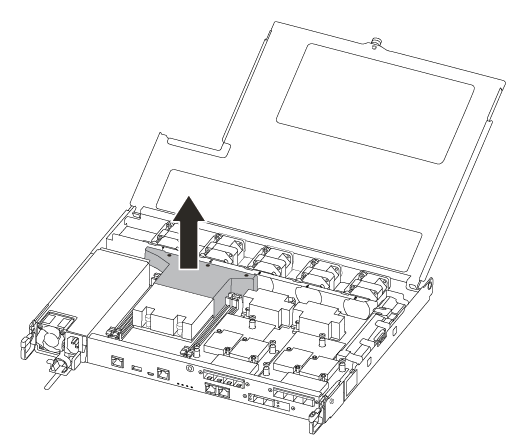

= Schritt 1: Entfernen Sie das Controller-Modul
:allow-uri-read: 

Zum Austauschen des Startmediums müssen Sie das beeinträchtigte Controller-Modul entfernen, das Ersatzstartmedium installieren und das Boot-Image auf ein USB-Flash-Laufwerk übertragen.

== Schritt 1: Entfernen Sie das Controller-Modul

Um auf Komponenten im Controller-Modul zuzugreifen, müssen Sie zunächst das Controller-Modul aus dem System entfernen und dann die Abdeckung am Controller-Modul entfernen.

.Schritte
. Wenn Sie nicht bereits geerdet sind, sollten Sie sich richtig Erden.
. Trennen Sie die Netzteile des Controller-Moduls von der Quelle.
. Lösen Sie die Netzkabelhalter, und ziehen Sie anschließend die Kabel von den Netzteilen ab.
. Setzen Sie den Zeigefinger in den Verriegelungsmechanismus auf beiden Seiten des Controller-Moduls ein, drücken Sie den Hebel mit dem Daumen, und ziehen Sie den Controller vorsichtig einige Zentimeter aus dem Gehäuse.
+

NOTE: Wenn Sie Schwierigkeiten beim Entfernen des Controller-Moduls haben, setzen Sie Ihre Zeigefinger durch die Fingerlöcher von innen (durch Überqueren der Arme).

+
image::../media/drw_a250_pcm_remove_install.png[drw a250 pcm ausbauen]

+
|===

 a| 
image:../media/legend_icon_01.png["Legende Nummer 1"]
 a| 
Hebel

 a| 
image:../media/legend_icon_02.png["Legende Nummer 2"]
 a| 
Verriegelungsmechanismus

|===
. Fassen Sie die Seiten des Controller-Moduls mit beiden Händen an, ziehen Sie es vorsichtig aus dem Gehäuse heraus und legen Sie es auf eine flache, stabile Oberfläche.
. Drehen Sie die Daumenschraube auf der Vorderseite des Controller-Moduls gegen den Uhrzeigersinn, und öffnen Sie die Abdeckung des Controller-Moduls.
+
image::../media/drw_a250_open_controller_module_cover.png[die Abdeckung des drw a250-Controller-Moduls öffnen]

+
|===

 a| 
image:../media/legend_icon_01.png["Legende Nummer 1"]
 a| 
Flügelschraube

 a| 
image:../media/legend_icon_02.png["Legende Nummer 2"]
 a| 
Controller-Modulabdeckung.

|===
. Heben Sie die Luftkanalabdeckung heraus.
+

== Schritt 2: Ersetzen Sie die Startmedien

Sie finden das ausgefallene Bootmedium im Controller-Modul, indem Sie den Luftkanal am Controller-Modul entfernen, bevor Sie das Boot-Medium ersetzen können.

Um die Schraube zu entfernen, mit der die Bootsmedien befestigt sind, benötigen Sie einen #1 Magnetschraubendreher. Aufgrund der Platzbeschränkungen im Controller-Modul sollten Sie auch einen Magneten haben, um die Schraube darauf zu übertragen, damit Sie sie nicht verlieren.

Sie können das Bootmedium mit dem folgenden Video oder den tabellarischen Schritten ersetzen:

.Animation - Ersetzen Sie das Startmedium
video::7c2cad51-dd95-4b07-a903-ac5b015c1a6d[panopto]
. Suchen und ersetzen Sie die gestörten Startmedien vom Controller-Modul.
+
image::../media/drw_a250_replace_boot_media.png[drw a250 ersetzen Startmedien]

+
[cols="1,3"]
|===

 a| 
image:../media/legend_icon_01.png["Legende Nummer 1"]
 a| 
Entfernen Sie die Schraube, mit der das Boot-Medium am Motherboard im Controller-Modul befestigt ist.

 a| 
image:../media/legend_icon_02.png["Legende Nummer 2"]
 a| 
Heben Sie die Boot-Medien aus dem Controller-Modul.

|===
. Entfernen Sie die Schraube mit dem #1-Magnetschraubendreher aus dem gestörten Boot-Medium und legen Sie sie sicher auf den Magneten.
. Heben Sie die gestörten Startmedien vorsichtig direkt aus dem Sockel und legen Sie sie beiseite.
. Entfernen Sie die Ersatzstartmedien aus dem antistatischen Versandbeutel, und richten Sie sie am Controller-Modul aus.
. Setzen Sie die Schraube mit dem #1-Magnetschraubendreher ein und ziehen Sie sie fest.
+

NOTE: Beim Anziehen der Schraube auf dem Boot-Medium keine Kraft auftragen, da sie möglicherweise knacken kann.

== Schritt 3: Übertragen Sie das Startabbild auf das Startmedium

Der installierte Ersatz-Startdatenträger ist ohne Startabbild, sodass Sie ein Startabbild über ein USB-Flash-Laufwerk übertragen müssen.

* Sie müssen über ein USB-Flash-Laufwerk verfügen, das auf MBR/FAT32 formatiert ist und eine Kapazität von mindestens 4 GB aufweist
* Eine Kopie der gleichen Bildversion von ONTAP wie der beeinträchtigte Controller. Das entsprechende Image können Sie im Abschnitt „Downloads“ auf der NetApp Support-Website herunterladen
+
** Wenn NVE aktiviert ist, laden Sie das Image mit NetApp Volume Encryption herunter, wie in der Download-Schaltfläche angegeben.
** Wenn NVE nicht aktiviert ist, laden Sie das Image ohne NetApp Volume Encryption herunter, wie im Download-Button dargestellt.

* Wenn Ihr System ein HA-Paar ist, müssen Sie eine Netzwerkverbindung haben.
* Wenn es sich bei Ihrem System um ein eigenständiges System handelt, benötigen Sie keine Netzwerkverbindung, Sie müssen jedoch beim Wiederherstellen des var-Dateisystems einen zusätzlichen Neustart durchführen.
+
.. Laden Sie das entsprechende Service-Image von der NetApp Support Site auf das USB-Flash-Laufwerk herunter und kopieren Sie es.
.. Laden Sie das Service-Image auf Ihren Arbeitsbereich auf Ihrem Laptop herunter.
.. Entpacken Sie das Service-Image.
+

NOTE: Wenn Sie den Inhalt mit Windows extrahieren, verwenden Sie winzip nicht zum Extrahieren des Netzboots-Images. Verwenden Sie ein anderes Extraktionstool, wie 7-Zip oder WinRAR.

+
Die Image-Datei „ungezippte Dienste“ enthält zwei Ordner:

+
*** Booten
*** efi

.. kopieren Sie den efi-Ordner in das oberste Verzeichnis auf dem USB-Flash-Laufwerk.
+
Das USB-Flash-Laufwerk sollte den efi-Ordner und die gleiche Service Image (BIOS)-Version des beeinträchtigten Controllers haben.

.. Entfernen Sie das USB-Flash-Laufwerk von Ihrem Laptop.
.. Wenn Sie dies noch nicht getan haben, den Luftkanal einbauen.
+
image::../media/drw_a250_install_airduct_cover.png[drw a250 Einbau der Luftkanalabdeckung]

.. Schließen Sie die Abdeckung des Controller-Moduls, und ziehen Sie die Daumenschraube fest.
+
image::../media/drw_a250_close_controller_module_cover.png[abdeckung des drw a250-Controllermoduls schließen]

+
[cols="1,3"]
|===

 a| 
image:../media/legend_icon_01.png["Legende Nummer 1"]
 a| 
Controller-Modulabdeckung

 a| 
image:../media/legend_icon_02.png["Legende Nummer 2"]
 a| 
Flügelschraube

|===
.. Richten Sie das Ende des Controller-Moduls an der Öffnung im Gehäuse aus, und drücken Sie dann vorsichtig das Controller-Modul zur Hälfte in das System.
.. Schließen Sie das Netzkabel an das Netzteil an, und setzen Sie den Netzkabelhalter wieder ein.
.. Stecken Sie das USB-Flash-Laufwerk in den USB-Steckplatz des Controller-Moduls.
+
Stellen Sie sicher, dass Sie das USB-Flash-Laufwerk in den für USB-Geräte gekennzeichneten Steckplatz und nicht im USB-Konsolenport installieren.

.. Drücken Sie das Controller-Modul ganz in das Chassis:
.. Platzieren Sie Ihre Zeigefinger durch die Fingerlöcher von der Innenseite des Verriegelungsmechanismus.
.. Drücken Sie die Daumen auf den orangefarbenen Laschen oben am Verriegelungsmechanismus nach unten, und schieben Sie das Controller-Modul vorsichtig über den Anschlag.
.. Lösen Sie Ihre Daumen von oben auf den Verriegelungs-Mechanismen und drücken Sie weiter, bis die Verriegelungen einrasten.
+
Das Controller-Modul beginnt zu booten, sobald es vollständig im Gehäuse sitzt. Bereiten Sie sich darauf vor, den Bootvorgang zu unterbrechen.

+
Das Controller-Modul sollte vollständig eingesetzt und mit den Kanten des Gehäuses bündig sein.

.. Unterbrechen Sie den Boot-Vorgang, um an der LOADER-Eingabeaufforderung zu stoppen, indem Sie Strg-C drücken, wenn Sie sehen Starten VON AUTOBOOT drücken Sie Strg-C, um den Vorgang abzubrechen
+
Wenn Sie diese Meldung verpassen, drücken Sie Strg-C, wählen Sie die Option zum Booten im Wartungsmodus aus, und halten Sie dann den Controller zum Booten in LOADER an.

.. Wenn Systeme mit einem Controller im Chassis vorhanden sind, schließen Sie das Netzteil wieder an und schalten Sie die Netzteile ein.
+
Das System beginnt mit dem Booten und wird bei DER LOADER-Eingabeaufforderung angehalten.

.. Legen Sie den Verbindungstyp für das Netzwerk an der LOADER-Eingabeaufforderung fest:
+
*** Wenn Sie DHCP konfigurieren: `ifconfig e0a -auto`
+

NOTE: Der von Ihnen konfigurierte Zielport ist der Zielport, über den Sie während der Wiederherstellung des var-Dateisystems mit dem beeinträchtigten Controller über den gesunden Controller kommunizieren. Sie können in diesem Befehl auch den Port E0M verwenden.

*** Wenn Sie manuelle Verbindungen konfigurieren: `ifconfig e0a -addr=filer_addr -mask=netmask -gw=gateway-dns=dns_addr-domain=dns_domain`
+
**** `filer_addr` Ist die IP-Adresse des Storage-Systems.
**** `netmask` Ist die Netzwerkmaske des Management-Netzwerks, die mit dem HA-Partner verbunden ist.
**** `gateway` Ist das Gateway für das Netzwerk.
**** `dns_addr` Ist die IP-Adresse eines Namensservers in Ihrem Netzwerk.
**** `dns_domain` Der Domain Name (DNS) ist der Domain-Name.
+
Wenn Sie diesen optionalen Parameter verwenden, benötigen Sie keinen vollqualifizierten Domänennamen in der Netzboot-Server-URL. Sie benötigen nur den Hostnamen des Servers.

+

NOTE: Andere Parameter können für Ihre Schnittstelle erforderlich sein. Sie können eingeben `help ifconfig` Details finden Sie in der Firmware-Eingabeaufforderung.

