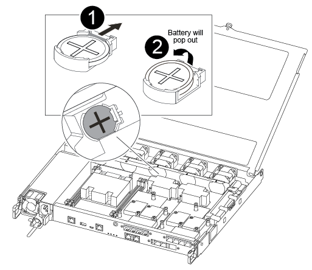

= Schritt 1: Schalten Sie den beeinträchtigten Regler aus
:allow-uri-read: 

Sie ersetzen den Echtzeituhr-Akku (RTC) im Controller-Modul, sodass die Dienste und Anwendungen Ihres Systems, die von der genauen Zeitsynchronisierung abhängen, weiterhin funktionieren.

* Sie können dieses Verfahren bei allen Versionen von ONTAP verwenden, die von Ihrem System unterstützt werden
* Alle anderen Komponenten des Systems müssen ordnungsgemäß funktionieren. Falls nicht, müssen Sie sich an den technischen Support wenden.

== Schritt 1: Schalten Sie den beeinträchtigten Regler aus

Um den beeinträchtigten Controller herunterzufahren, müssen Sie den Status des Controllers bestimmen und gegebenenfalls den Controller übernehmen, damit der gesunde Controller weiterhin Daten aus dem beeinträchtigten Reglerspeicher bereitstellen kann.

.Über diese Aufgabe
* Wenn Sie über ein SAN-System verfügen, müssen Sie Event-Meldungen ) für den beeinträchtigten Controller SCSI Blade überprüft haben  `cluster kernel-service show`. Mit dem `cluster kernel-service show` Befehl (im erweiterten Modus von priv) werden der Knotenname,  der Node, der Verfügbarkeitsstatus dieses Node und der Betriebsstatus dieses Node angezeigtlink:https://docs.netapp.com/us-en/ontap/system-admin/display-nodes-cluster-task.html["Quorum-Status"].
+
Jeder Prozess des SCSI-Blades sollte sich im Quorum mit den anderen Nodes im Cluster befinden. Probleme müssen behoben werden, bevor Sie mit dem Austausch fortfahren.

* Wenn Sie über ein Cluster mit mehr als zwei Nodes verfügen, muss es sich im Quorum befinden. Wenn sich das Cluster nicht im Quorum befindet oder ein gesunder Controller FALSE anzeigt, um die Berechtigung und den Zustand zu erhalten, müssen Sie das Problem korrigieren, bevor Sie den beeinträchtigten Controller herunterfahren; siehe link:https://docs.netapp.com/us-en/ontap/system-admin/synchronize-node-cluster-task.html?q=Quorum["Synchronisieren eines Node mit dem Cluster"^].

.Schritte
. Wenn AutoSupport aktiviert ist, können Sie die automatische Case-Erstellung durch Aufrufen einer AutoSupport Meldung unterdrücken: `system node autosupport invoke -node * -type all -message MAINT=<# of hours>h`
+
Die folgende AutoSupport Meldung unterdrückt die automatische Erstellung von Cases für zwei Stunden: `cluster1:> system node autosupport invoke -node * -type all -message MAINT=2h`

. Deaktivieren Sie das automatische Giveback von der Konsole des Controller mit dem ordnungsgemäßen Zustand: `storage failover modify -node local -auto-giveback false`
+

NOTE: Wenn Sie sehen _Möchten Sie Auto-Giveback deaktivieren?_, geben Sie ein `y`.

. Nehmen Sie den beeinträchtigten Controller zur LOADER-Eingabeaufforderung:
+
[cols="1,2"]
|===
| Wenn der eingeschränkte Controller angezeigt wird... | Dann... 

 a| 
Die LOADER-Eingabeaufforderung
 a| 
Fahren Sie mit dem nächsten Schritt fort.

 a| 
Warten auf Giveback...
 a| 
Drücken Sie Strg-C, und antworten Sie dann `y` Wenn Sie dazu aufgefordert werden.

 a| 
Eingabeaufforderung für das System oder Passwort
 a| 
Übernehmen oder stoppen Sie den beeinträchtigten Regler von der gesunden Steuerung: `storage failover takeover -ofnode _impaired_node_name_`

Wenn der Regler „beeinträchtigt“ auf Zurückgeben wartet... anzeigt, drücken Sie Strg-C, und antworten Sie dann `y`.

|===

== Schritt 2: Entfernen Sie das Controller-Modul

Sie müssen das Controller-Modul aus dem Chassis entfernen, wenn Sie eine Komponente im Controller-Modul ersetzen.

Achten Sie darauf, dass Sie die Kabel so kennzeichnen, dass Sie wissen, woher sie stammen.

. Wenn Sie nicht bereits geerdet sind, sollten Sie sich richtig Erden.
. Trennen Sie die Netzteile des Controller-Moduls von der Quelle.
. Lösen Sie die Netzkabelhalter, und ziehen Sie anschließend die Kabel von den Netzteilen ab.
. Setzen Sie den Zeigefinger in den Verriegelungsmechanismus auf beiden Seiten des Controller-Moduls ein, drücken Sie den Hebel mit dem Daumen, und ziehen Sie den Controller vorsichtig einige Zentimeter aus dem Gehäuse.
+

NOTE: Wenn Sie Schwierigkeiten beim Entfernen des Controller-Moduls haben, setzen Sie Ihre Zeigefinger durch die Fingerlöcher von innen (durch Überqueren der Arme).

+
image::../media/drw_a250_pcm_remove_install.png[Öffnen Sie den Verriegelungsmechanismus]

+
[cols="1,4"]
|===

 a| 
image:../media/icon_round_1.png["Legende Nummer 1"]
 a| 
Hebel

 a| 
image:../media/icon_round_2.png["Legende Nummer 2"]
 a| 
Verriegelungsmechanismus

|===
. Fassen Sie die Seiten des Controller-Moduls mit beiden Händen an, ziehen Sie es vorsichtig aus dem Gehäuse heraus und legen Sie es auf eine flache, stabile Oberfläche.
. Drehen Sie die Daumenschraube auf der Vorderseite des Controller-Moduls gegen den Uhrzeigersinn, und öffnen Sie die Abdeckung des Controller-Moduls.
+
image::../media/drw_a250_open_controller_module_cover.png[Öffnen Sie die Abdeckung des Controller-Moduls]

+
[cols="1,4"]
|===

 a| 
image:../media/icon_round_1.png["Legende Nummer 1"]
| Flügelschraube 

 a| 
image::../media/icon_round_2.png[Legende Nummer 2]
 a| 
Controller-Modulabdeckung.

|===
. Heben Sie die Luftkanalabdeckung heraus.
+
image::../media/drw_a250_remove_airduct_cover.png[Die Abdeckung des Luftkanals herausnehmen]

== Schritt 3: Ersetzen Sie die RTC-Batterie

Um die RTC-Batterie zu ersetzen, suchen Sie sie im Controller, und befolgen Sie die einzelnen Schritte.

Verwenden Sie das folgende Video oder die tabellarischen Schritte, um den RTC-Akku zu ersetzen:

.Animation - Ersetzen der RTC-Batterie
video::6ed27f71-d3a7-4cee-8d9f-ac5b016c982d[panopto]
. Suchen Sie den RTC-Akku zwischen Kühlkörper und Midplane, und entfernen Sie ihn genau wie in der Grafik dargestellt.
+

+
[cols="1,4"]
|===

 a| 
image:../media/icon_round_1.png["Legende Nummer 1"]
 a| 
Ziehen Sie vorsichtig die Lasche vom Batteriegehäuse weg. *Achtung:* das Herausziehen des Tabs könnte die Lasche verdrängen.

 a| 
image:../media/icon_round_2.png["Legende Nummer 2"]
 a| 
Heben Sie den Akku an. *Hinweis:* notieren Sie sich die Polarität der Batterie.

 a| 
image:../media/icon_round_3.png["Legende Nummer 3"]
 a| 
Der Akku sollte ausgeworfen werden.

|===
+
Die Batterie wird ausgeworfen.

. Entfernen Sie den Ersatzakku aus dem antistatischen Versandbeutel.
. Suchen Sie den RTC-Batteriehalter zwischen Kühlkörper und Midplane und setzen Sie ihn genau wie in der Grafik dargestellt ein.
+
image::../media/drw_a250_install_rtc_batt.png[Setzen Sie die RTC-Batterie ein]

+
|===

 a| 
image:../media/icon_round_1.png["Legende Nummer 1"]
| Schieben Sie die Batterie mit der positiven Polarität nach oben unter die Lasche des Batteriegehäuses. 

 a| 
image:../media/icon_round_2.png["Legende Nummer 2"]
 a| 
Schieben Sie den Akku vorsichtig in die richtige Position, und vergewissern Sie sich, dass er mit der Lasche am Gehäuse befestigt ist.

CAUTION: Wenn Sie ihn aggressiv einschieben, kann sich der Akku erneut auswerfen.

|===
. Überprüfen Sie die Batterie visuell, um sicherzustellen, dass sie vollständig in den Halter eingebaut ist und die Polarität korrekt ist.

== Schritt 4: Setzen Sie das Controller-Modul wieder ein und setzen Sie Zeit/Datum nach dem RTC-Batterieaustausch ein

Nachdem Sie eine Komponente innerhalb des Controller-Moduls ersetzt haben, müssen Sie das Controller-Modul im Systemgehäuse neu installieren, die Uhrzeit und das Datum auf dem Controller zurücksetzen und es dann booten.

. Wenn Sie dies noch nicht getan haben, schließen Sie den Luftkanal oder die Abdeckung des Controller-Moduls.
. Richten Sie das Ende des Controller-Moduls an der Öffnung im Gehäuse aus, und drücken Sie dann vorsichtig das Controller-Modul zur Hälfte in das System.
+
Setzen Sie das Controller-Modul erst dann vollständig in das Chassis ein, wenn Sie dazu aufgefordert werden.

. Das System nach Bedarf neu einsetzen.
+
Wenn Sie die Medienkonverter (QSFPs oder SFPs) entfernt haben, sollten Sie diese erneut installieren, wenn Sie Glasfaserkabel verwenden.

. Setzen Sie das Controller-Modul in das Chassis ein:
+
.. Stellen Sie sicher, dass die Arms des Verriegelungsmechanismus in der vollständig ausgestreckten Position verriegelt sind.
.. Richten Sie das Controller-Modul mit beiden Händen aus und schieben Sie es vorsichtig in die Arms des Verriegelungsmechanismus, bis es anhält.
.. Platzieren Sie Ihre Zeigefinger durch die Fingerlöcher von der Innenseite des Verriegelungsmechanismus.
.. Drücken Sie die Daumen auf den orangefarbenen Laschen oben am Verriegelungsmechanismus nach unten, und schieben Sie das Controller-Modul vorsichtig über den Anschlag.
.. Lösen Sie Ihre Daumen von oben auf den Verriegelungs-Mechanismen und drücken Sie weiter, bis die Verriegelungen einrasten. + das Controller-Modul sollte vollständig eingesetzt und bündig mit den Kanten des Gehäuses ausgeführt werden.
.. Schließen Sie die Netzkabel an die Netzteile an, setzen Sie die Sicherungsmanschette des Netzkabels wieder ein, und schließen Sie dann die Netzteile an die Stromquelle an.
+
Das Controller-Modul startet, sobald die Stromversorgung wiederhergestellt ist. Bereiten Sie sich darauf vor, den Bootvorgang zu unterbrechen.

.. Halten Sie den Controller an der LOADER-Eingabeaufforderung an.

. Uhrzeit und Datum auf dem Controller zurücksetzen:
+
.. Prüfen Sie Datum und Uhrzeit auf dem gesunden Controller mit dem `show date` Befehl.
.. Überprüfen Sie an der LOADER-Eingabeaufforderung auf dem Ziel-Controller die Zeit und das Datum.
.. Ändern Sie bei Bedarf das Datum mit dem `set date mm/dd/yyyy` Befehl.
.. Stellen Sie bei Bedarf die Uhrzeit in GMT mithilfe des ein `set time hh:mm:ss` Befehl.
.. Bestätigen Sie Datum und Uhrzeit auf dem Ziel-Controller.

. Geben Sie an der LOADER-Eingabeaufforderung ein `bye` Um die PCIe-Karten und andere Komponenten neu zu initialisieren und den Controller neu zu starten.
. Wiederherstellung des normalen Betriebs des Controllers durch Zurückgeben des Speichers: `storage failover giveback -ofnode _impaired_node_name_`
. Wenn die automatische Rückübertragung deaktiviert wurde, aktivieren Sie sie erneut: `storage failover modify -node local -auto-giveback true`

== Schritt 5: Senden Sie das fehlgeschlagene Teil an NetApp zurück

Senden Sie das fehlerhafte Teil wie in den dem Kit beiliegenden RMA-Anweisungen beschrieben an NetApp zurück.  https://mysupport.netapp.com/site/info/rma["Rückgabe und Austausch von Teilen"]Weitere Informationen finden Sie auf der Seite.
