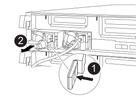

= Schritt 1: Entfernen Sie das Controller-Modul
:allow-uri-read: 

Um die Hardware des Controller-Moduls zu ersetzen, müssen Sie den beeinträchtigten Controller entfernen, die FRU-Komponenten in das Ersatzcontrollermodul verschieben, das Ersatzcontrollermodul im Gehäuse installieren und das System dann in den Wartungsmodus booten.

== Schritt 1: Entfernen Sie das Controller-Modul

Um auf Komponenten im Controller-Modul zuzugreifen, müssen Sie das Controller-Modul aus dem Gehäuse entfernen.

. Wenn Sie nicht bereits geerdet sind, sollten Sie sich richtig Erden.
. Lösen Sie die Netzkabelhalter, und ziehen Sie anschließend die Kabel von den Netzteilen ab.
. Lösen Sie den Haken- und Schlaufenriemen, mit dem die Kabel am Kabelführungsgerät befestigt sind, und ziehen Sie dann die Systemkabel und SFPs (falls erforderlich) vom Controller-Modul ab, um zu verfolgen, wo die Kabel angeschlossen waren.
+
Lassen Sie die Kabel im Kabelverwaltungs-Gerät so, dass bei der Neuinstallation des Kabelverwaltungsgeräts die Kabel organisiert sind.

. Entfernen Sie das Kabelführungs-Gerät aus dem Controller-Modul und legen Sie es beiseite.
. Drücken Sie beide Verriegelungsriegel nach unten, und drehen Sie dann beide Verriegelungen gleichzeitig nach unten.
+
Das Controller-Modul wird leicht aus dem Chassis entfernt.

+
image::../media/drw_c400_remove_controller_IEOPS-1216.svg[drw c400 Controller IEOPS 1216 entfernen]

+
[cols="10,90"]
|===

 a| 
image:../media/legend_icon_01.png[""]
 a| 
Verriegelungsriegel

 a| 
image:../media/legend_icon_02.png[""]
 a| 
Der Controller bewegt sich leicht aus dem Chassis

|===
. Schieben Sie das Controller-Modul aus dem Gehäuse.
+
Stellen Sie sicher, dass Sie die Unterseite des Controller-Moduls unterstützen, während Sie es aus dem Gehäuse schieben.

. Stellen Sie das Controller-Modul auf eine stabile, flache Oberfläche.
. Öffnen Sie am Ersatzsteuermodul den Luftkanal, und entfernen Sie die leeren Riser mithilfe der Animation, der Abbildung oder der schriftlichen Schritte aus dem Controller-Modul:
+
.Animation - Entfernen Sie die leeren Riser aus dem Ersatzcontroller-Modul
video::018a1c3c-0a26-4f48-bd60-b0300184c147[panopto]
+
image::../media/drw_c400_empty_riser_remove_IEOPS-1225.svg[Entfernen Sie den IEOPS 1225 des leeren drw c400-Risers]

[cols="10,90"]
|===

 a| 
image:../media/legend_icon_01.png[""]
 a| 
Riser-Verriegelungen

|===
. Drücken Sie die Verriegelungslaschen an den Seiten des Luftkanals in Richtung der Mitte des Controller-Moduls.
. Schieben Sie den Luftkanal zur Rückseite des Controller-Moduls, und drehen Sie ihn dann nach oben in seine vollständig geöffnete Position.
. Drehen Sie den Riserriegel auf der linken Seite des Steigrohrs 1 nach oben und in Richtung Luftkanal, heben Sie den Riseraufsatz an und legen Sie ihn dann beiseite.
. Wiederholen Sie den vorherigen Schritt für die verbleibenden Riser.

== Schritt 2: Bewegen Sie die Netzteile

Wenn Sie ein Controller-Modul ersetzen, müssen Sie das Netzteil vom beeinträchtigten Controller-Modul in das Ersatzcontrollermodul verschieben.

Sie können die folgenden Animationen, Abbildungen oder die schriftlichen Schritte verwenden, um die Netzteile in das Ersatzcontrollermodul zu verschieben.

.Animation - Verschieben der Netzteile
video::6cac8f5f-dc11-4b1d-9b18-b03001858fda[panopto]
. Entfernen Sie das Netzteil:
+

[cols="10,90"]
|===

 a| 
image:../media/legend_icon_01.png["Legende Nummer 1"]
 a| 
Sperrklinke des Netzteils

 a| 
image:../media/legend_icon_02.png["Legende Nummer 2"]
 a| 
Netzkabelhalter

|===
. Drehen Sie den Nockengriff so, dass er zum Herausziehen der Stromversorgung aus dem Gehäuse verwendet werden kann.
. Drücken Sie die blaue Verriegelungslasche, um das Netzteil aus dem Gehäuse zu lösen.
. Ziehen Sie das Netzteil mit beiden Händen aus dem Gehäuse und legen Sie es dann beiseite.
+
.. Stellen Sie das Netzteil auf das neue Controller-Modul, und installieren Sie es.
.. Halten und richten Sie die Kanten des Netzteils mit beiden Händen an der Öffnung im Controller-Modul aus, und drücken Sie dann vorsichtig das Netzteil in das Controller-Modul, bis die Verriegelungslasche einrastet.
+
Die Netzteile werden nur ordnungsgemäß mit dem internen Anschluss in Kontakt treten und auf eine Weise verriegeln.

+

NOTE: Um Schäden am internen Stecker zu vermeiden, sollten Sie beim Einschieben der Stromversorgung in das System keine übermäßige Kraft verwenden.

.. Wiederholen Sie die vorherigen Schritte für alle weiteren Netzteile.

== Schritt 3: Bewegen Sie den NVDIMM-Akku

Um den NVDIMM-Akku vom Controller-Modul mit eingeschränkter Betriebsdauer auf das Ersatzcontrollermodul zu verschieben, müssen Sie eine bestimmte Sequenz von Schritten durchführen.

Sie können die folgende Animation, Abbildung oder die geschriebenen Schritte verwenden, um den NVDIMM-Akku vom beeinträchtigten Controller-Modul in das Ersatzcontrollermodul zu verschieben.

.Animation - Verschieben der NVDIMM-Batterie
video::d38ef37e-aa0e-46ff-9283-b03001864e0c[panopto]
image::../media/drw_c400_nvdimm_batt_IEOPS-1227.svg[drw c400 nvdimm Batt IEOPS 1227]

[cols="10,90"]
|===

 a| 
image:../media/legend_icon_01.png["Legende Nummer 1"]
 a| 
NVDIMM-Batteriestecker

 a| 
image:../media/legend_icon_02.png["Legende Nummer 2"]
 a| 
Verriegelungslasche für NVDIMM-Batterie

 a| 
image:../media/legend_icon_03.png["Legende Nummer 3"]
 a| 
NVDIMM-Batterie

|===
. Öffnen Sie den Luftkanal:
+
.. Drücken Sie die Verriegelungslaschen an den Seiten des Luftkanals in Richtung der Mitte des Controller-Moduls.
.. Schieben Sie den Luftkanal zur Rückseite des Controller-Moduls, und drehen Sie ihn dann nach oben in seine vollständig geöffnete Position.

. Suchen Sie den NVDIMM-Akku im Controller-Modul.
. Suchen Sie den Batteriestecker, und drücken Sie den Clip auf der Vorderseite des Batteriesteckers, um den Stecker aus der Steckdose zu lösen, und ziehen Sie dann das Akkukabel aus der Steckdose.
. Fassen Sie den Akku an, und drücken Sie die blaue Verriegelungslasche, die mit DRUCKTASTE gekennzeichnet ist, und heben Sie den Akku aus dem Halter und dem Controller-Modul heraus.
. Bringen Sie den Akku in das Ersatzcontrollermodul.
. Richten Sie das Batteriemodul an der Öffnung für den Akku aus, und schieben Sie den Akku vorsichtig in den Steckplatz, bis er einrastet.
+

NOTE: Schließen Sie das Akkukabel erst dann wieder an die Hauptplatine an, wenn Sie dazu aufgefordert werden.

== Schritt 4: Verschieben Sie die Startmedien

Sie müssen das Startmedium ausfindig machen und dann die Anweisungen befolgen, um es aus dem beeinträchtigten Controller-Modul zu entfernen und in das Ersatzcontrollermodul einzufügen.

Sie können die folgenden Animationen, Abbildungen oder die geschriebenen Schritte verwenden, um die Startmedien vom beeinträchtigten Controller-Modul in das Ersatzcontrollermodul zu verschieben.

.Animation - Verschieben des Bootmediums
video::01d3d868-4c8a-4385-b264-b0300186fc58[panopto]
image::../media/drw_c400_replace_boot_media_IEOPS-1217.svg[drw c400 Boot-Medium IEOPS 1217 ersetzen]

[cols="10,90"]
|===

 a| 
image:../media/legend_icon_01.png["Legende Nummer 1"]
 a| 
Verriegelungslasche für Startmedien

 a| 
image:../media/legend_icon_02.png["Legende Nummer 2"]
 a| 
Boot-Medien

|===
. Suchen und entfernen Sie die Startmedien aus dem Controller-Modul:
+
.. Drücken Sie die blaue Taste am Ende des Startmediums, bis der Lip auf dem Boot-Medium die blaue Taste löscht.
.. Drehen Sie das Startmedium nach oben, und ziehen Sie das Startmedium vorsichtig aus dem Sockel.

. Bewegen Sie die Startmedien auf das neue Controller-Modul, richten Sie die Kanten des Startmediums am Buchsengehäuse aus, und schieben Sie sie dann vorsichtig in die Buchse.
. Überprüfen Sie die Startmedien, um sicherzustellen, dass sie ganz und ganz in der Steckdose sitzt.
+
Entfernen Sie gegebenenfalls die Startmedien, und setzen Sie sie wieder in den Sockel ein.

. Sperren Sie das Boot-Medium:
+
.. Drehen Sie das Startmedium nach unten zur Hauptplatine.
.. Drücken Sie die blaue Verriegelungstaste, damit sie sich in der geöffneten Position befindet.
.. Setzen Sie die Finger am Ende des Startmediums mit der blauen Taste, drücken Sie fest nach unten auf das Boot-Medium-Ende, um die blaue Verriegelungstaste zu drücken.

== Schritt 5: Verschieben Sie die PCIe Riser und Mezzanine-Karte

Im Rahmen des Controller-Austauschprozesses müssen Sie die PCIe Riser und die Mezzanine-Karte vom beeinträchtigten Controller-Modul auf das Ersatzcontrollermodul verschieben.

Sie können die folgenden Animationen, Abbildungen oder die schriftlichen Schritte verwenden, um die PCIe-Risers und die Mezzanine-Karte vom Modul für beeinträchtigte Controller in das Ersatzcontroller-Modul zu verschieben.

Verschieben von PCIe-Riser 1 und 2 (linke und mittlere Riser):

.Animation - Verschieben von PCI-Riserern 1 und 2
video::a38898c3-61a2-47bd-9011-b0300183540d[panopto]
Verschieben der Mezzanine-Karte und des Riser 3 (Riser rechts):

.Animation - Bewegen Sie die Mezzanine-Karte und Riser 3
video::54c98658-29a3-423b-ae01-b030018091f5[panopto]
image::../media/drw_c400_replace_PCIe_cards_IEOPS-1235.svg[drw c400 Ersetzen Sie die PCIe-Karten IEOPS 1235]

[cols="10,90"]
|===

 a| 
image:../media/legend_icon_01.png["Legende Nummer 1"]
 a| 
Riserverriegelung

 a| 
image:../media/legend_icon_02.png["Legende Nummer 2"]
 a| 
Verriegelung der PCI-Karte

 a| 
image:../media/legend_icon_03.png["Legende Nummer 3"]
 a| 
PCI-Sperrplatte

 a| 
image:../media/legend_icon_04.png["Legende Nummer 4"]
 a| 
PCI-Karte

|===
. Verschieben Sie PCIe-Risers ein und zwei vom beeinträchtigten Controller-Modul auf das Ersatzcontrollermodul:
+
.. Entfernen Sie alle SFP- oder QSFP-Module, die sich möglicherweise in den PCIe-Karten enthalten haben.
.. Drehen Sie die Riserverriegelung auf der linken Seite des Steigrohrs nach oben und in Richtung Luftkanal.
+
Der Riser hebt sich leicht vom Controller-Modul auf.

.. Heben Sie den Riser an, und schieben Sie ihn dann zum Ersatzcontrollermodul.
.. Richten Sie den Riser an den Stiften an der Seite des Riser-Sockels aus, senken Sie den Riser an den Stiften nach unten, schieben Sie den Riser in den Sockel auf dem Motherboard und drehen Sie dann den Riegel bündig mit dem Blech des Riser nach unten.
.. Wiederholen Sie diesen Schritt für die Risernummer 2.

. Entfernen Sie die Riser-Nummer 3, entfernen Sie die Mezzanine-Karte, und installieren Sie beide in das Ersatzcontrollermodul:
+
.. Entfernen Sie alle SFP- oder QSFP-Module, die sich möglicherweise in den PCIe-Karten enthalten haben.
.. Drehen Sie die Riserverriegelung auf der linken Seite des Steigrohrs nach oben und in Richtung Luftkanal.
+
Der Riser hebt sich leicht vom Controller-Modul auf.

.. Heben Sie den Riser an und legen Sie ihn auf eine stabile, flache Oberfläche.
.. Lösen Sie die Rändelschrauben auf der Mezzanine-Karte, und heben Sie die Karte vorsichtig direkt aus dem Sockel, und schieben Sie sie dann zum Ersatzcontroller-Modul.
.. Setzen Sie den Zwischenboden in den Ersatzcontroller ein, und befestigen Sie ihn mit den Rändelschrauben.
.. Installieren Sie den dritten Riser in das Ersatzcontrollermodul.

== Schritt 6: Verschieben Sie die DIMMs

Sie müssen die DIMMs ausfindig machen und sie dann vom beeinträchtigten Controllermodul in das Ersatzcontrollermodul verschieben.

Sie müssen das neue Controller-Modul bereit haben, damit Sie die DIMMs direkt vom beeinträchtigten Controller-Modul auf die entsprechenden Steckplätze im Ersatzcontroller-Modul verschieben können.

Sie können die DIMMs aus dem beeinträchtigten Controller-Modul in das Ersatzcontrollermodul verschieben, indem Sie die folgenden Animationen, Abbildungen oder die schriftlichen Schritte verwenden.

.Animation - Verschieben der DIMMs
video::c5c77fd1-b566-467f-a1cd-b0300187de35[panopto]
image::../media/drw_A400_Replace-NVDIMM-DIMM_IEOPS-1009.svg[drw A400 ersetzt NVDIMM DIMM IEOPS 1009]

[cols="10,90"]
|===

 a| 
image:../media/legend_icon_01.png["Legende Nummer 1"]
 a| 
DIMM-Verriegelungslaschen

 a| 
image:../media/legend_icon_02.png["Legende Nummer 2"]
 a| 
DIMM

 a| 
image:../media/legend_icon_03.png["Legende Nummer 3"]
 a| 
DIMM-Sockel

|===
. Suchen Sie die DIMMs auf dem Controller-Modul.
. Beachten Sie die Ausrichtung des DIMM-Moduls in den Sockel, damit Sie das DIMM-Modul in die richtige Ausrichtung einsetzen können.
. Vergewissern Sie sich, dass die NVDIMM-Batterie nicht an das neue Controller-Modul angeschlossen ist.
. Verschieben Sie die DIMMs vom Controller mit eingeschränkter Bedieneinheit auf das Ersatzcontrollermodul:
+

NOTE: Stellen Sie sicher, dass Sie jedes DIMM in demselben Steckplatz einsetzen, in dem es im beeinträchtigten Controller-Modul belegt ist.

+
.. Werfen Sie das DIMM aus dem Steckplatz, indem Sie die DIMM-Auswerfer auf beiden Seiten des DIMM langsam auseinander drücken und dann das DIMM aus dem Steckplatz schieben.
+

NOTE: Halten Sie das DIMM vorsichtig an den Rändern, um Druck auf die Komponenten auf der DIMM-Leiterplatte zu vermeiden.

.. Suchen Sie den entsprechenden DIMM-Steckplatz am Ersatzcontroller-Modul.
.. Vergewissern Sie sich, dass sich die DIMM-Auswurfklammern am DIMM-Sockel in der geöffneten Position befinden, und setzen Sie das DIMM-Auswerfer anschließend in den Sockel ein.
+
Die DIMMs passen eng in die Steckdose, sollten aber leicht einpassen. Falls nicht, richten Sie das DIMM-Modul mit dem Sockel aus und setzen Sie es wieder ein.

.. Prüfen Sie das DIMM visuell, um sicherzustellen, dass es gleichmäßig ausgerichtet und vollständig in den Sockel eingesetzt ist.
.. Wiederholen Sie diese Teilschritte für die übrigen DIMMs.

. Schließen Sie den NVDIMM-Akku an die Hauptplatine an.
+
Vergewissern Sie sich, dass der Stecker am Controller-Modul abhält.

== Schritt 7: Installieren Sie das Controller-Modul

Nachdem alle Komponenten vom beeinträchtigten Controller-Modul in das Ersatzcontrollermodul verschoben wurden, müssen Sie das Ersatzcontrollermodul in das Gehäuse installieren und es dann in den Wartungsmodus booten.

. Wenn Sie dies noch nicht getan haben, schließen Sie den Luftkanal.
. Richten Sie das Ende des Controller-Moduls an der Öffnung im Gehäuse aus, und drücken Sie dann vorsichtig das Controller-Modul zur Hälfte in das System.
+

NOTE: Setzen Sie das Controller-Modul erst dann vollständig in das Chassis ein, wenn Sie dazu aufgefordert werden.

+
image::../media/drw_c400_install_controller_IEOPS-1226.svg[drw c400 installieren Controller IEOPS 1226]

+
[cols="10,90"]
|===

 a| 
image:../media/legend_icon_01.png[""]
 a| 
Schieben Sie den Controller in das Gehäuse

 a| 
image:../media/legend_icon_02.png[""]
 a| 
Verriegelungsriegel

|===
. Verkabeln Sie nur die Management- und Konsolen-Ports, sodass Sie auf das System zugreifen können, um die Aufgaben in den folgenden Abschnitten auszuführen.
+

NOTE: Sie schließen die übrigen Kabel später in diesem Verfahren an das Controller-Modul an.

. Schließen Sie die Installation des Controller-Moduls ab:
+
.. Schließen Sie das Netzkabel an das Netzteil an, setzen Sie die Sicherungshülse des Netzkabels wieder ein, und schließen Sie dann das Netzteil an die Stromquelle an.
.. Schieben Sie das Controller-Modul mithilfe der Verriegelungen fest in das Gehäuse, bis sich die Verriegelungsriegel erheben.
+

NOTE: Beim Einschieben des Controller-Moduls in das Gehäuse keine übermäßige Kraft verwenden, um Schäden an den Anschlüssen zu vermeiden.

.. Setzen Sie das Controller-Modul vollständig in das Gehäuse ein, indem Sie die Verriegelungsriegel nach oben drehen, kippen Sie sie so, dass sie die Sicherungsstifte entfernen, den Controller vorsichtig ganz nach innen schieben und dann die Verriegelungsriegel in die verriegelte Position senken.
+
Das Controller-Modul beginnt zu booten, sobald es vollständig im Gehäuse sitzt. Bereiten Sie sich darauf vor, den Bootvorgang zu unterbrechen.

.. Wenn Sie dies noch nicht getan haben, installieren Sie das Kabelverwaltungsgerät neu.
.. Unterbrechen Sie den normalen Boot-Prozess und booten Sie zu LOADER, indem Sie drücken `Ctrl-C`.
+

NOTE: Wenn das System im Startmenü stoppt, wählen Sie die Option zum Booten in LOADER.

.. Geben Sie an der LOADER-Eingabeaufforderung ein `bye` Um die PCIe-Karten und andere Komponenten neu zu initialisieren.
.. Unterbrechen Sie den Boot-Prozess und booten Sie an der LOADER-Eingabeaufforderung, indem Sie drücken `Ctrl-C`.
+
Wenn das System im Startmenü stoppt, wählen Sie die Option zum Booten in LOADER.

