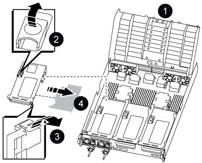
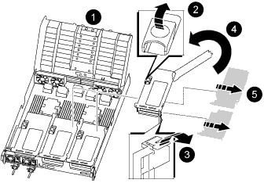

= 
:allow-uri-read: 

.Schritte
. Stellen Sie fest, ob die Karte, die Sie austauschen, von Riser 1 stammt oder von Riser 2 oder 3 stammt.
+
** Wenn Sie die 100-GbE-PCIe-Karte in Riser 1 ersetzen, verwenden Sie die Schritte 2 - 3 und die Schritte 6 - 7.
** Wenn Sie eine PCIe-Karte von Riser 2 oder 3 ersetzen, verwenden Sie die Schritte 4 bis 7.

. Entfernen Sie die Riser 1 vom Controller-Modul:
+
.. Entfernen Sie die QSFP-Module, die sich möglicherweise in der PCIe-Karte enthalten haben.
.. Drehen Sie die Riserverriegelung auf der linken Seite des Riser nach oben und in Richtung der Lüftermodule.
+
Der Riser hebt sich leicht vom Controller-Modul auf.

.. Heben Sie den Riser an, und legen Sie ihn in Richtung der Lüfter, so dass die Metalllippe auf dem Riser den Rand des Controller-Moduls entfernt, heben Sie den Riser aus dem Controller-Modul und legen Sie ihn dann auf eine stabile, flache Oberfläche.
+

+
[cols="1,4"]
|===

 a| 
image:../media/icon_round_1.png["Legende Nummer 1"]
 a| 
Luftkanal

 a| 
image:../media/icon_round_2.png["Legende Nummer 2"]
 a| 
Riserverriegelung

 a| 
image:../media/icon_round_3.png["Legende Nummer 3"]
 a| 
Kartenverriegelungshalterung

 a| 
image:../media/icon_round_4.png["Legende Nummer 4"]
 a| 
Riser 1 (linker Riser) mit 100-GbE-PCIe-Karte in Steckplatz 1.

|===

. Entfernen Sie die PCIe-Karte aus dem Riser 1:
+
.. Drehen Sie den Riser so, dass Sie auf die PCIe-Karte zugreifen können.
.. Drücken Sie die Sicherungshalterung an der Seite des PCIe-Riser und drehen Sie sie dann in die offene Position.
.. Entfernen Sie die PCIe-Karte aus dem Riser.

. Entfernen Sie den PCIe-Riser aus dem Controller-Modul:
+
.. Entfernen Sie alle SFP- oder QSFP-Module, die sich möglicherweise in den PCIe-Karten enthalten haben.
.. Drehen Sie die Riserverriegelung auf der linken Seite des Riser nach oben und in Richtung der Lüftermodule.
+
Der Riser hebt sich leicht vom Controller-Modul auf.

.. Heben Sie den Riser an, und legen Sie ihn in Richtung der Lüfter, so dass die Metalllippe auf dem Riser den Rand des Controller-Moduls entfernt, heben Sie den Riser aus dem Controller-Modul und legen Sie ihn dann auf eine stabile, flache Oberfläche.
+

+
[cols="1,4"]
|===

 a| 
image:../media/icon_round_1.png["Legende Nummer 1"]
 a| 
Luftkanal

 a| 
image:../media/icon_round_2.png["Legende Nummer 2"]
 a| 
Riserkarte 2 (mittlerer Riser) oder Verriegelungsriegel 3 (rechter Riser)

 a| 
image:../media/icon_round_3.png["Legende Nummer 3"]
 a| 
Kartenverriegelungshalterung

 a| 
image:../media/icon_round_4.png["Legende Nummer 4"]
 a| 
Seitenwand an Riser 2 oder 3

 a| 
image:../media/icon_round_5.png["Legende Nummer 5"]
 a| 
PCIe-Karten in Riser 2 oder 3

|===

. Entfernen Sie die PCIe-Karte aus dem Riser:
+
.. Drehen Sie den Riser so, dass Sie auf die PCIe-Karten zugreifen können.
.. Drücken Sie die Sicherungshalterung an der Seite des PCIe-Riser und drehen Sie sie dann in die offene Position.
.. Schwenken Sie die Seitenwand vom Riser ab.
.. Entfernen Sie die PCIe-Karte aus dem Riser.

. Setzen Sie die PCIe-Karte in denselben Steckplatz im Riser ein:
+
.. Richten Sie die Karte am Kartensockel im Riser aus, und schieben Sie sie anschließend in den Sockel im Riser.
+

NOTE: Stellen Sie sicher, dass die Karte vollständig und quadratische Position im Risersteckplatz hat.

.. Schließen Sie für Riser 2 oder 3 die Seitenabdeckung.
.. Schwenken Sie die Verriegelungsverriegelung, bis sie in die verriegelte Position einrastet.

. Installieren Sie den Riser in das Controller-Modul:
+
.. Richten Sie die Lippe des Riser an der Unterseite der Bleche des Controller-Moduls aus.
.. Führen Sie den Riser entlang der Stifte im Controller-Modul und senken Sie den Riser anschließend in das Controller-Modul.
.. Drehen Sie die Verriegelung nach unten, und klicken Sie sie in die verriegelte Position.
+
Bei der Verriegelung ist die Verriegelung bündig mit der Oberseite des Riser und der Riser sitzt im Controller-Modul.

.. Setzen Sie alle SFP-Module wieder ein, die von den PCIe-Karten entfernt wurden.

