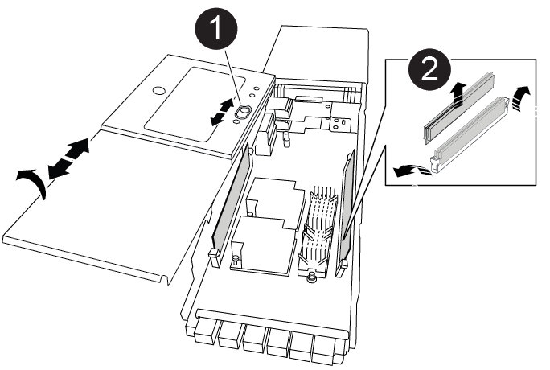

= Schritt 1: Schalten Sie den beeinträchtigten Regler aus
:allow-uri-read: 

Das NVRAM-Modul besteht aus NVRAM11 und DIMMs. Ein ausgefallenes NVRAM-Modul oder die DIMMs im NVRAM-Modul können Sie ersetzen. Um ein ausgefallenes NVRAM-Modul zu ersetzen, müssen Sie es aus dem Chassis entfernen, die DIMMs in das Ersatzmodul verschieben und das Ersatz-NVRAM-Modul im Chassis installieren.

Zum Austauschen und NVRAM-DIMM müssen Sie das NVRAM-Modul aus dem Chassis entfernen, das fehlerhafte DIMM im Modul ersetzen und dann das NVRAM-Modul neu installieren.

.Über diese Aufgabe
Da die System-ID vom NVRAM-Modul abgeleitet wird, werden beim Ersetzen des Moduls Festplatten, die zum System gehören, einer neuen System-ID neu zugewiesen.

.Bevor Sie beginnen
* Alle Platten-Shelves müssen ordnungsgemäß funktionieren.
* Wenn sich Ihr System in einem HA-Paar befindet, muss der Partner-Controller den Controller übernehmen können, der dem zu ersetzenden NVRAM-Modul zugeordnet ist.
* Bei diesem Verfahren wird die folgende Terminologie verwendet:
+
** Der beeinträchtigte Controller ist der Controller, an dem Sie Wartungsarbeiten durchführen.
** Der gesunde Controller ist der HA-Partner des beeinträchtigten Controllers.

* Dieses Verfahren umfasst Schritte zur automatischen Neuzuteilung von Festplatten an das Controller-Modul, das dem neuen NVRAM-Modul zugeordnet ist. Sie müssen die Festplatten neu zuweisen, wenn Sie dazu aufgefordert werden. Das Ausfüllen der Neuzuweisung von Festplatte vor dem Giveback kann Probleme verursachen.
* Sie müssen die fehlerhafte Komponente durch eine vom Anbieter empfangene Ersatz-FRU-Komponente ersetzen.
* Im Rahmen dieses Verfahrens können Festplatten oder Platten-Shelfs nicht geändert werden.

== Schritt 1: Schalten Sie den beeinträchtigten Regler aus

Fahren Sie den Regler herunter oder übernehmen Sie ihn mit einer der folgenden Optionen.

[role="tabbed-block"]
====
.Option 1: Die meisten Systeme
--
Um den beeinträchtigten Controller herunterzufahren, müssen Sie den Status des Controllers bestimmen und gegebenenfalls den Controller übernehmen, damit der gesunde Controller weiterhin Daten aus dem beeinträchtigten Reglerspeicher bereitstellen kann.

.Über diese Aufgabe
* Wenn Sie NetApp Storage Encryption verwenden, müssen Sie die MSID mithilfe der Anweisungen im zurückgesetzt haben link:https://docs.netapp.com/us-en/ontap/encryption-at-rest/return-seds-unprotected-mode-task.html["SEDs werden in den ungeschützten Modus versetzt"].
* Wenn Sie über ein SAN-System verfügen, müssen Sie Ereignismeldungen geprüft haben  `cluster kernel-service show`) Für beeinträchtigte Controller SCSI-Blade. Der `cluster kernel-service show` Der Befehl zeigt den Node-Namen, den Quorum-Status dieses Node, den Verfügbarkeitsstatus dieses Node und den Betriebsstatus dieses Node an.
+
Jeder Prozess des SCSI-Blades sollte sich im Quorum mit den anderen Nodes im Cluster befinden. Probleme müssen behoben werden, bevor Sie mit dem Austausch fortfahren.

* Wenn Sie über ein Cluster mit mehr als zwei Nodes verfügen, muss es sich im Quorum befinden. Wenn sich das Cluster nicht im Quorum befindet oder ein gesunder Controller FALSE anzeigt, um die Berechtigung und den Zustand zu erhalten, müssen Sie das Problem korrigieren, bevor Sie den beeinträchtigten Controller herunterfahren; siehe link:https://docs.netapp.com/us-en/ontap/system-admin/synchronize-node-cluster-task.html?q=Quorum["Synchronisieren eines Node mit dem Cluster"^].

.Schritte
. Wenn AutoSupport aktiviert ist, unterdrücken Sie die automatische Erstellung eines Cases durch Aufrufen einer AutoSupport Meldung: `system node autosupport invoke -node * -type all -message MAINT=number_of_hours_downh`
+
Die folgende AutoSupport Meldung unterdrückt die automatische Erstellung von Cases für zwei Stunden: `cluster1:> system node autosupport invoke -node * -type all -message MAINT=2h`

. Deaktivieren Sie das automatische Giveback von der Konsole des gesunden Controllers: `storage failover modify –node local -auto-giveback false`
+

NOTE: Wenn Sie sehen _Möchten Sie Auto-Giveback deaktivieren?_, geben Sie ein `y`.

. Nehmen Sie den beeinträchtigten Controller zur LOADER-Eingabeaufforderung:
+
[cols="1,2"]
|===
| Wenn der eingeschränkte Controller angezeigt wird... | Dann... 

 a| 
Die LOADER-Eingabeaufforderung
 a| 
Fahren Sie mit dem nächsten Schritt fort.

 a| 
Warten auf Giveback...
 a| 
Drücken Sie Strg-C, und antworten Sie dann `y` Wenn Sie dazu aufgefordert werden.

 a| 
Eingabeaufforderung für das System oder Passwort
 a| 
Übernehmen oder stoppen Sie den beeinträchtigten Regler von der gesunden Steuerung: `storage failover takeover -ofnode _impaired_node_name_`

Wenn der Regler „beeinträchtigt“ auf Zurückgeben wartet... anzeigt, drücken Sie Strg-C, und antworten Sie dann `y`.

|===

--
.Option 2: Controller befindet sich in einem MetroCluster
--

NOTE: Verwenden Sie dieses Verfahren nicht, wenn sich Ihr System in einer MetroCluster-Konfiguration mit zwei Knoten befindet.

Um den beeinträchtigten Controller herunterzufahren, müssen Sie den Status des Controllers bestimmen und gegebenenfalls den Controller übernehmen, damit der gesunde Controller weiterhin Daten aus dem beeinträchtigten Reglerspeicher bereitstellen kann.

* Wenn Sie über ein Cluster mit mehr als zwei Nodes verfügen, muss es sich im Quorum befinden. Wenn sich das Cluster nicht im Quorum befindet oder ein gesunder Controller FALSE anzeigt, um die Berechtigung und den Zustand zu erhalten, müssen Sie das Problem korrigieren, bevor Sie den beeinträchtigten Controller herunterfahren; siehe link:https://docs.netapp.com/us-en/ontap/system-admin/synchronize-node-cluster-task.html?q=Quorum["Synchronisieren eines Node mit dem Cluster"^].
* Wenn Sie über eine MetroCluster-Konfiguration verfügen, müssen Sie bestätigt haben, dass der MetroCluster-Konfigurationsstatus konfiguriert ist und dass die Nodes in einem aktivierten und normalen Zustand vorliegen (`metrocluster node show`).

.Schritte
. Wenn AutoSupport aktiviert ist, unterdrücken Sie die automatische Erstellung eines Cases durch Aufrufen einer AutoSupport Meldung: `system node autosupport invoke -node * -type all -message MAINT=number_of_hours_downh`
+
Die folgende AutoSupport Meldung unterdrückt die automatische Erstellung von Cases für zwei Stunden: `cluster1:*> system node autosupport invoke -node * -type all -message MAINT=2h`

. Deaktivieren Sie das automatische Giveback von der Konsole des gesunden Controllers: `storage failover modify –node local -auto-giveback false`
. Nehmen Sie den beeinträchtigten Controller zur LOADER-Eingabeaufforderung:
+
[cols="1,2"]
|===
| Wenn der eingeschränkte Controller angezeigt wird... | Dann... 

 a| 
Die LOADER-Eingabeaufforderung
 a| 
Fahren Sie mit dem nächsten Schritt fort.

 a| 
Warten auf Giveback...
 a| 
Drücken Sie Strg-C, und antworten Sie dann `y` Wenn Sie dazu aufgefordert werden.

 a| 
Eingabeaufforderung des Systems oder Passwort (Systempasswort eingeben)
 a| 
Übernehmen oder stoppen Sie den beeinträchtigten Regler von der gesunden Steuerung: `storage failover takeover -ofnode _impaired_node_name_`

Wenn der Regler „beeinträchtigt“ auf Zurückgeben wartet... anzeigt, drücken Sie Strg-C, und antworten Sie dann `y`.

|===

--
====

== Schritt 2: Ersetzen Sie das NVRAM-Modul

Zum Austauschen des NVRAM-Moduls suchen Sie es in Steckplatz 6 im Chassis und befolgen die spezifische Sequenz von Schritten.

. Wenn Sie nicht bereits geerdet sind, sollten Sie sich richtig Erden.
. Entfernen des Ziel-NVRAM-Moduls aus dem Chassis:
+
.. Drücken Sie die Taste mit der Nummerierung und dem Buchstaben.
+
Die Nockentaste bewegt sich vom Gehäuse weg.

.. Drehen Sie die Nockenverriegelung nach unten, bis sie sich in horizontaler Position befindet.
+
Das NVRAM-Modul geht aus dem Chassis heraus und bewegt sich einige Zentimeter heraus.

.. Entfernen Sie das NVRAM-Modul aus dem Gehäuse, indem Sie an den Zuglaschen an den Seiten der Modulfläche ziehen.
+
.Animation: Ersetzen Sie das NVRAM-Modul
video::6eb2d864-9d35-4a23-b6c2-adf9016b359f[panopto]
+
image::../media/drw_a900_move-remove_NVRAM_module.png[drw a900 Move NVRAM-Modul entfernen]

+
[cols="10,90"]
|===

 a| 
image:../media/legend_icon_01.png["Legende Nummer 1"]
 a| 
Vorgeratene und nummerierte Nockenverriegelung

 a| 
image:../media/legend_icon_02.png["Legende Nummer 2"]
 a| 
Nockenverriegelung vollständig entriegelt

|===
. Setzen Sie das NVRAM-Modul auf eine stabile Fläche und entfernen Sie die Abdeckung vom NVRAM-Modul, indem Sie die blaue Verriegelungstaste auf der Abdeckung nach unten drücken und dann, während Sie die blaue Taste gedrückt halten, den Deckel aus dem NVRAM-Modul schieben.
+

+
[cols="10,90"]
|===

 a| 
image:../media/legend_icon_01.png["Legende Nummer 1"]
 a| 
Verriegelungsknopf für die Abdeckung

 a| 
image:../media/legend_icon_02.png["Legende Nummer 2"]
 a| 
DIMM- und DIMM-Auswurfklammern

|===
. Entfernen Sie nacheinander die DIMMs aus dem alten NVRAM-Modul und installieren Sie sie im ErsatzNVRAM-Modul.
. Schließen Sie die Abdeckung am Modul.
. Installieren Sie das Ersatz-NVRAM-Modul in das Chassis:
+
.. Richten Sie das Modul an den Kanten der Gehäuseöffnung in Steckplatz 6 aus.
.. Schieben Sie das Modul vorsichtig in den Schlitz, bis die vorletzte und nummerierte Nockenverriegelung mit dem Stift der E/A-Nockenwelle einrastet. Drücken Sie dann die Nockenverriegelung ganz nach oben, um das Modul zu verriegeln.

== Schritt 3: Ersetzen Sie ein NVRAM-DIMM

Um NVRAM-DIMMs im NVRAM-Modul zu ersetzen, müssen Sie das NVRAM-Modul entfernen, das Modul öffnen und dann das Ziel-DIMM ersetzen.

. Wenn Sie nicht bereits geerdet sind, sollten Sie sich richtig Erden.
. Entfernen des Ziel-NVRAM-Moduls aus dem Chassis:
+
.. Drücken Sie die Taste mit der Nummerierung und dem Buchstaben.
+
Die Nockentaste bewegt sich vom Gehäuse weg.

.. Drehen Sie die Nockenverriegelung nach unten, bis sie sich in horizontaler Position befindet.
+
Das NVRAM-Modul geht aus dem Chassis heraus und bewegt sich einige Zentimeter heraus.

.. Entfernen Sie das NVRAM-Modul aus dem Gehäuse, indem Sie an den Zuglaschen an den Seiten der Modulfläche ziehen.
+
.Animation – NVRAM-DIMM ersetzen
video::0ae4e603-c22b-4930-8070-adf2000e38b5[panopto]
+
image::../media/drw_a900_move-remove_NVRAM_module.png[drw a900 Move NVRAM-Modul entfernen]

+
[cols="10,90"]
|===

 a| 
image:../media/legend_icon_01.png["Legende Nummer 1"]
 a| 
Vorgeratene und nummerierte Nockenverriegelung

 a| 
image:../media/legend_icon_02.png["Legende Nummer 2"]
 a| 
nockenverriegelung vollständig entriegelt

|===
. Setzen Sie das NVRAM-Modul auf eine stabile Fläche und entfernen Sie die Abdeckung vom NVRAM-Modul, indem Sie die blaue Verriegelungstaste auf der Abdeckung nach unten drücken und dann, während Sie die blaue Taste gedrückt halten, den Deckel aus dem NVRAM-Modul schieben.
+

+
[cols="10,90"]
|===

 a| 
image:../media/legend_icon_01.png["Legende Nummer 1"]
 a| 
Verriegelungsknopf für die Abdeckung

 a| 
image:../media/legend_icon_02.png["Legende Nummer 2"]
 a| 
DIMM- und DIMM-Auswurfklammern

|===
. Suchen Sie das DIMM, das im NVRAM-Modul ausgetauscht werden soll, und entfernen Sie es, indem Sie die DIMM-Verriegelungslaschen nach unten drücken und das DIMM aus dem Sockel heben.
. Installieren Sie das ErsatzDIMM, indem Sie das DIMM-Modul am Sockel ausrichten und das DIMM vorsichtig in den Sockel schieben, bis die Verriegelungslaschen einrasten.
. Schließen Sie die Abdeckung am Modul.
. Installieren Sie das NVRAM-Modul in das Chassis:
+
.. Richten Sie das Modul an den Kanten der Gehäuseöffnung in Steckplatz 6 aus.
.. Schieben Sie das Modul vorsichtig in den Schlitz, bis die vorletzte und nummerierte Nockenverriegelung mit dem Stift der E/A-Nockenwelle einrastet. Drücken Sie dann die Nockenverriegelung ganz nach oben, um das Modul zu verriegeln.

== Schritt 4: Starten Sie den Controller neu

Nachdem Sie die FRU ersetzt haben, müssen Sie das Controller-Modul neu booten.

. Um ONTAP von der LOADER-Eingabeaufforderung zu booten, geben Sie ein `bye`.

== Schritt 5: Festplatten neu zuweisen

Sie müssen die Änderung der System-ID beim Booten des Ersatz-Controllers bestätigen und anschließend überprüfen, ob die Änderung implementiert wurde.

CAUTION: Eine Neuzuweisung der Festplatte ist nur erforderlich, wenn das NVRAM-Modul ersetzt wird. Dies gilt nicht für den Austausch des NVRAM-DIMM.

.Schritte
. Wenn sich der Ersatz-Controller im Wartungsmodus befindet (zeigt das an `*>` Eingabeaufforderung), beenden Sie den Wartungsmodus und gehen Sie zur LOADER-Eingabeaufforderung: `halt`
. Booten Sie an der LOADER-Eingabeaufforderung auf dem Ersatz-Controller den Controller und geben Sie „y“ ein, wenn Sie aufgrund von nicht übereinstimmenden System-ID aufgefordert werden, die System-ID außer Kraft zu setzen.
. Warten Sie, bis Sie auf das Giveback warten... Die Meldung wird auf der Konsole des Controllers mit dem Ersatzmodul angezeigt und anschließend vom gesunden Controller aus überprüfen, ob die neue Partner-System-ID automatisch zugewiesen wurde: `storage failover show`
+
In der Befehlsausgabe sollte eine Meldung angezeigt werden, dass sich die System-ID auf dem beeinträchtigten Controller geändert hat und die korrekten alten und neuen IDs angezeigt werden. Im folgenden Beispiel wurde node2 ersetzt und hat eine neue System-ID von 151759706.

+
[listing]
----
node1:> storage failover show
                                    Takeover
Node              Partner           Possible     State Description
------------      ------------      --------     -------------------------------------
node1             node2             false        System ID changed on partner (Old:
                                                  151759755, New: 151759706), In takeover
node2             node1             -            Waiting for giveback (HA mailboxes)
----
. Geben Sie den Controller zurück:
+
.. Geben Sie von dem ordnungsgemäßen Controller den Storage des ersetzten Controllers wieder: `storage failover giveback -ofnode replacement_node_name`
+
Der Ersatz-Controller benötigt wieder Storage und läuft ab.

+
Wenn Sie aufgrund einer nicht übereinstimmenden System-ID aufgefordert werden, die System-ID außer Kraft zu setzen, sollten Sie eingeben `y`.

+

NOTE: Wenn das Rückübertragung ein Vetorecht ist, können Sie erwägen, das Vetos außer Kraft zu setzen.

+
Weitere Informationen finden Sie im https://docs.netapp.com/us-en/ontap/high-availability/ha_manual_giveback.html#if-giveback-is-interrupted["Manuelle Giveback-Befehle"^] Thema, um das Veto zu überschreiben.

.. Nachdem das Giveback abgeschlossen ist, bestätigen Sie, dass das HA-Paar sich gesund befindet und ein Takeover möglich ist: `storage failover show`
+
Die Ausgabe von der `storage failover show` Befehl sollte nicht die in der Partnernachricht geänderte System-ID enthalten.

. Überprüfen Sie, ob die Festplatten ordnungsgemäß zugewiesen wurden: `storage disk show -ownership`
+
Bei den Festplatten, die zum Ersatz-Controller gehören, sollte die neue System-ID angezeigt werden. Im folgenden Beispiel zeigen die Festplatten von node1 jetzt die neue System-ID, 151759706:

+
[listing]
----
node1:> storage disk show -ownership

Disk  Aggregate Home  Owner  DR Home  Home ID    Owner ID  DR Home ID Reserver  Pool
----- ------    ----- ------ -------- -------    -------    -------  ---------  ---
1.0.0  aggr0_1  node1 node1  -        151759706  151759706  -       151759706 Pool0
1.0.1  aggr0_1  node1 node1           151759706  151759706  -       151759706 Pool0
.
.
.
----
. Wenn sich das System in einer MetroCluster-Konfiguration befindet, überwachen Sie den Status des Controllers: `metrocluster node show`
+
Die MetroCluster-Konfiguration dauert einige Minuten nach dem Austausch und kehrt in den normalen Zustand zurück. Zu diesem Zeitpunkt zeigt jeder Controller einen konfigurierten Status mit aktivierter DR-Spiegelung und einem normalen Modus an. Der `metrocluster node show -fields node-systemid` In der Befehlsausgabe wird die alte System-ID angezeigt, bis die MetroCluster-Konfiguration den normalen Status aufweist.

. Wenn der Controller in einer MetroCluster-Konfiguration befindet, überprüfen Sie abhängig vom Status des MetroCluster, ob im Feld für die DR-Home-ID der ursprüngliche Eigentümer der Festplatte angezeigt wird, wenn der ursprüngliche Eigentümer ein Controller am Disaster-Standort ist.
+
Dies ist erforderlich, wenn beide der folgenden Werte erfüllt sind:

+
** Die MetroCluster Konfiguration befindet sich in einem Switchover-Zustand.
** Der Ersatz-Controller ist der aktuelle Besitzer der Festplatten am Disaster-Standort.
+
Siehe https://docs.netapp.com/us-en/ontap-metrocluster/manage/concept_understanding_mcc_data_protection_and_disaster_recovery.html#disk-ownership-changes-during-ha-takeover-and-metrocluster-switchover-in-a-four-node-metrocluster-configuration["Änderungen am Festplattenbesitz während HA Takeover und MetroCluster Switchover in einer MetroCluster Konfiguration mit vier Nodes"] Finden Sie weitere Informationen.

. Wenn sich das System in einer MetroCluster-Konfiguration befindet, vergewissern Sie sich, dass jeder Controller konfiguriert ist: `metrocluster node show - fields configuration-state`
+
[listing]
----
node1_siteA::> metrocluster node show -fields configuration-state

dr-group-id            cluster node           configuration-state
-----------            ---------------------- -------------- -------------------
1 node1_siteA          node1mcc-001           configured
1 node1_siteA          node1mcc-002           configured
1 node1_siteB          node1mcc-003           configured
1 node1_siteB          node1mcc-004           configured

4 entries were displayed.
----
. Vergewissern Sie sich, dass die erwarteten Volumes für jeden Controller vorhanden sind: `vol show -node node-name`
. Wenn die Speicherverschlüsselung aktiviert ist, müssen Sie die Funktion wiederherstellen.
. Wenn Sie die automatische Übernahme beim Neustart deaktiviert haben, aktivieren Sie sie vom gesunden Controller: `storage failover modify -node replacement-node-name -onreboot true`

== Schritt 6: Stellen Sie die Funktionen für Storage und Volume Encryption wieder her

Wenn die Speicherverschlüsselung aktiviert ist, gehen Sie wie folgt vor.

IMPORTANT: Dieser Schritt gilt nicht für den Austausch des NVRAM-DIMM.

[role="tabbed-block"]
====
.Option 1: Verwenden Von Onboard Key Manager
--
.Schritte
. Starten Sie den Node im Boot-Menü.
. Wählen Sie Option 10, `Set onboard key management recovery secrets`.
. Geben Sie die Passphrase für den Onboard-Schlüsselmanager ein, den Sie vom Kunden erhalten haben.
. Fügen Sie an der Eingabeaufforderung die Sicherungsschlüsseldaten aus der Ausgabe von ein `security key-manager backup show` ODER `security key-manager onboard show-backup` Befehl.
+
Beispiel für Backup-Daten:

+
---------------------------- BEGINNEN SIE MIT DEM BACKUP---------------------------------

+
TmV0QXBWIETLESBKBG9iAAAAAAAAAAAAAAAAAAAAAAAAAAAAAAAAAAAAAAAAAAAAAAAAAAAAAAAAAA1AAAAAAAAAAAAAAAAAAAAAA1AAAAAAAAAAAAAAAAAAAAAAAA1AAAAAAAAAAAAAAAAAAAAAAAAAAAAAAA1AAAAAAAAAAAAAAAAAAAAAAAAAAAAAA1AAAAAAAAAAAAAAAAAAAAAAAAAAAAAAAA1AAAAAAAAAAAAAAAAAAAAAAAAAAAAAAAAAAA . . . H4nPQM0nrDRYRa9SCv8AAAAAAAAAAAAAAAAAAAAAAAAAAAAAAAAAAAAAAAAAAAAAAAAAAAAAAAAAAAAAAAAAAAAAAAAAAAAAAAAAAAAAAAAAAAAAAAAAAAAAAAAAAAAAAAAAAAAAAAAAAAAAAAAAAAAAAAAAAAAA

+
--------------------------------- END-BACKUP--------------------------------------------------

+

NOTE: Der Controller kehrt zum Startmenü zurück.

. Option 1 auswählen, `Normal Boot`
. Geben Sie nur die CFO-Aggregate mit dem zurück `storage failover giveback -fromnode local -only-cfo-aggregates true` Befehl.
+
** Wenn der Befehl aufgrund eines ausgefallenen Laufwerks ausfällt, setzen Sie die ausgefallene Festplatte physisch aus, lassen Sie sie aber in den Steckplatz, bis ein Austausch erfolgt.
** Wenn der Befehl aufgrund einer offenen CIFS-Sitzung nicht erfolgreich ausgeführt wird, informieren Sie sich beim Kunden, wie CIFS-Sitzungen abgeschlossen werden können.
+

NOTE: Die Beendigung von CIFS kann zu Datenverlust führen.

** Wenn der Befehl fehlschlägt, weil der Partner „nicht bereit“ ist, warten Sie 5 Minuten, bis die NVRAMs synchronisiert wurden.
** Wenn der Befehl aufgrund eines NDMP-, SnapMirror- oder SnapVault-Prozesses ausfällt, deaktivieren Sie den Prozess. Weitere Informationen finden Sie in den entsprechenden Inhalten.

. Sobald die Rückgabe abgeschlossen ist, überprüfen Sie den Failover- und Giveback-Status mit `storage failover show` Und `storage failover show-giveback` Befehle.
+
Es werden nur die CFO-Aggregate (Root-Aggregate und Daten-Aggregate im CFO-Stil) angezeigt.

. Führen Sie die integrierte Synchronisierung des Sicherheitsschlüsselmanagers aus:
+
.. Führen Sie die aus `security key-manager onboard sync` Geben Sie bei der entsprechenden Aufforderung die Passphrase ein.
.. Geben Sie das ein `security key-manager key-query` Befehl zum Anzeigen einer detaillierten Ansicht aller im Onboard-Schlüsselmanager gespeicherten Schlüssel und zur Überprüfung des s `Restored` Spalte = `yes/true` Für alle Authentifizierungsschlüssel.
+

NOTE: Wenn der `Restored` Spalte = nichts anderes als `yes/true`, Wenden Sie sich an den Kundendienst.

.. Warten Sie 10 Minuten, bis der Schlüssel über das Cluster synchronisiert wird.

. Stellen Sie das Konsolenkabel auf den Partner Controller um.
. Geben Sie den Ziel-Controller mithilfe des zurück `storage failover giveback -fromnode local` Befehl.
. Überprüfen Sie den Giveback-Status, drei Minuten nachdem Berichte abgeschlossen wurden, mithilfe des `storage failover show` Befehl.
+
Falls das Giveback nach 20 Minuten nicht abgeschlossen ist, wenden Sie sich an den Kundendienst.

. Geben Sie an der Eingabeaufforderung für clustershell den Befehl net int show -is-Home false ein, um die logischen Schnittstellen aufzulisten, die sich nicht auf ihrem Home-Controller und Port befinden.
+
Wenn Schnittstellen als aufgeführt werden `false`, Zurücksetzen dieser Schnittstellen zurück auf ihren Home-Port mit dem net int revert Befehl.

. Bewegen Sie das Konsolenkabel auf den Ziel-Controller, und führen Sie den aus `version -v` Befehl zum Prüfen der ONTAP-Versionen.
. Stellen Sie die automatische Rückgabe wieder her, wenn Sie die Funktion mithilfe von deaktivieren `storage failover modify -node local -auto-giveback true` Befehl.
. Setzen Sie die MSID zurück, wenn sie zuvor festgelegt wurde und zu Beginn dieses Verfahrens erfasst wurde:
+
.. Weisen Sie einem FIPS-Laufwerk oder einer SED mithilfe des einen Datenauthentifizierungsschlüssel zu `storage encryption disk modify -disk _disk_ID_ -data-key-id _key_ID_` Befehl.
+

NOTE: Sie können das verwenden `security key-manager key query -key-type NSE-AK` Befehl zum Anzeigen von Schlüssel-IDs.

.. Überprüfen Sie, ob die Authentifizierungsschlüssel mit dem zugewiesen wurden `storage encryption disk show` Befehl.

--
.Option 2: Verwenden Von External Manager
--
. Starten Sie den Controller im Boot-Menü.
. Wählen Sie Option 11, `Configure node for external key management`.
. Geben Sie die Informationen zum Verwaltungszertifikat an den Eingabeaufforderungen ein.
+

NOTE: Der Controller kehrt zum Startmenü zurück, nachdem die Managementzertifikatinformationen abgeschlossen sind.

. Option 1 auswählen, `Normal Boot`
. Bewegen Sie das Konsolenkabel auf den Partner Controller und geben Sie den Ziel-Controller-Storage mit dem Storage Failover Giveback -vNode local -only-cfo-Aggregates echten lokalen Befehl zurück.
+
** Wenn der Befehl aufgrund eines ausgefallenen Laufwerks ausfällt, setzen Sie die ausgefallene Festplatte physisch aus, lassen Sie sie aber in den Steckplatz, bis ein Austausch erfolgt.
** Wenn der Befehl aufgrund von offenen CIFS-Sitzungen ausfällt, wenden Sie sich an den Kunden, wie CIFS-Sitzungen abgeschlossen werden können.
+

NOTE: Die Beendigung von CIFS kann zu Datenverlust führen.

** Wenn der Befehl fehlschlägt, weil der Partner "nicht bereit" ist, warten Sie 5 Minuten, bis die NVMEMs synchronisieren.
** Wenn der Befehl aufgrund eines NDMP-, SnapMirror- oder SnapVault-Prozesses ausfällt, deaktivieren Sie den Prozess. Weitere Informationen finden Sie in den entsprechenden Inhalten.

. Warten Sie 3 Minuten, und überprüfen Sie den Failover-Status mit dem Befehl „Storage Failover show“.
. Geben Sie an der Clustershell-Eingabeaufforderung den ein `net int show -is-home false` Befehl zum Auflistung der logischen Schnittstellen, die sich nicht auf ihrem Home Controller und Port befinden.
+
Wenn Schnittstellen als aufgeführt werden `false`, Zurücksetzen dieser Schnittstellen zurück zu ihrem Home-Port mit dem `net int revert` Befehl.

. Bewegen Sie das Konsolenkabel auf den Ziel-Controller, und führen Sie den aus `version -v` Befehl zum Prüfen der ONTAP-Versionen.
. Stellen Sie die automatische Rückgabe wieder her, wenn Sie die Funktion mithilfe von deaktivieren `storage failover modify -node local -auto-giveback true` Befehl.
. Verwenden Sie die `storage encryption disk show` An der clustershell-Eingabeaufforderung zur Überprüfung der Ausgabe.
. Verwenden Sie die `security key-manager key-query` Befehl zum Anzeigen der Verschlüsselung und Authentifizierungsschlüssel, die auf den Verschlüsselungsmanagement-Servern gespeichert sind.
+
** Wenn der `Restored` Spalte = `yes/true`, Sie sind fertig und können den Austauschprozess abschließen.
** Wenn der `Key Manager type` = `external` Und das `Restored` Spalte = nichts anderes als `yes/true`, Verwenden Sie den Befehl Security Key-Manager External Restore, um die Schlüssel-IDs der Authentifizierungsschlüssel wiederherzustellen.
+

NOTE: Falls der Befehl fehlschlägt, wenden Sie sich an den Kundendienst.

** Wenn der `Key Manager type` = `onboard` Und das `Restored` Spalte = nichts anderes als `yes/true`, Verwenden Sie den Onboard Sync-Befehl des Security Key-Managers, um den Key Manager-Typ neu zu synchronisieren.
+
Verwenden Sie die `security key-manager key-query` Befehl zum Überprüfen des `Restored` Spalte = `yes/true` Für alle Authentifizierungsschlüssel.

. Schließen Sie das Konsolenkabel an den Partner Controller an.
. Geben Sie den Controller mit dem lokalen Befehl Storage Failover Giveback -abnode zurück.
. Stellen Sie die automatische Rückgabe wieder her, wenn Sie die Funktion mithilfe von deaktivieren `storage failover modify -node local -auto-giveback true` Befehl.
. Setzen Sie die MSID zurück, wenn sie zuvor festgelegt wurde und zu Beginn dieses Verfahrens erfasst wurde:
+
.. Weisen Sie einem FIPS-Laufwerk oder einer SED mithilfe des einen Datenauthentifizierungsschlüssel zu `storage encryption disk modify -disk _disk_ID_ -data-key-id _key_ID_` Befehl.
+

NOTE: Sie können das verwenden `security key-manager key query -key-type NSE-AK` Befehl zum Anzeigen von Schlüssel-IDs.

.. Überprüfen Sie, ob die Authentifizierungsschlüssel mit dem zugewiesen wurden `storage encryption disk show` Befehl.

--
====

== Schritt 7: Senden Sie das fehlgeschlagene Teil an NetApp zurück

Senden Sie das fehlerhafte Teil wie in den dem Kit beiliegenden RMA-Anweisungen beschrieben an NetApp zurück. Siehe https://mysupport.netapp.com/site/info/rma["Teilerückgabe  Austausch"] Seite für weitere Informationen.
