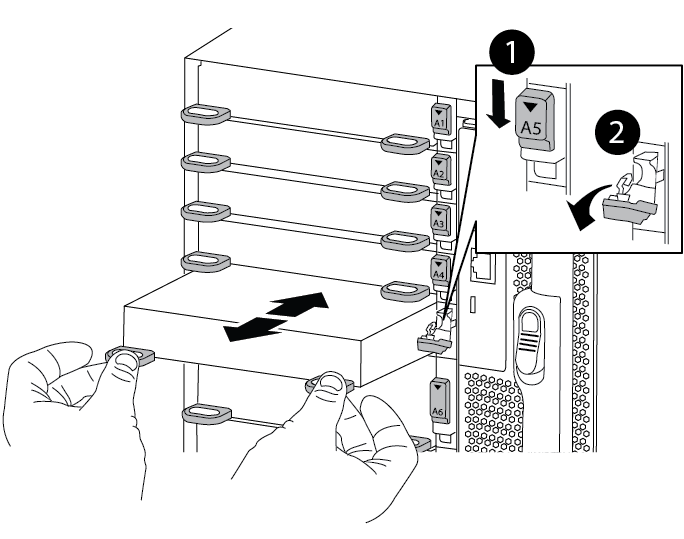

= Schritt 1: Fahren Sie den Knoten mit beeinträchtigten Knoten herunter
:allow-uri-read: 

Um ein E/A-Modul zu ersetzen, müssen Sie eine bestimmte Sequenz von Aufgaben ausführen.

* Sie können dieses Verfahren bei allen Versionen von ONTAP verwenden, die von Ihrem System unterstützt werden.
* Alle anderen Komponenten des Systems müssen ordnungsgemäß funktionieren. Falls nicht, müssen Sie sich an den technischen Support wenden.

== Schritt 1: Fahren Sie den Knoten mit beeinträchtigten Knoten herunter

Fahren Sie den Regler herunter oder übernehmen Sie ihn mit einer der folgenden Optionen.

[role="tabbed-block"]
====
.Option 1: Die meisten Systeme
--
Um den beeinträchtigten Controller herunterzufahren, müssen Sie den Status des Controllers bestimmen und gegebenenfalls den Controller übernehmen, damit der gesunde Controller weiterhin Daten aus dem beeinträchtigten Reglerspeicher bereitstellen kann.

.Bevor Sie beginnen
Wenn Sie über ein Cluster mit mehr als zwei Nodes verfügen, muss es sich im Quorum befinden. Wenn sich das Cluster nicht im Quorum befindet oder ein gesunder Controller FALSE anzeigt, um die Berechtigung und den Zustand zu erhalten, müssen Sie das Problem korrigieren, bevor Sie den beeinträchtigten Controller herunterfahren; siehe link:https://docs.netapp.com/us-en/ontap/system-admin/synchronize-node-cluster-task.html?q=Quorum["Synchronisieren eines Node mit dem Cluster"^].

.Schritte
. Wenn AutoSupport aktiviert ist, unterdrücken Sie die automatische Fallerstellung durch Aufruf eines AutoSupport-Meldungsbefehls: `system node autosupport invoke -node * -type all -message MAINT=number_of_hours_downh`
+
Mit dem folgenden AutoSupport-Befehl wird die automatische Erstellung von Fällen zwei Stunden lang unterdrückt: `cluster1:*> system node autosupport invoke -node * -type all -message MAINT=2h`

. Deaktivieren Sie die automatische Rückgabe von der Konsole des beeinträchtigten Controllers:
+
`storage failover modify -node impaired-node -auto-giveback-of false`

+

NOTE: Wenn Sie _Möchten Sie die automatische Rückgabe deaktivieren?_ sehen, geben Sie ein `y` .

+
.. Wenn der beeinträchtigte Controller nicht hochgefahren werden kann oder bereits übernommen wurde, müssen Sie die HA-Verbindung vom fehlerfreien Controller trennen, bevor Sie den beeinträchtigten Controller hochfahren.  Dadurch wird verhindert, dass der beeinträchtigte Controller eine automatische Rückgabe durchführt.
+
`system ha interconnect link off -node healthy-node -link 0`

+
`system ha interconnect link off -node healthy-node -link 1`

. Nehmen Sie den beeinträchtigten Controller zur LOADER-Eingabeaufforderung:
+
[cols="1,2"]
|===
| Wenn der eingeschränkte Controller angezeigt wird... | Dann... 

 a| 
Die LOADER-Eingabeaufforderung
 a| 
Fahren Sie mit dem nächsten Schritt fort.

 a| 
Eingabeaufforderung des Systems oder Passwort (Systempasswort eingeben)
 a| 
Halten Sie den Controller für den beeinträchtigten Betrieb an oder übernehmen Sie ihn vom Controller für den ordnungsgemäßen Betrieb: `storage failover takeover -ofnode _impaired_node_name_`

Wenn der Regler „beeinträchtigt“ auf Zurückgeben wartet... anzeigt, drücken Sie Strg-C, und antworten Sie dann `y`.

|===

--
.Option 2: Controller befindet sich in einem MetroCluster
--

NOTE: Verwenden Sie dieses Verfahren nicht, wenn sich Ihr System in einer MetroCluster-Konfiguration mit zwei Knoten befindet.

Um den beeinträchtigten Controller herunterzufahren, müssen Sie den Status des Controllers bestimmen und gegebenenfalls den Controller übernehmen, damit der gesunde Controller weiterhin Daten aus dem beeinträchtigten Reglerspeicher bereitstellen kann.

* Wenn Sie über ein Cluster mit mehr als zwei Nodes verfügen, muss es sich im Quorum befinden. Wenn sich das Cluster nicht im Quorum befindet oder ein gesunder Controller FALSE anzeigt, um die Berechtigung und den Zustand zu erhalten, müssen Sie das Problem korrigieren, bevor Sie den beeinträchtigten Controller herunterfahren; siehe link:https://docs.netapp.com/us-en/ontap/system-admin/synchronize-node-cluster-task.html?q=Quorum["Synchronisieren eines Node mit dem Cluster"^].
* Wenn Sie über eine MetroCluster-Konfiguration verfügen, müssen Sie bestätigt haben, dass der MetroCluster-Konfigurationsstatus konfiguriert ist und dass die Nodes in einem aktivierten und normalen Zustand vorliegen (`metrocluster node show`).

.Schritte
. Wenn AutoSupport aktiviert ist, unterdrücken Sie die automatische Fallerstellung durch Aufruf eines AutoSupport-Befehls: `system node autosupport invoke -node * -type all -message MAINT=number_of_hours_downh`
+
Mit dem folgenden AutoSupport-Befehl wird die automatische Erstellung von Fällen zwei Stunden lang unterdrückt: `cluster1:*> system node autosupport invoke -node * -type all -message MAINT=2h`

. Deaktivieren Sie das automatische Giveback von der Konsole des gesunden Controllers: `storage failover modify –node local -auto-giveback false`
. Nehmen Sie den beeinträchtigten Controller zur LOADER-Eingabeaufforderung:
+
[cols="1,2"]
|===
| Wenn der eingeschränkte Controller angezeigt wird... | Dann... 

 a| 
Die LOADER-Eingabeaufforderung
 a| 
Fahren Sie mit dem nächsten Schritt fort.

 a| 
Warten auf Giveback...
 a| 
Drücken Sie Strg-C, und antworten Sie dann `y` Wenn Sie dazu aufgefordert werden.

 a| 
Eingabeaufforderung des Systems oder Passwort (Systempasswort eingeben)
 a| 
Halten Sie den Controller für den beeinträchtigten Betrieb an oder übernehmen Sie ihn vom Controller für den ordnungsgemäßen Betrieb: `storage failover takeover -ofnode _impaired_node_name_`

Wenn der Regler „beeinträchtigt“ auf Zurückgeben wartet... anzeigt, drücken Sie Strg-C, und antworten Sie dann `y`.

|===

--
====

== Schritt 2: E/A-Module ersetzen

Um ein E/A-Modul zu ersetzen, suchen Sie es im Gehäuse und befolgen Sie die spezifischen Schritte.

. Wenn Sie nicht bereits geerdet sind, sollten Sie sich richtig Erden.
. Trennen Sie alle Kabel, die mit dem Ziel-E/A-Modul verbunden sind.
+
Achten Sie darauf, dass Sie die Kabel so kennzeichnen, dass Sie wissen, woher sie stammen.

. Entfernen Sie das Ziel-I/O-Modul aus dem Gehäuse:
+
.. Drücken Sie die Taste mit der Nummerierung und dem Buchstaben.
+
Die Nockentaste bewegt sich vom Gehäuse weg.

.. Drehen Sie die Nockenverriegelung nach unten, bis sie sich in horizontaler Position befindet.
+
Das I/O-Modul wird aus dem Gehäuse entfernt und bewegt sich ca. 1/2 Zoll aus dem I/O-Steckplatz.

.. Entfernen Sie das E/A-Modul aus dem Gehäuse, indem Sie an den Zuglaschen an den Seiten der Modulfläche ziehen.
+
Stellen Sie sicher, dass Sie den Steckplatz verfolgen, in dem sich das I/O-Modul befand.

+
.Animation - E/A-Modul entfernen/installieren
video::3a5b1f6e-15ec-40b4-bb2a-adf9016af7b6[panopto]
+

+
[cols="10,90"]
|===

 a| 
image:../media/icon_round_1.png["Legende Nummer 1"]
 a| 
Gerettete und nummerierte E/A-Nockenverriegelung

 a| 
image:../media/icon_round_2.png["Legende Nummer 2"]
 a| 
E/A-Nockenverriegelung vollständig entriegelt

|===
. Legen Sie das E/A-Modul beiseite.
. Setzen Sie das Ersatz-E/A-Modul in das Gehäuse ein, indem Sie das E/A-Modul vorsichtig in den Steckplatz schieben, bis die vorletzte und nummerierte E/A-Nockenverriegelung mit dem E/A-Nockenstift in Kontakt kommt und dann die E/A-Nockenverriegelung ganz nach oben drücken, um das Modul zu sichern.
. E/A-Modul nach Bedarf wieder aufführen.

== Schritt 3: Starten Sie den Controller neu

Nachdem Sie ein I/O-Modul ersetzt haben, müssen Sie das Controller-Modul neu starten.

NOTE: Wenn das neue I/O-Modul nicht das gleiche Modell wie das ausgefallene Modul ist, müssen Sie zuerst den BMC neu booten.

.Schritte
. Starten Sie den BMC neu, wenn das Ersatzmodul nicht dasselbe Modell wie das alte Modul ist:
+
.. Ändern Sie von der LOADER-Eingabeaufforderung in den erweiterten Berechtigungsebene: `priv set advanced`
.. Starten Sie den BMC neu: `sp reboot`

. Booten Sie an der LOADER-Eingabeaufforderung den Node neu: `bye`
+

NOTE: Dadurch werden die PCIe-Karten und andere Komponenten neu initialisiert und der Node wird neu gebootet.

. Wenn Ihr System so konfiguriert ist, dass es 10-GbE-Cluster-Interconnect und Datenverbindungen auf 40-GbE-NICs unterstützt 10, konvertieren Sie diese Ports mit dem Befehl nicadmin convert aus dem Wartungsmodus. Siehe https://docs.netapp.com/us-en/ontap/networking/convert_40gbe_nic_ports_into_multiple_10gbe_ports_for_10gbe_connectivity.html["Konvertieren Sie 40-GbE-NIC-Ports für 10-GbE-Konnektivität in mehrere 10-GbE-Ports"^] Finden Sie weitere Informationen.
+

NOTE: Achten Sie darauf, den Wartungsmodus nach Abschluss der Konvertierung zu beenden.

. Zurückkehren des Node in den normalen Betrieb: `storage failover giveback -ofnode impaired_node_name`
. Wenn die automatische Rückübertragung deaktiviert wurde, aktivieren Sie sie erneut: `storage failover modify -node local -auto-giveback true`

== Schritt 4: Senden Sie das fehlgeschlagene Teil an NetApp zurück

Senden Sie das fehlerhafte Teil wie in den dem Kit beiliegenden RMA-Anweisungen beschrieben an NetApp zurück.  https://mysupport.netapp.com/site/info/rma["Rückgabe und Austausch von Teilen"]Weitere Informationen finden Sie auf der Seite.
