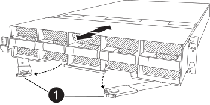
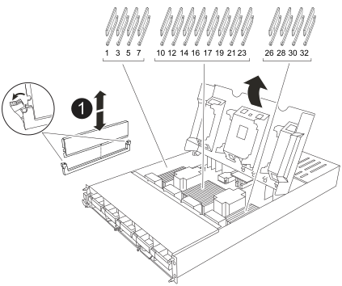

= Schritt 1: Schalten Sie den beeinträchtigten Regler aus
:allow-uri-read: 

Sie müssen ein DIMM im Controller ersetzen, wenn das Speichersystem auf Fehler wie übermäßige CECC-Fehler (korrigierbare Fehlerkorrekturcodes) stößt, die auf Warnmeldungen der Systemzustandsüberwachung oder nicht korrigierbaren ECC-Fehlern basieren, die normalerweise durch einen einzelnen DIMM-Fehler verursacht werden, der das Starten von ONTAP verhindert.

.Bevor Sie beginnen
Alle anderen Komponenten des Systems müssen ordnungsgemäß funktionieren. Falls nicht, müssen Sie sich an den technischen Support wenden.

Sie müssen die fehlerhafte Komponente durch eine vom Anbieter empfangene Ersatz-FRU-Komponente ersetzen.

== Schritt 1: Schalten Sie den beeinträchtigten Regler aus

Schalten Sie den außer Betrieb genommenen Controller aus oder übernehmen Sie ihn.

Um den beeinträchtigten Controller herunterzufahren, müssen Sie den Status des Controllers bestimmen und gegebenenfalls den Controller übernehmen, damit der gesunde Controller weiterhin Daten aus dem beeinträchtigten Reglerspeicher bereitstellen kann.

.Über diese Aufgabe
* Wenn Sie über ein SAN-System verfügen, müssen Sie Event-Meldungen ) für den beeinträchtigten Controller SCSI Blade überprüft haben  `cluster kernel-service show`. Mit dem `cluster kernel-service show` Befehl (im erweiterten Modus von priv) werden der Knotenname,  der Node, der Verfügbarkeitsstatus dieses Node und der Betriebsstatus dieses Node angezeigtlink:https://docs.netapp.com/us-en/ontap/system-admin/display-nodes-cluster-task.html["Quorum-Status"].
+
Jeder Prozess des SCSI-Blades sollte sich im Quorum mit den anderen Nodes im Cluster befinden. Probleme müssen behoben werden, bevor Sie mit dem Austausch fortfahren.

* Wenn Sie über ein Cluster mit mehr als zwei Nodes verfügen, muss es sich im Quorum befinden. Wenn sich das Cluster nicht im Quorum befindet oder ein gesunder Controller FALSE anzeigt, um die Berechtigung und den Zustand zu erhalten, müssen Sie das Problem korrigieren, bevor Sie den beeinträchtigten Controller herunterfahren; siehe link:https://docs.netapp.com/us-en/ontap/system-admin/synchronize-node-cluster-task.html?q=Quorum["Synchronisieren eines Node mit dem Cluster"^].

.Schritte
. Wenn AutoSupport aktiviert ist, können Sie die automatische Case-Erstellung durch Aufrufen einer AutoSupport Meldung unterdrücken: `system node autosupport invoke -node * -type all -message MAINT=<# of hours>h`
+
Die folgende AutoSupport Meldung unterdrückt die automatische Erstellung von Cases für zwei Stunden: `cluster1:> system node autosupport invoke -node * -type all -message MAINT=2h`

. Deaktivieren Sie das automatische Giveback von der Konsole des Controller mit dem ordnungsgemäßen Zustand: `storage failover modify -node local -auto-giveback false`
+

NOTE: Wenn Sie sehen _Möchten Sie Auto-Giveback deaktivieren?_, geben Sie ein `y`.

. Nehmen Sie den beeinträchtigten Controller zur LOADER-Eingabeaufforderung:
+
[cols="1,2"]
|===
| Wenn der eingeschränkte Controller angezeigt wird... | Dann... 

 a| 
Die LOADER-Eingabeaufforderung
 a| 
Fahren Sie mit dem nächsten Schritt fort.

 a| 
Warten auf Giveback...
 a| 
Drücken Sie Strg-C, und antworten Sie dann `y` Wenn Sie dazu aufgefordert werden.

 a| 
Eingabeaufforderung für das System oder Passwort
 a| 
Übernehmen oder stoppen Sie den beeinträchtigten Regler von der gesunden Steuerung: `storage failover takeover -ofnode _impaired_node_name_`

Wenn der Regler „beeinträchtigt“ auf Zurückgeben wartet... anzeigt, drücken Sie Strg-C, und antworten Sie dann `y`.

|===

== Schritt 2: Entfernen Sie das Controller-Modul

Sie müssen das Controller-Modul aus dem Gehäuse entfernen, wenn Sie das Controller-Modul austauschen oder eine Komponente im Controller-Modul austauschen.

. Überprüfen Sie die NVRAM-Status-LED in Steckplatz 4/5 des Systems. An der Vorderseite des Controller-Moduls befindet sich außerdem eine NVRAM-LED. Suchen Sie nach dem NV-Symbol:
+
image::../media/drw_a1K-70-90_nvram-led_ieops-1463.svg[Grafik für die NVRAM-Warnungs- und Status-LED zur Lage]

+
[cols="1,4"]
|===

 a| 
image:../media/icon_round_1.png["Legende Nummer 1"]
 a| 
NVRAM-Status-LED

 a| 
image:../media/icon_round_2.png["Legende Nummer 2"]
 a| 
LED für NVRAM-Warnung

|===
+
** Wenn die NV-LED aus ist, mit dem nächsten Schritt fortfahren.
** Wenn die NV-LED blinkt, warten Sie, bis das Blinken beendet ist. Wenn das Blinken länger als 5 Minuten andauert, wenden Sie sich an den technischen Support, um Unterstützung zu erhalten.

. Wenn Sie nicht bereits geerdet sind, sollten Sie sich richtig Erden.
. Haken Sie an der Vorderseite des Geräts die Finger in die Löcher in den Verriegelungsnocken ein, drücken Sie die Laschen an den Nockenhebeln zusammen, und drehen Sie beide Verriegelungen gleichzeitig vorsichtig, aber fest zu sich hin.
+
Das Controller-Modul bewegt sich leicht aus dem Gehäuse.

+

+
[cols="1,4"]
|===

 a| 
image:../media/icon_round_1.png["Legende Nummer 1"]
| Verriegelungsnocken 
|===
. Schieben Sie das Controller-Modul aus dem Gehäuse und legen Sie es auf eine Ebene, stabile Oberfläche.
+
Stellen Sie sicher, dass Sie die Unterseite des Controller-Moduls stützen, wenn Sie es aus dem Gehäuse herausziehen.

== Schritt 3: Ersetzen Sie ein DIMM

Sie müssen ein DIMM ersetzen, wenn das System einen permanenten Fehler für dieses DIMM meldet.

. Wenn Sie nicht bereits geerdet sind, sollten Sie sich richtig Erden.
. Öffnen Sie den Luftkanal der Steuerung auf der Oberseite der Steuerung.
+
.. Stecken Sie Ihre Finger in die Aussparungen an den entfernten Enden des Luftkanals.
.. Heben Sie den Luftkanal an, und drehen Sie ihn bis zum gewünschten Winkel nach oben.

. Suchen Sie die DIMMs auf dem Controller-Modul, und identifizieren Sie das DIMM für den Austausch.
. Werfen Sie das DIMM aus dem Steckplatz, indem Sie die beiden DIMM-Auswerferlaschen auf beiden Seiten des DIMM langsam auseinander drücken und dann das DIMM aus dem Steckplatz schieben.
+

IMPORTANT: Halten Sie das DIMM vorsichtig an den Rändern, um Druck auf die Komponenten auf der DIMM-Leiterplatte zu vermeiden.

+

+
[cols="1,4"]
|===

 a| 
image:../media/icon_round_1.png["Legende Nummer 1"]
 a| 
DIMM- und DIMM-Auswurfklammern

|===
. Entfernen Sie das Ersatz-DIMM aus dem antistatischen Versandbeutel, halten Sie das DIMM an den Ecken und richten Sie es am Steckplatz aus.
+
Die Kerbe zwischen den Stiften am DIMM sollte mit der Lasche im Sockel aufliegen.

. Vergewissern Sie sich, dass sich die DIMM-Auswerferlaschen am Anschluss in der geöffneten Position befinden und setzen Sie das DIMM-Auswerfer anschließend in den Steckplatz ein.
+
Das DIMM passt eng in den Steckplatz, sollte aber leicht einpassen. Falls nicht, richten Sie das DIMM-Modul mit dem Steckplatz aus und setzen Sie es wieder ein.

+

IMPORTANT: Prüfen Sie das DIMM visuell, um sicherzustellen, dass es gleichmäßig ausgerichtet und vollständig in den Steckplatz eingesetzt ist.

. Drücken Sie vorsichtig, aber fest auf die Oberseite des DIMM, bis die Auswurfklammern über den Kerben an den Enden des DIMM einrasten.
. Den Luftkanal der Steuerung schließen.

== Schritt 4: Installieren Sie den Controller

Installieren Sie das Controller-Modul neu, und starten Sie es.

. Stellen Sie sicher, dass der Luftkanal vollständig geschlossen ist, indem Sie ihn bis zum gewünschten Ziel nach unten drehen.
+
Er muss bündig auf die Metallplatte des Controller-Moduls liegen.

. Richten Sie das Ende des Controller-Moduls an der Öffnung im Gehäuse aus, und schieben Sie das Controller-Modul in das Gehäuse, wobei die Hebel von der Vorderseite des Systems weg gedreht sind.
. Sobald das Controller-Modul Sie daran hindert, es weiter zu schieben, drehen Sie die Nockengriffe nach innen, bis sie wieder unter den Lüftern einrasten
+

NOTE: Setzen Sie das Controller-Modul nicht zu stark in das Gehäuse ein, um Beschädigungen der Anschlüsse zu vermeiden.

+
Das Controller-Modul startet, sobald es vollständig im Gehäuse sitzt.

. Stellen Sie den außer Betrieb genommenen Controller wieder ein, indem Sie seine Speicherung zurückgeben: `storage failover giveback -ofnode _impaired_node_name_`.
. Wenn die automatische Rückgabe deaktiviert wurde, aktivieren Sie sie erneut: `storage failover modify -node local -auto-giveback true`.
. Wenn AutoSupport aktiviert ist, kann die automatische Fallerstellung wiederhergestellt/aufgehoben werden: `system node autosupport invoke -node * -type all -message MAINT=END`.

== Schritt 5: Senden Sie das fehlgeschlagene Teil an NetApp zurück

Senden Sie das fehlerhafte Teil wie in den dem Kit beiliegenden RMA-Anweisungen beschrieben an NetApp zurück.  https://mysupport.netapp.com/site/info/rma["Rückgabe und Austausch von Teilen"]Weitere Informationen finden Sie auf der Seite.
