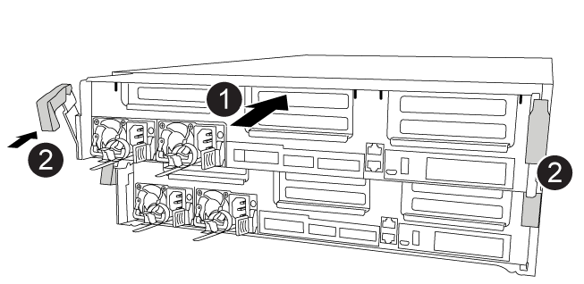

= 
:allow-uri-read: 

Nachdem alle Komponenten vom beeinträchtigten Controller-Modul in das Ersatzcontrollermodul verschoben wurden, müssen Sie das Ersatzcontrollermodul in das Gehäuse installieren und es dann in den Wartungsmodus booten.

Sie können die folgende Animation, Abbildung oder die geschriebenen Schritte zur Installation des Ersatzcontrollermoduls im Gehäuse verwenden.

.Animation - Installieren des Controller-Moduls
video::0310fe80-b129-4685-8fef-ab19010e720a[panopto]

[cols="10,90"]
|===

 a| 
image:../media/icon_round_1.png["Legende Nummer 1"]
 a| 
Controller-Modul

 a| 
image:../media/icon_round_2.png["Legende Nummer 2"]
 a| 
Verriegelungsriegel der Steuerung

|===
.Schritte
. Wenn Sie dies noch nicht getan haben, schließen Sie den Luftkanal.
. Richten Sie das Ende des Controller-Moduls an der Öffnung im Gehäuse aus, und drücken Sie dann vorsichtig das Controller-Modul zur Hälfte in das System.
+

NOTE: Setzen Sie das Controller-Modul erst dann vollständig in das Chassis ein, wenn Sie dazu aufgefordert werden.

. Verkabeln Sie nur die Management- und Konsolen-Ports, sodass Sie auf das System zugreifen können, um die Aufgaben in den folgenden Abschnitten auszuführen.
+

NOTE: Sie schließen die übrigen Kabel später in diesem Verfahren an das Controller-Modul an.

. Schließen Sie die Installation des Controller-Moduls ab:
+
.. Schieben Sie das Controller-Modul mithilfe der Verriegelungen fest in das Gehäuse, bis sich die Verriegelungsriegel erheben.
+

NOTE: Beim Einschieben des Controller-Moduls in das Gehäuse keine übermäßige Kraft verwenden, um Schäden an den Anschlüssen zu vermeiden.

.. Setzen Sie das Controller-Modul vollständig in das Gehäuse ein, indem Sie die Verriegelungsriegel nach oben drehen, kippen Sie sie so, dass sie die Sicherungsstifte entfernen, den Controller vorsichtig ganz nach innen schieben und dann die Verriegelungsriegel in die verriegelte Position senken.
.. Schließen Sie die Netzkabel an die Netzteile an, setzen Sie die Sicherungsmanschette des Netzkabels wieder ein, und schließen Sie dann die Netzteile an die Stromquelle an.
+
Das Controller-Modul startet, sobald die Stromversorgung wiederhergestellt ist. Bereiten Sie sich darauf vor, den Bootvorgang zu unterbrechen.

.. Wenn Sie dies noch nicht getan haben, installieren Sie das Kabelverwaltungsgerät neu.
.. Unterbrechen Sie den normalen Boot-Prozess und booten Sie zu LOADER, indem Sie drücken `Ctrl-C`.
+

NOTE: Wenn das System im Startmenü stoppt, wählen Sie die Option zum Booten in LOADER.

.. Geben Sie an der LOADER-Eingabeaufforderung ein `bye` Um die PCIe-Karten und andere Komponenten neu zu initialisieren.
.. Unterbrechen Sie den Boot-Prozess und booten Sie an der LOADER-Eingabeaufforderung, indem Sie drücken `Ctrl-C`.
+
Wenn das System im Startmenü stoppt, wählen Sie die Option zum Booten in LOADER.

