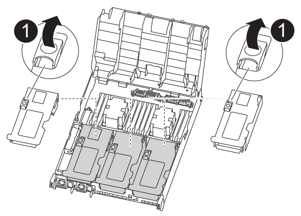

= 
:allow-uri-read: 

Um auf Komponenten im Controller-Modul zuzugreifen, müssen Sie das Controller-Modul aus dem Gehäuse entfernen.

Sie können das Controller-Modul mithilfe der folgenden Animation, Illustration oder der geschriebenen Schritte aus dem Gehäuse entfernen.

.Animation - Entfernen Sie das Controller-Modul
video::ca74d345-e213-4390-a599-aae10019ec82[panopto]
.Schritte
. Wenn Sie nicht bereits geerdet sind, sollten Sie sich richtig Erden.
. Lösen Sie die Netzkabelhalter, und ziehen Sie anschließend die Kabel von den Netzteilen ab.
. Lösen Sie den Haken- und Schlaufenriemen, mit dem die Kabel am Kabelführungsgerät befestigt sind, und ziehen Sie dann die Systemkabel und SFPs (falls erforderlich) vom Controller-Modul ab, um zu verfolgen, wo die Kabel angeschlossen waren.
+
Lassen Sie die Kabel im Kabelverwaltungs-Gerät so, dass bei der Neuinstallation des Kabelverwaltungsgeräts die Kabel organisiert sind.

. Entfernen Sie das Kabelführungs-Gerät aus dem Controller-Modul und legen Sie es beiseite.
. Drücken Sie beide Verriegelungsriegel nach unten, und drehen Sie dann beide Verriegelungen gleichzeitig nach unten.
+
Das Controller-Modul wird leicht aus dem Chassis entfernt.

+
image::../media/drw_A400_Remove_controller.png[Lösen Sie das Controller-Modul]

+
[cols="10a,90a"]
|===

 a| 
image:../media/icon_round_1.png["Legende Nummer 1"]
 a| 
Verriegelungsriegel

 a| 
image:../media/icon_round_2.png["Legende Nummer 2"]
 a| 
Der Controller bewegt sich leicht aus dem Chassis

|===
. Schieben Sie das Controller-Modul aus dem Gehäuse.
+
Stellen Sie sicher, dass Sie die Unterseite des Controller-Moduls unterstützen, während Sie es aus dem Gehäuse schieben.

. Stellen Sie das Controller-Modul auf eine stabile, flache Oberfläche.
. Öffnen Sie am Ersatzsteuermodul den Luftkanal, und entfernen Sie die leeren Riser mithilfe der Animation, der Abbildung oder der schriftlichen Schritte aus dem Controller-Modul:
+
.Animation - Entfernen Sie die leeren Riser aus dem Ersatzcontroller-Modul
video::49053752-e813-4c15-a917-ab190147fa6e[panopto]

[cols="10,90"]
|===

 a| 
image:../media/icon_round_1.png["Legende Nummer 1"]
 a| 
Entriegelungsriegel für Riser

|===
. Drücken Sie die Verriegelungslaschen an den Seiten des Luftkanals in Richtung der Mitte des Controller-Moduls.
. Schieben Sie den Luftkanal zur Rückseite des Controller-Moduls, und drehen Sie ihn dann nach oben in seine vollständig geöffnete Position.
. Drehen Sie den Riserriegel auf der linken Seite des Steigrohrs 1 nach oben und in Richtung Luftkanal, heben Sie den Riseraufsatz an und legen Sie ihn dann beiseite.
. Wiederholen Sie den vorherigen Schritt für die verbleibenden Riser.

