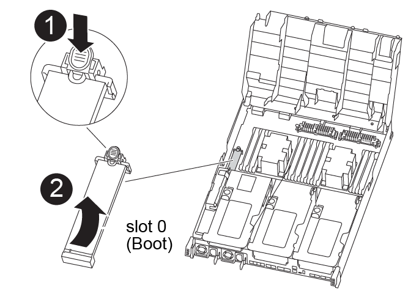

= 
:allow-uri-read: 

Sie müssen das Startmedium ausfindig machen und dann die Anweisungen befolgen, um es aus dem beeinträchtigten Controller-Modul zu entfernen und in das Ersatzcontrollermodul einzufügen.

Sie können die folgenden Animationen, Abbildungen oder die geschriebenen Schritte verwenden, um die Startmedien vom beeinträchtigten Controller-Modul in das Ersatzcontrollermodul zu verschieben.

.Animation - Verschieben des Bootmediums
video::2a14099c-85de-4a84-867c-aad9012efac8[panopto]

[cols="10,90"]
|===

 a| 
image:../media/icon_round_1.png["Legende Nummer 1"]
 a| 
Verriegelungslasche für Startmedien

 a| 
image:../media/icon_round_2.png["Legende Nummer 2"]
 a| 
Boot-Medien

|===
.Schritte
. Suchen und entfernen Sie die Startmedien aus dem Controller-Modul:
+
.. Drücken Sie die blaue Taste am Ende des Startmediums, bis der Lip auf dem Boot-Medium die blaue Taste löscht.
.. Drehen Sie das Startmedium nach oben, und ziehen Sie das Startmedium vorsichtig aus dem Sockel.

. Bewegen Sie die Startmedien auf das neue Controller-Modul, richten Sie die Kanten des Startmediums am Buchsengehäuse aus, und schieben Sie sie dann vorsichtig in die Buchse.
. Überprüfen Sie die Startmedien, um sicherzustellen, dass sie ganz und ganz in der Steckdose sitzt.
+
Entfernen Sie gegebenenfalls die Startmedien, und setzen Sie sie wieder in den Sockel ein.

. Sperren Sie das Boot-Medium:
+
.. Drehen Sie das Startmedium nach unten zur Hauptplatine.
.. Drücken Sie die blaue Verriegelungstaste, damit sie sich in der geöffneten Position befindet.
.. Platzieren Sie Ihre Finger am Ende des Bootmediums neben dem blauen Knopf und drücken Sie fest auf das Ende des Bootmediums, um den blauen Verriegelungsknopf zu betätigen.

