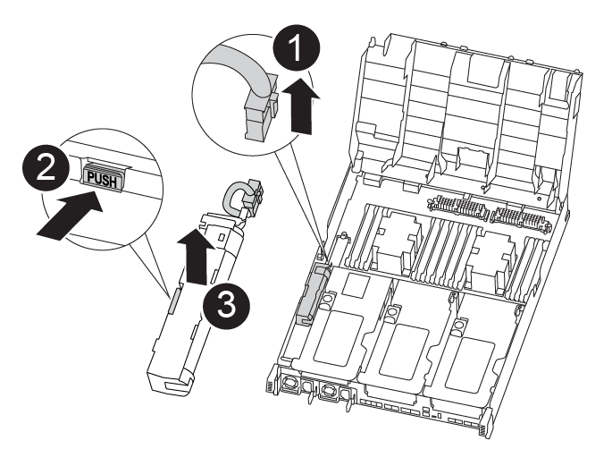

= 
:allow-uri-read: 

Um den NVDIMM-Akku vom Controller-Modul mit eingeschränkter Betriebsdauer auf das Ersatzcontrollermodul zu verschieben, müssen Sie eine bestimmte Sequenz von Schritten durchführen.

Sie können die folgende Animation, Abbildung oder die geschriebenen Schritte verwenden, um den NVDIMM-Akku vom beeinträchtigten Controller-Modul in das Ersatzcontrollermodul zu verschieben.

.Animation - Verschieben der NVDIMM-Batterie
video::94d115b2-b02a-4234-805c-aad9012f204c[panopto]

[cols="10,90"]
|===

 a| 
image:../media/icon_round_1.png["Legende Nummer 1"]
 a| 
NVDIMM-Batteriestecker

 a| 
image:../media/icon_round_2.png["Legende Nummer 2"]
 a| 
Verriegelungslasche für NVDIMM-Batterie

 a| 
image:../media/icon_round_3.png["Legende Nummer 3"]
 a| 
NVDIMM-Batterie

|===
.Schritte
. Öffnen Sie den Luftkanal:
+
.. Drücken Sie die Verriegelungslaschen an den Seiten des Luftkanals in Richtung der Mitte des Controller-Moduls.
.. Schieben Sie den Luftkanal zur Rückseite des Controller-Moduls, und drehen Sie ihn dann nach oben in seine vollständig geöffnete Position.

. Suchen Sie den NVDIMM-Akku im Controller-Modul.
. Suchen Sie den Batteriestecker, und drücken Sie den Clip auf der Vorderseite des Batteriesteckers, um den Stecker aus der Steckdose zu lösen, und ziehen Sie dann das Akkukabel aus der Steckdose.
. Fassen Sie den Akku an, und drücken Sie die blaue Verriegelungslasche, die mit DRUCKTASTE gekennzeichnet ist, und heben Sie den Akku aus dem Halter und dem Controller-Modul heraus.
. Bringen Sie den Akku in das Ersatzcontrollermodul.
. Richten Sie das Batteriemodul an der Öffnung für die Batterie aus und drücken Sie die Batterie dann vorsichtig in den Schlitz, bis sie einrastet.
+

NOTE: Schließen Sie das Akkukabel erst dann wieder an die Hauptplatine an, wenn Sie dazu aufgefordert werden.

