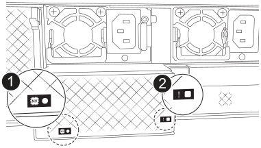
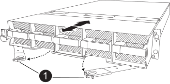
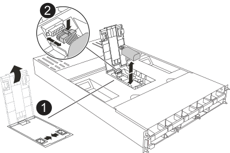

= Schritt 1: Schalten Sie den beeinträchtigten Regler aus
:allow-uri-read: 

.Über diese Aufgabe
Dieses Verfahren gilt für den Austausch einer defekten NV-Batterie für das NVRAM Modul in den Steckplätzen 4 und 5 des AFX 2K Controllers. Informationen zum Austausch der NV-Batterie für das NVRAM12-EX Modul in den Steckplätzen 6 und 7 des AFX 2K Controllers sind unter link:nv12l-replace.html#step-2-replace-the-nvram12-ex-module-nvram-dimm-or-nvram-battery["Die NV-Batterie für den NVRAM12-EX ersetzen"] zu finden.

[[step-1-shut-down-the-impaired-controller]]
== Schritt 1: Schalten Sie den beeinträchtigten Regler aus

Schalten Sie den außer Betrieb genommenen Controller aus oder übernehmen Sie ihn.

Übernehmen Sie den fehlerhaften Controller und stoppen Sie ihn, damit der intakte Controller weiterhin Daten aus dem Speicher des fehlerhaften Controllers bereitstellt. Dazu unterdrücken Sie die automatische Fallerstellung in AutoSupport, deaktivieren die automatische Rückgabe und bringen den fehlerhaften Controller zur LOADER-Eingabeaufforderung. Die LOADER-Eingabeaufforderung ist der sichere, angehaltene Zustand, aus dem Sie die FRU ersetzen können.

.Über diese Aufgabe
* Wenn Sie einen Cluster mit mehr als vier Knoten haben, muss dieser im Quorum sein.  Um Clusterinformationen zu Ihren Knoten anzuzeigen, verwenden Sie die `cluster show` Befehl.  Weitere Informationen zum `cluster show` Befehl, siehelink:https://docs.netapp.com/us-en/ontap/system-admin/display-nodes-cluster-task.html["Anzeigen von Details auf Knotenebene in einem ONTAP Cluster"^] .
* Wenn der Cluster nicht im Quorum ist oder wenn der Zustand oder die Berechtigung eines Controllers (mit Ausnahme des beeinträchtigten Controllers) als falsch angezeigt wird, müssen Sie das Problem beheben, bevor Sie den beeinträchtigten Controller herunterfahren. Sehen link:https://docs.netapp.com/us-en/ontap/system-admin/synchronize-node-cluster-task.html?q=Quorum["Synchronisieren eines Node mit dem Cluster"^] .

.Schritte
. Wenn AutoSupport aktiviert ist, unterdrücken Sie die automatische Erstellung eines Cases durch Aufrufen einer AutoSupport Meldung:
+
`system node autosupport invoke -node * -type all -message MAINT=<# of hours>h`

+
Die folgende AutoSupport Meldung unterdrückt die automatische Erstellung von Cases für zwei Stunden:

+
`cluster1:> system node autosupport invoke -node * -type all -message MAINT=2h`

. Deaktivieren Sie die automatische Rückgabe von der Konsole des beeinträchtigten Controllers:
+
`storage failover modify -node impaired-node -auto-giveback-of false`

+

NOTE: Wenn Sie _Möchten Sie die automatische Rückgabe deaktivieren?_ sehen, geben Sie ein `y` .

. Nehmen Sie den beeinträchtigten Controller zur LOADER-Eingabeaufforderung:
+
[cols="1,2"]
|===
| Wenn der eingeschränkte Controller angezeigt wird... | Dann... 

 a| 
Die LOADER-Eingabeaufforderung
 a| 
Fahren Sie mit dem nächsten Schritt fort.

 a| 
Eingabeaufforderung für das System oder Passwort
 a| 
Übernehmen oder stoppen Sie den beeinträchtigten Controller vom fehlerfreien Controller:
`storage failover takeover -ofnode _impaired_node_name_ -halt _true_`

Der Parameter _-halt true_ bringt den beeinträchtigten Knoten zur LOADER-Eingabeaufforderung.

|===

[[step-2-remove-the-controller-module]]
== Schritt 2: Entfernen Sie das Controller-Modul

Sie müssen das Controller-Modul aus dem Gehäuse entfernen, wenn Sie das Controller-Modul austauschen oder eine Komponente im Controller-Modul austauschen.

. Die NVRAM-Status-LED in Steckplatz 4/5 und die NVRAM12-EX-Status-LED in Steckplatz 6/7 des Systems befinden sich an den angegebenen Positionen. Eine NVRAM LED befindet sich außerdem auf der Frontplatte des Controller-Moduls. Das NV-Symbol ist zu beachten:
+
image::../media/drw_a1K-70-90_nvram-led_ieops-1463.svg[Grafik für die NVRAM-Warnungs- und Status-LED zur Lage]

+
[cols="1,4"]
|===

2+| *NVRAM* 

 a| 
image:../media/icon_round_1.png["Legende Nummer 1"]
 a| 
NVRAM-Status-LED

 a| 
image:../media/icon_round_2.png["Legende Nummer 2"]
 a| 
LED für NVRAM-Warnung

|===
+

+
[cols="1,4"]
|===

2+| *NVRAM12-EX* 

 a| 
image:../media/icon_round_1.png["Legende Nummer 1"]
 a| 
NVRAM12-EX Status-LED

 a| 
image:../media/icon_round_2.png["Legende Nummer 2"]
 a| 
NVRAM12-EX Attention-LED

|===
+
** Wenn die NV-LED aus ist, mit dem nächsten Schritt fortfahren.
** Wenn die NV-LED blinkt, warten Sie, bis das Blinken beendet ist. Wenn das Blinken länger als 5 Minuten andauert, wenden Sie sich an den technischen Support, um Unterstützung zu erhalten.

. Wenn Sie nicht bereits geerdet sind, sollten Sie sich richtig Erden.
. Entfernen Sie die Blende (falls erforderlich) mit beiden Händen, indem Sie die Öffnungen auf beiden Seiten der Blende greifen und zu sich ziehen, bis sich die Blende von den Kugelbolzen am Gehäuserahmen löst.
. Haken Sie an der Vorderseite des Geräts die Finger in die Löcher in den Verriegelungsnocken ein, drücken Sie die Laschen an den Nockenhebeln zusammen, und drehen Sie beide Verriegelungen gleichzeitig vorsichtig, aber fest zu sich hin.
+
Das Controller-Modul bewegt sich leicht aus dem Gehäuse.

+

+
[cols="1,4"]
|===

 a| 
image:../media/icon_round_1.png["Legende Nummer 1"]
| Verriegelungsnocken 
|===
. Schieben Sie das Controller-Modul aus dem Gehäuse und legen Sie es auf eine Ebene, stabile Oberfläche.
+
Stellen Sie sicher, dass Sie die Unterseite des Controller-Moduls stützen, wenn Sie es aus dem Gehäuse herausziehen.

[[step-3-replace-the-nv-battery]]
== Schritt 3: Tauschen Sie die NV-Batterie aus

Entfernen Sie die fehlerhafte NV-Batterie aus dem Controller-Modul, und setzen Sie die neue NV-Batterie ein.

. Öffnen Sie die Abdeckung des Luftkanals, und suchen Sie nach der NV-Batterie.
+

+
[cols="1,4"]
|===

 a| 
image:../media/icon_round_1.png["Legende Nummer 1"]
| Abdeckung des NV-Batterie-Luftkanals 

 a| 
image:../media/icon_round_2.png["Legende Nummer 2"]
 a| 
NV-Batteriestecker

|===
. Heben Sie die Batterie an, um auf den Batteriestecker zuzugreifen.
. Drücken Sie die Klammer auf der Vorderseite des Batteriesteckers, um den Stecker aus der Steckdose zu lösen, und ziehen Sie dann das Batteriekabel aus der Steckdose.
. Heben Sie die Batterie aus dem Luftkanal und dem Steuermodul, und legen Sie sie beiseite.
. Entfernen Sie den Ersatzakku aus der Verpackung.
. Setzen Sie den Ersatzakku in den Controller ein:
+
.. Schließen Sie den Batteriestecker an die Steckerbuchse an, und stellen Sie sicher, dass der Stecker einrastet.
.. Setzen Sie den Akku in den Steckplatz ein, und drücken Sie den Akku fest nach unten, um sicherzustellen, dass er fest eingerastet ist.

. Schließen Sie die Abdeckung des NV-Luftkanals.
+
Vergewissern Sie sich, dass der Stecker in die Steckdose einrastet.

[[step-4-reinstall-the-controller-module]]
== Schritt 4: Installieren Sie das Controller-Modul neu

Installieren Sie das Controller-Modul neu, und starten Sie es.

. Stellen Sie sicher, dass der Luftkanal vollständig geschlossen ist, indem Sie ihn bis zum gewünschten Ziel nach unten drehen.
+
Er muss bündig auf die Metallplatte des Controller-Moduls liegen.

. Richten Sie das Ende des Controller-Moduls an der Öffnung im Gehäuse aus, und schieben Sie das Controller-Modul in das Gehäuse, wobei die Hebel von der Vorderseite des Systems weg gedreht sind.
. Sobald das Controller-Modul Sie daran hindert, es weiter zu schieben, drehen Sie die Nockengriffe nach innen, bis sie wieder unter den Lüftern einrasten
+

NOTE: Setzen Sie das Controller-Modul nicht zu stark in das Gehäuse ein, um Beschädigungen der Anschlüsse zu vermeiden.

+
Das Controller-Modul startet, sobald es vollständig im Gehäuse sitzt.

. Richten Sie die Lünette an den Kugelbolzen aus und drücken Sie die Lünette dann vorsichtig an ihren Platz.
. Drücken Sie <enter>, wenn die Konsolenmeldungen angehalten werden.
+
** Wenn die Anmeldeaufforderung angezeigt wird, fahren Sie mit dem nächsten Schritt fort.
** Wenn keine Anmeldeaufforderung angezeigt wird, melden Sie sich beim Partnerknoten an.

. Geben Sie nur die Wurzel mit der Option „override-destination-checks“ zurück:
+
`storage failover giveback -ofnode impaired-node -only-root true -override -destination-checks true`

+

NOTE: Der folgende Befehl ist nur auf der Berechtigungsebene „Diagnosemodus“ verfügbar.  Weitere Informationen zu Berechtigungsstufen finden Sie unterlink:https://docs.netapp.com/us-en/ontap/system-admin/administrative-privilege-levels-concept.html["Verstehen Sie die Berechtigungsstufen für ONTAP CLI-Befehle"^] .

+
Wenn Sie auf Fehler stoßen, wenden Sie sich an https://support.netapp.com["NetApp Support"].

. Warten Sie 5 Minuten, nachdem der Giveback-Bericht abgeschlossen ist, und überprüfen Sie dann den Failover- und Giveback-Status:
+
`storage failover show`Und `storage failover show-giveback`

+

NOTE: Der folgende Befehl ist nur auf der Berechtigungsebene „Diagnosemodus“ verfügbar.

. Wenn die automatische Rückübertragung deaktiviert wurde, aktivieren Sie sie erneut:
+
`storage failover modify -node local -auto-giveback-of true`

. Stellen Sie den funktionsbeeinträchtigten Controller wieder in den Normalbetrieb ein, indem Sie den Speicher zurückgeben:
+
`storage failover giveback -ofnode _impaired_node_name_`

. Wenn AutoSupport aktiviert ist, können Sie die automatische Fallerstellung wiederherstellen/zurücknehmen:
+
`system node autosupport invoke -node * -type all -message MAINT=END`

[[step-5-return-the-failed-part-to-netapp]]
== Schritt 5: Senden Sie das fehlgeschlagene Teil an NetApp zurück

Senden Sie das fehlerhafte Teil wie in den dem Kit beiliegenden RMA-Anweisungen beschrieben an NetApp zurück.  https://mysupport.netapp.com/site/info/rma["Rückgabe und Austausch von Teilen"]Weitere Informationen finden Sie auf der Seite.
