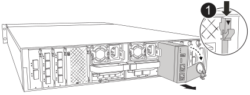
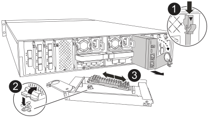

= 
:allow-uri-read: 

Das Systemmanagementmodul enthält das Bootmedium und stellt Systemmanagementfunktionen bereit. Das defekte Systemmanagementmodul muss entfernt, das Bootmedium auf das Ersatzmodul übertragen und das Ersatzmodul wieder im Gehäuse installiert werden.

.Schritte
. Entfernen Sie das System Management-Modul:
+

NOTE: Stellen Sie sicher, dass die NVRAM-Destage abgeschlossen ist, bevor Sie fortfahren. Wenn die LED am NV-Modul aus ist, ist die NVRAM-Destage abgeschlossen. Wenn die LED blinkt, sollte gewartet werden, bis das Blinken aufhört. Falls das Blinken länger als 5 Minuten andauert, sollte der Technical Support kontaktiert werden.

+

+
[cols="1,4"]
|===

 a| 
image::../media/icon_round_1.png[Legende Nummer 1]
 a| 
Nockenverriegelung des Systemmanagementmoduls

|===
+
.. Wenn Sie nicht bereits geerdet sind, sollten Sie sich richtig Erden.
.. Ziehen Sie die Stromversorgungskabel von den Netzteilen ab.
.. Entfernen Sie alle mit dem Systemverwaltungsmodul verbundenen Kabel.  Beschriften Sie die Kabel an den Anschlussstellen, damit Sie sie bei der Neuinstallation des Moduls wieder an die richtigen Anschlüsse anschließen können.
.. Drehen Sie das Kabelführungs-Fach nach unten, indem Sie die Tasten an beiden Seiten an der Innenseite des Kabelführungs-Fachs ziehen und das Fach dann nach unten drehen.
.. Drücken Sie die Nockentaste am System Management-Modul.
.. Den Nockenhebel bis zum gewünschten Winkel nach unten drehen.
.. Den Finger in das Loch am Nockenhebel stecken und das Modul gerade aus dem System ziehen.
.. Legen Sie das Systemverwaltungsmodul auf eine antistatische Matte, um auf das Startmedium zuzugreifen.

. Verschieben Sie das Startmedium in das Ersatz-System-Management-Modul:
+

+
[cols="1,4"]
|===

 a| 
image::../media/icon_round_1.png[Legende Nummer 1]
 a| 
Nockenverriegelung des Systemmanagementmoduls

 a| 
image::../media/icon_round_2.png[Legende Nummer 2]
 a| 
Verriegelungstaste für Startmedien

 a| 
image::../media/icon_round_3.png[Legende Nummer 3]
 a| 
Boot-Medien

|===
+
.. Drücken Sie die blaue Taste zum Sperren des Startmediums im Modul für die eingeschränkte Systemverwaltung.
.. Drehen Sie das Startmedium nach oben und schieben Sie es aus dem Sockel.

. Installieren Sie das Startmedium im Ersatz-System-Management-Modul:
+
.. Richten Sie die Kanten der Startmedien am Buchsengehäuse aus, und schieben Sie sie vorsichtig in die Buchse.
.. Drehen Sie das Boot-Medium nach unten, bis es die Verriegelungstaste berührt.
.. Drücken Sie die blaue Verriegelung, drehen Sie die Startmedien ganz nach unten, und lassen Sie die blaue Verriegelungstaste los.

. Installieren Sie das Ersatz-System-Management-Modul im Gehäuse:
+
.. Richten Sie die Kanten des Ersatz-System-Management-Moduls an der Systemöffnung aus und drücken Sie es vorsichtig in das Controller-Modul.
.. Schieben Sie das Modul vorsichtig in den Steckplatz, bis die Nockenverriegelung mit dem E/A-Nockenbolzen einrastet, und drehen Sie dann die Nockenverriegelung bis zum Anschlag nach oben, um das Modul zu verriegeln.

. Drehen Sie die Kabelmanagement-ARM bis zur geschlossenen Position.
. System-Management-Modul erneut verwenden.

