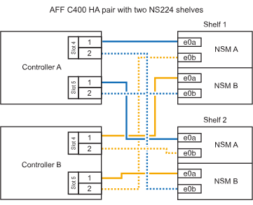

= 
:allow-uri-read: 

.Bevor Sie beginnen
* Sie müssen die überprüft haben link:requirements-hot-add-shelf.html["Hot-Add-Anforderungen und Best Practices"].
* Sie müssen die entsprechenden Verfahren in abgeschlossen haben link:prepare-hot-add-shelf.html["Bei laufendem Betrieb ein Shelf hinzufügen"].
* Sie müssen die Shelfs installiert, eingeschaltet und die Shelf-IDs wie in festgelegt haben link:prepare-hot-add-shelf.html["Installieren Sie ein Shelf für ein Hot-Add-System"].

*Kabel-Shelf zu einem AFF A400 HA-Paar*

Bei einem AFF A400 HA-Paar können Sie bis zu zwei Shelves im laufenden Betrieb hinzufügen und Onboard Ports e0c/e0d und Ports in Steckplatz 5 je nach Bedarf verwenden.

.Schritte
. Wenn Sie jedem Controller ein Shelf Hot-hinzufügen und dabei nur einen Satz RoCE-fähiger Ports (Onboard RoCE-fähige Ports) verwenden, und dies das einzige NS224-Shelf in Ihrem HA-Paar ist, führen Sie die folgenden Teilschritte durch.
+
Andernfalls fahren Sie mit dem nächsten Schritt fort.

+
.. Kabel-Shelf NSM A Port e0a zu Controller A Port e0c.
.. Kabel-Shelf NSM A Port e0b zum Controller B Port e0d.
.. Kabel-Shelf NSM B-Port e0a zu Controller B-Port e0c.
.. Kabel-Shelf NSM B-Port e0b für Controller A-Port e0d.
+
In der folgenden Abbildung wird die Verkabelung für ein Hot-Added Shelf mit einem Satz RoCE-fähiger Ports an jedem Controller gezeigt:

+
image::../media/drw_ns224_a400_1shelf.png[Verkabelung für ein AFF/ASA A400 mit einem NS224-Shelf und einem Satz integrierter Ports]

. Wenn Sie jedem Controller ein oder zwei Shelfs während des laufenden Einsatzes mit zwei Sets von RoCE-fähigen Ports (Onboard- und PCIe-Karten-RoCE-fähigen Ports) hinzufügen, führen Sie die folgenden Teilschritte durch.
+
[cols="1,3"]
|===
| Shelfs | Verkabelung 

 a| 
Shelf 1
 a| 
.. Verbinden Sie NSM A Port e0a mit Controller A Port e0c.
.. Verkabeln Sie den NSM A-Port e0b mit Controller B-Steckplatz 5, Port 2 (e5b).
.. Verbinden Sie den NSM B-Port e0a mit Controller B-Port e0c.
.. Verkabeln Sie den NSM B-Port e0b mit Controller A-Steckplatz 5, Port 2 (e5b).
.. Wenn Sie ein zweites Regal heizen, füllen Sie die Unterschritte "`Shelf 2`" aus; andernfalls fahren Sie mit Schritt 3 fort.

 a| 
Shelf 2
 a| 
.. Verkabeln Sie den NSM A-Port e0a mit Controller A-Steckplatz 5, Port 1 (e5a).
.. Verbinden Sie den NSM A-Port e0b mit dem Port e0d des Controllers.
.. Verkabeln Sie den NSM B-Port e0a mit Controller B-Steckplatz 5, Port 1 (e5a).
.. Verbinden Sie den NSM B-Port e0b mit Controller A-Port e0d.
.. Fahren Sie mit Schritt 3 fort.

|===
+
Die folgende Abbildung zeigt die Verkabelung für zwei Hot-Added Shelves:

+
image::../media/drw_ns224_a400_2shelves_IEOPS-983.svg[Verkabelung für ein /ASA A400 mit zwei NS224-Shelfs und einem Satz integrierter Ports und einem Satz Ports auf PCIe-Karten]

. Überprüfen Sie mit https://mysupport.netapp.com/site/tools/tool-eula/activeiq-configadvisor["Active IQ Config Advisor"^].
+
Wenn Verkabelungsfehler auftreten, befolgen Sie die entsprechenden Korrekturmaßnahmen.

. Wenn Sie die automatische Laufwerkszuweisung als Teil der Vorbereitung für dieses Verfahren deaktiviert haben, müssen Sie manuell die Laufwerkseigentümer festlegen und bei Bedarf die automatische Laufwerkszuweisung wieder aktivieren. Siehe link:complete-hot-add-shelf.html["Füllen Sie das Hot Add aus"].
+
Andernfalls werden Sie mit diesem Verfahren durchgeführt.

*Kabel-Shelf zu einem AFF C400 HA-Paar*

Bei einem AFF C400 HA-Paar können Sie bei Bedarf bis zu zwei Shelfs im laufenden Betrieb hinzufügen und Ports in Steckplatz 4 und 5 verwenden.

.Schritte
. Wenn Sie bei jedem Controller ein Shelf mit einem Satz RoCE-fähiger Ports hinzufügen und dies das einzige NS224-Shelf in Ihrem HA-Paar ist, führen Sie die folgenden Teilschritte durch.
+
Andernfalls fahren Sie mit dem nächsten Schritt fort.

+
.. Verkabeln Sie das Shelf NSM A-Port e0a mit Controller A, Steckplatz 4, Port 1 (e4a).
.. Verkabeln Sie den Shelf NSM A-Port e0b mit Controller B-Steckplatz 4, Port 2 (e4b).
.. Verkabeln Sie den Shelf NSM B-Port e0a mit Controller B-Steckplatz 4, Port 1 (e4a).
.. Verkabeln Sie den Shelf NSM B-Port e0b mit Controller A-Steckplatz 4, Port 2 (e4b).
+
In der folgenden Abbildung wird die Verkabelung für ein Hot-Added Shelf mit einem Satz RoCE-fähiger Ports an jedem Controller gezeigt:

+
image::../media/drw_ns224_c400_1shelf_IEOPS-985.svg[Verkabelung für ein AFF/ASA C400 mit einem NS224-Shelf und einem Satz PCIe-Karten-Ports]

. Wenn Sie ein oder zwei Shelfs im laufenden Betrieb mit zwei Sets von RoCE-fähigen Ports an jedem Controller hinzufügen, führen Sie die folgenden Teilschritte durch.
+
[cols="1,3"]
|===
| Shelfs | Verkabelung 

 a| 
Shelf 1
 a| 
.. Verkabeln Sie den NSM A-Port e0a mit dem Controller A-Steckplatz 4, Port 1 (e4a).
.. Verkabeln Sie den NSM A-Port e0b mit Controller B-Steckplatz 5, Port 2 (e5b).
.. Verbinden Sie den NSM B-Port e0a mit Controller B-Port-Steckplatz 4 Port 1 (e4a).
.. Verkabeln Sie den NSM B-Port e0b mit Controller A-Steckplatz 5, Port 2 (e5b).
.. Wenn Sie ein zweites Regal heizen, füllen Sie die Unterschritte "`Shelf 2`" aus; andernfalls fahren Sie mit Schritt 3 fort.

 a| 
Shelf 2
 a| 
.. Verkabeln Sie den NSM A-Port e0a mit Controller A-Steckplatz 5, Port 1 (e5a).
.. Verkabeln Sie den NSM A-Port e0b mit Controller B-Steckplatz 4, Port 2 (e4b).
.. Verkabeln Sie den NSM B-Port e0a mit Controller B-Steckplatz 5, Port 1 (e5a).
.. Verkabeln Sie den NSM B-Port e0b mit Controller A-Steckplatz 4, Port 2 (e4b).
.. Fahren Sie mit Schritt 3 fort.

|===
+
Die folgende Abbildung zeigt die Verkabelung für zwei Hot-Added Shelves:

+

. Überprüfen Sie mit https://mysupport.netapp.com/site/tools/tool-eula/activeiq-configadvisor["Active IQ Config Advisor"^].
+
Wenn Verkabelungsfehler auftreten, befolgen Sie die entsprechenden Korrekturmaßnahmen.

.Was kommt als Nächstes?
Wenn Sie die automatische Laufwerkszuweisung als Teil der Vorbereitung für dieses Verfahren deaktiviert haben, müssen Sie manuell die Laufwerkseigentümer festlegen und die automatische Laufwerkszuweisung ggf. erneut aktivieren. Gehen Sie zu link:complete-hot-add-shelf.html["Füllen Sie das Hot Add aus"].

Andernfalls müssen Sie das Hot-Add-Regal verwenden.
