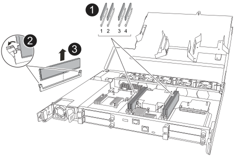
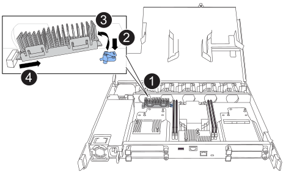

= Schritt 1: Entfernen Sie die Steuerung
:allow-uri-read: 

== Schritt 1: Entfernen Sie die Steuerung

Sie müssen den Controller aus dem Chassis entfernen, wenn Sie den Controller austauschen oder eine Komponente im Controller austauschen.

.Bevor Sie beginnen
Stellen Sie sicher, dass alle anderen Komponenten des Speichersystems ordnungsgemäß funktionieren. Wenn nicht, müssen Sie sich an den entsprechenden Kontakt wenden, bevor Sie https://mysupport.netapp.com/site/global/dashboard["NetApp Support"] mit diesem Verfahren fortfahren.

.Schritte
. Stellen Sie am Controller für beeinträchtigte Störungen sicher, dass die NV-LED nicht leuchtet.
+
Wenn die NV-LED ausgeschaltet ist, ist die Entrampung abgeschlossen, und es ist sicher, den außer Betrieb genommenen Controller zu entfernen.

+

NOTE: Wenn die NV-LED blinkt (grün), wird die Auslagerung ausgeführt. Sie müssen warten, bis die NV-LED erlischt. Wenn das Blinken jedoch länger als fünf Minuten andauert, wenden Sie sich an https://mysupport.netapp.com/site/global/dashboard["NetApp Support"], bevor Sie mit diesem Verfahren fortfahren.

+
Die NV-LED befindet sich neben dem NV-Symbol auf dem Controller.

+
image::../media/drw_g_nvmem_led_ieops-1839.svg[Position der NV-Status-LED]

[cols="1,4"]
|===

 a| 
image::../media/icon_round_1.png[Legende Nummer 1]
 a| 
NV-Symbol und LED am Controller

|===
. Wenn Sie nicht bereits geerdet sind, sollten Sie sich richtig Erden.
. Trennen Sie die Stromversorgung des außer Betrieb genommenen Controllers:
+

NOTE: Netzteile (PSUs) verfügen über keinen Netzschalter.

+
[cols="1,2"]
|===
| Wenn Sie eine Verbindung trennen... | Dann... 

 a| 
NETZTEILEINHEIT
 a| 
.. Öffnen Sie die Netzkabelhalterung.
.. Ziehen Sie das Netzkabel vom Netzteil ab, und legen Sie es beiseite.

 a| 
DC-NETZTEIL
 a| 
.. Lösen Sie die beiden Flügelschrauben am D-SUB-DC-Netzkabelanschluss.
.. Ziehen Sie das Netzkabel vom Netzteil ab, und legen Sie es beiseite.

|===
. Ziehen Sie alle Kabel vom Controller für beeinträchtigte Verbindung ab.
+
Verfolgen Sie, wo die Kabel angeschlossen wurden.

. Entfernen Sie die Steuerung für den beeinträchtigten Betrieb:
+
Die folgende Abbildung zeigt den Betrieb der Controller-Griffe (von der linken Seite des Controllers) beim Entfernen eines Controllers:

+
image::../media/drw_g_and_t_handles_remove_ieops-1837.svg[Controller-Griff zum Entfernen eines Controllers]

+
[cols="1,4"]
|===

 a| 
image::../media/icon_round_1.png[Legende Nummer 1]
 a| 
Drücken Sie an beiden Enden der Steuerung die vertikalen Verriegelungslaschen nach außen, um die Griffe zu lösen.

 a| 
image::../media/icon_round_2.png[Legende Nummer 2]
 a| 
** Ziehen Sie die Griffe zu sich, um den Controller von der Mittelplatine zu lösen.
+
Wenn Sie ziehen, die Griffe aus dem Controller und dann fühlen Sie einen gewissen Widerstand, ziehen Sie weiter.

** Schieben Sie den Controller aus dem Chassis heraus, während Sie die Unterseite des Controllers stützen, und platzieren Sie ihn auf einer Ebenen, stabilen Oberfläche.

 a| 
image::../media/icon_round_3.png[Legende Nummer 3]
 a| 
Drehen Sie die Griffe bei Bedarf aufrecht (neben den Laschen), um sie aus dem Weg zu bewegen.

|===
. Öffnen Sie die Controllerabdeckung, indem Sie die Flügelschraube gegen den Uhrzeigersinn drehen, um sie zu lösen, und öffnen Sie dann die Abdeckung.

== Schritt 2: Das Netzteil bewegen

Setzen Sie das Netzteil (PSU) auf den Ersatz-Controller.

. Bewegen Sie das Netzteil vom Controller für beeinträchtigte Netzteileinheiten:
+
Stellen Sie sicher, dass sich der linke seitliche Controller-Griff in der aufrechten Position befindet, damit Sie Zugang zum Netzteil haben.

[role="tabbed-block"]
====
.Option 1: Wechselstromnetzteil verschieben
--
Führen Sie die folgenden Schritte durch, um ein Netzteil zu bewegen.

.Schritte
. Entfernen Sie das AC-Netzteil vom Controller für beeinträchtigte Stromversorgung:
+
image::../media/drw_g_t_psu_replace_ieops-1899.svg[Wechselstromnetzteil ersetzen]

+
[cols="1,4"]
|===

 a| 
image::../media/icon_round_1.png[Legende Nummer 1]
 a| 
Drehen Sie den Netzteilgriff nach oben in die horizontale Position, und fassen Sie ihn dann an.

 a| 
image::../media/icon_round_2.png[Legende Nummer 2]
 a| 
Drücken Sie mit dem Daumen auf die blaue Lasche, um das Netzteil vom Controller zu lösen.

 a| 
image::../media/icon_round_3.png[Legende Nummer 3]
 a| 
Ziehen Sie das Netzteil aus dem Controller, während Sie die andere Hand verwenden, um das Gewicht zu tragen.

CAUTION: Das Netzteil ist kurz. Verwenden Sie immer zwei Hände, um es zu stützen, wenn es vom Controller entfernt wird, so dass er nicht plötzlich vom Controller frei schwingt und Sie verletzt.

|===
. Setzen Sie das Netzteil in den Ersatz-Controller ein:
+
.. Stützen Sie die Kanten des Netzteils mit beiden Händen auf die Öffnung im Controller und richten Sie sie aus.
.. Schieben Sie das Netzteil vorsichtig in den Controller, bis die Verriegelungsklammer einrastet.
+
Ein Netzteil wird nur ordnungsgemäß mit dem internen Anschluss verbunden und in einer Richtung verriegelt.

+

NOTE: Um eine Beschädigung des internen Anschlusses zu vermeiden, verwenden Sie beim Einschieben des Netzteils in den Controller keine übermäßige Kraft.

.. Drehen Sie den Griff nach unten, so dass er sich nicht im normalen Betrieb befindet.

--
.Option 2: Verschieben eines DC-Netzteils
--
Führen Sie die folgenden Schritte durch, um ein DC-Netzteil zu verschieben.

.Schritte
. Entfernen Sie das DC-Netzteil vom Controller für beeinträchtigte Störungen:
+
.. Drehen Sie den Griff nach oben in die horizontale Position, und fassen Sie ihn dann an.
.. Drücken Sie mit dem Daumen auf die Terrakotta-Lasche, um den Verriegelungsmechanismus zu lösen.
.. Ziehen Sie das Netzteil aus dem Controller, während Sie die andere Hand verwenden, um das Gewicht zu tragen.
+

NOTE: Das Netzteil ist kurz. Verwenden Sie immer zwei Hände, um es zu stützen, wenn es vom Controller entfernt wird, damit er nicht vom Controller ausschwenkt und Sie verletzt.

+
image::../media/drw_dcpsu_remove-replace-generic_IEOPS-788.svg[Entfernen Sie ein DC-Netzteil]

+
[cols="1,4"]
|===

 a| 
image::../media/icon_round_1.png[Legende Nummer 1]
 a| 
Flügelschrauben

 a| 
image::../media/icon_round_2.png[Legende Nummer 2]
 a| 
D-SUB-DC-Netzteilkabelanschluss

 a| 
image::../media/icon_round_3.png[Legende Nummer 3]
 a| 
Netzteilgriff

 a| 
image::../media/icon_round_4.png[Legende Nummer 4]
 a| 
Verriegelungslasche für das Terrakotta-Netzteil

|===
. Setzen Sie das Netzteil in den Ersatz-Controller ein:
+
.. Stützen Sie die Kanten des Netzteils mit beiden Händen auf die Öffnung im Controller und richten Sie sie aus.
.. Schieben Sie das Netzteil vorsichtig in den Controller, bis die Verriegelungsklammer einrastet.
+
Ein Netzteil muss ordnungsgemäß mit dem internen Anschluss und dem Verriegelungsmechanismus verbunden sein. Wiederholen Sie diesen Schritt, wenn Sie das Netzteil nicht richtig eingesetzt haben.

+

NOTE: Um eine Beschädigung des internen Anschlusses zu vermeiden, verwenden Sie beim Einschieben des Netzteils in den Controller keine übermäßige Kraft.

.. Drehen Sie den Griff nach unten, so dass er sich nicht im normalen Betrieb befindet.

--
====

== Schritt 3: Bewegen Sie die Lüfter

Bringen Sie die Lüfter zum Ersatzcontroller.

. Entfernen Sie einen der Lüfter vom Controller für beeinträchtigte Störungen:
+
image::../media/drw_g_fan_replace_ieops-1903.svg[Lüfter Austauschen]

+
[cols="1,4"]
|===

 a| 
image::../media/icon_round_1.png[Legende Nummer 1]
| Halten Sie beide Seiten des Lüfters an den blauen Berührungspunkten. 

 a| 
image::../media/icon_round_2.png[Legende Nummer 2]
| Ziehen Sie den Lüfter gerade nach oben und aus dem Sockel heraus. 
|===
. Setzen Sie den Lüfter in den Ersatzcontroller ein, indem Sie ihn in den Führungen ausrichten, und drücken Sie ihn dann nach unten, bis der Lüfteranschluss vollständig in der Buchse sitzt.
. Wiederholen Sie diese Schritte für die übrigen Lüfter.

== Schritt 4: Verschieben Sie den NV-Akku

Bringen Sie die NV-Batterie in die Ersatzsteuerung.

. Entfernen Sie die NV-Batterie aus der außer Betrieb genommenen Steuerung:
+
image::../media/drw_g_nv_battery_replace_ieops-1864.svg[Ersetzen Sie die NV-Batterie]

+
[cols="1,4"]
|===

 a| 
image::../media/icon_round_1.png[Legende Nummer 1]
 a| 
Heben Sie die NV-Batterie aus dem Fach heraus.

 a| 
image::../media/icon_round_2.png[Legende Nummer 2]
 a| 
Den Kabelbaum aus der Halterung nehmen.

 a| 
image::../media/icon_round_3.png[Legende Nummer 3]
 a| 
.. Drücken Sie die Lasche auf dem Anschluss nach innen und halten Sie sie gedrückt.
.. Ziehen Sie den Stecker nach oben und aus der Buchse heraus.
+
Wenn Sie den Stecker nach oben ziehen, bewegen Sie ihn vorsichtig von Ende zu Ende (längs), um ihn zu lösen.

|===
. Setzen Sie die NV-Batterie in den Ersatzcontroller ein:
+
.. Stecken Sie den Kabelstecker in die entsprechende Buchse.
.. Verlegen Sie die Verkabelung entlang der Seite des Netzteils, in die Halterung und dann durch den Kanal vor dem NV-Batteriefach.
.. Legen Sie die NV-Batterie in das Fach ein.
+
Die NV-Batterie sollte bündig im Fach sitzen.

== Schritt 5: System-DIMMs verschieben

Bringen Sie die DIMMs an den Ersatzcontroller.

Wenn Sie DIMM-Platzhalterkarten besitzen, müssen Sie diese nicht verschieben. Der Ersatz-Controller sollte mit den installierten Platzhaltern geliefert werden.

. Entfernen Sie eines der DIMMs aus dem Controller für beeinträchtigte Elemente:
+

+
[cols="1,4"]
|===

 a| 
image::../media/icon_round_1.png[Legende Nummer 1]
 a| 
DIMM-Steckplatznummerierung und -Positionen.

NOTE: Je nach Modell des Speichersystems verfügen Sie über zwei oder vier DIMMs.

 a| 
image::../media/icon_round_2.png[Legende Nummer 1]
 a| 
** Beachten Sie die Ausrichtung des DIMM im Sockel, sodass Sie das DIMM in der richtigen Ausrichtung in den Ersatzcontroller einsetzen können.
** Werfen Sie das DIMM aus, indem Sie die beiden DIMM-Auswurfhalterungen an beiden Enden des DIMM-Steckplatzes langsam auseinander drücken.

IMPORTANT: Halten Sie das DIMM vorsichtig an den Ecken oder Kanten, um Druck auf die Komponenten der DIMM-Platine zu vermeiden.

 a| 
image::../media/icon_round_3.png[Legende Nummer 3]
 a| 
Heben Sie das DIMM-Modul nach oben und aus dem Steckplatz heraus.

Die Auswerferlaschen bleiben in der geöffneten Position.

|===
. Installieren Sie das DIMM-Modul im Ersatzcontroller:
+
.. Stellen Sie sicher, dass die DIMM-Auswurfhalterungen am Anschluss in der geöffneten Position sind.
.. Halten Sie das DIMM an den Ecken fest, und setzen Sie das DIMM-Modul dann gerade in den Steckplatz ein.
+
Die Kerbe an der Unterseite des DIMM, unter den Stiften, sollte sich mit der Lasche im Steckplatz.

+
Wenn das DIMM richtig eingesetzt wird, lässt es sich leicht einsetzen, passt aber fest in den Steckplatz. Falls nicht, setzen Sie das DIMM erneut ein.

.. Überprüfen Sie das DIMM visuell, um sicherzustellen, dass es gleichmäßig ausgerichtet und vollständig in den Steckplatz eingesetzt ist.
.. Drücken Sie vorsichtig nach unten, aber fest auf der Oberseite des DIMM, bis die Auswurfklammern über den Kerben an beiden Enden des DIMM einrasten.

. Wiederholen Sie diese Schritte für die übrigen DIMMs.

== Schritt 6: Verschieben Sie die Startmedien

Bringen Sie das Startmedium auf den Ersatzcontroller.

. Entfernen Sie das Startmedium vom Controller für beeinträchtigte Störungen:
+

+
[cols="1,4"]
|===

 a| 
image::../media/icon_round_1.png[Legende Nummer 1]
 a| 
Speicherort des Startmediums

 a| 
image::../media/icon_round_2.png[Legende Nummer 2]
 a| 
Drücken Sie auf die blaue Lasche, um das rechte Ende des Startmediums freizugeben.

 a| 
image::../media/icon_round_3.png[Legende Nummer 3]
 a| 
Heben Sie das rechte Ende des Kofferraummediums in einem leichten Winkel an, um einen guten Halt an den Seiten des Kofferraummediums zu erhalten.

 a| 
image::../media/icon_round_4.png[Legende Nummer 4]
 a| 
Ziehen Sie das linke Ende des Trägermediums vorsichtig aus dem Sockel.

|===
. Installieren Sie das Startmedium in den Ersatz-Controller:
+
.. Schieben Sie das Buchsenende des Startmediums in den entsprechenden Sockel.
.. Drücken Sie am gegenüberliegenden Ende des Startmediums die blaue Lasche (in geöffneter Position) nach unten und halten Sie sie gedrückt, drücken Sie das Ende des Startmediums vorsichtig nach unten, bis es stoppt, und lassen Sie dann die Lasche los, um das Startmedium zu fixieren.

== Schritt 7: Verschieben Sie die E/A-Module

Bringen Sie die E/A-Module und alle E/A-Blindmodule auf den Ersatz-Controller.

. Trennen Sie die Verkabelung von einem der E/A-Module.
+
Achten Sie darauf, dass Sie die Kabel so beschriften, dass Sie wissen, woher sie stammen.

. Entfernen Sie das E/A-Modul vom Controller für beeinträchtigte Vorgänge:
+
Stellen Sie sicher, dass Sie den Steckplatz verfolgen, in dem sich das I/O-Modul befand.

+
Wenn Sie das E/A-Modul in Steckplatz 4 entfernen, stellen Sie sicher, dass sich der Griff des rechten Controllers in der aufrechten Position befindet, um Zugriff auf das E/A-Modul zu ermöglichen.

+
image::../media/drw_g_io_module_replace_ieops-1900.svg[Entfernen Sie das E/A-Modul]

+
[cols="1,4"]
|===

 a| 
image::../media/icon_round_1.png[Legende Nummer 1]
 a| 
Drehen Sie die Flügelschraube des E/A-Moduls gegen den Uhrzeigersinn, um sie zu lösen.

 a| 
image::../media/icon_round_2.png[Legende Nummer 2]
 a| 
Ziehen Sie das E/A-Modul mithilfe der Anschlusslasche links und der Rändelschraube aus dem Controller.

|===
. Setzen Sie das E/A-Modul in den Ersatz-Controller ein:
+
.. Richten Sie das E/A-Modul an den Kanten des Schlitzes aus.
.. Drücken Sie das E/A-Modul vorsichtig bis zum Steckplatz, und achten Sie darauf, dass das Modul ordnungsgemäß in den Anschluss eingesetzt wird.
+
Sie können die Lasche auf der linken Seite und die Flügelschraube verwenden, um das E/A-Modul einzudrücken.

.. Drehen Sie die Rändelschraube im Uhrzeigersinn, um sie festzuziehen.

. Wiederholen Sie diese Schritte, um die verbleibenden E/A-Module und alle E/A-Blindmodule auf den Ersatzcontroller zu verschieben.

== Schritt 8: Installieren Sie den Controller

Setzen Sie den Controller wieder in das Gehäuse ein und starten Sie ihn neu.

.Über diese Aufgabe
Die folgende Abbildung zeigt den Betrieb der Controller-Griffe (von der linken Seite eines Controllers) beim Wiedereinbau des Controllers und kann als Referenz für die weiteren Schritte zur Neuinstallation des Controllers verwendet werden.

image::../media/drw_g_and_t_handles_reinstall_ieops-1838.svg[Controller-Handle-Betrieb zum Installieren eines Controllers]

[cols="1,4"]
|===

 a| 
image::../media/icon_round_1.png[Legende Nummer 1]
 a| 
Wenn Sie die Controller-Griffe senkrecht (neben den Laschen) gedreht haben, um sie während der Wartung des Controllers aus dem Weg zu bewegen, drehen Sie sie nach unten in die horizontale Position.

 a| 
image::../media/icon_round_2.png[Legende Nummer 2]
 a| 
Drücken Sie die Griffe, um den Controller wieder in das Gehäuse einzusetzen, und drücken Sie dann, wenn Sie dazu aufgefordert werden, bis der Controller vollständig eingesetzt ist.

 a| 
image::../media/icon_round_3.png[Legende Nummer 3]
 a| 
Drehen Sie die Griffe in die aufrechte Position und sichern Sie sie mit den Verriegelungslaschen.

|===
.Schritte
. Schließen Sie die Controllerabdeckung, und drehen Sie die Flügelschraube im Uhrzeigersinn, bis sie festgezogen ist.
. Setzen Sie den Controller zur Hälfte in das Chassis ein.
+
Richten Sie die Rückseite des Controllers an der Öffnung im Chassis aus, und drücken Sie dann den Controller vorsichtig mit den Griffen.

+

NOTE: Setzen Sie den Controller erst dann vollständig in das Chassis ein, wenn Sie dazu aufgefordert werden.

. Schließen Sie das Konsolenkabel an den Konsolen-Port am Controller und am Laptop an, sodass das Laptop beim Neustart des Controllers Konsolenmeldungen erhält.
. Setzen Sie den Controller vollständig im Chassis ein:
+
.. Drücken Sie die Griffe fest, bis der Controller auf die Mittelplatine trifft und vollständig sitzt.
+

NOTE: Schieben Sie den Controller nicht zu stark in das Gehäuse, da dadurch die Anschlüsse beschädigt werden können.

.. Drehen Sie die Controller-Griffe nach oben und fixieren Sie sie mit den Laschen.
+

NOTE: Der Controller startet, sobald er vollständig im Gehäuse eingesetzt ist.

. Bringen Sie den Controller zur Loader-Eingabeaufforderung, indem Sie STRG-C drücken, um den AUTOBOOT abzubrechen.
. Stellen Sie die Uhrzeit und das Datum auf dem Controller ein:
+
Stellen Sie sicher, dass Sie sich an der Loader-Eingabeaufforderung des Controllers befinden.

+
.. Datum und Uhrzeit auf dem Controller anzeigen:
+
`show date`

+

NOTE: Die Standardeinstellung für Uhrzeit und Datum ist GMT. Sie haben die Möglichkeit, die Anzeige in der lokalen Zeit und im 24-Stunden-Modus durchzuführen.

.. Aktuelle Zeit in GMT einstellen:
+
`set time hh:mm:ss`

+
Sie können die aktuelle GMT vom gesunden Knoten abrufen:

+
`date -u`

.. Stellen Sie das aktuelle Datum in GMT ein:
+
`set date mm/dd/yyyy`

+
Sie können die aktuelle GMT vom gesunden Knoten abrufen: +
`date -u`

. Controller nach Bedarf wieder verstellen.
. Schließen Sie das Netzkabel wieder an das Netzteil an.
+
Sobald das Netzteil wieder mit Strom versorgt wird, sollte die Status-LED grün leuchten.

+
[cols="1,2"]
|===
| Wenn Sie eine Verbindung... | Dann... 

 a| 
NETZTEILEINHEIT
 a| 
.. Schließen Sie das Netzkabel an das Netzteil an.
.. Befestigen Sie das Netzkabel mit der Netzkabelhalterung.

 a| 
DC-NETZTEIL
 a| 
.. Schließen Sie den D-SUB-DC-Netzkabelanschluss an das Netzteil an.
.. Ziehen Sie die beiden Flügelschrauben fest, um den D-SUB DC-Netzkabelanschluss am Netzteil zu befestigen.

|===

