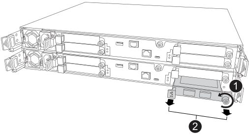

= 
:allow-uri-read: 

Das defekte E/A-Modul kann im laufenden Betrieb gegen ein gleichwertiges E/A-Modul ausgetauscht werden:

.Schritte
. Wenn Sie nicht bereits geerdet sind, sollten Sie sich richtig Erden.
. Entfernen Sie das defekte E/A-Modul aus dem beeinträchtigten Controller:
+

+
[cols="1,4"]
|===

 a| 
image::../media/icon_round_1.png[Legende Nummer 1]
 a| 
Drehen Sie die Flügelschraube des E/A-Moduls gegen den Uhrzeigersinn, um sie zu lösen.

 a| 
image::../media/icon_round_2.png[Legende Nummer 2]
 a| 
Ziehen Sie das E/A-Modul mithilfe der Anschlussbeschriftungslasche links und der Rändelschraube rechts aus dem Controller.

|===
. Installieren Sie das Ersatz-I/O-Modul:
+
.. Richten Sie das E/A-Modul an den Kanten des Schlitzes aus.
.. Drücken Sie das E/A-Modul vorsichtig ganz in den Steckplatz und achten Sie darauf, dass das E/A-Modul richtig im Anschluss sitzt.
+
Zum Eindrücken des I/O-Moduls können Sie die Lasche links und die Rändelschraube rechts verwenden.

.. Drehen Sie die Rändelschraube im Uhrzeigersinn, um sie festzuziehen.

. Verkabeln Sie das Ersatz-E/A-Modul.

