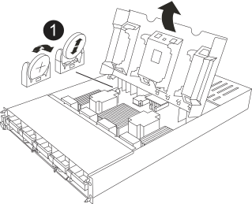

= Ersetzen Sie den Echtzeitakku AFF A1K
:allow-uri-read: 
:icons: font
:imagesdir: ../media/

[role="lead"]
Sie ersetzen den Echtzeituhr-Akku (RTC) im Controller-Modul, sodass die Dienste und Anwendungen Ihres Systems, die von der genauen Zeitsynchronisierung abhängen, weiterhin funktionieren.

* Sie können dieses Verfahren bei allen Versionen von ONTAP verwenden, die von Ihrem System unterstützt werden.
* Alle anderen Komponenten des Systems müssen ordnungsgemäß funktionieren. Falls nicht, müssen Sie sich an den technischen Support wenden.

== Schritt 1: Schalten Sie den beeinträchtigten Regler aus

Fahren Sie den Regler herunter oder übernehmen Sie ihn mit einer der folgenden Optionen.

[role="tabbed-block"]
====
.Option 1: Die meisten Systeme
--
Um den beeinträchtigten Controller herunterzufahren, müssen Sie den Status des Controllers bestimmen und gegebenenfalls den Controller übernehmen, damit der gesunde Controller weiterhin Daten aus dem beeinträchtigten Reglerspeicher bereitstellen kann.

.Über diese Aufgabe
* Wenn Sie über ein SAN-System verfügen, müssen Sie Event-Meldungen ) für den beeinträchtigten Controller SCSI Blade überprüft haben  `cluster kernel-service show`. Mit dem `cluster kernel-service show` Befehl (im erweiterten Modus von priv) werden der Knotenname, der Quorum-Status dieses Node, der Verfügbarkeitsstatus dieses Node und der Betriebsstatus dieses Node angezeigt.
+
Jeder Prozess des SCSI-Blades sollte sich im Quorum mit den anderen Nodes im Cluster befinden. Probleme müssen behoben werden, bevor Sie mit dem Austausch fortfahren.

* Wenn Sie über ein Cluster mit mehr als zwei Nodes verfügen, muss es sich im Quorum befinden. Wenn sich das Cluster nicht im Quorum befindet oder ein gesunder Controller FALSE anzeigt, um die Berechtigung und den Zustand zu erhalten, müssen Sie das Problem korrigieren, bevor Sie den beeinträchtigten Controller herunterfahren; siehe link:https://docs.netapp.com/us-en/ontap/system-admin/synchronize-node-cluster-task.html?q=Quorum["Synchronisieren eines Node mit dem Cluster"^].

.Schritte
. Wenn AutoSupport aktiviert ist, können Sie die automatische Case-Erstellung durch Aufrufen einer AutoSupport Meldung unterdrücken: `system node autosupport invoke -node * -type all -message MAINT=<# of hours>h`
+
Die folgende AutoSupport Meldung unterdrückt die automatische Erstellung von Cases für zwei Stunden: `cluster1:> system node autosupport invoke -node * -type all -message MAINT=2h`

. Deaktivieren Sie das automatische Giveback von der Konsole des gesunden Controllers: `storage failover modify –node local -auto-giveback false`
+

NOTE: Wenn Sie sehen _Möchten Sie Auto-Giveback deaktivieren?_, geben Sie ein `y`.

. Nehmen Sie den beeinträchtigten Controller zur LOADER-Eingabeaufforderung:
+
[cols="1,2"]
|===
| Wenn der eingeschränkte Controller angezeigt wird... | Dann... 

 a| 
Die LOADER-Eingabeaufforderung
 a| 
Fahren Sie mit dem nächsten Schritt fort.

 a| 
Warten auf Giveback...
 a| 
Drücken Sie Strg-C, und antworten Sie dann `y` Wenn Sie dazu aufgefordert werden.

 a| 
Eingabeaufforderung für das System oder Passwort
 a| 
Übernehmen oder stoppen Sie den beeinträchtigten Regler von der gesunden Steuerung: `storage failover takeover -ofnode _impaired_node_name_`

Wenn der Regler „beeinträchtigt“ auf Zurückgeben wartet... anzeigt, drücken Sie Strg-C, und antworten Sie dann `y`.

|===

--
.Option 2: Controller befindet sich in einem MetroCluster
--
Um den beeinträchtigten Controller herunterzufahren, müssen Sie den Status des Controllers bestimmen und gegebenenfalls den Controller übernehmen, damit der gesunde Controller weiterhin Daten aus dem beeinträchtigten Reglerspeicher bereitstellen kann.

* Wenn Sie über ein Cluster mit mehr als zwei Nodes verfügen, muss es sich im Quorum befinden. Wenn sich das Cluster nicht im Quorum befindet oder ein gesunder Controller FALSE anzeigt, um die Berechtigung und den Zustand zu erhalten, müssen Sie das Problem korrigieren, bevor Sie den beeinträchtigten Controller herunterfahren; siehe link:https://docs.netapp.com/us-en/ontap/system-admin/synchronize-node-cluster-task.html?q=Quorum["Synchronisieren eines Node mit dem Cluster"^].
* Wenn Sie über eine MetroCluster-Konfiguration verfügen, müssen Sie bestätigt haben, dass der MetroCluster-Konfigurationsstatus konfiguriert ist und dass die Nodes in einem aktivierten und normalen Zustand vorliegen (`metrocluster node show`).

.Schritte
. Wenn AutoSupport aktiviert ist, unterdrücken Sie die automatische Erstellung eines Cases durch Aufrufen einer AutoSupport Meldung: `system node autosupport invoke -node * -type all -message MAINT=number_of_hours_downh`
+
Die folgende AutoSupport Meldung unterdrückt die automatische Erstellung von Cases für zwei Stunden: `cluster1:*> system node autosupport invoke -node * -type all -message MAINT=2h`

. Deaktivieren Sie das automatische Giveback von der Konsole des gesunden Controllers: `storage failover modify –node local -auto-giveback false`
. Nehmen Sie den beeinträchtigten Controller zur LOADER-Eingabeaufforderung:
+
[cols="1,2"]
|===
| Wenn der eingeschränkte Controller angezeigt wird... | Dann... 

 a| 
Die LOADER-Eingabeaufforderung
 a| 
Fahren Sie mit dem nächsten Schritt fort.

 a| 
Warten auf Giveback...
 a| 
Drücken Sie Strg-C, und antworten Sie dann `y` Wenn Sie dazu aufgefordert werden.

 a| 
Eingabeaufforderung des Systems oder Passwort (Systempasswort eingeben)
 a| 
Übernehmen oder stoppen Sie den beeinträchtigten Regler von der gesunden Steuerung: `storage failover takeover -ofnode _impaired_node_name_`

Wenn der Regler „beeinträchtigt“ auf Zurückgeben wartet... anzeigt, drücken Sie Strg-C, und antworten Sie dann `y`.

|===

--
====

== Schritt 2: Entfernen Sie das Controller-Modul

Sie müssen das Controller-Modul aus dem Gehäuse entfernen, wenn Sie das Controller-Modul austauschen oder eine Komponente im Controller-Modul austauschen.

. Überprüfen Sie die NVRAM-Status-LED in Steckplatz 4/5 des Systems. An der Vorderseite des Controller-Moduls befindet sich außerdem eine NVRAM-LED. Suchen Sie nach dem NV-Symbol:
+
image::../media/drw_a1K-70-90_nvram-led_ieops-1463.svg[Grafik für die NVRAM-Warnungs- und Status-LED zur Lage]

+
[cols="1,4"]
|===

 a| 
image:../media/legend_icon_01.svg["Legende Nummer 1, Breite=30px"]
 a| 
NVRAM-Status-LED

 a| 
image:../media/legend_icon_02.svg["Legende Nummer 1, Breite=30px"]
 a| 
LED für NVRAM-Warnung

|===
+

NOTE: Wenn die NVRAM-Status-LED blinkt, bedeutet dies möglicherweise, dass das Controller-Modul nicht ordnungsgemäß übernommen oder angehalten wurde (nicht belegte Daten). Wenn das beeinträchtigte Controller-Modul nicht erfolgreich vom Partner-Controller-Modul übernommen wurde, wenden Sie sich an https://mysupport.netapp.com/site/global/dashboard["NetApp Support"] , bevor Sie mit diesem Verfahren fortfahren.

+
Das allgemeine Verhalten der NVRAM-Status-LED am Controller-Modul für beeinträchtigte besteht wie folgt:

+
** Die NVRAM-Status-LED blinkt, wenn die Stromversorgung vom Controller-Modul getrennt wird und sich das Controller-Modul im Status „Warten auf Rückgabe“ befindet oder das Controller-Modul nicht ordnungsgemäß übernommen oder angehalten wird (nicht belegte Daten).
** Wenn das Controller-Modul aus dem Gehäuse entfernt wird, blinkt die NVRAM-Status-LED, sodass das Controller-Modul nicht übernommen oder ordnungsgemäß angehalten wird (nicht belegte Daten). Vergewissern Sie sich, dass das Controller-Modul sauber Übernahme durch das Partner Controller-Modul erfolgt ist oder dass das beeinträchtigte Controller-Modul angezeigt wird `waiting for giveback`. Anschließend kann die blinkende LED ignoriert werden (und der Controller kann aus dem Gehäuse entfernt werden).

. Wenn Sie nicht bereits geerdet sind, sollten Sie sich richtig Erden.
. Haken Sie an der Vorderseite des Geräts die Finger in die Löcher in den Verriegelungsnocken ein, drücken Sie die Laschen an den Nockenhebeln zusammen, und drehen Sie beide Verriegelungen gleichzeitig vorsichtig, aber fest zu sich hin.
+
Das Controller-Modul bewegt sich leicht aus dem Gehäuse.

+
image::../media/drw_a1k_pcm_remove_replace_ieops-1375.svg[Controller Grafik entfernen]

+
[cols="1,4"]
|===

 a| 
image:../media/legend_icon_01.svg["Legende Nummer 1, Breite=30px"]
| Eine Verriegelungsnocken 
|===
. Schieben Sie das Controller-Modul aus dem Gehäuse und legen Sie es auf eine Ebene, stabile Oberfläche.
+
Stellen Sie sicher, dass Sie die Unterseite des Controller-Moduls stützen, wenn Sie es aus dem Gehäuse herausziehen.

== Schritt 3: Ersetzen Sie die RTC-Batterie

Entfernen Sie die fehlerhafte RTC-Batterie, und setzen Sie die Ersatz-RTC-Batterie ein.

. Öffnen Sie den Luftkanal der Steuerung auf der Oberseite der Steuerung.
+
.. Stecken Sie Ihre Finger in die Aussparungen an den entfernten Enden des Luftkanals.
.. Heben Sie den Luftkanal an, und drehen Sie ihn bis zum gewünschten Winkel nach oben.

. Suchen Sie die RTC-Batterie unter dem Luftkanal.
+

+
[cols="1,4"]
|===

 a| 
image:../media/legend_icon_01.svg["Legende Nummer 1,Breite=30px"]
| RTC-Akku und Gehäuse 
|===
. Schieben Sie den Akku vorsichtig von der Halterung weg, drehen Sie ihn vom Halter weg, und heben Sie ihn dann aus der Halterung.
+

NOTE: Beachten Sie die Polarität der Batterie, während Sie sie aus dem Halter entfernen. Der Akku ist mit einem Pluszeichen gekennzeichnet und muss korrekt in der Halterung positioniert werden. Ein Pluszeichen in der Nähe des Halters zeigt an, wie der Akku positioniert werden soll.

. Entfernen Sie den Ersatzakku aus dem antistatischen Versandbeutel.
. Notieren Sie die Polarität der RTC-Batterie, und setzen Sie sie anschließend in den Halter ein, indem Sie die Batterie schräg kippen und nach unten drücken.
. Überprüfen Sie die Batterie visuell, um sicherzustellen, dass sie vollständig in den Halter eingebaut ist und die Polarität korrekt ist.

== Schritt 4: Installieren Sie das Controller-Modul neu

Installieren Sie das Controller-Modul neu, und starten Sie es.

. Wenn Sie dies noch nicht getan haben, schließen Sie den Luftkanal.
. Richten Sie das Ende des Controller-Moduls an der Öffnung im Gehäuse aus, und schieben Sie das Controller-Modul in das Gehäuse, wobei die Hebel von der Vorderseite des Systems weg gedreht sind.
. Sobald das Controller-Modul Sie daran hindert, es weiter zu schieben, drehen Sie die Nockengriffe nach innen, bis sie wieder unter den Lüftern einrasten
+

NOTE: Setzen Sie das Controller-Modul nicht zu stark in das Gehäuse ein, um Beschädigungen der Anschlüsse zu vermeiden.

+
Das Controller-Modul startet, sobald es vollständig im Gehäuse sitzt.

. Stellen Sie die automatische Rückgabe wieder her, wenn Sie die Funktion mithilfe von deaktivieren `storage failover modify -node local -auto-giveback true` Befehl.
. Wenn AutoSupport aktiviert ist, können Sie die automatische Fallerstellung mit dem Befehl wiederherstellen/zurücknehmen. `system node autosupport invoke -node * -type all -message MAINT=END`

== Schritt 5: Setzen Sie die Uhrzeit und das Datum auf dem Controller zurück

NOTE: Nach dem Austauschen der RTC-Batterie, dem Einsetzen des Controllers und dem Einschalten des ersten BIOS-Rücksetzens werden folgende Fehlermeldungen angezeigt:
`RTC date/time error. Reset date/time to default`
`RTC power failure error` Diese Meldungen werden entfernt, und Sie können mit diesem Verfahren fortfahren.

. Mit dem Befehl „_Cluster date show_“ Datum und Uhrzeit auf dem funktionstüchtigen Controller prüfen.

NOTE: Wenn Ihr System im Boot-Menü stoppt, wählen Sie die Option für  `Reboot node` und antworten Sie bei der entsprechenden Aufforderung _y_, und starten Sie dann mit _Strg-C_ zum LOADER

. Überprüfen Sie an der LOADER-Eingabeaufforderung auf dem Ziel-Controller die Zeit und das Datum mit dem `cluster date show` Befehl.
. Ändern Sie bei Bedarf das Datum mit dem `set date mm/dd/yyyy` Befehl.
. Stellen Sie bei Bedarf die Uhrzeit in GMT mithilfe des ein `set time hh:mm:ss` Befehl.
+
.. Bestätigen Sie Datum und Uhrzeit auf dem Ziel-Controller.
.. Geben Sie an der Eingabeaufforderung des LOADERS _bye_ ein, um die PCIe-Karten und andere Komponenten neu zu initialisieren und den Controller neu starten zu lassen.
.. Kehren Sie den Controller in den normalen Betrieb zurück, indem Sie seinen Storage zurückgeben: _Storage Failover Giveback -ofnode _Impaired_Node_Name__
.. Wenn das automatische Giveback deaktiviert wurde, aktivieren Sie es erneut: _Storage Failover modify -Node local -Auto-Giveback true_

== Schritt 6: Senden Sie das fehlgeschlagene Teil an NetApp zurück

Senden Sie das fehlerhafte Teil wie in den dem Kit beiliegenden RMA-Anweisungen beschrieben an NetApp zurück. Siehe https://mysupport.netapp.com/site/info/rma["Teilerückgabe  Austausch"] Seite für weitere Informationen.
