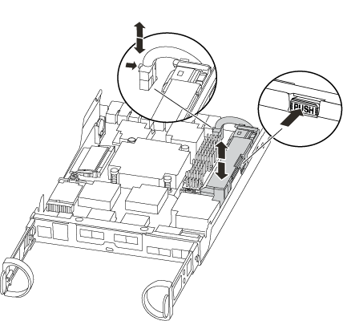

= Ersetzen Sie die Controller-Modul-Hardware – AFF A200
:allow-uri-read: 
:icons: font
:imagesdir: ../media/

[role="lead"]
Um die Hardware des Controller-Moduls zu ersetzen, müssen Sie den beeinträchtigten Controller entfernen, die FRU-Komponenten in das Ersatzcontrollermodul verschieben, das Ersatzcontrollermodul im Gehäuse installieren und das System dann in den Wartungsmodus booten.

== Schritt 1: Controller-Modul entfernen

Zum Austauschen des Controller-Moduls müssen Sie zuerst das alte Controller-Modul aus dem Chassis entfernen.

.Schritte
. Wenn Sie nicht bereits geerdet sind, sollten Sie sich richtig Erden.
. Lösen Sie den Haken- und Schlaufenriemen, mit dem die Kabel am Kabelführungsgerät befestigt sind, und ziehen Sie dann die Systemkabel und SFPs (falls erforderlich) vom Controller-Modul ab, um zu verfolgen, wo die Kabel angeschlossen waren.
+
Lassen Sie die Kabel im Kabelverwaltungs-Gerät so, dass bei der Neuinstallation des Kabelverwaltungsgeräts die Kabel organisiert sind.

. Entfernen Sie die Kabelführungsgeräte von der linken und rechten Seite des Controller-Moduls und stellen Sie sie zur Seite.
+
image::../media/drw_25xx_cable_management_arm.png[drw 25xx Kabelmanagement-ARM]

. Wenn Sie nach dem Entfernen der Kabel die SFP-Module im System belassen, verschieben Sie sie in das neue Controller-Modul.
. Drücken Sie die Verriegelung am Nockengriff, bis sie loslässt, öffnen Sie den Nockengriff vollständig, um das Controller-Modul aus der Mittelplatine zu lösen, und ziehen Sie das Controller-Modul anschließend mit zwei Händen aus dem Gehäuse heraus.
+
image::../media/drw_2240_x_opening_cam_latch.png[drw 2240 x Öffnungsnockenverriegelung]

. Drehen Sie das Controller-Modul um und legen Sie es auf eine flache, stabile Oberfläche.
. Öffnen Sie die Abdeckung, indem Sie die blauen Laschen einschieben, um die Abdeckung zu lösen, und schwenken Sie dann die Abdeckung nach oben und öffnen Sie sie.
+
image::../media/drw_2600_opening_pcm_cover.png[drw 2600, öffnen der pcm-Abdeckung]

== Schritt 2: Verschieben Sie die Startmedien

Sie müssen das Bootmedium ausfindig machen und die Anweisungen befolgen, um es aus dem alten Controller-Modul zu entfernen und in das neue Controller-Modul einzufügen.

.Schritte
. Suchen Sie das Boot-Medium mithilfe der folgenden Abbildung oder der FRU-Zuordnung auf dem Controller-Modul:
. Drücken Sie die blaue Taste am Startmediengehäuse, um die Startmedien aus dem Gehäuse zu lösen, und ziehen Sie sie vorsichtig gerade aus der Buchse des Boot-Mediums heraus.
+

NOTE: Drehen oder ziehen Sie die Boot-Medien nicht gerade nach oben, da dadurch der Sockel oder das Boot-Medium beschädigt werden kann.

. Bewegen Sie die Startmedien auf das neue Controller-Modul, richten Sie die Kanten des Startmediums am Buchsengehäuse aus, und schieben Sie sie dann vorsichtig in die Buchse.
. Überprüfen Sie die Startmedien, um sicherzustellen, dass sie ganz und ganz in der Steckdose sitzt.
+
Entfernen Sie gegebenenfalls die Startmedien, und setzen Sie sie wieder in den Sockel ein.

. Drücken Sie die Startmedien nach unten, um die Verriegelungstaste am Startmediengehäuse zu betätigen.

== Schritt 3: Verschieben Sie die NVMEM-Batterie

Um die NVMEM-Batterie vom alten Controller-Modul in das neue Controller-Modul zu verschieben, müssen Sie eine bestimmte Sequenz von Schritten durchführen.

.Schritte
. Überprüfen Sie die NVMEM-LED:
+
** Wenn sich Ihr System in einer HA-Konfiguration befindet, fahren Sie mit dem nächsten Schritt fort.
** Wenn sich das System in einer eigenständigen Konfiguration befindet, fahren Sie das Controller-Modul ordnungsgemäß herunter, und überprüfen Sie dann die NVRAM-LED, die durch das NV-Symbol gekennzeichnet ist.
+
image::../media/drw_hw_nvram_icon.png[drw-hw-nvram-Symbol]

+

NOTE: Die NVRAM-LED blinkt während des Auslagerung des Inhalts in den Flash-Speicher, wenn Sie das System anhalten. Nach Abschluss der Abscheidungen schaltet sich die LED aus.

+
*** Wenn die Stromversorgung ohne eine saubere Abschaltung unterbrochen wird, blinkt die NVMEM-LED bis zum Abschluss des Destages und die LED erlischt.
*** Wenn die LED eingeschaltet ist und eingeschaltet ist, werden nicht geschriebene Daten auf NVMEM gespeichert.
+
Dies tritt in der Regel während eines unkontrollierten Herunterfahrens auf, nachdem ONTAP erfolgreich gestartet wurde.

. Suchen Sie den NVMEM-Akku im Controller-Modul.
+

. Suchen Sie den Batteriestecker, und drücken Sie den Clip auf der Vorderseite des Batteriesteckers, um den Stecker aus der Steckdose zu lösen, und ziehen Sie dann das Akkukabel aus der Steckdose.
. Fassen Sie den Akku an, und drücken Sie die blaue Verriegelungslasche, die mit DRUCKTASTE gekennzeichnet ist, und heben Sie den Akku aus dem Halter und dem Controller-Modul heraus.
. Bringen Sie den Akku in das Ersatzcontrollermodul.
. Schließen Sie das Batteriekabel an der Seite des Batteriehalters um den Kabelkanal.
. Positionieren Sie den Akku, indem Sie die Schlüsselrippen der Batteriehalter an den „`V`“-Kerben an der Seitenwand aus Metall ausrichten.
. Schieben Sie den Akku entlang der Seitenwand aus Metall nach unten, bis die Halterungen an der Seitenwand in die Steckplätze am Akkupack einhaken und der Akkupack einrastet und in die Öffnung an der Seitenwand einrastet.

== Schritt 4: Verschieben Sie die DIMMs

Um die DIMMs zu verschieben, müssen Sie die Anweisungen befolgen, um sie vom alten Controller-Modul in das Ersatzcontrollermodul zu finden und zu verschieben.

Sie müssen das neue Controller-Modul bereit haben, damit Sie die DIMMs direkt vom beeinträchtigten Controller-Modul auf die entsprechenden Steckplätze im Ersatzcontroller-Modul verschieben können.

.Schritte
. Suchen Sie die DIMMs auf dem Controller-Modul.
. Beachten Sie die Ausrichtung des DIMM-Moduls in den Sockel, damit Sie das DIMM-Modul in die richtige Ausrichtung einsetzen können.
. Werfen Sie das DIMM aus dem Steckplatz, indem Sie die beiden DIMM-Auswerferlaschen auf beiden Seiten des DIMM langsam auseinander drücken und dann das DIMM aus dem Steckplatz schieben.
+

NOTE: Halten Sie das DIMM vorsichtig an den Rändern, um Druck auf die Komponenten auf der DIMM-Leiterplatte zu vermeiden.

+
Die Anzahl und Anordnung der System-DIMMs hängt vom Modell Ihres Systems ab.

+
Die folgende Abbildung zeigt die Position der System-DIMMs:

+
image::../media/drw_2600_dimms.png[drw 2600 dimms]

. Wiederholen Sie diese Schritte, um bei Bedarf weitere DIMMs zu entfernen.
. Vergewissern Sie sich, dass der NVMEM-Akku nicht an das neue Controller-Modul angeschlossen ist.
. Suchen Sie den Steckplatz, in dem Sie das DIMM installieren.
. Vergewissern Sie sich, dass sich die DIMM-Auswerferlaschen am Anschluss in der geöffneten Position befinden und setzen Sie das DIMM-Auswerfer anschließend in den Steckplatz ein.
+
Das DIMM passt eng in den Steckplatz, sollte aber leicht einpassen. Falls nicht, richten Sie das DIMM-Modul mit dem Steckplatz aus und setzen Sie es wieder ein.

+

NOTE: Prüfen Sie das DIMM visuell, um sicherzustellen, dass es gleichmäßig ausgerichtet und vollständig in den Steckplatz eingesetzt ist.

. Wiederholen Sie diese Schritte für die übrigen DIMMs.
. Suchen Sie den NVMEM-Batteriestecker, und drücken Sie dann den Clip auf der Vorderseite des Batteriesteckers, um ihn in den Sockel zu stecken.
+
Vergewissern Sie sich, dass der Stecker am Controller-Modul abhält.

== Schritt 5: Installieren Sie den Controller

Nachdem Sie die Komponenten aus dem alten Controller-Modul in das neue Controller-Modul installiert haben, müssen Sie das neue Controller-Modul im Systemgehäuse installieren und das Betriebssystem booten.

Bei HA-Paaren mit zwei Controller-Modulen im selben Chassis ist die Sequenz, in der Sie das Controller-Modul installieren, besonders wichtig, da sie versucht, neu zu booten, sobald Sie es vollständig im Chassis einsetzen.

NOTE: Möglicherweise wird die System-Firmware beim Booten des Systems aktualisiert. Diesen Vorgang nicht abbrechen. Das Verfahren erfordert, dass Sie den Bootvorgang unterbrechen, den Sie in der Regel jederzeit nach der entsprechenden Aufforderung durchführen können. Wenn das System jedoch beim Booten der System die System-Firmware aktualisiert, müssen Sie nach Abschluss der Aktualisierung warten, bevor Sie den Bootvorgang unterbrechen.

.Schritte
. Wenn Sie nicht bereits geerdet sind, sollten Sie sich richtig Erden.
. Wenn dies noch nicht geschehen ist, bringen Sie die Abdeckung am Controller-Modul wieder an.
. Richten Sie das Ende des Controller-Moduls an der Öffnung im Gehäuse aus, und drücken Sie dann vorsichtig das Controller-Modul zur Hälfte in das System.
+

NOTE: Setzen Sie das Controller-Modul erst dann vollständig in das Chassis ein, wenn Sie dazu aufgefordert werden.

. Verkabeln Sie nur die Management- und Konsolen-Ports, sodass Sie auf das System zugreifen können, um die Aufgaben in den folgenden Abschnitten auszuführen.
+

NOTE: Sie schließen die übrigen Kabel später in diesem Verfahren an das Controller-Modul an.

. Führen Sie die Neuinstallation des Controller-Moduls durch:
+
[cols="1,2"]
|===
| Ihr System befindet sich in... | Führen Sie dann folgende Schritte aus... 

 a| 
Ein HA-Paar
 a| 
Das Controller-Modul beginnt zu booten, sobald es vollständig im Gehäuse sitzt. Bereiten Sie sich darauf vor, den Bootvorgang zu unterbrechen.

.. Schieben Sie das Steuermodul fest in die offene Position, bis es auf die Mittelebene trifft und vollständig sitzt, und schließen Sie dann den Nockengriff in die verriegelte Position.
+

CAUTION: Beim Einschieben des Controller-Moduls in das Gehäuse keine übermäßige Kraft verwenden, um Schäden an den Anschlüssen zu vermeiden.

+
Der Controller beginnt zu booten, sobald er im Gehäuse sitzt.

.. Wenn Sie dies noch nicht getan haben, installieren Sie das Kabelverwaltungsgerät neu.
.. Verbinden Sie die Kabel mit dem Haken- und Schlaufenband mit dem Kabelmanagement-Gerät.
.. Wenn die Meldung angezeigt wird `Press Ctrl-C for Boot Menu`, Drücken Sie `Ctrl-C` Um den Bootvorgang zu unterbrechen.
+

NOTE: Wenn die Eingabeaufforderung nicht angezeigt wird und das Controller-Modul im ONTAP gebootet wird, geben Sie ein `halt`, Und geben Sie an der LOADER-Eingabeaufforderung ein `boot_ontap`, Drücken Sie `Ctrl-C` Wenn Sie dazu aufgefordert werden, und starten Sie dann in den Wartungsmodus.

.. Wählen Sie im angezeigten Menü die Option zum Starten im Wartungsmodus aus.

 a| 
Eine eigenständige Konfiguration
 a| 
.. Schieben Sie das Steuermodul fest in die offene Position, bis es auf die Mittelebene trifft und vollständig sitzt, und schließen Sie dann den Nockengriff in die verriegelte Position.
+

NOTE: Beim Einschieben des Controller-Moduls in das Gehäuse keine übermäßige Kraft verwenden, um Schäden an den Anschlüssen zu vermeiden.

.. Wenn Sie dies noch nicht getan haben, installieren Sie das Kabelverwaltungsgerät neu.
.. Verbinden Sie die Kabel mit dem Haken- und Schlaufenband mit dem Kabelmanagement-Gerät.
.. Schließen Sie die Stromkabel wieder an die Netzteile und an die Stromquellen an, schalten Sie den Netzstrom ein, um den Bootvorgang zu starten, und drücken Sie dann `Ctrl-C` Nachdem Sie den gesehen haben `Press Ctrl-C for Boot Menu` Nachricht:
+

NOTE: Wenn die Eingabeaufforderung nicht angezeigt wird und das Controller-Modul im ONTAP gebootet wird, geben Sie ein `halt`, Und geben Sie an der LOADER-Eingabeaufforderung ein `boot_ontap`, Drücken Sie `Ctrl-C` Wenn Sie dazu aufgefordert werden, und starten Sie dann in den Wartungsmodus.

.. Wählen Sie im Startmenü die Option Wartungsmodus aus.

|===
+

IMPORTANT: Während des Bootens werden möglicherweise die folgenden Eingabeaufforderungen angezeigt:

+
** Eine Warnmeldung über eine nicht übereinstimmende System-ID und die Aufforderung, die System-ID außer Kraft zu setzen.
** Eine Eingabeaufforderung mit einer Warnmeldung, dass Sie beim Aufrufen des Wartungsmodus in einer HA-Konfiguration sicherstellen müssen, dass der gesunde Controller weiterhin ausgefallen ist. Sie können sicher reagieren `y` Um diese Eingabeaufforderungen.

