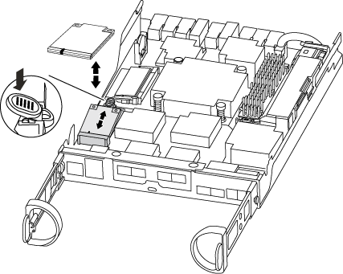

= Ersetzen Sie das Startmedium – AFF A220
:allow-uri-read: 
:icons: font
:imagesdir: ../media/

[role="lead"]
Das AFF A220 -System unterstützt ausschließlich manuelle Wiederherstellungsverfahren über Bootmedien.

Zum Austauschen des Startmediums müssen Sie das beeinträchtigte Controller-Modul entfernen, das Ersatzstartmedium installieren und das Boot-Image auf ein USB-Flash-Laufwerk übertragen.

== Schritt 1: Entfernen Sie das Controller-Modul

Um auf Komponenten innerhalb des Controllers zuzugreifen, müssen Sie zuerst das Controller-Modul aus dem System entfernen und dann die Abdeckung am Controller-Modul entfernen.

. Wenn Sie nicht bereits geerdet sind, sollten Sie sich richtig Erden.
. Lösen Sie den Haken- und Schlaufenriemen, mit dem die Kabel am Kabelführungsgerät befestigt sind, und ziehen Sie dann die Systemkabel und SFPs (falls erforderlich) vom Controller-Modul ab, um zu verfolgen, wo die Kabel angeschlossen waren.
+
Lassen Sie die Kabel im Kabelverwaltungs-Gerät so, dass bei der Neuinstallation des Kabelverwaltungsgeräts die Kabel organisiert sind.

. Entfernen Sie die Kabelführungsgeräte von der linken und rechten Seite des Controller-Moduls und stellen Sie sie zur Seite.
+
image::../media/drw_25xx_cable_management_arm.png[Einsetzen oder Entfernen der Kabelverwaltungs-ARM]

. Drücken Sie die Verriegelung am Nockengriff, bis sie loslässt, öffnen Sie den Nockengriff vollständig, um das Controller-Modul aus der Mittelplatine zu lösen, und ziehen Sie das Controller-Modul anschließend mit zwei Händen aus dem Gehäuse heraus.
+
image::../media/drw_2240_x_opening_cam_latch.png[Öffnen der Nockenhebelverriegelung]

. Drehen Sie das Controller-Modul um und legen Sie es auf eine flache, stabile Oberfläche.
. Öffnen Sie die Abdeckung, indem Sie die blauen Laschen einschieben, um die Abdeckung zu lösen, und schwenken Sie dann die Abdeckung nach oben und öffnen Sie sie.
+
image::../media/drw_2600_opening_pcm_cover.png[Öffnen oder Schließen des Controller-Moduls]

== Schritt 2: Ersetzen Sie die Startmedien

Sie müssen das Startmedium im Controller finden und die Anweisungen befolgen, um es zu ersetzen.

.Schritte
. Wenn Sie nicht bereits geerdet sind, sollten Sie sich richtig Erden.
. Suchen Sie das Boot-Medium mithilfe der folgenden Abbildung oder der FRU-Zuordnung auf dem Controller-Modul:
+

. Drücken Sie die blaue Taste am Startmediengehäuse, um die Startmedien aus dem Gehäuse zu lösen, und ziehen Sie sie vorsichtig gerade aus der Buchse des Boot-Mediums heraus.
+

NOTE: Drehen oder ziehen Sie die Boot-Medien nicht gerade nach oben, da dadurch der Sockel oder das Boot-Medium beschädigt werden kann.

. Richten Sie die Kanten des Ersatzstartmediums an der Buchse des Boot-Mediums aus, und schieben Sie ihn dann vorsichtig in die Buchse.
. Überprüfen Sie die Startmedien, um sicherzustellen, dass sie ganz und ganz in der Steckdose sitzt.
+
Entfernen Sie gegebenenfalls die Startmedien, und setzen Sie sie wieder in den Sockel ein.

. Drücken Sie die Startmedien nach unten, um die Verriegelungstaste am Startmediengehäuse zu betätigen.
. Schließen Sie die Abdeckung des Controller-Moduls.

== Schritt 3: Übertragen Sie das Startabbild auf das Startmedium

Sie können das System-Image über ein USB-Flash-Laufwerk, auf dem das Image installiert ist, auf dem Ersatzstartmedium installieren. Sie müssen das var-Dateisystem jedoch während dieses Vorgangs wiederherstellen.

* Sie müssen über ein USB-Flash-Laufwerk verfügen, das auf FAT32 formatiert ist und eine Kapazität von mindestens 4 GB aufweist.
* Eine Kopie der gleichen Bildversion von ONTAP wie der beeinträchtigte Controller. Das entsprechende Image können Sie im Abschnitt „Downloads“ auf der NetApp Support-Website herunterladen
+
** Wenn NVE aktiviert ist, laden Sie das Image mit NetApp Volume Encryption herunter, wie in der Download-Schaltfläche angegeben.
** Wenn NVE nicht aktiviert ist, laden Sie das Image ohne NetApp Volume Encryption herunter, wie im Download-Button dargestellt.

* Wenn Ihr System ein HA-Paar ist, müssen Sie eine Netzwerkverbindung haben.
* Wenn es sich bei Ihrem System um ein eigenständiges System handelt, benötigen Sie keine Netzwerkverbindung, Sie müssen jedoch beim Wiederherstellen des var-Dateisystems einen zusätzlichen Neustart durchführen.

.Schritte
. Richten Sie das Ende des Controller-Moduls an der Öffnung im Gehäuse aus, und drücken Sie dann vorsichtig das Controller-Modul zur Hälfte in das System.
. Installieren Sie das Kabelverwaltungsgerät neu und führen Sie das System nach Bedarf wieder ein.
+
Denken Sie beim Neuinstallieren der Medienkonverter (SFPs) daran, wenn sie entfernt wurden.

. Stecken Sie das USB-Flash-Laufwerk in den USB-Steckplatz des Controller-Moduls.
+
Stellen Sie sicher, dass Sie das USB-Flash-Laufwerk in den für USB-Geräte gekennzeichneten Steckplatz und nicht im USB-Konsolenport installieren.

. Drücken Sie das Controller-Modul ganz in das System, vergewissern Sie sich, dass der Nockengriff das USB-Flash-Laufwerk löscht, drücken Sie den Nockengriff fest, um den Sitz des Controller-Moduls zu beenden, schieben Sie den Nockengriff in die geschlossene Position und ziehen Sie die Daumenschraube fest.
+
Der Controller beginnt zu booten, sobald er vollständig im Chassis installiert ist.

. Unterbrechen Sie den Boot-Vorgang, um an der LOADER-Eingabeaufforderung zu stoppen, indem Sie Strg-C drücken, wenn Sie sehen Starten VON AUTOBOOT drücken Sie Strg-C, um den Vorgang abzubrechen
+
Wenn Sie diese Meldung verpassen, drücken Sie Strg-C, wählen Sie die Option zum Booten im Wartungsmodus aus, und halten Sie dann den Controller zum Booten in LOADER an.

. Wenn Systeme mit einem Controller im Chassis vorhanden sind, schließen Sie das Netzteil wieder an und schalten Sie die Netzteile ein.
+
Das System beginnt mit dem Booten und wird bei DER LOADER-Eingabeaufforderung angehalten.

. Legen Sie den Verbindungstyp für das Netzwerk an der LOADER-Eingabeaufforderung fest:
+
** Wenn Sie DHCP konfigurieren: `ifconfig e0a -auto`
+

NOTE: Der von Ihnen konfigurierte Zielport ist der Zielport, über den Sie während der Wiederherstellung des var-Dateisystems mit dem beeinträchtigten Controller über den gesunden Controller kommunizieren. Sie können in diesem Befehl auch den Port E0M verwenden.

** Wenn Sie manuelle Verbindungen konfigurieren: `ifconfig e0a -addr=filer_addr -mask=netmask -gw=gateway-dns=dns_addr-domain=dns_domain`
+
*** Filer_addr ist die IP-Adresse des Speichersystems.
*** Netmask ist die Netzwerkmaske des Managementnetzwerks, das mit dem HA-Partner verbunden ist.
*** Das Gateway ist das Gateway für das Netzwerk.
*** dns_addr ist die IP-Adresse eines Namensservers in Ihrem Netzwerk.
*** die dns_Domain ist der Domain Name des Domain Name System (DNS).
+
Wenn Sie diesen optionalen Parameter verwenden, benötigen Sie keinen vollqualifizierten Domänennamen in der Netzboot-Server-URL. Sie benötigen nur den Hostnamen des Servers.

+

NOTE: Andere Parameter können für Ihre Schnittstelle erforderlich sein. Sie können eingeben `help ifconfig` Details finden Sie in der Firmware-Eingabeaufforderung.

