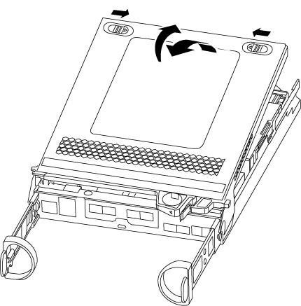

= Ersetzen Sie ein DIMM-Modul – AFF A220
:allow-uri-read: 
:icons: font
:imagesdir: ../media/

[role="lead"]
Sie müssen ein DIMM im Controller ersetzen, wenn das Speichersystem auf Fehler wie übermäßige CECC-Fehler (korrigierbare Fehlerkorrekturcodes) stößt, die auf Warnmeldungen der Systemzustandsüberwachung oder nicht korrigierbaren ECC-Fehlern basieren, die normalerweise durch einen einzelnen DIMM-Fehler verursacht werden, der das Starten von ONTAP verhindert.

Alle anderen Komponenten des Systems müssen ordnungsgemäß funktionieren. Falls nicht, müssen Sie sich an den technischen Support wenden.

Sie müssen die fehlerhafte Komponente durch eine vom Anbieter empfangene Ersatz-FRU-Komponente ersetzen.

== Schritt 1: Schalten Sie den beeinträchtigten Regler aus

Um den beeinträchtigten Controller herunterzufahren, müssen Sie den Status des Controllers bestimmen und gegebenenfalls den Controller übernehmen, damit der gesunde Controller weiterhin Daten aus dem beeinträchtigten Reglerspeicher bereitstellen kann.

.Über diese Aufgabe
* Wenn Sie über ein SAN-System verfügen, müssen Sie Event-Meldungen ) für den beeinträchtigten Controller SCSI Blade überprüft haben  `cluster kernel-service show`. Mit dem `cluster kernel-service show` Befehl (im erweiterten Modus von priv) werden der Knotenname,  der Node, der Verfügbarkeitsstatus dieses Node und der Betriebsstatus dieses Node angezeigtlink:https://docs.netapp.com/us-en/ontap/system-admin/display-nodes-cluster-task.html["Quorum-Status"].
+
Jeder Prozess des SCSI-Blades sollte sich im Quorum mit den anderen Nodes im Cluster befinden. Probleme müssen behoben werden, bevor Sie mit dem Austausch fortfahren.

* Wenn Sie über ein Cluster mit mehr als zwei Nodes verfügen, muss es sich im Quorum befinden. Wenn sich das Cluster nicht im Quorum befindet oder ein gesunder Controller FALSE anzeigt, um die Berechtigung und den Zustand zu erhalten, müssen Sie das Problem korrigieren, bevor Sie den beeinträchtigten Controller herunterfahren; siehe link:https://docs.netapp.com/us-en/ontap/system-admin/synchronize-node-cluster-task.html?q=Quorum["Synchronisieren eines Node mit dem Cluster"^].

.Schritte
. Wenn AutoSupport aktiviert ist, unterdrücken Sie die automatische Erstellung eines Cases durch Aufrufen einer AutoSupport Meldung:
+
`system node autosupport invoke -node * -type all -message MAINT=<# of hours>h`

+
Die folgende AutoSupport Meldung unterdrückt die automatische Erstellung von Cases für zwei Stunden:

+
`cluster1:> system node autosupport invoke -node * -type all -message MAINT=2h`

. Automatische Rückgabe deaktivieren:
+
.. Geben Sie den folgenden Befehl von der Konsole des fehlerfreien Controllers ein:
+
`storage failover modify -node _impaired_node_name_ -auto-giveback false`

.. Eingeben `y` wenn die Eingabeaufforderung _Möchten Sie die automatische Rückgabe deaktivieren?_ angezeigt wird

. Nehmen Sie den beeinträchtigten Controller zur LOADER-Eingabeaufforderung:
+
[cols="1,2"]
|===
| Wenn der eingeschränkte Controller angezeigt wird... | Dann... 

 a| 
Die LOADER-Eingabeaufforderung
 a| 
Fahren Sie mit dem nächsten Schritt fort.

 a| 
Warten auf Giveback...
 a| 
Drücken Sie Strg-C, und antworten Sie dann `y` Wenn Sie dazu aufgefordert werden.

 a| 
Eingabeaufforderung für das System oder Passwort
 a| 
Übernehmen oder stoppen Sie den beeinträchtigten Regler von der gesunden Steuerung:

`storage failover takeover -ofnode _impaired_node_name_ -halt _true_`

Der Parameter _-stop true_ führt Sie zur Loader-Eingabeaufforderung.

|===
. Wenn das System nur über ein Controller-Modul im Gehäuse verfügt, schalten Sie die Netzteile aus und ziehen Sie dann die Netzkabel des beeinträchtigten Controllers von der Stromquelle ab.

== Schritt 2: Controller-Modul entfernen

Um auf Komponenten innerhalb des Controllers zuzugreifen, müssen Sie zuerst das Controller-Modul aus dem System entfernen und dann die Abdeckung am Controller-Modul entfernen.

.Schritte
. Wenn Sie nicht bereits geerdet sind, sollten Sie sich richtig Erden.
. Lösen Sie den Haken- und Schlaufenriemen, mit dem die Kabel am Kabelführungsgerät befestigt sind, und ziehen Sie dann die Systemkabel und SFPs (falls erforderlich) vom Controller-Modul ab, um zu verfolgen, wo die Kabel angeschlossen waren.
+
Lassen Sie die Kabel im Kabelverwaltungs-Gerät so, dass bei der Neuinstallation des Kabelverwaltungsgeräts die Kabel organisiert sind.

. Entfernen Sie die Kabelführungsgeräte von der linken und rechten Seite des Controller-Moduls und stellen Sie sie zur Seite.
+
image::../media/drw_25xx_cable_management_arm.png[Einsetzen oder Entfernen der Kabelverwaltungs-ARM]

. Drücken Sie die Verriegelung am Nockengriff, bis sie loslässt, öffnen Sie den Nockengriff vollständig, um das Controller-Modul aus der Mittelplatine zu lösen, und ziehen Sie das Controller-Modul anschließend mit zwei Händen aus dem Gehäuse heraus.
+
image::../media/drw_2240_x_opening_cam_latch.png[Öffnen der Nockenhebelverriegelung]

. Drehen Sie das Controller-Modul um und legen Sie es auf eine flache, stabile Oberfläche.
. Öffnen Sie die Abdeckung, indem Sie die blauen Laschen einschieben, um die Abdeckung zu lösen, und schwenken Sie dann die Abdeckung nach oben und öffnen Sie sie.
+

== Schritt 3: Ersetzen Sie die DIMMs

Um die DIMMs auszutauschen, suchen Sie sie im Controller und befolgen Sie die Schritte in der jeweiligen Reihenfolge.

Wenn Sie ein DIMM ersetzen, müssen Sie es entfernen, nachdem Sie den NVMEM-Akku aus dem Controller-Modul ausgesteckt haben.

.Schritte
. Wenn Sie nicht bereits geerdet sind, sollten Sie sich richtig Erden.
. Überprüfen Sie die NVMEM-LED auf der Rückseite des Controller-Moduls.
+
Sie müssen ein sauberes System herunterfahren, bevor Sie Systemkomponenten ersetzen, um nicht geschriebene Daten im nichtflüchtigen Speicher (NVMEM) zu verlieren. Die LED befindet sich auf der Rückseite des Controller-Moduls. Achten Sie auf das folgende Symbol:

+
image::../media/drw_hw_nvram_icon.png[NV-LED]

. Wenn die NVMEM-LED nicht blinkt, befindet sich kein Inhalt in der NVMEM. Sie können die folgenden Schritte überspringen und mit der nächsten Aufgabe bei diesem Verfahren fortfahren.
. Wenn die NVMEM-LED blinkt, befinden sich Daten in der NVMEM und Sie müssen die Batterie trennen, um den Speicher zu löschen:
+
.. Suchen Sie den Akku, drücken Sie den Clip auf der Vorderseite des Batteriesteckers, um den Sicherungsclip von der Steckdose zu lösen, und ziehen Sie dann das Akkukabel aus der Steckdose.
+
image::../media/drw_2600_nvmem_battery_unplug.png[Austausch der NVMEM-Batterie]

.. Vergewissern Sie sich, dass die NVMEM-LED nicht mehr leuchtet.
.. Schließen Sie den Batteriestecker wieder an.

. Kehren Sie zu zurück <<Schritt 3: Ersetzen Sie die DIMMs>> In diesem Verfahren wird die NVMEM-LED erneut überprüft.
. Suchen Sie die DIMMs auf dem Controller-Modul.
. Beachten Sie die Ausrichtung des DIMM-Moduls in der Buchse, damit Sie das ErsatzDIMM in die richtige Ausrichtung einsetzen können.
. Werfen Sie das DIMM aus dem Steckplatz, indem Sie die beiden DIMM-Auswerferlaschen auf beiden Seiten des DIMM langsam auseinander drücken und dann das DIMM aus dem Steckplatz schieben.
+

NOTE: Halten Sie das DIMM vorsichtig an den Rändern, um Druck auf die Komponenten auf der DIMM-Leiterplatte zu vermeiden.

+
Die Anzahl und Anordnung der System-DIMMs hängt vom Modell Ihres Systems ab.

+
Die folgende Abbildung zeigt die Position der System-DIMMs:

+
image::../media/drw_2600_dimm_repl_animated_gif.png[Austauschen eines DIMM]

. Entfernen Sie das Ersatz-DIMM aus dem antistatischen Versandbeutel, halten Sie das DIMM an den Ecken und richten Sie es am Steckplatz aus.
+
Die Kerbe zwischen den Stiften am DIMM sollte mit der Lasche im Sockel aufliegen.

. Vergewissern Sie sich, dass sich die DIMM-Auswerferlaschen am Anschluss in der geöffneten Position befinden und setzen Sie das DIMM-Auswerfer anschließend in den Steckplatz ein.
+
Das DIMM passt eng in den Steckplatz, sollte aber leicht einpassen. Falls nicht, richten Sie das DIMM-Modul mit dem Steckplatz aus und setzen Sie es wieder ein.

+

NOTE: Prüfen Sie das DIMM visuell, um sicherzustellen, dass es gleichmäßig ausgerichtet und vollständig in den Steckplatz eingesetzt ist.

. Drücken Sie vorsichtig, aber fest auf die Oberseite des DIMM, bis die Auswurfklammern über den Kerben an den Enden des DIMM einrasten.
. Suchen Sie den NVMEM-Batteriestecker, und drücken Sie dann den Clip auf der Vorderseite des Batteriesteckers, um ihn in den Sockel zu stecken.
+
Vergewissern Sie sich, dass der Stecker am Controller-Modul abhält.

. Schließen Sie die Abdeckung des Controller-Moduls.

== Schritt 4: Installieren Sie das Controller-Modul neu

Nachdem Sie die Komponenten im Controller-Modul ausgetauscht haben, setzen Sie sie wieder in das Gehäuse ein.

.Schritte
. Wenn Sie nicht bereits geerdet sind, sollten Sie sich richtig Erden.
. Wenn dies noch nicht geschehen ist, bringen Sie die Abdeckung am Controller-Modul wieder an.
. Richten Sie das Ende des Controller-Moduls an der Öffnung im Gehäuse aus, und drücken Sie dann vorsichtig das Controller-Modul zur Hälfte in das System.
+

NOTE: Setzen Sie das Controller-Modul erst dann vollständig in das Chassis ein, wenn Sie dazu aufgefordert werden.

. Das System nach Bedarf neu einsetzen.
+
Wenn Sie die Medienkonverter (QSFPs oder SFPs) entfernt haben, sollten Sie diese erneut installieren, wenn Sie Glasfaserkabel verwenden.

. Führen Sie die Neuinstallation des Controller-Moduls durch:
+
[cols="1,2"]
|===
| Ihr System befindet sich in... | Führen Sie dann folgende Schritte aus... 

 a| 
Ein HA-Paar
 a| 
Das Controller-Modul beginnt zu booten, sobald es vollständig im Gehäuse sitzt.

.. Schieben Sie das Steuermodul fest in die offene Position, bis es auf die Mittelebene trifft und vollständig sitzt, und schließen Sie dann den Nockengriff in die verriegelte Position.
+

NOTE: Beim Einschieben des Controller-Moduls in das Gehäuse keine übermäßige Kraft verwenden, um Schäden an den Anschlüssen zu vermeiden.

+
Der Controller beginnt zu booten, sobald er im Gehäuse sitzt.

.. Wenn Sie dies noch nicht getan haben, installieren Sie das Kabelverwaltungsgerät neu.
.. Verbinden Sie die Kabel mit dem Haken- und Schlaufenband mit dem Kabelmanagement-Gerät.

 a| 
Eine eigenständige Konfiguration
 a| 
.. Schieben Sie das Steuermodul fest in die offene Position, bis es auf die Mittelebene trifft und vollständig sitzt, und schließen Sie dann den Nockengriff in die verriegelte Position.
+

NOTE: Beim Einschieben des Controller-Moduls in das Gehäuse keine übermäßige Kraft verwenden, um Schäden an den Anschlüssen zu vermeiden.

.. Wenn Sie dies noch nicht getan haben, installieren Sie das Kabelverwaltungsgerät neu.
.. Verbinden Sie die Kabel mit dem Haken- und Schlaufenband mit dem Kabelmanagement-Gerät.
.. Schließen Sie die Stromkabel wieder an die Netzteile und an die Stromquellen an, und schalten Sie dann den Netzstrom ein, um den Bootvorgang zu starten.

|===

== Schritt 5: Aggregate in einer MetroCluster Konfiguration mit zwei Nodes zurückwechseln

Dieser Task gilt nur für MetroCluster-Konfigurationen mit zwei Nodes.

.Schritte
. Vergewissern Sie sich, dass sich alle Nodes im befinden `enabled` Bundesland: `metrocluster node show`
+
[listing]
----
cluster_B::>  metrocluster node show

DR                           Configuration  DR
Group Cluster Node           State          Mirroring Mode
----- ------- -------------- -------------- --------- --------------------
1     cluster_A
              controller_A_1 configured     enabled   heal roots completed
      cluster_B
              controller_B_1 configured     enabled   waiting for switchback recovery
2 entries were displayed.
----
. Überprüfen Sie, ob die Neusynchronisierung auf allen SVMs abgeschlossen ist: `metrocluster vserver show`
. Überprüfen Sie, ob die automatischen LIF-Migrationen durch die heilenden Vorgänge erfolgreich abgeschlossen wurden: `metrocluster check lif show`
. Führen Sie den Wechsel zurück mit dem aus `metrocluster switchback` Befehl von einem beliebigen Node im verbleibenden Cluster
. Stellen Sie sicher, dass der Umkehrvorgang abgeschlossen ist: `metrocluster show`
+
Der Vorgang zum zurückwechseln wird weiterhin ausgeführt, wenn sich ein Cluster im befindet `waiting-for-switchback` Bundesland:

+
[listing]
----
cluster_B::> metrocluster show
Cluster              Configuration State    Mode
--------------------	------------------- 	---------
 Local: cluster_B configured       	switchover
Remote: cluster_A configured       	waiting-for-switchback
----
+
Der Vorgang zum zurückwechseln ist abgeschlossen, wenn sich die Cluster im befinden `normal` Bundesland:

+
[listing]
----
cluster_B::> metrocluster show
Cluster              Configuration State    Mode
--------------------	------------------- 	---------
 Local: cluster_B configured      		normal
Remote: cluster_A configured      		normal
----
+
Wenn ein Wechsel eine lange Zeit in Anspruch nimmt, können Sie den Status der in-progress-Basispläne über die überprüfen `metrocluster config-replication resync-status show` Befehl.

. Wiederherstellung beliebiger SnapMirror oder SnapVault Konfigurationen

== Schritt 6: Senden Sie das fehlgeschlagene Teil an NetApp zurück

Senden Sie das fehlerhafte Teil wie in den dem Kit beiliegenden RMA-Anweisungen beschrieben an NetApp zurück.  https://mysupport.netapp.com/site/info/rma["Rückgabe und Austausch von Teilen"]Weitere Informationen finden Sie auf der Seite.
