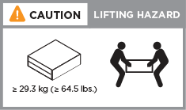

= Detaillierte Schritte - AFF A250
:allow-uri-read: 
:icons: font
:imagesdir: ../media/

[role="lead"]
Dieser Abschnitt enthält detaillierte Schritt-für-Schritt-Anweisungen zur Installation eines AFF A250-Systems.

== Schritt 1: Installation vorbereiten

Um Ihr AFF A250-System zu installieren, müssen Sie ein Konto erstellen und das System registrieren. Außerdem müssen Sie die entsprechende Anzahl und den entsprechenden Kabeltyp für Ihr System inventarisieren und bestimmte Netzwerkinformationen erfassen.

NOTE: Kunden mit besonderen Anforderungen an die Stromversorgung müssen die HWU bezüglich ihrer Konfigurationsoptionen prüfen.

.Bevor Sie beginnen
* Stellen Sie sicher, dass Sie Zugriff auf haben link:https://hwu.netapp.com["NetApp Hardware Universe"^] (HWU), um Informationen zu den Standortanforderungen zu erhalten.
* Stellen Sie sicher, dass Sie Zugriff auf haben link:http://mysupport.netapp.com/documentation/productlibrary/index.html?productID=62286["Versionshinweise zu Ihrer Version von ONTAP"^] Weitere Informationen zu diesem System.
* Folgendes müssen Sie an Ihrer Website angeben:
+
** Rack-Platz für das Storage-System
** Kreuzschlitzschraubendreher #2
** Zusätzliche Netzwerkkabel zum Anschließen des Systems an den Netzwerk-Switch und Laptop oder die Konsole über einen Webbrowser

.Schritte
. Packen Sie den Inhalt aller Boxen aus.
. Notieren Sie die Seriennummer des Systems von den Controllern.
+
image::../media/drw_ssn_label.png[Beispiel für die Seriennummer des Systems]

. Richten Sie Ihr Konto ein:
+
.. Melden Sie sich bei Ihrem bestehenden Konto an oder erstellen Sie ein Konto.
.. link:https://mysupport.netapp.com/eservice/registerSNoAction.do?moduleName=RegisterMyProduct["Registrieren"^] Ihrem System.

. Herunterladen und installieren link:https://mysupport.netapp.com/site/tools/tool-eula/activeiq-configadvisor["NetApp Downloads: Config Advisor"^] Auf Ihrem Laptop.
. Notieren Sie sich die Anzahl und die Kabeltypen, die Sie erhalten haben.
+
In der folgenden Tabelle sind die Kabeltypen aufgeführt, die Sie möglicherweise erhalten können. Wenn Sie ein Kabel erhalten, das nicht in der Tabelle aufgeführt ist, lesen Sie die link:https://hwu.netapp.com["NetApp Hardware Universe"^] Um das Kabel zu lokalisieren und dessen Verwendung zu identifizieren.

+
[cols="1,2,1,2"]
|===
| Kabeltyp... | Teilenummer und Länge | Steckverbindertyp | Für... .2+ 

 a| 
25-GbE-Kabel
 a| 
X66240A-05 (112-00595), 0,5 m;

X66240-2 (112-00573), 2 m, 3+
 a| 
image:../media/oie_cable100_gbe_qsfp28.png["100-GbE-QSFP28-Anschluss"]
 a| 
Cluster Interconnect-Netzwerk

 a| 
X66240A-2 (112-00598), 2 m;

X66240A-5 (112-00600), 5 m
 a| 
Daten
 a| 
100-GbE-Kabel
 a| 
X6211-2 (112-00574), 2 m;

X6211-5 (112-00576), 5 m

 a| 
Storage
 a| 
RJ-45 (je nach Bestellung)
 a| 
Keine Angabe
 a| 
image:../media/oie_cable_rj45.png["RJ-45-Kabelanschluss"]

 a| 
Managementnetzwerk (BMC und Port mit Schraubenschlüssel) und Ethernet-Daten (e0a und e0b)
 a| 
Fibre Channel
 a| 
X66250-2 (112-00342) 2 m;

X66250-5 (112-00344) 5 m;

X66250-15 (112-00346) 15m;

X66250-30 (112-00347) 30 m
 a| 
image:../media/oie_cable_fc_optical.png["OIE Glasfaserkabel für Fibre Channel"]

 a| 
 a| 
Micro-USB-Konsolenkabel
 a| 
Keine Angabe
 a| 
image:../media/oie_cable_micro_usb.png["Micro-USB-Anschluss"]

 a| 
Konsolenverbindung während der Software-Einrichtung
 a| 
Stromkabel
 a| 
Keine Angabe
 a| 
image:../media/oie_cable_power.png["Stromkabel"]

|===
. Überprüfen Sie die link:https://library.netapp.com/ecm/ecm_download_file/ECMLP2862613["ONTAP Konfigurationsleitfaden"^] Und sammeln Sie die in diesem Handbuch aufgeführten erforderlichen Informationen.

== Schritt 2: Installieren Sie die Hardware

Sie müssen das System je nach Bedarf in einem 4-Säulen-Rack oder NetApp Systemschrank installieren.

.Schritte
. Installieren Sie die Schienensatz nach Bedarf.
. Installieren und sichern Sie das System anhand der im Schienensatz enthaltenen Anweisungen.
+

NOTE: Sie müssen sich der Sicherheitsbedenken im Zusammenhang mit dem Gewicht des Systems bewusst sein.

+

. Identifizieren und verwalten Sie Kabel, da dieses System über kein Kabelverwaltungs-Gerät verfügt.
. Bringen Sie die Blende auf die Vorderseite des Systems an.

== Schritt 3: Controller mit Cluster verkabeln

Verkabeln Sie die Controller mit der Cluster-Methode ohne Switch mit zwei Nodes oder mit der Cluster Interconnect-Netzwerkmethode.

[role="tabbed-block"]
====
.Option 1: Cluster mit zwei Nodes ohne Switches
--
Die Management-, Fibre Channel- und Daten- oder Host-Netzwerk-Ports der Controller-Module sind mit Switches verbunden. Die Cluster Interconnect-Ports sind an beiden Controller-Modulen verkabelt.

.Bevor Sie beginnen
* Wenden Sie sich an den Netzwerkadministrator, um Informationen zum Anschließen des Systems an die Switches zu erhalten.
* Prüfen Sie unbedingt den Abbildungspfeil, um die richtige Ausrichtung des Kabelanschlusses zu prüfen.
+
image::../media/oie_cable_pull_tab_down.png[Kabelanschluss mit Zuglasche unten]

+

NOTE: Wenn Sie den Anschluss einsetzen, sollten Sie das Gefühl haben, dass er einrasten kann. Wenn Sie nicht das Gefühl haben, dass er klickt, entfernen Sie ihn, drehen Sie ihn um und versuchen Sie es erneut.

.Über diese Aufgabe
Verwenden Sie die Animation oder die tabellarischen Schritte, um die Verkabelung zwischen den Controllern und den Switches abzuschließen. Führen Sie die Schritte an jedem Controller aus.

.Animation - zwei-Node-Cluster ohne Switch verkabeln
video::beec3966-0a01-473c-a5de-ac68017fbf29[panopto]
.Schritte
. Verwenden Sie das 25-GbE-Cluster-Interconnect-Kabel, um die Cluster-Interconnect-Ports e0c mit e0c und e0d mit e0d zu verbinden.
+
image:../media/oie_cable_sfp_gbe_copper.png["GbE SFP Kupfer Connector"]:

+
image:../media/drw_affa250_tnsc_cabling.png["Cluster-Interconnect-Verkabelung in einem 2-Node-Cluster ohne Switches"]

. Die Port-Schraubenschlüssel-Ports mit den Managementnetzwerk-Switches mit den RJ45-Kabeln verkabeln.
+
image::../media/drw_affa250_mgmt_cabling.png[Verkabelung des Management-Ports]

IMPORTANT: Schließen Sie die Stromkabel AN dieser Stelle NICHT an.

--
.Option 2: Cluster mit Switch
--
Alle Ports auf den Controllern sind mit Switches verbunden; Cluster Interconnect, Management, Fibre Channel und Daten- oder Host-Netzwerk-Switches.

.Bevor Sie beginnen
* Wenden Sie sich an den Netzwerkadministrator, um Informationen zum Anschließen des Systems an die Switches zu erhalten.
* Prüfen Sie unbedingt den Abbildungspfeil, um die richtige Ausrichtung des Kabelanschlusses zu prüfen.
+
image::../media/oie_cable_pull_tab_down.png[Kabelanschluss mit Zuglasche unten]

+

NOTE: Wenn Sie den Anschluss einsetzen, sollten Sie das Gefühl haben, dass er einrasten kann. Wenn Sie nicht das Gefühl haben, dass er klickt, entfernen Sie ihn, drehen Sie ihn um und versuchen Sie es erneut.

.Über diese Aufgabe
Verwenden Sie die Animation oder die Schritte, um die Verkabelung zwischen den Controllern und den Switches abzuschließen. Führen Sie die Schritte an jedem Controller aus.

.Animation - Cluster mit Kabelverschaltung
video::bf6759dc-4cbf-488e-982e-ac68017fbef8[panopto]
.Schritte
. Verkabeln Sie die Cluster Interconnect Ports e0c und e0d mit den 25-GbE-Cluster Interconnect-Switches.
+
image:../media/drw_affa250_switched_clust_cabling.png["Cluster-Interconnect-Verkabelung"]

. Die Port-Schraubenschlüssel-Ports mit den Managementnetzwerk-Switches mit den RJ45-Kabeln verkabeln.
+
image::../media/drw_affa250_mgmt_cabling.png[Verkabelung des Management-Ports]

--
====

== Schritt 4: Kabel zum Host-Netzwerk oder Speicher (optional)

Sie verfügen über eine konfigurationsabhängige optionale Verkabelung mit den Fibre Channel- oder iSCSI-Hostnetzwerken oder dem Direct-Attached Storage. Diese Verkabelung ist nicht exklusiv; Sie können die Verkabelung zu einem Host-Netzwerk und Speicher haben.

NOTE: link:https://hwu.netapp.com["NetApp Hardware Universe"^] Steckplatz-Priorität für Host-Netzwerkkarten (Fibre Channel oder 25 GbE) ist Steckplatz 2. Wenn Sie jedoch beide Karten haben, wird die Fibre Channel-Karte in Steckplatz 2 eingesetzt, und die 25GbE-Karte wird in Steckplatz 1 eingesetzt (wie in den Optionen unten gezeigt). Wenn Sie über ein externes Shelf verfügen, wird die Speicherkarte in Steckplatz 1 eingesetzt, der einzige unterstützte Steckplatz für Shelfs.

[role="tabbed-block"]
====
.Option 1: Kabel zum Fibre-Channel-Hostnetzwerk
--
Fibre Channel-Ports auf den Controllern sind mit Fibre Channel Host-Netzwerk-Switches verbunden.

.Bevor Sie beginnen
* Wenden Sie sich an den Netzwerkadministrator, um Informationen zum Anschließen des Systems an die Switches zu erhalten.
* Prüfen Sie unbedingt den Abbildungspfeil, um die richtige Ausrichtung des Kabelanschlusses zu prüfen.
+
image::../media/oie_cable_pull_tab_up.png[Kabelanschluss mit Zuglasche oben]

+

NOTE: Wenn Sie den Anschluss einsetzen, sollten Sie spüren, dass er einrastet. Wenn Sie nicht fühlen, dass er klickt, entfernen Sie ihn, drehen Sie ihn um und versuchen Sie es erneut.

.Über diese Aufgabe
Führen Sie den folgenden Schritt für jedes Controller-Modul durch.

.Schritte
. Verkabeln Sie die Ports 2a bis 2d mit den FC-Host-Switches.
+
image:../media/drw_affa250_fc_host_cabling.png["Fibre Channel-Hostverkabelung"]

--
.Option 2: Verkabelung zu 25 GbE Daten oder Host-Netzwerk
--
25-GbE-Ports auf den Controllern sind mit 25-GbE-Daten oder Host-Netzwerk-Switches verbunden.

.Bevor Sie beginnen
* Wenden Sie sich an den Netzwerkadministrator, um Informationen zum Anschließen des Systems an die Switches zu erhalten.
* Prüfen Sie unbedingt den Abbildungspfeil, um die richtige Ausrichtung des Kabelanschlusses zu prüfen.
+
image::../media/oie_cable_pull_tab_up.png[Kabelanschluss mit Zuglasche oben]

+

NOTE: Wenn Sie den Anschluss einsetzen, sollten Sie das Gefühl haben, dass er einrasten kann. Wenn Sie nicht das Gefühl haben, dass er klickt, entfernen Sie ihn, drehen Sie ihn um und versuchen Sie es erneut.

.Über diese Aufgabe
Führen Sie den folgenden Schritt für jedes Controller-Modul durch.

.Schritte
. Verkabeln Sie die Ports e4a über e4d mit den 10 GbE Host Netzwerk-Switches.
+
image:../media/drw_affa250_25gbe_host_cabling.png["25-GbE-Verkabelung"]

--
.Option 3: Controller zum einzelnen Festplatten-Shelf verkabeln
--
Verkabeln Sie jeden Controller mit den NSM-Modulen am NS224-Festplatten-Shelf.

.Bevor Sie beginnen
Prüfen Sie unbedingt den Abbildungspfeil, um die richtige Ausrichtung des Kabelanschlusses zu prüfen.

image::../media/oie_cable_pull_tab_up.png[Kabelanschluss mit Zuglasche oben]

NOTE: Wenn Sie den Anschluss einsetzen, sollten Sie das Gefühl haben, dass er einrasten kann. Wenn Sie nicht das Gefühl haben, dass er klickt, entfernen Sie ihn, drehen Sie ihn um und versuchen Sie es erneut.

.Über diese Aufgabe
Schließen Sie die Verkabelung zwischen den Controllern und dem einzelnen Shelf anhand der Animation oder der tabellarischen Schritte ab. Führen Sie die Schritte für jedes Controller-Modul aus.

.Animation - Verkabeln Sie die Controller mit einem einzigen NS224
video::3f92e625-a19c-4d10-9028-ac68017fbf57[panopto]
.Schritte
. Verbinden Sie Controller A mit dem Shelf.
+
image:../media/drw_affa250_1shelf_cabling_a.png["Controller 1-Verkabelung"]

. Verbinden Sie Controller B mit dem Shelf.
+
image:../media/drw_affa250_1shelf_cabling_b.png["Controller-2-Verkabelung"]

--
====

== Schritt 5: System-Setup abschließen

Führen Sie die Systemeinrichtung und -Konfiguration mithilfe der Cluster-Erkennung mit nur einer Verbindung zum Switch und Laptop durch, oder indem Sie direkt einen Controller im System verbinden und dann eine Verbindung zum Management-Switch herstellen.

NOTE: Informationen zum Herstellen einer kontinuierlichen Verbindung eines Controller-Konsolenports für die Fernverwaltung finden Sie im Knowledge-Base-Artikel. https://kb.netapp.com/on-prem/ontap/OHW/OHW-KBs/How_to_connect_an_ONTAP_controller_console_port_for_remote_management["Wie man einen ONTAP -Controller-Konsolenport für die Fernverwaltung anschließt"^]Die

[role="tabbed-block"]
====
.Option 1: Wenn die Netzwerkerkennung aktiviert ist
--
Wenn die Netzwerkerkennung auf Ihrem Laptop aktiviert ist, können Sie das System mit der automatischen Cluster-Erkennung einrichten und konfigurieren.

.Schritte
. Schließen Sie die Stromkabel an die Controller-Netzteile an, und schließen Sie sie dann an Stromquellen auf verschiedenen Stromkreisen an.
+
Das System beginnt zu booten. Das erste Booten kann bis zu acht Minuten dauern.

. Stellen Sie sicher, dass die Netzwerkerkennung auf Ihrem Laptop aktiviert ist.
+
Weitere Informationen finden Sie in der Online-Hilfe Ihres Notebooks.

. Schließen Sie Ihren Laptop mithilfe der Animation an den Management-Switch an:
+
.Animation - Verbinden Sie Ihren Laptop mit dem Management-Switch
video::d61f983e-f911-4b76-8b3a-ab1b0066909b[panopto]
. Wählen Sie ein ONTAP-Symbol aus, um es zu ermitteln:
+
image::../media/drw_autodiscovery_controler_select_ieops-1849.svg[Wählen Sie ein ONTAP-Symbol aus]

+
.. Öffnen Sie Den Datei-Explorer.
.. Klicken Sie im linken Fensterbereich auf *Netzwerk*, klicken Sie mit der rechten Maustaste und wählen Sie *Aktualisieren*.
.. Doppelklicken Sie auf das ONTAP-Symbol, und akzeptieren Sie alle auf dem Bildschirm angezeigten Zertifikate.
+

NOTE: XXXXX ist die Seriennummer des Systems für den Ziel-Node.

+
System Manager wird geöffnet.

. Konfigurieren Sie das System mithilfe von System Manager geführten Setups anhand der Daten, die Sie im erfasst haben link:https://library.netapp.com/ecm/ecm_download_file/ECMLP2862613["ONTAP Konfigurationsleitfaden"^].
. Überprüfen Sie den Systemzustand Ihres Systems, indem Sie Config Advisor ausführen.
. Nachdem Sie die Erstkonfiguration abgeschlossen haben, finden Sie unter https://docs.netapp.com/us-en/ontap/index.html["ONTAP 9-Dokumentation"^] Informationen zum Konfigurieren zusätzlicher Funktionen in ONTAP.

--
.Option 2: Wenn die Netzwerkerkennung nicht aktiviert ist
--
Wenn die Netzwerkerkennung auf Ihrem Laptop nicht aktiviert ist, müssen Sie die Konfiguration und das Setup mit dieser Aufgabe abschließen.

.Schritte
. Laptop oder Konsole verkabeln und konfigurieren:
+
.. Stellen Sie den Konsolenport des Laptops oder der Konsole auf 115,200 Baud mit N-8-1 ein.
+

NOTE: Informationen zur Konfiguration des Konsolenport finden Sie in der Online-Hilfe Ihres Laptops oder der Konsole.

.. Verbinden Sie den Laptop oder die Konsole mit dem Switch im Management-Subnetz.
+
image::../media/drw_console_client_mgmt_subnet_affa250.png[Verbindung mit dem Management-Subnetz wird hergestellt]

.. Weisen Sie dem Laptop oder der Konsole eine TCP/IP-Adresse zu. Verwenden Sie dabei eine Adresse, die sich im Management-Subnetz befindet.

. Schließen Sie die Stromkabel an die Controller-Netzteile an, und schließen Sie sie dann an Stromquellen auf verschiedenen Stromkreisen an.
+
Das System beginnt zu booten. Das erste Booten kann bis zu acht Minuten dauern.

. Weisen Sie einem der Nodes eine erste Node-Management-IP-Adresse zu.
+
[cols="1,2"]
|===
| Wenn das Managementnetzwerk DHCP enthält... | Dann... 

 a| 
Konfiguriert
 a| 
Notieren Sie die IP-Adresse, die den neuen Controllern zugewiesen ist.

 a| 
Nicht konfiguriert
 a| 
.. Öffnen Sie eine Konsolensitzung mit PuTTY, einem Terminalserver oder dem entsprechenden Betrag für Ihre Umgebung.
+

NOTE: Überprüfen Sie die Online-Hilfe Ihres Laptops oder Ihrer Konsole, wenn Sie nicht wissen, wie PuTTY konfiguriert werden soll.

.. Geben Sie die Management-IP-Adresse ein, wenn Sie dazu aufgefordert werden.

|===
. Konfigurieren Sie das Cluster unter System Manager auf Ihrem Laptop oder Ihrer Konsole:
+
.. Rufen Sie die Node-Management-IP-Adresse im Browser auf.
+

NOTE: Das Format für die Adresse ist +https://x.x.x.x+.

.. Konfigurieren Sie das System anhand der Daten, die Sie im erfasst haben link:https://library.netapp.com/ecm/ecm_download_file/ECMLP2862613["ONTAP Konfigurationsleitfaden"^].

. Überprüfen Sie den Systemzustand Ihres Systems, indem Sie Config Advisor ausführen.
. Nachdem Sie die Erstkonfiguration abgeschlossen haben, finden Sie unter https://docs.netapp.com/us-en/ontap/index.html["ONTAP 9-Dokumentation"^] Informationen zum Konfigurieren zusätzlicher Funktionen in ONTAP.

--
====