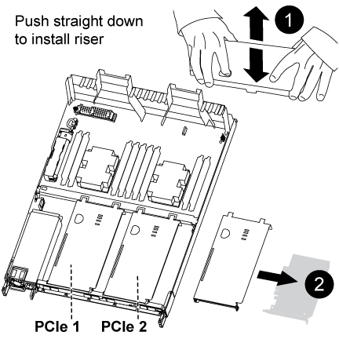

= Ersetzen Sie die Hardware des Controller-Moduls – AFF A320
:allow-uri-read: 
:icons: font
:imagesdir: ../media/

[role="lead"]
Um die Hardware des Controller-Moduls zu ersetzen, müssen Sie den beeinträchtigten Controller entfernen, die FRU-Komponenten in das Ersatzcontrollermodul verschieben, das Ersatzcontrollermodul im Gehäuse installieren und das System dann in den Wartungsmodus booten.

== Schritt 1: Entfernen Sie das Controller-Modul

Um auf Komponenten im Controller-Modul zuzugreifen, müssen Sie das Controller-Modul aus dem Gehäuse entfernen.

Sie können die folgenden Bilder oder die geschriebenen Schritte verwenden, um das Controller-Modul aus dem Gehäuse zu entfernen.

Das folgende Bild zeigt das Entfernen der Kabel und Kabelführungsarme aus dem Modul für beeinträchtigte Controller:

image::../media/drw_a320_controller_cable_unplug_animated_gif.png[Entfernen des Kabelverwaltungsgeräts]

Das folgende Bild zeigt das Entfernen des beeinträchtigten Controller-Moduls aus dem Gehäuse:

image::../media/drw_a320_controller_remove_animated_gif.png[Entfernen des Controllers]

. Wenn Sie nicht bereits geerdet sind, sollten Sie sich richtig Erden.
. Trennen Sie das Netzteil des Controller-Moduls von der Stromversorgung.
. Lösen Sie den Haken- und Schlaufenriemen, mit dem die Kabel am Kabelführungsgerät befestigt sind, und ziehen Sie dann die Systemkabel und SFPs (falls erforderlich) vom Controller-Modul ab, um zu verfolgen, wo die Kabel angeschlossen waren.
+
Lassen Sie die Kabel im Kabelverwaltungs-Gerät so, dass bei der Neuinstallation des Kabelverwaltungsgeräts die Kabel organisiert sind.

. Entfernen Sie die Kabelführungsgeräte von der linken und rechten Seite des Controller-Moduls und stellen Sie sie zur Seite.
. Entfernen Sie das Controller-Modul aus dem Chassis:
+
.. Setzen Sie den Zeigefinger in den Verriegelungsmechanismus auf beiden Seiten des Controller-Moduls ein.
.. Drücken Sie auf die orangefarbene Lasche oben am Verriegelungsmechanismus nach unten, bis der Rastbolzen am Gehäuse entfernt wird.
+
Der Haken des Verriegelungsmechanismus sollte fast senkrecht sein und sich vom Chassispindel frei sein.

.. Ziehen Sie das Controller-Modul vorsichtig einige Zentimeter zu Ihnen, damit Sie die Seiten des Controller-Moduls erfassen können.
.. Ziehen Sie das Controller-Modul vorsichtig mit beiden Händen aus dem Gehäuse und legen Sie es auf eine flache, stabile Oberfläche.

== Schritt 2: Bewegen Sie die Netzteile

Wenn Sie ein Controller-Modul ersetzen, müssen Sie das Netzteil vom beeinträchtigten Controller-Modul in das Ersatzcontrollermodul verschieben.

. Drehen Sie den Nockengriff so, dass er zum Herausziehen der Stromversorgung aus dem Controller-Modul verwendet werden kann, während Sie auf die blaue Verriegelungslasche drücken.
+

CAUTION: Das Netzteil ist kurz. Verwenden Sie immer zwei Hände, um sie zu unterstützen, wenn Sie sie aus dem Controller-Modul entfernen, damit es nicht plötzlich aus dem Controller-Modul schwingen und Sie verletzen.

. Stellen Sie das Netzteil auf das neue Controller-Modul, und installieren Sie es.
. Halten und richten Sie die Kanten des Netzteils mit beiden Händen an der Öffnung im Controller-Modul aus, und drücken Sie dann vorsichtig das Netzteil in das Controller-Modul, bis die Verriegelungslasche einrastet.
+
Die Netzteile werden nur ordnungsgemäß mit dem internen Anschluss in Kontakt treten und auf eine Weise verriegeln.

+

NOTE: Um Schäden am internen Stecker zu vermeiden, sollten Sie beim Einschieben der Stromversorgung in das System keine übermäßige Kraft verwenden.

== Schritt 3: Bewegen Sie den NVDIMM-Akku

Um den NVDIMM-Akku vom Controller-Modul mit eingeschränkter Betriebsdauer auf das Ersatzcontrollermodul zu verschieben, müssen Sie eine bestimmte Sequenz von Schritten durchführen.

Sie können die folgende Abbildung oder die geschriebenen Schritte verwenden, um den NVDIMM-Akku vom beeinträchtigten Controller-Modul in das Ersatzcontrollermodul zu verschieben.

image::../media/drw_a320_nvbat_move_animated_gif.png[Die NV-Batterie bewegen]

. Suchen Sie den NVDIMM-Akku im Controller-Modul.
. Suchen Sie den Batteriestecker, und drücken Sie den Clip auf der Vorderseite des Batteriesteckers, um den Stecker aus der Steckdose zu lösen, und ziehen Sie dann das Akkukabel aus der Steckdose.
. Fassen Sie den Akku an, und drücken Sie die blaue Verriegelungslasche, die mit DRUCKTASTE gekennzeichnet ist, und heben Sie den Akku aus dem Halter und dem Controller-Modul heraus.
. Bringen Sie den Akku in das Ersatzcontrollermodul.
. Richten Sie das Batteriemodul an der Öffnung für den Akku aus, und schieben Sie den Akku vorsichtig in den Steckplatz, bis er einrastet.
+

NOTE: Schließen Sie das Akkukabel erst dann wieder an die Hauptplatine an, wenn Sie dazu aufgefordert werden.

== Schritt 4: Verschieben Sie die Startmedien

Sie müssen das Startmedium ausfindig machen und dann die Anweisungen befolgen, um es aus dem beeinträchtigten Controller-Modul zu entfernen und in das Ersatzcontrollermodul einzufügen.

Sie können die folgende Abbildung oder die schriftlichen Schritte verwenden, um die Startmedien vom beeinträchtigten Controller-Modul in das Ersatzcontrollermodul zu verschieben.

image::../media/drw_a320_boot_media_move_animated_gif.png[Verschieben Sie das Startmedium]

. Öffnen Sie den Luftkanal, und suchen Sie das Boot-Medium mithilfe der folgenden Abbildung oder der FRU-Zuordnung auf dem Controller-Modul:
. Suchen und entfernen Sie die Startmedien aus dem Controller-Modul:
+
.. Drücken Sie die blaue Taste am Ende des Startmediums, bis der Lip auf dem Boot-Medium die blaue Taste löscht.
.. Drehen Sie das Startmedium nach oben, und ziehen Sie das Startmedium vorsichtig aus dem Sockel.

. Bewegen Sie die Startmedien auf das neue Controller-Modul, richten Sie die Kanten des Startmediums am Buchsengehäuse aus, und schieben Sie sie dann vorsichtig in die Buchse.
. Überprüfen Sie die Startmedien, um sicherzustellen, dass sie ganz und ganz in der Steckdose sitzt.
+
Entfernen Sie gegebenenfalls die Startmedien, und setzen Sie sie wieder in den Sockel ein.

. Sperren Sie das Boot-Medium:
+
.. Drehen Sie das Startmedium nach unten zur Hauptplatine.
.. Platzieren Sie einen Finger am Ende des Startmediums mit der blauen Taste und drücken Sie das Bootmedium-Ende nach unten, um die blaue Verriegelungstaste zu berühren.
.. Heben Sie beim Drücken auf die Startmedien die blaue Verriegelungstaste an, um die Boot-Medien zu verriegeln.

== Schritt 5: Verschieben Sie die DIMMs

Sie müssen die DIMMs ausfindig machen und sie dann vom beeinträchtigten Controllermodul in das Ersatzcontrollermodul verschieben.

Sie müssen das neue Controller-Modul bereit haben, damit Sie die DIMMs direkt vom beeinträchtigten Controller-Modul auf die entsprechenden Steckplätze im Ersatzcontroller-Modul verschieben können.

Mithilfe der folgenden Abbildungen oder der schriftlichen Schritte können Sie die DIMMs vom beeinträchtigten Controller-Modul in das Ersatzcontrollermodul verschieben.

image::../media/drw_a320_dimm_move_animated_gif.png[Verschieben Sie eine DIMM-Animation]

. Suchen Sie die DIMMs auf dem Controller-Modul.
+
image::../media/drw_a320_dimm_map.png[DIMM-Karte]

+
|===

 a| 
image:../media/legend_icon_01.png["Legende Nummer 1"]
| Luftkanal 

 a| 
image:../media/legend_icon_02.png["Legende Nummer 2"]
 a| 
** System-DIMMs-Steckplätze: 2,4, 7, 9, 13, 15 18 und 20
** NVDIMM-Steckplatz: 11
+

NOTE: NVDIMM sieht deutlich anders aus als System-DIMMs.

|===
. Beachten Sie die Ausrichtung des DIMM-Moduls in den Sockel, damit Sie das DIMM-Modul in die richtige Ausrichtung einsetzen können.
. Vergewissern Sie sich, dass die NVDIMM-Batterie nicht an das neue Controller-Modul angeschlossen ist.
. Verschieben Sie die DIMMs vom Controller mit eingeschränkter Bedieneinheit auf das Ersatzcontrollermodul:
+

NOTE: Stellen Sie sicher, dass Sie jedes DIMM in demselben Steckplatz einsetzen, in dem es im beeinträchtigten Controller-Modul belegt ist.

+
.. Werfen Sie das DIMM aus dem Steckplatz, indem Sie die DIMM-Auswerfer auf beiden Seiten des DIMM langsam auseinander drücken und dann das DIMM aus dem Steckplatz schieben.
+

NOTE: Halten Sie das DIMM vorsichtig an den Rändern, um Druck auf die Komponenten auf der DIMM-Leiterplatte zu vermeiden.

.. Suchen Sie den entsprechenden DIMM-Steckplatz am Ersatzcontroller-Modul.
.. Vergewissern Sie sich, dass sich die DIMM-Auswurfklammern am DIMM-Sockel in der geöffneten Position befinden, und setzen Sie das DIMM-Auswerfer anschließend in den Sockel ein.
+
Die DIMMs passen eng in die Steckdose, sollten aber leicht einpassen. Falls nicht, richten Sie das DIMM-Modul mit dem Sockel aus und setzen Sie es wieder ein.

.. Prüfen Sie das DIMM visuell, um sicherzustellen, dass es gleichmäßig ausgerichtet und vollständig in den Sockel eingesetzt ist.
.. Wiederholen Sie diese Teilschritte für die übrigen DIMMs.

. Schließen Sie den NVDIMM-Akku an die Hauptplatine an.
+
Vergewissern Sie sich, dass der Stecker am Controller-Modul abhält.

== Schritt 6: Verschieben Sie die PCIe Riser

Sie müssen die PCIe-Riser, bei denen die PCIe-Karten installiert sind, vom beeinträchtigten Controller-Modul auf das Ersatzcontrollermodul verschieben.

Sie können die PCIe-Risers mithilfe der folgenden Abbildung oder der geschriebenen Schritte vom beeinträchtigten Controller-Modul auf das Ersatzcontrollermodul verschieben.

. Entfernen Sie die Abdeckung über den PCIe-Riserern, indem Sie die blaue Rändelschraube auf der Abdeckung lösen, die Abdeckung zu Ihnen schieben, die Abdeckung nach oben drehen, sie vom Controller-Modul anheben und dann beiseite stellen.
. Entfernen Sie die leeren Riser aus dem Ersatzcontrollermodul.
+
.. Setzen Sie den Zeigefinger in die Öffnung auf der linken Seite des Steigmoduls und fassen Sie den Riser mit Ihrem Daumen an.
.. Heben Sie die Steigleitung gerade nach oben und aus der Bucht, und legen Sie sie dann beiseite.
.. Wiederholen Sie diese Unterschritte für den zweiten Riser.

. Verschieben Sie die PCIe-Risers vom Controller-Modul mit eingeschränkter Steuereinheit in die gleichen Riser-Schächte des Ersatzcontrollermoduls:
+
.. Entfernen Sie einen Riser aus dem beeinträchtigten Controller-Modul und verschieben Sie ihn zum Ersatzcontrollermodul.
.. Senken Sie den Riser gerade in den Schacht, so dass er quadratisch mit dem Schacht ist und die Stifte des Riser in die Führungslöcher auf der Rückseite des Schacht gleiten.
.. Setzen Sie den Riser gerade in den Sockel des Motherboards ein, indem Sie an den Rändern des Riser sogar nach unten Druck ausüben, bis er sitzt.
+
Der Riser sollte glatt und mit wenig Widerstand sitzen. Setzen Sie den Riseraufnehmer wieder in den Schacht ein, wenn der Riseraufnehmer mit einem erheblichen Widerstand in den Sockel eingesetzt wird.

.. Wiederholen Sie diese Unterschritte für den zweiten Riser.
.. Setzen Sie die Abdeckung wieder über die PCIe Riser ein.

== Schritt 7: Installieren Sie das Controller-Modul

Nachdem alle Komponenten vom beeinträchtigten Controller-Modul in das Ersatzcontrollermodul verschoben wurden, müssen Sie das Ersatzcontrollermodul in das Gehäuse installieren und es dann in den Wartungsmodus booten.

Sie können die folgende Abbildung oder die geschriebenen Schritte zur Installation des Ersatzcontrollermoduls im Gehäuse verwenden.

image::../media/drw_a320_controller_install_animated_gif.png[Installieren des Controllers]

. Wenn Sie dies noch nicht getan haben, schließen Sie den Luftkanal auf der Rückseite des Controller-Moduls und setzen Sie die Abdeckung wieder über die PCIe-Karten ein.
. Richten Sie das Ende des Controller-Moduls an der Öffnung im Gehäuse aus, und drücken Sie dann vorsichtig das Controller-Modul zur Hälfte in das System.
+

NOTE: Setzen Sie das Controller-Modul erst dann vollständig in das Chassis ein, wenn Sie dazu aufgefordert werden.

. Verkabeln Sie nur die Management- und Konsolen-Ports, sodass Sie auf das System zugreifen können, um die Aufgaben in den folgenden Abschnitten auszuführen.
+

NOTE: Sie schließen die übrigen Kabel später in diesem Verfahren an das Controller-Modul an.

. Führen Sie die Neuinstallation des Controller-Moduls durch:
+
.. Stellen Sie sicher, dass die Verriegelungsarme in der ausgestreckten Position verriegelt sind.
.. Drücken Sie das Controller-Modul mithilfe der Entriegelungshebel in den Chassis-Schacht, bis der Anschlag einrastet.
.. Drücken Sie die orangefarbenen Laschen oben am Verriegelungsmechanismus nach unten und halten Sie sie gedrückt.
.. Schieben Sie das Controller-Modul vorsichtig in den Gehäuseschacht, bis es bündig an den Kanten des Chassis liegt.
+

NOTE: Die Arms des Verriegelungsmechanismus lassen sich in das Gehäuse schieben.

+
Das Controller-Modul beginnt zu booten, sobald es vollständig im Gehäuse sitzt.

.. Lösen Sie die Verriegelungen, um das Controller-Modul einrasten zu lassen.
.. Stromversorgung wieder einschalten.
.. Wenn Sie dies noch nicht getan haben, installieren Sie das Kabelverwaltungsgerät neu.
.. Unterbrechen Sie den normalen Bootvorgang, indem Sie auf drücken `Ctrl-C`.

