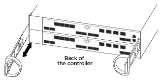
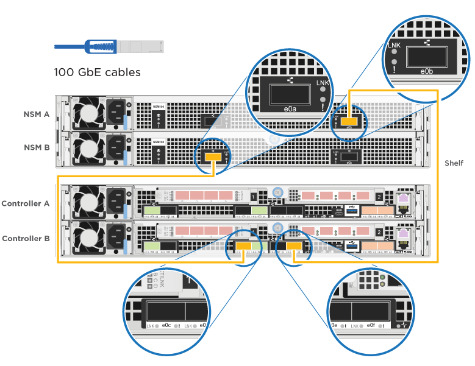

= Detaillierter Leitfaden – AFF A320
:allow-uri-read: 
:icons: font
:imagesdir: ../media/

[role="lead"]
Dieser Leitfaden enthält detaillierte Schritt-für-Schritt-Anleitungen zur Installation eines typischen NetApp Systems. In diesem Handbuch finden Sie weitere detaillierte Installationsanweisungen.

== Installation vorbereiten

Um Ihr AFF A320-System zu installieren, müssen Sie ein Konto erstellen, das System registrieren und Lizenzschlüssel abrufen. Außerdem müssen Sie die entsprechende Anzahl und den entsprechenden Kabeltyp für Ihr System inventarisieren und bestimmte Netzwerkinformationen erfassen.

Sie müssen Zugriff auf das Hardware Universe haben, um Informationen zu den Standortanforderungen sowie zusätzliche Informationen über Ihr konfiguriertes System zu erhalten. Möglicherweise möchten Sie auch Zugriff auf die Versionshinweise für Ihre Version von ONTAP haben, um weitere Informationen zu diesem System zu erhalten.

https://hwu.netapp.com["NetApp Hardware Universe"]

http://mysupport.netapp.com/documentation/productlibrary/index.html?productID=62286["Finden Sie die Versionshinweise für Ihre Version von ONTAP 9"]

Folgendes müssen Sie an Ihrer Website angeben:

* Rack-Platz für das Storage-System
* Kreuzschlitzschraubendreher #2
* Zusätzliche Netzwerkkabel zum Anschließen des Systems an den Netzwerk-Switch und Laptop oder die Konsole über einen Webbrowser
* Ein Laptop oder eine Konsole mit einer RJ-45-Verbindung und Zugriff auf einen Webbrowser
+
.. Packen Sie den Inhalt aller Boxen aus.
.. Notieren Sie die Seriennummer des Systems von den Controllern.
+
image::../media/drw_ssn_label.png[drw ssn-Etikett]

.. Richten Sie Ihr Konto ein:
+
... Melden Sie sich bei Ihrem bestehenden Konto an oder erstellen Sie ein Konto.
... Registrieren Sie das System.
+
https://mysupport.netapp.com/eservice/registerSNoAction.do?moduleName=RegisterMyProduct["NetApp Produktregistrierung"]

.. Notieren Sie sich die Anzahl und die Kabeltypen, die Sie erhalten haben.
+
In der folgenden Tabelle sind die Kabeltypen aufgeführt, die Sie möglicherweise erhalten können. Wenn Sie ein Kabel empfangen, das nicht in der Tabelle aufgeführt ist, finden Sie im Hardware Universe das Kabel und dessen Verwendung.

+
https://hwu.netapp.com["NetApp Hardware Universe"]

+
[cols="1,2,1,2"]
|===
| Kabeltyp... | Teilenummer und Länge | Steckverbindertyp | Für... 

 a| 
100-GbE-Kabel (QSF(28)
 a| 
X6211A-05 (112-00595), 0,5 m

X6211A-1 (112-00573), 1 m

X6211A-2 (112-00574), 2 m

X6211A-5 (112-00574), 5 m
 a| 
image:../media/oie_cable100_gbe_qsfp28.png[""]
 a| 
Storage-, Cluster Interconnect/HA- und Ethernet-Daten (abhängig von der Reihenfolge

 a| 
40-GbE-Kabel
 a| 
X6211A-1 (112-00573), 1 m;

X6211A-3 (112-00543), 3 m;

X6211A-5 (112-00576), 5 m
 a| 
image:../media/oie_cable_sfp_gbe_copper.png[""]
 a| 
Storage-, Cluster Interconnect/HA- und Ethernet-Daten (abhängig von der Reihenfolge

 a| 
Ethernet-Kabel – MPO
 a| 
X6200-2 (112-00326), 2 m

X66250-5 (112-00328), 5 m

X66250-30 (112-00331), 30 m
 a| 
image:../media/oie_cable_etherned_mpo.png[""]
 a| 
Ethernet-Kabel (je nach Reihenfolge)

 a| 
Optische Kabel
 a| 
SR:

X6553-R6 (112-00188), 2 m

X6554-R6 (112-00189), 15 m

X6537-R6 (112-00091), 30 m

LR:

X66250-3 (112-00342), 2 m

X6260-5 (112-00344), 5 m

X6260-30 (112-00354), 30 m
 a| 
image:../media/oie_cable_fiber_lc_connector.png[""]
 a| 
FC-Konfigurationen (je nach Reihenfolge)

 a| 
RJ-45 (je nach Bestellung)
 a| 
X6585-R6 (112-00291), 3 m

X6562-R6 (112-00196), 5 m
 a| 
image:../media/oie_cable_rj45.png[""]
 a| 
Managementnetzwerk

 a| 
Micro-USB-Konsolenkabel
 a| 
Keine Angabe
 a| 
image:../media/oie_cable_micro_usb.png[""]
 a| 
Verbindung über die Konsole, die während der Software-Einrichtung verwendet wird, wenn Laptop oder Konsole die Netzwerkerkennung nicht unterstützt.

 a| 
Stromkabel
 a| 
Keine Angabe
 a| 
image:../media/oie_cable_power.png[""]
 a| 
System einschalten

|===
.. Laden Sie das _Cluster-Konfigurationsarbeitsblatt_ herunter, und füllen Sie es aus.
+
https://library.netapp.com/ecm/ecm_download_file/ECMLP2839002["Cluster-Konfigurationsdokument"]

== Installieren Sie die Hardware

Sie müssen das System je nach Bedarf in einem 4-Säulen-Rack oder NetApp Systemschrank installieren.

. Installieren Sie die Schienensatz nach Bedarf.
. Installieren und sichern Sie das System anhand der im Schienensatz enthaltenen Anweisungen.
+

NOTE: Sie müssen sich der Sicherheitsbedenken im Zusammenhang mit dem Gewicht des Systems bewusst sein.

+
image::../media/drw_a320_weight_label.png[drw a320-Gewichtetikett]

. Schließen Sie Kabelmanagement-Geräte (wie abgebildet) an.
+

. Bringen Sie die Blende auf die Vorderseite des Systems an.

== Controller mit dem Netzwerk verkabeln

Sie können die Controller mithilfe der Switch-freien Cluster-Methode mit zwei Nodes oder des Cluster Interconnect-Netzwerks mit dem Netzwerk verkabeln.

=== Option 1: Verkabeln eines 2-Node-Clusters ohne Switches

Die optionalen Daten-Ports, optionalen NIC-Karten und Management-Ports der Controller-Module werden mit Switches verbunden. Die Cluster Interconnect/HA-Ports sind an beiden Controller-Modulen verkabelt.

Sie müssen sich an den Netzwerkadministrator wenden, um Informationen über das Anschließen des Systems an die Switches zu erhalten.

Prüfen Sie unbedingt den Abbildungspfeil, um die richtige Ausrichtung des Kabelanschlusses zu prüfen.

image::../media/oie_cable_pull_tab_up.png[ziehen Sie die Lasche des oie-Kabels nach oben]

NOTE: Wenn Sie den Anschluss einsetzen, sollten Sie das Gefühl haben, dass er einrasten kann. Wenn Sie nicht das Gefühl haben, dass er klickt, entfernen Sie ihn, drehen Sie ihn um und versuchen Sie es erneut.

. Sie können die Verkabelung zwischen den Controllern und den Switches mit der Abbildung oder Schritt-für-Schritt-Anleitung ausführen:
+
image::../media/drw_a320_tnsc_network_cabling_composite_animated_gif.png[drw a320 tnsc Netzwerkverkabelung animiert gif]

+
[cols="1,2"]
|===
| Schritt | Führen Sie die Ausführung an jedem Controller-Modul aus 

 a| 
image:../media/oie_legend_icon_1_lg.png[""]
 a| 
Cluster-/HA-Ports mit dem 100-GbE-Kabel (QSFP28) miteinander verkabeln:

** e0a an e0a
** e0d bis e0dimage:../media/drw_a320_tnsc_cluster_ha_connection_step1a.png[""]

 a| 
image:../media/oie_legend_icon_2_o.png[""]
 a| 
Wenn Sie Ihre integrierten Ports für eine Datennetzwerkverbindung verwenden, verbinden Sie die 100-GbE- oder 40-GbE-Kabel mit den entsprechenden Datennetzwerk-Switches:

** e0g und e0himage:../media/drw_a320_onboard_data_connection_step2.png[""]

 a| 
image:../media/oie_legend_icon_3_dr.png[""]
 a| 
Wenn Sie Ihre NIC-Karten für Ethernet- oder FC-Verbindungen verwenden, verbinden Sie die NIC-Karte(n) mit den entsprechenden Switches:

image::../media/drw_a320_nic_connections_step3.png[drw a320 nic-Verbindungen Schritt 3]

 a| 
image:../media/oie_legend_icon_4_lp.png[""]
 a| 
Verkabeln Sie die E0M-Ports mit den Management-Netzwerk-Switches mit den RJ45-Kabeln.

image:../media/drw_a320_management_port_connection_step4.png[""]

 a| 
image:../media/oie_legend_icon_attn_symbol.png[""]
 a| 
Schließen Sie die Stromkabel AN dieser Stelle NICHT an.

|===
. Verkabeln Sie Ihren Speicher: <<Controller mit Laufwerk-Shelfs verkabeln>>

=== Option 2: Verkabelung eines Switch Clusters

Die optionalen Daten-Ports, optionalen NIC-Karten und Management-Ports der Controller-Module werden mit Switches verbunden. Die Cluster Interconnect/HA-Ports sind mit dem Cluster/HA-Switch verbunden.

Sie müssen sich an den Netzwerkadministrator wenden, um Informationen über das Anschließen des Systems an die Switches zu erhalten.

Prüfen Sie unbedingt den Abbildungspfeil, um die richtige Ausrichtung des Kabelanschlusses zu prüfen.

image::../media/oie_cable_pull_tab_up.png[ziehen Sie die Lasche des oie-Kabels nach oben]

NOTE: Wenn Sie den Anschluss einsetzen, sollten Sie das Gefühl haben, dass er einrasten kann. Wenn Sie nicht das Gefühl haben, dass er klickt, entfernen Sie ihn, drehen Sie ihn um und versuchen Sie es erneut.

. Sie können die Verkabelung zwischen den Controllern und den Switches mit der Abbildung oder Schritt-für-Schritt-Anleitung ausführen:
+
image::../media/drw_a320_switched_network_cabling_composite_animated_GIF.png[drw a320-geschaltete Netzwerkverkabelung, animierte GIF]

+
[cols="1,3"]
|===
| Schritt | Führen Sie die Ausführung an jedem Controller-Modul aus 

 a| 
image:../media/oie_legend_icon_1_lg.png[""]
 a| 
Cluster-/HA-Ports mit dem Cluster/HA-Switch mit dem 100-GbE-Kabel (QSFP28) verkabeln:

** e0a auf beide Controller zum Cluster/HA-Switch
** e0d an beiden Controllern zum Cluster/HA-Switchimage:../media/drw_a320_switched_cluster_ha_connection_step1b.png[""]

 a| 
image:../media/oie_legend_icon_2_o.png[""]
 a| 
Wenn Sie Ihre integrierten Ports für eine Datennetzwerkverbindung verwenden, verbinden Sie die 100-GbE- oder 40-GbE-Kabel mit den entsprechenden Datennetzwerk-Switches:

** e0g und e0himage:../media/drw_a320_onboard_data_connection_step2.png[""]

 a| 
image:../media/oie_legend_icon_3_dr.png[""]
 a| 
Wenn Sie Ihre NIC-Karten für Ethernet- oder FC-Verbindungen verwenden, verbinden Sie die NIC-Karte(n) mit den entsprechenden Switches:

image::../media/drw_a320_nic_connections_step3.png[drw a320 nic-Verbindungen Schritt 3]

 a| 
image:../media/oie_legend_icon_4_lp.png[""]
 a| 
Verkabeln Sie die E0M-Ports mit den Management-Netzwerk-Switches mit den RJ45-Kabeln.

image:../media/drw_a320_management_port_connection_step4.png[""]

 a| 
image:../media/oie_legend_icon_attn_symbol.png[""]
 a| 
Schließen Sie die Stromkabel AN dieser Stelle NICHT an.

|===
. Verkabeln Sie Ihren Speicher: <<Controller mit Laufwerk-Shelfs verkabeln>>

== Controller mit Laufwerk-Shelfs verkabeln

Sie müssen die Controller mithilfe der integrierten Storage-Ports mit den Shelfs verkabeln.

=== Option 1: Controller mit einem einzelnen Festplatten-Shelf verkabeln

Sie müssen jeden Controller mit den NSM-Modulen am NS224-Laufwerk-Shelf verkabeln.

Prüfen Sie unbedingt den Abbildungspfeil, um die richtige Ausrichtung des Kabelanschlusses zu prüfen.

image::../media/oie_cable_pull_tab_up.png[ziehen Sie die Lasche des oie-Kabels nach oben]

NOTE: Wenn Sie den Anschluss einsetzen, sollten Sie das Gefühl haben, dass er einrasten kann. Wenn Sie nicht das Gefühl haben, dass er klickt, entfernen Sie ihn, drehen Sie ihn um und versuchen Sie es erneut.

. Sie können die Abbildung oder die Schritt-für-Schritt-Anleitung verwenden, um Ihre Controller mit einem einzigen Shelf zu verkabeln.
+
image::../media/drw_a320_single_shelf_connections_animated_gif.png[drw a320 EinzelShelf-Verbindungen animiert gif]

+
[cols="1,3"]
|===
| Schritt | Führen Sie die Ausführung an jedem Controller-Modul aus 

 a| 
image:../media/oie_legend_icon_1_mb.png[""]
 a| 
Controller A mit dem Shelf verkabeln image:../media/drw_a320_storage_cabling_controller_a_single_shelf.png[""]

 a| 
image:../media/oie_legend_icon_2_lo.png[""]
 a| 
Controller B am Shelf verkabeln: 

|===
. Informationen zum Abschließen der Einrichtung des Systems finden Sie unter <<Führen Sie die Einrichtung und Konfiguration des Systems durch>>

=== Option 2: Controller mit zwei Festplatten-Shelfs verkabeln

Sie müssen jeden Controller an beiden NS224 Laufwerk-Shelfs mit den NSM-Modulen verkabeln.

Prüfen Sie unbedingt den Abbildungspfeil, um die richtige Ausrichtung des Kabelanschlusses zu prüfen.

image::../media/oie_cable_pull_tab_up.png[ziehen Sie die Lasche des oie-Kabels nach oben]

NOTE: Wenn Sie den Anschluss einsetzen, sollten Sie das Gefühl haben, dass er einrasten kann. Wenn Sie nicht das Gefühl haben, dass er klickt, entfernen Sie ihn, drehen Sie ihn um und versuchen Sie es erneut.

. Sie können die folgende Abbildung bzw. die geschriebenen Schritte verwenden, um die Controller mit zwei Laufwerk-Shelfs zu verkabeln.
+
image::../media/drw_a320_2_shevles_cabling_animated_gif.png[drw a320 2-Schalen-Kabel animiert gif]

+
[cols="1-3"]
|===
| Schritt | Führen Sie die Ausführung an jedem Controller-Modul aus 

 a| 
image:../media/oie_legend_icon_1_mb.png[""]
 a| 
Verbinden Sie Controller A mit den Shelfs: image:../media/drw_a320_2_shelves_cabling_controller_a.png[""]

 a| 
image:../media/oie_legend_icon_2_lo.png[""]
 a| 
Controller B mit den Shelfs verkabeln: image:../media/drw_a320_2_shelves_cabling_controller_b.png[""]

|===
. Informationen zum Abschließen der Einrichtung des Systems finden Sie unter <<Führen Sie die Einrichtung und Konfiguration des Systems durch>>

== Führen Sie die Einrichtung und Konfiguration des Systems durch

Die Einrichtung und Konfiguration des Systems kann mithilfe der Cluster-Erkennung nur mit einer Verbindung zum Switch und Laptop abgeschlossen werden. Sie können auch direkt eine Verbindung zu einem Controller im System herstellen und dann eine Verbindung zum Management Switch herstellen.

=== Option 1: Abschluss der Systemeinrichtung und -Konfiguration bei aktivierter Netzwerkerkennung

Wenn die Netzwerkerkennung auf Ihrem Laptop aktiviert ist, können Sie das System mit der automatischen Cluster-Erkennung einrichten und konfigurieren.

. Schließen Sie die Stromkabel an die Controller-Netzteile an, und schließen Sie sie dann an Stromquellen auf verschiedenen Stromkreisen an.
+
Das System beginnt zu booten. Das erste Booten kann bis zu acht Minuten dauern

. Stellen Sie sicher, dass die Netzwerkerkennung auf Ihrem Laptop aktiviert ist.
+
Weitere Informationen finden Sie in der Online-Hilfe Ihres Notebooks.

. Schließen Sie Ihren Laptop mithilfe der folgenden Animation an den Management-Switch an.
+
.Animation - Verbinden Sie Ihren Laptop mit dem Management-Switch
video::d61f983e-f911-4b76-8b3a-ab1b0066909b[panopto]
. Wählen Sie ein ONTAP-Symbol aus, um es zu ermitteln:
+
image::../media/drw_autodiscovery_controler_select.png[wählen sie den drw-Kontroller für die automatische Ermittlung aus]

+
.. Öffnen Sie Den Datei-Explorer.
.. Klicken Sie im linken Bereich auf Netzwerk.
.. Mit der rechten Maustaste klicken und Aktualisieren auswählen.
.. Doppelklicken Sie auf das ONTAP-Symbol, und akzeptieren Sie alle auf dem Bildschirm angezeigten Zertifikate.
+

NOTE: XXXXX ist die Seriennummer des Systems für den Ziel-Node.

+
System Manager wird geöffnet.

. Mit der systemgesteuerten Einrichtung konfigurieren Sie das System anhand der im _NetApp ONTAP Configuration Guide_ erfassten Daten.
+
https://library.netapp.com/ecm/ecm_download_file/ECMLP2862613["ONTAP Konfigurationsleitfaden"]

. Überprüfen Sie den Systemzustand Ihres Systems, indem Sie Config Advisor ausführen.
. Wechseln Sie nach Abschluss der Erstkonfiguration mit dem https://www.netapp.com/data-management/oncommand-system-documentation/["ONTAP  ONTAP System Manager; Dokumentationsressourcen"] Seite für Informationen über das Konfigurieren zusätzlicher Funktionen in ONTAP.

=== Option 2: Abschluss der Systemeinrichtung und -Konfiguration, falls die Netzwerkerkennung nicht aktiviert ist

Wenn die Netzwerkerkennung auf Ihrem Laptop nicht aktiviert ist, müssen Sie die Konfiguration und das Setup mit dieser Aufgabe abschließen.

. Laptop oder Konsole verkabeln und konfigurieren:
+
.. Stellen Sie den Konsolenport des Laptops oder der Konsole auf 115,200 Baud mit N-8-1 ein.
+

NOTE: Informationen zur Konfiguration des Konsolenport finden Sie in der Online-Hilfe Ihres Laptops oder der Konsole.

.. Schließen Sie das Konsolenkabel über das im System gelieferte Konsolenkabel an den Laptop oder die Konsole an den Management Switch im Management-Subnetz.
+
image::../media/drw_a320_laptop_to_switch_and_controller.png[drw a320-Laptop für Switch und Controller]

.. Weisen Sie dem Laptop oder der Konsole eine TCP/IP-Adresse zu. Verwenden Sie dabei eine Adresse, die sich im Management-Subnetz befindet.

. Mithilfe der folgenden Animation können Sie eine oder mehrere Laufwerk-Shelf-IDs festlegen:
+
.Animation: Legen Sie die Festplatten-Shelf-IDs fest
video::c600f366-4d30-481a-89d9-ab1b0066589b[panopto]
. Schließen Sie die Stromkabel an die Controller-Netzteile an, und schließen Sie sie dann an Stromquellen auf verschiedenen Stromkreisen an.
+
Das System beginnt zu booten. Das erste Booten kann bis zu acht Minuten dauern

. Weisen Sie einem der Nodes eine erste Node-Management-IP-Adresse zu.
+
[cols="1,3"]
|===
| Wenn das Managementnetzwerk DHCP enthält... | Dann... 

 a| 
Konfiguriert
 a| 
Notieren Sie die IP-Adresse, die den neuen Controllern zugewiesen ist.

 a| 
Nicht konfiguriert
 a| 
.. Öffnen Sie eine Konsolensitzung mit PuTTY, einem Terminalserver oder dem entsprechenden Betrag für Ihre Umgebung.
+

NOTE: Überprüfen Sie die Online-Hilfe Ihres Laptops oder Ihrer Konsole, wenn Sie nicht wissen, wie PuTTY konfiguriert werden soll.

.. Geben Sie die Management-IP-Adresse ein, wenn Sie dazu aufgefordert werden.

|===
. Konfigurieren Sie das Cluster unter System Manager auf Ihrem Laptop oder Ihrer Konsole:
+
.. Rufen Sie die Node-Management-IP-Adresse im Browser auf.
+

NOTE: Das Format für die Adresse ist +https://x.x.x.x+.

.. Konfigurieren Sie das System mit den im _NetApp ONTAP Configuration Guide_ erfassten Daten.
+
https://library.netapp.com/ecm/ecm_download_file/ECMLP2862613["ONTAP Konfigurationsleitfaden"]

. Überprüfen Sie den Systemzustand Ihres Systems, indem Sie Config Advisor ausführen.
. Wechseln Sie nach Abschluss der Erstkonfiguration mit dem https://www.netapp.com/data-management/oncommand-system-documentation/["ONTAP  ONTAP System Manager; Dokumentationsressourcen"] Seite für Informationen über das Konfigurieren zusätzlicher Funktionen in ONTAP.

