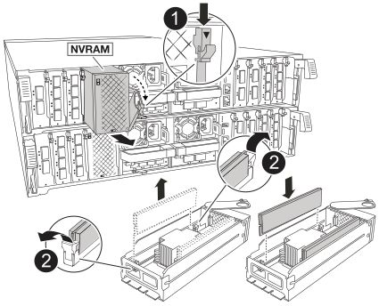

= Ersetzen Sie die Hardware des Controller-Moduls – AFF A70, AFF A90
:allow-uri-read: 
:icons: font
:imagesdir: ../media/

[role="lead"]
Zum Austauschen des Controllers müssen Sie den beeinträchtigten Controller entfernen, die FRU-Komponenten vom beeinträchtigten Controller-Modul auf das Ersatz-Controller-Modul verschieben, das Ersatz-Controller-Modul im Chassis einbauen und das System dann im Wartungsmodus booten.

== Schritt 1: Entfernen Sie das Controller-Modul

Sie müssen das Controller-Modul aus dem Chassis entfernen, wenn Sie das Controller-Modul ersetzen oder eine Komponente im Controller-Modul ersetzen.

. Drücken Sie auf der Vorderseite des Gehäuses die Daumen, um jedes Laufwerk fest einzuschieben, bis Sie einen positiven Stopp spüren. Dadurch wird sichergestellt, dass die Laufwerke fest an der Mittelplatine des Gehäuses sitzen.
+
image::../media/drw_a800_drive_seated_IEOPS-960.svg[drw a800-Laufwerk mit IEOPS 960]

. Überprüfen Sie, ob die gelbe NVRAM-Status-LED in Steckplatz 4/5 auf der Rückseite des außer Betrieb genommenen Controller-Moduls ausgeschaltet ist. Suchen Sie nach dem NV-Symbol.
+
image::../media/drw_a1K-70-90_nvram-led_ieops-1463.svg[Grafik für die NVRAM-Warnungs- und Status-LED zur Lage]

+
[cols="1,4"]
|===

 a| 
image:../media/legend_icon_01.svg["Legende Nummer 1, Breite=30px"]
 a| 
NVRAM-Status-LED

 a| 
image:../media/legend_icon_02.svg["Legende Nummer 1, Breite=30px"]
 a| 
LED für NVRAM-Warnung

|===
+

NOTE: Wenn die NVRAM-Status-LED blinkt, bedeutet dies möglicherweise, dass das Controller-Modul nicht ordnungsgemäß übernommen oder angehalten wurde (nicht belegte Daten). Wenn das beeinträchtigte Controller-Modul nicht erfolgreich vom Partner-Controller-Modul übernommen wurde, wenden Sie sich an https://mysupport.netapp.com/site/global/dashboard["NetApp Support"] , bevor Sie mit diesem Verfahren fortfahren.

+
Das allgemeine Verhalten der NVRAM-Status-LED am Controller-Modul für beeinträchtigte besteht wie folgt:

+
** Die NVRAM-Status-LED blinkt, wenn die Stromversorgung vom Controller-Modul getrennt wird und sich das Storage-System im Status „Warten auf Rückgabe“ befindet oder das Controller-Modul nicht ordnungsgemäß übernommen oder angehalten wird (nicht belegte Daten).
** Wenn das Controller-Modul aus dem Chassis entfernt wird, blinkt die NVRAM-Status-LED, sodass das Controller-Modul nicht übernommen oder ordnungsgemäß angehalten wird (nicht belegte Daten). Vergewissern Sie sich, dass das Controller-Modul sauber Übernahme durch das Partner Controller-Modul erfolgt ist oder dass das beeinträchtigte Controller-Modul angezeigt wird `waiting for giveback`. Anschließend kann die blinkende LED ignoriert werden (und das Controller-Modul kann aus dem Gehäuse entfernt werden).

. Wenn Sie nicht bereits geerdet sind, sollten Sie sich richtig Erden.
. Ziehen Sie die Stromversorgungskabel des Controller-Moduls von den Netzteilen des Controller-Moduls (PSU) ab.
+

NOTE: Wenn Ihr System über Gleichstrom verfügt, trennen Sie den Netzstecker von den Netzteilen.

. Ziehen Sie die Systemkabel und die SFP- und QSFP-Module (falls erforderlich) vom Controller-Modul ab, um zu verfolgen, wo die Kabel angeschlossen waren.
+
Lassen Sie die Kabel im Kabelverwaltungs-Gerät so, dass bei der Neuinstallation des Kabelverwaltungsgeräts die Kabel organisiert sind.

. Entfernen Sie das Kabelverwaltungsgerät vom Controller-Modul.
. Drücken Sie beide Verriegelungsriegel nach unten, und drehen Sie dann beide Verriegelungen gleichzeitig nach unten.
+
Das Controller-Modul wird leicht aus dem Chassis entfernt.

+
image::../media/drw_a70-90_pcm_remove_replace_ieops-1365.svg[Controller Grafik entfernen]

+
[cols="1,4"]
|===

 a| 
image:../media/legend_icon_01.svg["Legende Nummer 1, Breite=30px"]
| Eine Verriegelungsverriegelung 

 a| 
image:../media/legend_icon_02.svg["Callout-Nummer 2, Breite=30 px"]
 a| 
Sicherungsstift

|===
. Schieben Sie das Controller-Modul aus dem Gehäuse und platzieren Sie es auf einer Ebenen, stabilen Oberfläche.
+
Stellen Sie sicher, dass Sie die Unterseite des Controller-Moduls unterstützen, während Sie es aus dem Gehäuse schieben.

== Schritt 2: Bewegen Sie die Netzteile

Bringen Sie die Netzteile zum Ersatzcontroller.

. Drehen Sie den Nockengriff so, dass er verwendet werden kann, um die Stromversorgung aus dem Controller-Modul zu ziehen, während Sie die Verriegelungslasche drücken.
+

CAUTION: Das Netzteil ist kurz. Verwenden Sie immer zwei Hände, um sie zu unterstützen, wenn Sie sie aus dem Controller-Modul entfernen, damit es nicht plötzlich aus dem Controller-Modul schwingen und Sie verletzen.

+
image::../media/drw_a70-90_psu_remove_replace_ieops-1368.svg[Netzteil entfernen]

+
[cols="1,4"]
|===

 a| 
image::../media/legend_icon_01.svg[Legende Nummer 1]
| Verriegelungslasche für das Terrakotta-Netzteil 

 a| 
image::../media/legend_icon_02.svg[Legende Nummer 2]
 a| 
Stromversorgung

|===
. Stellen Sie das Netzteil auf das neue Controller-Modul, und installieren Sie es.
. Halten und richten Sie die Kanten des Netzteils mit beiden Händen an der Öffnung im Controller-Modul aus, und drücken Sie dann vorsichtig das Netzteil in das Controller-Modul, bis die Verriegelungslasche einrastet.
+
Die Netzteile werden nur ordnungsgemäß mit dem internen Anschluss in Kontakt treten und auf eine Weise verriegeln.

+

NOTE: Um Schäden am internen Stecker zu vermeiden, sollten Sie beim Einschieben der Stromversorgung in das System keine übermäßige Kraft verwenden.

== Schritt 3: Bewegen Sie die Lüfter

Bringen Sie die Lüftermodule in das Ersatz-Controller-Modul.

. Entfernen Sie das Lüftermodul, indem Sie die Verriegelungslaschen an der Seite des Lüftermoduls einklemmen und dann das Lüftermodul gerade aus dem Controller-Modul herausheben.
+
image::../media/drw_a70-90_fan_remove_replace_ieops-1366.svg[Entfernen Sie die Lüfter]

+
[cols="1,4"]
|===

 a| 
image::../media/legend_icon_01.svg[Legende Nummer 1]
 a| 
Verriegelungslaschen des Lüfters

 a| 
image::../media/legend_icon_02.svg[Legende Nummer 2]
 a| 
Lüftermodul

|===
. Schieben Sie das Lüftermodul in das Ersatzcontrollermodul, und installieren Sie dann das Lüftermodul, indem Sie die Kanten an der Öffnung im Controller-Modul ausrichten und das Lüftermodul dann in das Controller-Modul schieben, bis die Verriegelungen einrasten.
. Wiederholen Sie diese Schritte für die übrigen Lüftermodule.

== Schritt 4: Verschieben Sie den NV-Akku

Verschieben Sie die NV-Batterie in das Ersatz-Controller-Modul.

. Öffnen Sie die Abdeckung des Luftkanals in der Mitte des Steuermoduls, und suchen Sie nach der NV-Batterie.
+
image::../media/drw_a70-90_remove_replace_nvmembat_ieops-1369.svg[Die NV-Batterie bewegen]

+
[cols="1,4"]
|===

 a| 
image::../media/legend_icon_01.svg[Legende Nummer 1]
| NV-Batterie-Luftkanal 

 a| 
image::../media/legend_icon_02.svg[Legende Nummer 2]
 a| 
NV-Akkustecker

|===
+
*Achtung:* die NV-Modul-LED blinkt beim Abstapeln des Inhalts auf den Flash-Speicher, wenn Sie das System anhalten. Nach Abschluss der Abscheidungen schaltet sich die LED aus.

. Heben Sie die Batterie an, um auf den Batteriestecker zuzugreifen.
. Drücken Sie die Klammer auf der Vorderseite des Batteriesteckers, um den Stecker aus der Steckdose zu lösen, und ziehen Sie dann das Batteriekabel aus der Steckdose.
. Heben Sie die Batterie aus dem Luftkanal und dem Controller-Modul heraus.
. Setzen Sie den Akku in das Ersatz-Controller-Modul ein, und setzen Sie ihn dann in das Ersatz-Controller-Modul ein:
+
.. Öffnen Sie den Luftkanal der NV-Batterie im neuen Controller-Modul.
.. Stecken Sie den Batteriestecker in die Steckdose, und stellen Sie sicher, dass der Stecker einrastet.
.. Setzen Sie den Akku in den Steckplatz ein, und drücken Sie den Akku fest nach unten, um sicherzustellen, dass er fest eingerastet ist.
.. Schließen Sie den Luftkanal der NV-Batterie.

== Schritt 5: System-DIMMs verschieben

Bringen Sie die DIMMs an das Ersatz-Controller-Modul an.

. Öffnen Sie den Luftkanal der Steuerung auf der Oberseite der Steuerung.
+
.. Stecken Sie Ihre Finger in die Aussparungen an den entfernten Enden des Luftkanals.
.. Heben Sie den Luftkanal an, und drehen Sie ihn bis zum gewünschten Winkel nach oben.

. Suchen Sie die System-DIMMs auf der Hauptplatine.
+
image::../media/drw_a70_90_dimm_ieops-1513.svg[DIMM-Karte]

+
[cols="1,4"]
|===

 a| 
image::../media/legend_icon_01.svg[Legende Nummer 1]
| System-DIMM 
|===
. Beachten Sie die Ausrichtung des DIMM-Moduls in den Sockel, damit Sie das DIMM-Modul in die richtige Ausrichtung einsetzen können.
. Werfen Sie das DIMM aus dem Steckplatz, indem Sie die beiden DIMM-Auswerferlaschen auf beiden Seiten des DIMM langsam auseinander drücken und dann das DIMM aus dem Steckplatz schieben.
+

NOTE: Halten Sie das DIMM vorsichtig an den Rändern, um Druck auf die Komponenten auf der DIMM-Leiterplatte zu vermeiden.

. Suchen Sie den Steckplatz auf dem Ersatz-Controller-Modul, in dem Sie das DIMM installieren.
. Setzen Sie das DIMM-Modul in den Steckplatz ein.
+
Das DIMM passt eng in den Steckplatz, sollte aber leicht einpassen. Falls nicht, richten Sie das DIMM-Modul mit dem Steckplatz aus und setzen Sie es wieder ein.

+

NOTE: Prüfen Sie das DIMM visuell, um sicherzustellen, dass es gleichmäßig ausgerichtet und vollständig in den Steckplatz eingesetzt ist.

. Drücken Sie vorsichtig, aber fest auf die Oberseite des DIMM, bis die Auswurfklammern über den Kerben an den Enden des DIMM einrasten.
. Wiederholen Sie diese Schritte für die übrigen DIMMs.
. Den Luftkanal der Steuerung schließen.

== Schritt 6: Verschieben Sie die E/A-Module

Bringen Sie die E/A-Module in das Ersatz-Controller-Modul.

image::../media/drw_a70_90_io_remove_replace_ieops-1532.svg[Entfernen Sie das E/A-Modul]

[cols="1,4"]
|===

 a| 
image::../media/legend_icon_01.svg[Legende Nummer 1]
| E/A-Modul Nockenhebel 
|===
. Trennen Sie alle Kabel vom Ziel-E/A-Modul.
+
Achten Sie darauf, dass Sie die Kabel so kennzeichnen, dass Sie wissen, woher sie stammen.

. Drehen Sie die Kabelmanagement-ARM nach unten, indem Sie die Tasten an der Innenseite der Kabelmanagement-ARM ziehen und nach unten drehen.
. Entfernen Sie die E/A-Module aus dem Controller-Modul:
+
.. Drücken Sie die Verriegelungstaste des Ziel-E/A-Moduls.
+
Der Nockenhebel bewegt sich vom Controller-Modul weg.

.. Drehen Sie die Nockenverriegelung so weit wie möglich nach unten. Drehen Sie bei horizontalen Modulen den Nocken so weit wie möglich vom Modul weg.
.. Entfernen Sie das Modul vom Controller-Modul, indem Sie den Finger in die Öffnung des Nockenhebels einhaken und das Modul aus dem Controller-Modul herausziehen.
+
Stellen Sie sicher, dass Sie den Steckplatz verfolgen, in dem sich das I/O-Modul befand.

.. Setzen Sie das neue E/A-Modul in das Ersatz-Controller-Modul ein, indem Sie das E/A-Modul vorsichtig in den Steckplatz schieben, bis die E/A-Nockenverriegelung mit dem E/A-Nockenbolzen einrastet. Drücken Sie dann die E/A-Nockenverriegelung ganz nach oben, um das Modul zu verriegeln.

. Wiederholen Sie diese Schritte, um die verbleibenden E/A-Module, mit Ausnahme der Module in den Steckplätzen 6 und 7, auf das Ersatz-Controller-Modul zu verschieben.
+

NOTE: Um die E/A-Module aus den Steckplätzen 6 und 7 zu verschieben, müssen Sie den Träger, der diese E/A-Module enthält, vom beeinträchtigten Controller-Modul auf das Ersatz-Controller-Modul verschieben.

. Bringen Sie den Träger mit den E/A-Modulen in den Steckplätzen 6 und 7 zum Ersatz-Controller-Modul:
+
.. Drücken Sie die Taste am rechten Griff am Tragegriff. ..Schieben Sie den Träger aus dem außer Betrieb genommenen Controller-Modul und setzen Sie ihn in die gleiche Position wie im außer Betrieb genommenen Controller-Modul ein.
.. Schieben Sie den Träger vorsichtig bis zum Ende in das Ersatz-Controller-Modul, bis er einrastet.

== Schritt 7: Verschieben Sie das Modul System Management

Verschieben Sie das System-Management-Modul auf das Ersatz-Controller-Modul.

image::../media/drw_a70-90_sys-mgmt_replace_ieops-1373.svg[Ersetzen Sie das System Management-Modul]

[cols="1,4"]
|===

 a| 
image::../media/legend_icon_01.svg[Legende Nummer 1]
 a| 
Nockenverriegelung des Systemmanagementmoduls

 a| 
image::../media/legend_icon_02.svg[Legende Nummer 2]
 a| 
Verriegelungstaste für Startmedien

 a| 
image::../media/legend_icon_03.svg[Legende Nummer 3]
 a| 
Ersatz-System-Management-Modul

|===
. Entfernen Sie das System-Management-Modul aus dem Controller-Modul für beeinträchtigte Störungen:
+
.. Drücken Sie die Taste für die Systemverwaltung. Der Nockenhebel bewegt sich vom Gehäuse weg.
.. Den Nockenhebel ganz nach unten drehen.
.. Führen Sie den Finger in den Nockenhebel, und ziehen Sie das Modul gerade aus dem System.

. Installieren Sie das Systemmanagement-Modul in das Ersatz-Controller-Modul im gleichen Steckplatz, in dem es sich auf dem Controller-Modul für den beeinträchtigten Betrieb befand:
+
.. Richten Sie die Kanten des Systemmanagementmoduls an der Systemöffnung aus und drücken Sie es vorsichtig in das Controller-Modul.
.. Schieben Sie das Modul vorsichtig in den Steckplatz, bis die Nockenverriegelung mit dem E/A-Nockenbolzen einrastet, und drehen Sie dann die Nockenverriegelung bis zum Anschlag nach oben, um das Modul zu verriegeln.

== Schritt 8: Verschieben Sie das NVRAM-Modul

Setzen Sie das NVRAM-Modul auf das Ersatz-Controller-Modul.

[cols="1,4"]
|===

 a| 
image:../media/legend_icon_01.svg["Legende Nummer 1,Breite=30px"]
| Nockenverriegelungstaste 

 a| 
image:../media/legend_icon_02.svg["Callout-Nummer 2,Breite=30 px"]
 a| 
DIMM-Sperrklinke

|===
. Entfernen Sie das NVRAM-Modul aus dem Controller-Modul für beeinträchtigte Störungen:
+
.. Drücken Sie die Taste für die Nockenverriegelung.
+
Die Nockentaste bewegt sich vom Gehäuse weg.

.. Drehen Sie die Nockenverriegelung so weit wie möglich.
.. Entfernen Sie das NVRAM-Modul aus dem Gehäuse, indem Sie den Finger in die Öffnung des Nockenhebels stecken und das Modul aus dem Gehäuse ziehen.

. Installieren Sie das NVRAM-Modul in Steckplatz 4/5 im Ersatz-Controller-Modul:
+
.. Richten Sie das Modul an den Kanten der Gehäuseöffnung in Steckplatz 4/5 aus.
.. Schieben Sie das Modul vorsichtig bis zum Anschlag in den Steckplatz, und drücken Sie dann die Nockenverriegelung ganz nach oben, um das Modul zu verriegeln.

== Schritt 9: Installieren Sie das Controller-Modul

Installieren Sie das Controller-Modul neu, und starten Sie es neu.

. Stellen Sie sicher, dass der Luftkanal vollständig geschlossen ist, indem Sie ihn bis zum gewünschten Ziel nach unten drehen.
+
Er muss bündig auf die Metallplatte des Controller-Moduls liegen.

. Richten Sie das Ende des Controller-Moduls an der Öffnung im Gehäuse aus, und drücken Sie dann vorsichtig das Controller-Modul zur Hälfte in das System.
+

NOTE: Setzen Sie das Controller-Modul erst dann vollständig in das Chassis ein, wenn Sie dazu aufgefordert werden.

. Das System nach Bedarf neu einsetzen.
+
Wenn Sie die Transceiver (QSFPs oder SFPs) entfernt haben, müssen Sie sie erneut installieren, wenn Sie Glasfaserkabel verwenden.

. Führen Sie die Neuinstallation des Controller-Moduls durch:
+
.. Drücken Sie das Controller-Modul fest in das Gehäuse, bis es auf die Mittelebene trifft und vollständig sitzt.
+
Die Verriegelungen steigen, wenn das Controller-Modul voll eingesetzt ist.

+

NOTE: Beim Einschieben des Controller-Moduls in das Gehäuse keine übermäßige Kraft verwenden, um Schäden an den Anschlüssen zu vermeiden.

+
.. Drehen Sie die Verriegelungen nach oben in die verriegelte Position.

. Schließen Sie die Netzkabel an die Netzteile an.
+

NOTE: Wenn Sie über Gleichstromnetzteile verfügen, schließen Sie den Netzteilblock wieder an die Netzteile an, nachdem das Controller-Modul vollständig im Gehäuse eingesetzt ist.

+
Das Controller-Modul wird gestartet, wenn die Stromversorgung wiederhergestellt ist. Wenn sie bis zur LOADER-Eingabeaufforderung gebootet wird, booten Sie den Controller mit dem Befehl neu `boot_ontap` .

. Stellen Sie die automatische Rückgabe wieder her, wenn Sie die Funktion mithilfe von deaktivieren `storage failover modify -node local -auto-giveback true` Befehl.
. Wenn AutoSupport aktiviert ist, können Sie die automatische Fallerstellung mit dem Befehl wiederherstellen/zurücknehmen. `system node autosupport invoke -node * -type all -message MAINT=END`
. Wenn Sie dies noch nicht getan haben, installieren Sie das Kabelverwaltungsgerät neu, und stellen Sie den Controller wieder her.

