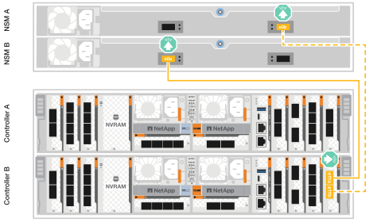

= Verkabeln Sie die Hardware - AFF A70, AFF A90
:allow-uri-read: 
:icons: font
:imagesdir: ../media/

[role="lead"]
Verkabeln Sie die Controller und Shelfs entsprechend Ihrer spezifischen Storage-Systemkonfiguration.

.Bevor Sie beginnen
Prüfen Sie den Pfeil in der Abbildung in den Verkabelungsdiagrammen auf die richtige Ausrichtung der Zuglasche am Kabelanschluss.

image::../media/drw_cable_pull_tab_direction_ieops-1699.svg[Beispiel für die Ausrichtung der Kabelzuglasche]

* Wenn Sie den Anschluss einsetzen, sollten Sie spüren, dass er einrastet. Wenn Sie ihn nicht einrasten, entfernen Sie ihn, drehen Sie den Kabelkopf um und versuchen Sie es erneut.
* Stecken Sie beim Anschließen an einen optischen Switch den SFP-Port in den Controller-Port, bevor Sie die Verkabelung zum Port durchführen.

== Schritt 1: Controller mit Ihrem Netzwerk verbinden

Verkabeln Sie die Controller entweder als zwei-Node-Cluster ohne Switches oder als Switched-Cluster mit dem Netzwerk.

.Bevor Sie beginnen
Wenden Sie sich an Ihren Netzwerkadministrator, um Informationen über das Anschließen des Speichersystems an die Switches zu erhalten.

.Über diese Aufgabe
Diese Verfahren zeigen gängige Konfigurationen. Beachten Sie, dass die jeweilige Verkabelung von den für Ihr Speichersystem bestellten Komponenten abhängt. Ausführliche Informationen zur Konfiguration und zur Steckplatzpriorität finden Sie unter link:https://hwu.netapp.com["NetApp Hardware Universe"^].

[role="tabbed-block"]
====
.Option 1: Cluster ohne Kabel
--
Verkabeln Sie Ihre Switch-losen Cluster-Verbindungen.

.Schritte
. Verkabeln Sie die Cluster/HA-Interconnect-Ports e1a mit e1a und e7a mit e7a mit dem Cluster/HA-Verbindungskabel.
+

NOTE: Der Cluster-Interconnect-Verkehr und der HA Traffic nutzen dieselben physischen Ports.

+
.. Kabelanschluss e1a an Controller A zu Anschluss E1A an Controller B.
.. Kabelanschluss e7a an Controller A zu Anschluss E1A an Controller B.
+
*Cluster/HA Verbindungskabel*

+
image::../media/oie_cable_25Gb_Ethernet_SFP28_IEOPS-1069.svg[Cluster HA-Kabel]

+
image::../media/drw_70-90_tnsc_cluster_cabling_ieops-1653.svg[Verkabelungsdiagramm für Cluster mit zwei Nodes ohne Switches]

. Verkabeln Sie die Ethernet-Modulports mit Ihrem Hostnetzwerk.
+
Im Folgenden finden Sie einige typische Beispiele für eine Verkabelung im Host-Netzwerk. Informationen zu Ihrer spezifischen Systemkonfiguration finden Sie unter link:https://hwu.netapp.com["NetApp Hardware Universe"^] .

+
.. Verkabeln Sie die Ports e9a und e9b wie in der Abbildung dargestellt mit dem Ethernet-Datennetzwerk-Switch.
+

NOTE: Um eine maximale Systemperformance für Cluster- und HA-Datenverkehr zu erreichen, sollten die Ports e1b und e7b nicht für Host-Netzwerkverbindungen verwendet werden. Verwenden Sie eine separate Hostkarte, um die Leistung zu maximieren.

+
*100-GbE-Kabel*

+
image::../media/oie_cable_sfp_gbe_copper.svg[100-GB-Ethernet-Kabel]

+
image::../media/drw_70-90_network_cabling1_ieops-1654.svg[Kabel zum 100-GB-Ethernet-Netzwerk]

.. Verkabeln Sie die 10/25-GbE-Host-Netzwerk-Switches.
+
*4 Ports, 10/25 GbE Host*

+
image::../media/oie_cable_sfp_gbe_copper.svg[10/25-GB-Kabel]

+
image::../media/drw_70-90_network_cabling2_ieops-1655.svg[Kabel zum 100-GB-Ethernet-Netzwerk]

. Verbinden Sie die Controller-Management- (Schraubenschlüssel-) Ports mit den Management-Netzwerk-Switches mit 1000BASE-T RJ-45-Kabeln.
+
image::../media/oie_cable_rj45.svg[RJ45-Kabel]

+
* 1000BASE-T RJ-45 KABEL*

+
image::../media/drw_70-90_management_connection_ieops-1656.svg[Stellen Sie eine Verbindung mit dem Managementnetzwerk her]

IMPORTANT: Stecken Sie die Netzkabel noch nicht ein.

--
.Option 2: Verkabeln des Clusters mit Switches
--
Verkabeln Sie Ihre Switched Cluster-Verbindungen.

.Schritte
. Stellen Sie die folgenden Kabelverbindungen her:
+

NOTE: Der Cluster-Interconnect-Verkehr und der HA Traffic nutzen dieselben physischen Ports.

+
.. Kabelanschluss e1a an Controller A und Anschluss e1a an Controller B an Cluster-Netzwerk-Switch A.
.. Kabelanschluss e7a an Controller A und Port e7a an Controller B an Cluster-Netzwerk-Switch B.
+
*100-GbE-Kabel*

+
image::../media/oie_cable100_gbe_qsfp28.svg[100-GB-Kabel]

+
image::../media/drw_70-90_switched_cluster_cabling_ieops-1657.svg[Verkabeln Sie Cluster-Verbindungen mit dem Cluster-Netzwerk]

. Verkabeln Sie die Ethernet-Modulports mit Ihrem Hostnetzwerk.
+
Im Folgenden finden Sie einige typische Beispiele für eine Verkabelung im Host-Netzwerk. Informationen zu Ihrer spezifischen Systemkonfiguration finden Sie unter link:https://hwu.netapp.com["NetApp Hardware Universe"^] .

+
.. Verkabeln Sie die Ports e9a und e9b wie in der Abbildung dargestellt mit dem Ethernet-Datennetzwerk-Switch.
+

NOTE: Um eine maximale Systemperformance für Cluster- und HA-Datenverkehr zu erreichen, sollten die Ports e1b und e7b nicht für Host-Netzwerkverbindungen verwendet werden. Verwenden Sie eine separate Hostkarte, um die Leistung zu maximieren.

+
*100-GbE-Kabel*

+
image::../media/oie_cable_sfp_gbe_copper.svg[100-GB-Ethernet-Kabel]

+
image::../media/drw_70-90_network_cabling1_ieops-1654.svg[Kabel zum 100-GB-Ethernet-Netzwerk]

.. Verkabeln Sie die 10/25-GbE-Host-Netzwerk-Switches.
+
*4 Ports, 10/25 GbE Host*

+
image::../media/oie_cable_sfp_gbe_copper.svg[10 GB Ethernet-Kabel]

+
image::../media/drw_70-90_network_cabling2_ieops-1655.svg[Kabel zu 10/25-GB-Ethernet-Netzwerk]

. Verbinden Sie die Controller-Management- (Schraubenschlüssel-) Ports mit den Management-Netzwerk-Switches mit 1000BASE-T RJ-45-Kabeln.
+
image::../media/oie_cable_rj45.svg[RJ-45-Kabel]

+
* 1000BASE-T RJ-45 KABEL*

+
image::../media/drw_70-90_management_connection_ieops-1656.svg[Stellen Sie eine Verbindung mit dem Managementnetzwerk her]

IMPORTANT: Stecken Sie die Netzkabel noch nicht ein.

--
====

== Schritt 2: Controller zu den Shelfs verkabeln

Verkabeln Sie Ihre Controller mit dem Shelf oder den Shelfs.

Diese Verfahren zeigen, wie Sie Ihre Controller mit einem Shelf und zwei Shelfs verkabeln. Sie können Ihre Controller mit maximal vier Shelfs verbinden.

[role="tabbed-block"]
====
.Option 1: Kabel zu einem NS224-Shelf
--
Verkabeln Sie jeden Controller mit den NSM-Modulen im NS224-Shelf. Die Grafik zeigt die Verkabelung von jedem der Controller: Controller A-Verkabelung in blau und Controller B-Verkabelung in gelb.

*100 GbE QSFP28 Kupferkabel*

image::../media/oie_cable100_gbe_qsfp28.svg[100-GbE-QSFP28-Kupferkabel]

.Schritte
. Verbinden Sie den Controller A-Port e11a mit dem NSM A-Port e0a.
. Verbinden Sie den Controller A-Port e11b mit dem Port NSM B Port e0b.
+
image:../media/drw_a70-90_1shelf_cabling_a_ieops-1731.svg["Controller A e11a und e11b zu einem einzelnen NS224 Shelf"]

. Verbinden Sie den Port e11a von Controller B mit dem Port e0a von NSM B.
. Verbinden Sie den Port e11b des Controllers B mit dem Port e0b des NSM A.
+

--
.Option 2: Kabel zu zwei NS224-Einschüben
--
Verkabeln Sie jeden Controller mit den NSM-Modulen beider NS224-Shelfs. Die Grafik zeigt die Verkabelung von jedem der Controller: Controller A-Verkabelung in blau und Controller B-Verkabelung in gelb.

*100 GbE QSFP28 Kupferkabel*

image::../media/oie_cable100_gbe_qsfp28.svg[100-GbE-QSFP28-Kupferkabel]

.Schritte
. An Controller A die folgenden Verbindungen verkabeln:
+
.. Verbinden Sie Port e11a mit Shelf 1, NSM A Port e0a.
.. Verbinden Sie den Port e11b mit Shelf 2, den NSM B Port e0b.
.. Verbinden Sie Port e8a mit Shelf 2, NSM A Port e0a.
.. Verbinden Sie Port e8b mit Shelf 1, NSM B Port e0b.
+
image:../media/drw_a70-90_2shelf_cabling_a_ieops-1733.svg["Controller-zu-Shelf-Verbindungen für Controller A"]

. An Controller B die folgenden Verbindungen verkabeln:
+
.. Verbinden Sie Port e11a mit Shelf 1, NSM B Port e0a.
.. Verbinden Sie Port e11b mit Shelf 2, NSM A Port e0b.
.. Verbinden Sie Port e8a mit Shelf 2, NSM B Port e0a.
.. Verbinden Sie Port e8b mit Shelf 1, NSM A Port e0b.
+
image:../media/drw_a70-90_2shelf_cabling_b_ieops-1734.svg["Controller-zu-Shelf-Verbindungen für Controller B"]

--
====