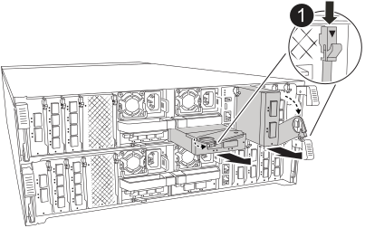

= Ein I/O-Modul kann in Ihrem AFF A70 oder AFF A90 System Hot-Swap-fähig entfernt werden, ohne dass ein Herunterfahren erforderlich ist.
:allow-uri-read: 
:icons: font
:imagesdir: ../media/

[role="lead"]
Sie können ein Ethernet-E/A-Modul in Ihrem AFF A70 oder AFF A90-Speichersystem per Hot-Swap austauschen, wenn ein Modul ausfällt und Ihr Speichersystem alle ONTAP-Versionanforderungen erfüllt.

Um ein E/A-Modul per Hot-Swap auszutauschen, stellen Sie sicher, dass auf Ihrem Speichersystem ONTAP 9.18.1 GA oder höher ausgeführt wird, bereiten Sie Ihr Speichersystem und das E/A-Modul vor, führen Sie den Hot-Swap des defekten Moduls durch, nehmen Sie das Ersatzmodul in Betrieb, stellen Sie den normalen Betrieb des Speichersystems wieder her und senden Sie das defekte Modul an NetApp zurück.

.Über diese Aufgabe
* Sie müssen kein manuelles Takeover durchführen, bevor Sie das ausgefallene E/A-Modul ersetzen.
* Wenden Sie die Befehle auf den richtigen Controller und E/A-Steckplatz während des Hot-Swaps an:
+
** Der _beeinträchtigte Controller_ ist der Controller, bei dem Sie das I/O-Modul austauschen.
** Der _gesunde Controller_ ist der HA-Partner des beeinträchtigten Controllers.

* Sie können die Standort-LEDs (blau) des Speichersystems einschalten, um das betroffene Speichersystem leichter zu finden. Melden Sie sich mit SSH beim BMC an und geben Sie den  `system location-led _on_` Befehl ein.
+
Das Speichersystem verfügt über drei Positions-LEDs: eine am Bedienerdisplay und je eine an jedem Controller. Die LEDs bleiben 30 Minuten lang eingeschaltet.

+
Sie können sie deaktivieren, indem Sie den Befehl eingeben `system location-led _off_`. Wenn Sie sich nicht sicher sind, ob die LEDs leuchten oder nicht, können Sie ihren Status überprüfen, indem Sie den Befehl eingeben `system location-led show`.

[[step-1-confirm-the-storage-system-meets-the-procedure-requirements]]
== Schritt 1: Bestätigen, dass das Lagersystem die Verfahrensanforderungen erfüllt

Um dieses Verfahren anwenden zu können, muss auf Ihrem Speichersystem ONTAP 9.18.1 GA oder eine neuere Version laufen, und Ihr Speichersystem muss alle Anforderungen erfüllen.

NOTE: Wenn auf Ihrem Speichersystem nicht ONTAP 9.18.1 GA oder höher ausgeführt wird, können Sie dieses Verfahren nicht verwenden, Sie müssen das link:io-module-replace.html["Vorgehensweise zum Ersetzen eines E/A-Moduls"] verwenden.

* Sie führen einen Hot-Swap eines Ethernet-E/A-Moduls in einem beliebigen Steckplatz mit beliebiger Portkombination für Cluster, HA und Client gegen ein gleichwertiges E/A-Modul durch. Sie können den Typ des E/A-Moduls nicht ändern.
+
Ethernet-I/O-Module mit Ports, die für Speicher oder MetroCluster verwendet werden, sind nicht Hot-Swap-fähig.

* Ihr Speichersystem (schalterlose oder geschaltete Clusterkonfiguration) kann jede für Ihr Speichersystem unterstützte Anzahl von Knoten haben.
* Alle Knoten im Cluster müssen die gleiche ONTAP Version (ONTAP 9.18.1GA oder höher) ausführen oder unterschiedliche Patch-Level derselben ONTAP Version ausführen.
+
Wenn auf den Knoten in Ihrem Cluster unterschiedliche ONTAP Versionen ausgeführt werden, handelt es sich um ein Cluster mit gemischten Versionen, und Hot-Swap eines E/A-Moduls wird nicht unterstützt.

* Die Controller in Ihrem Speichersystem können sich in einem der folgenden Zustände befinden:
+
** Beide Controller können aktiv sein und I/O ausführen (Daten bereitstellen).
** Jeder Controller kann sich im Takeover-Zustand befinden, wenn das Takeover durch das ausgefallene I/O-Modul verursacht wurde und die Nodes ansonsten ordnungsgemäß funktionieren.
+
In bestimmten Situationen kann ONTAP aufgrund eines ausgefallenen E/A-Moduls automatisch ein Takeover eines der beiden Controller durchführen. Wenn beispielsweise das ausgefallene E/A-Modul alle Cluster-Ports enthielt (alle Cluster-Verbindungen dieses Controllers ausfallen), führt ONTAP automatisch ein Takeover durch.

* Alle anderen Komponenten des Speichersystems müssen ordnungsgemäß funktionieren. Falls nicht, wenden Sie sich an https://mysupport.netapp.com/site/global/dashboard["NetApp Support"], bevor Sie mit diesem Verfahren fortfahren.

[[step-2-prepare-the-storage-system-and-io-module-slot]]
== Schritt 2: Bereiten Sie das Speichersystem und den Steckplatz für das I/O-Modul vor

Bereiten Sie das Speichersystem und den Steckplatz für das E/A-Modul so vor, dass das defekte E/A-Modul sicher entfernt werden kann:

.Schritte
. Richtig gemahlen.
. Beschriften Sie die Kabel, um zu erkennen, woher sie stammen, und ziehen Sie dann alle Kabel vom Ziel-I/O-Modul ab.
+
[NOTE]
====
Das E/A-Modul sollte ausgefallen sein (die Ports sollten sich im Link-down-Status befinden); wenn die Verbindungen jedoch noch aktiv sind und den letzten funktionierenden Cluster-Port enthalten, löst das Abziehen der Kabel ein automatisches Takeover aus.

Warten Sie fünf Minuten nach dem Abziehen der Kabel, um sicherzustellen, dass alle Takeover oder LIF-Failover abgeschlossen sind, bevor Sie mit diesem Verfahren fortfahren.

====
. Wenn AutoSupport aktiviert ist, unterdrücken Sie die automatische Erstellung eines Cases durch Aufrufen einer AutoSupport Meldung:
+
`system node autosupport invoke -node * -type all -message MAINT=<number of hours down>h`

+
Beispielsweise unterdrückt die folgende AutoSupport Meldung die automatische Fallerstellung für zwei Stunden:

+
`node2::> system node autosupport invoke -node * -type all -message MAINT=2h`

. Automatisches Giveback deaktivieren, wenn der Partnerknoten übernommen wurde:
+
[cols="1,2"]
|===
| Wenn... | Dann... 

 a| 
Wenn einer der beiden Controller automatisch das Takeover seines Partners durchführte
 a| 
Automatische Rückgabe deaktivieren:

.. Geben Sie den folgenden Befehl in der Konsole des Controllers ein, der die Steuerung seines Partners übernommen hat:
+
`storage failover modify -node local -auto-giveback false`

.. Eingeben `y` wenn die Eingabeaufforderung _Möchten Sie die automatische Rückgabe deaktivieren?_ angezeigt wird

 a| 
Beide Controller sind betriebsbereit und führen E/A aus (liefern Daten)
 a| 
Fahren Sie mit dem nächsten Schritt fort.

|===
. Bereiten Sie das defekte E/A-Modul für die Entfernung vor, indem Sie es außer Betrieb nehmen und ausschalten:
+
.. Geben Sie den folgenden Befehl ein:
+
`system controller slot module remove -node _impaired_node_name_ -slot _slot_number_`

.. Eingeben `y` wenn die Eingabeaufforderung _Möchten Sie fortfahren?_ angezeigt wird
+
Beispielsweise bereitet der folgende Befehl das defekte Modul in Steckplatz 7 auf Node 2 (den beeinträchtigten Controller) für die Entfernung vor und zeigt eine Meldung an, dass es sicher entfernt werden kann:

+
[listing]
----
node2::> system controller slot module remove -node node2 -slot 7

Warning: IO_2X_100GBE_NVDA_NIC module in slot 7 of node node2 will be powered off for removal.

Do you want to continue? {y|n}: y

The module has been successfully removed from service and powered off. It can now be safely removed.
----

. Überprüfen Sie, ob das ausgefallene E/A-Modul ausgeschaltet ist:
+
`system controller slot module show`

+
Die Ausgabe sollte  `_powered-off_` in der  `_status_` Spalte für das ausgefallene Modul und dessen Steckplatznummer angezeigt werden.

[[step-3-replace-the-failed-io-module]]
== Schritt 3: Ersetzen Sie das defekte E/A-Modul

Das defekte E/A-Modul kann im laufenden Betrieb gegen ein gleichwertiges E/A-Modul ausgetauscht werden.

.Schritte
. Wenn Sie nicht bereits geerdet sind, sollten Sie sich richtig Erden.
. Drehen Sie das Kabelführungs-Fach nach unten, indem Sie die Tasten an der Innenseite des Kabelführungs-Fachs herausziehen und nach unten drehen.
. Entfernen Sie das E/A-Modul aus dem Controller-Modul:
+

NOTE: Die folgende Abbildung zeigt die Entfernung eines horizontalen und eines vertikalen E/A-Moduls. Normalerweise entfernen Sie nur ein E/A-Modul.

+

+
[cols="1,4"]
|===

 a| 
image:../media/icon_round_1.png["Legende Nummer 1"]
 a| 
Nockenverriegelungstaste

|===
+
.. Drücken Sie die Taste für die Nockenverriegelung.
.. Drehen Sie die Nockenverriegelung so weit wie möglich vom Modul weg.
.. Entfernen Sie das Modul vom Controller-Modul, indem Sie den Finger in die Öffnung des Nockenhebels einhaken und das Modul aus dem Controller-Modul herausziehen.
+
Behalten Sie im Auge, in welchem Steckplatz sich das I/O-Modul befand.

. Legen Sie das E/A-Modul beiseite.
. Setzen Sie das Ersatz-E/A-Modul in den Zielsteckplatz ein:
+
.. Richten Sie das E/A-Modul an den Kanten des Schlitzes aus.
.. Schieben Sie das Modul vorsichtig in den Steckplatz bis zum Controller-Modul, und drehen Sie dann die Nockenverriegelung ganz nach oben, um das Modul zu verriegeln.

. Verkabeln Sie das E/A-Modul.
. Drehen Sie das Kabelführungs-Fach in die verriegelte Position.

[[step-4-bring-the-replacement-io-module-online]]
== Schritt 4: Bringen Sie das Ersatz-E/A-Modul online

Schalten Sie das Ersatz-I/O-Modul online, überprüfen Sie, ob die I/O-Modul-Ports erfolgreich initialisiert wurden, überprüfen Sie, ob der Steckplatz mit Strom versorgt ist, und überprüfen Sie dann, ob das I/O-Modul online und erkannt ist.

.Über diese Aufgabe
Nachdem das E/A-Modul ausgetauscht wurde und die Ports wieder in einen fehlerfreien Zustand versetzt wurden, werden die LIFs auf das ausgetauschte E/A-Modul zurückgesetzt.

.Schritte
. Schalten Sie das Ersatz-E/A-Modul online:
+
.. Geben Sie den folgenden Befehl ein:
+
`system controller slot module insert -node _impaired_node_name_ -slot _slot_number_`

.. Eingeben `y` wenn die Eingabeaufforderung „Möchten Sie fortfahren?“ angezeigt wird
+
Die Ausgabe sollte bestätigen, dass das I/O-Modul erfolgreich online geschaltet wurde (eingeschaltet, initialisiert und in Betrieb genommen).

+
Beispielsweise schaltet der folgende Befehl Steckplatz 7 auf Knoten 2 (dem beeinträchtigten Controller) online und zeigt eine Meldung an, dass der Vorgang erfolgreich war:

+
[listing]
----
node2::> system controller slot module insert -node node2 -slot 7

Warning: IO_2X_100GBE_NVDA_NIC module in slot 7 of node node2 will be powered on and initialized.

Do you want to continue? {y|n}: `y`

The module has been successfully powered on, initialized and placed into service.
----

. Überprüfen Sie, ob jeder Port des E/A-Moduls erfolgreich initialisiert wurde:
+
.. Geben Sie den folgenden Befehl von der Konsole des beeinträchtigten Controllers ein:
+
`event log show -event \*hotplug.init*`

+

NOTE: Es kann mehrere Minuten dauern, bis erforderliche Firmware-Updates durchgeführt und Ports initialisiert sind.

+
Die Ausgabe sollte ein oder mehrere hotplug.init.success EMS-Ereignisse anzeigen und  `_hotplug.init.success:_` in der  `_Event_` Spalte angeben, dass jeder Port auf dem E/A-Modul erfolgreich initialisiert wurde.

+
Beispielsweise zeigt die folgende Ausgabe, dass die Initialisierung für die I/O-Ports e7b und e7a erfolgreich war:

+
[listing]
----
node2::> event log show -event *hotplug.init*

Time                Node             Severity      Event

------------------- ---------------- ------------- ---------------------------

7/11/2025 16:04:06  node2      NOTICE        hotplug.init.success: Initialization of ports "e7b" in slot 7 succeeded

7/11/2025 16:04:06  node2      NOTICE        hotplug.init.success: Initialization of ports "e7a" in slot 7 succeeded

2 entries were displayed.
----
.. Falls die Portinitialisierung fehlschlägt, überprüfen Sie das EMS-Log, um die nächsten Schritte zu ermitteln.

. Überprüfen Sie, ob der I/O-Modul-Steckplatz eingeschaltet und betriebsbereit ist:
+
`system controller slot module show`

+
Die Ausgabe sollte den Steckplatzstatus als  `_powered-on_` anzeigen und somit die Betriebsbereitschaft des E/A-Moduls signalisieren.

. Prüfen Sie, ob das I/O-Modul online und erkannt ist.
+
Geben Sie den Befehl von der Konsole des beeinträchtigten Controllers ein:

+
`system controller config show -node local -slot _slot_number_`

+
Wenn das I/O-Modul erfolgreich online geschaltet wurde und erkannt wird, zeigt die Ausgabe Informationen zum I/O-Modul an, einschließlich Portinformationen für den Slot.

+
Beispielsweise sollten Sie eine Ausgabe ähnlich der folgenden für ein E/A-Modul in Steckplatz 7 sehen:

+
[listing]
----
node2::> system controller config show -node local -slot 7

Node: node2
Sub- Device/
Slot slot Information
---- ---- -----------------------------
   7    - Dual 40G/100G Ethernet Controller CX6-DX
                  e7a MAC Address: d0:39:ea:59:69:74 (auto-100g_cr4-fd-up)
                          QSFP Vendor:        CISCO-BIZLINK
                          QSFP Part Number:   L45593-D218-D10
                          QSFP Serial Number: LCC2807GJFM-B
                  e7b MAC Address: d0:39:ea:59:69:75 (auto-100g_cr4-fd-up)
                          QSFP Vendor:        CISCO-BIZLINK
                          QSFP Part Number:   L45593-D218-D10
                          QSFP Serial Number: LCC2809G26F-A
                  Device Type:        CX6-DX PSID(NAP0000000027)
                  Firmware Version:   22.44.1700
                  Part Number:        111-05341
                  Hardware Revision:  20
                  Serial Number:      032403001370
----

[[step-5-restore-the-storage-system-to-normal-operation]]
== Schritt 5: Wiederherstellen des Normalbetriebs des Speichersystems

Stellen Sie den Normalbetrieb Ihres Speichersystems wieder her, indem Sie den Speicher dem übernommenen Controller zurückgeben (falls erforderlich), die automatische Rückgabe wiederherstellen (falls erforderlich), überprüfen, ob sich die LIFs an ihren Heimatports befinden, und die automatische Fallerstellung von AutoSupport wieder aktivieren.

.Schritte
. Je nach Version von ONTAP, die auf Ihrem Speichersystem läuft, und dem Status der Controller geben Sie den Speicher zurück und stellen die automatische Rückgabe auf dem übernommenen Controller wieder her:
+
[cols="1,2"]
|===
| Wenn... | Dann... 

 a| 
Wenn einer der beiden Controller automatisch das Takeover seines Partners durchführte
 a| 
.. Stellen Sie den übernommenen Controller wieder in den Normalbetrieb, indem Sie ihm seinen Speicher zurückgeben:
+
`storage failover giveback -ofnode _controller that was taken over_name_`

.. Stellen Sie das automatische Giveback von der Konsole des übernommenen Controllers wieder her:
+
`storage failover modify -node local -auto-giveback _true_`

 a| 
Beide Controller sind betriebsbereit und führen E/A aus (liefern Daten)
 a| 
Fahren Sie mit dem nächsten Schritt fort.

|===
. Überprüfen Sie, ob die logischen Schnittstellen an ihren Heimatknoten und Ports melden: `network interface show -is-home false`
+
Wenn eine der LIFs als falsch aufgeführt ist, stellen Sie sie auf ihre Home-Ports zurück: `network interface revert -vserver * -lif *`

. Wenn AutoSupport aktiviert ist, stellen Sie die automatische Fallerstellung wieder her:
+
`system node autosupport invoke -node * -type all -message MAINT=end`

[[step-6-return-the-failed-part-to-netapp]]
== Schritt 6: Senden Sie das fehlgeschlagene Teil an NetApp zurück

Senden Sie das fehlerhafte Teil wie in den dem Kit beiliegenden RMA-Anweisungen beschrieben an NetApp zurück.  https://mysupport.netapp.com/site/info/rma["Rückgabe und Austausch von Teilen"]Weitere Informationen finden Sie auf der Seite.
