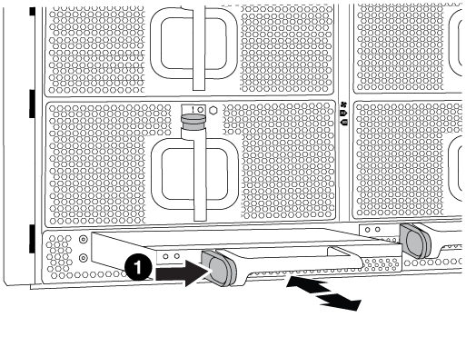

= Verschieben und ersetzen Sie Hardware – AFF A700
:allow-uri-read: 
:icons: font
:imagesdir: ../media/

[role="lead"]
Verschieben Sie die Lüfter, Festplatten und Controller-Module oder Module vom beeinträchtigten Gehäuse in das neue Gehäuse und tauschen Sie das beeinträchtigte Gehäuse aus dem Geräterrack oder dem Systemschrank aus, indem Sie das neue Gehäuse des gleichen Modells wie das beeinträchtigte Gehäuse verwenden.

== Schritt 1: Entfernen Sie die Netzteile

.Schritte
Wenn Sie die Netzteile entfernen, wenn Sie ein Gehäuse ersetzen, müssen Sie das Gerät ausschalten, trennen und dann das Netzteil vom alten Gehäuse entfernen.

. Wenn Sie nicht bereits geerdet sind, sollten Sie sich richtig Erden.
. Schalten Sie das Netzteil aus und trennen Sie die Netzkabel:
+
.. Schalten Sie den Netzschalter am Netzteil aus.
.. Öffnen Sie die Netzkabelhalterung, und ziehen Sie dann das Netzkabel vom Netzteil ab.
.. Ziehen Sie das Netzkabel von der Stromversorgung ab.

. Halten Sie die orangefarbene Taste am Netzteilgriff gedrückt, und ziehen Sie dann das Netzteil aus dem Gehäuse.
+

CAUTION: Wenn Sie ein Netzteil entfernen, verwenden Sie immer zwei Hände, um sein Gewicht zu stützen.

+
image::../media/drw_9000_remove_install_psu_module.gif[drw 9000 das Einbauen des netzteilmoduls entfernen]

+
[cols="1,3"]
|===

 a| 
image:../media/legend_icon_01.png["Legende Nummer 1"]
| Verriegelungsknopf 
|===
. Wiederholen Sie die vorherigen Schritte für alle weiteren Netzteile.

== Schritt 2: Entfernen Sie die Lüfter

Um die Lüftermodule beim Austausch des Gehäuses zu entfernen, müssen Sie eine bestimmte Sequenz von Aufgaben durchführen.

.Schritte
. Entfernen Sie die Blende (falls erforderlich) mit zwei Händen, indem Sie die Öffnungen auf beiden Seiten der Blende fassen und dann zu Ihnen ziehen, bis sich die Blende von den Kugelknöpfen am Rahmen des Chassis löst.
. Drücken Sie die orangefarbene Taste am Lüftermodul, und ziehen Sie das Lüftermodul gerade aus dem Gehäuse, um sicherzustellen, dass Sie es mit der freien Hand unterstützen.
+

CAUTION: Die Lüftermodule sind kurz. Unterstützen Sie das Lüftermodul immer mit Ihrer freien Hand, damit es nicht plötzlich vom Gehäuse abfällt und Sie verletzt.

+
image::../media/drw_9000_remove_install_fan.png[drw 9000 Ausbau des Lüfters]

+
[cols="1,3"]
|===

 a| 
image:../media/legend_icon_01.png["Legende Nummer 1"]
| Orangefarbene Entriegelungstaste 
|===
. Setzen Sie das Lüftermodul beiseite.
. Wiederholen Sie die vorherigen Schritte für alle verbleibenden Lüftermodule.

== Schritt 3: Entfernen Sie das Controller-Modul

Um das Chassis auszutauschen, müssen Sie das Controller-Modul oder die Module aus dem alten Chassis entfernen.

.Schritte
. Ziehen Sie die Kabel vom beeinträchtigten Controller-Modul ab, und verfolgen Sie, wo die Kabel angeschlossen waren.
. Schieben Sie die orangefarbene Taste am Nockengriff nach unten, bis sie entsperrt ist.
+
image::../media/drw_9000_remove_pcm.png[drw 9000 PCM entfernen]

+
[cols="1,3"]
|===

 a| 
image:../media/legend_icon_01.png["Legende Nummer 1"]
| Freigabetaste für den CAM-Griff 

 a| 
image:../media/legend_icon_02.png["Legende Nummer 2"]
 a| 
CAM-Griff

|===
. Drehen Sie den Nockengriff so, dass er das Controller-Modul vollständig aus dem Gehäuse herausrückt, und schieben Sie dann das Controller-Modul aus dem Gehäuse.
+
Stellen Sie sicher, dass Sie die Unterseite des Controller-Moduls unterstützen, während Sie es aus dem Gehäuse schieben.

. Stellen Sie das Controller-Modul an einer sicheren Stelle beiseite, und wiederholen Sie diese Schritte, wenn Sie ein weiteres Controller-Modul im Chassis haben.

== Schritt 4: Entfernen Sie die E/A-Module

.Schritte
Um I/O-Module aus dem alten Chassis, einschließlich der NVRAM-Module, zu entfernen, befolgen Sie die spezifischen Abfolge von Schritten. Sie müssen das FlashCache Modul nicht aus dem NVRAM-Modul entfernen, wenn Sie es in ein neues Chassis verschieben.

. Trennen Sie alle Kabel, die mit dem Ziel-E/A-Modul verbunden sind.
+
Achten Sie darauf, dass Sie die Kabel so kennzeichnen, dass Sie wissen, woher sie stammen.

. Entfernen Sie das Ziel-I/O-Modul aus dem Gehäuse:
+
.. Drücken Sie die Taste mit der Nummerierung und dem Buchstaben.
+
Die Nockentaste bewegt sich vom Gehäuse weg.

.. Drehen Sie die Nockenverriegelung nach unten, bis sie sich in horizontaler Position befindet.
+
Das I/O-Modul wird aus dem Gehäuse entfernt und bewegt sich ca. 1/2 Zoll aus dem I/O-Steckplatz.

.. Entfernen Sie das E/A-Modul aus dem Gehäuse, indem Sie an den Zuglaschen an den Seiten der Modulfläche ziehen.
+
Stellen Sie sicher, dass Sie den Steckplatz verfolgen, in dem sich das I/O-Modul befand.

+
image::../media/drw_9000_remove_pcie_module.png[drw 9000 entfernen das pcie-Modul]

+
[cols="1,3"]
|===

 a| 
image:../media/legend_icon_01.png["Legende Nummer 1"]
| Gerettete und nummerierte E/A-Nockenverriegelung 

 a| 
image:../media/legend_icon_02.png["Legende Nummer 2"]
 a| 
E/A-Nockenverriegelung vollständig entriegelt

|===

. Legen Sie das E/A-Modul beiseite.
. Wiederholen Sie den vorherigen Schritt für die verbleibenden I/O-Module des alten Chassis.

== Schritt 5: Entfernen Sie das Leistungsmodul des De-Stage-Controllers

.Schritte
Zur Installation des Ersatzgehäuses müssen die Controller-Stromversorgungsmodule aus dem alten Gehäuse entfernt werden.

. Drücken Sie die orangefarbene Verriegelungstaste am Modulgriff, und schieben Sie das DCPM-Modul aus dem Gehäuse.
+

+
[cols="1,3"]
|===

 a| 
image:../media/legend_icon_01.png["Legende Nummer 1"]
| DCPM-Modul orange Verriegelungsknopf 
|===
. Stellen Sie das DCPM-Modul an einem sicheren Ort zur Seite, und wiederholen Sie diesen Schritt für das restliche DCPM-Modul.

== Schritt 6: Ersetzen Sie ein Chassis aus dem Rack oder Systemschrank der Ausrüstung

.Schritte
Sie müssen das vorhandene Chassis aus dem Rack oder dem Systemschrank entfernen, bevor Sie das Ersatzgehäuse installieren können.

. Entfernen Sie die Schrauben von den Montagepunkten des Gehäuses.
+

NOTE: Wenn sich das System in einem Systemschrank befindet, müssen Sie möglicherweise die hintere Abklemme entfernen.

. Schieben Sie mit Hilfe von zwei oder drei Personen das alte Chassis in einem Systemschrank oder _L_-Halterungen in einem Geräterückel von den Rack-Schienen und legen Sie es dann beiseite.
. Wenn Sie nicht bereits geerdet sind, sollten Sie sich richtig Erden.
. Installieren Sie das Ersatzgehäuse mithilfe von zwei oder drei Personen in das Rack oder den Systemschrank des Geräts, indem Sie das Chassis an die Rack-Schienen in einem Systemschrank oder _L_ -Halterungen in einem Rack führen.
. Schieben Sie das Chassis vollständig in das Rack oder den Systemschrank der Ausrüstung.
. Befestigen Sie die Vorderseite des Chassis mit den Schrauben, die Sie vom alten Chassis entfernt haben, am Rack oder am Systemschrank des Geräts.
. Befestigen Sie die Rückseite des Chassis am Rack oder am Systemschrank des Geräts.
. Wenn Sie die Kabelführungshalter verwenden, entfernen Sie sie aus dem alten Chassis und installieren Sie sie dann am Ersatzgehäuse.
. Falls noch nicht geschehen, befestigen Sie die Blende.

== Schritt 7: Bewegen Sie das USB-LED-Modul in das neue Gehäuse

.Schritte
Sobald das neue Gehäuse im Rack oder Schrank installiert ist, müssen Sie das USB-LED-Modul vom alten Gehäuse in das neue Gehäuse verlegen.

. Suchen Sie das USB-LED-Modul an der Vorderseite des alten Gehäuses direkt unter den Netzteilschächten.
. Drücken Sie die schwarze Verriegelungstaste auf der rechten Seite des Moduls, um das Modul aus dem Gehäuse zu lösen, und schieben Sie es dann aus dem alten Gehäuse heraus.
. Richten Sie die Kanten des Moduls am USB-LED-Schacht an der Unterseite des Ersatzgehäuses aus, und schieben Sie das Modul vorsichtig bis zum Einrasten in das Gehäuse.

== Schritt 8: Beim Austausch des Gehäuses das Modul für das Abschalten des Controllers einbauen

.Schritte
Sobald das Ersatzgehäuse in das Rack oder den Systemschrank eingebaut ist, müssen Sie die entstufigen Controller-Stromversorgungsmodule in diesem wieder einbauen.

. Richten Sie das Ende des DCPM-Moduls an der Gehäuseöffnung aus, und schieben Sie es dann vorsichtig in das Gehäuse, bis es einrastet.
+

NOTE: Modul und Steckplatz sind codiert. Das Modul nicht in die Öffnung zwingen. Wenn das Modul nicht leicht einarbeitet, richten Sie das Modul aus und schieben Sie es in das Gehäuse.

. Wiederholen Sie diesen Schritt für das restliche DCPM-Modul.

== Schritt 9: Installieren Sie die Lüfter im Gehäuse

.Schritte
Um die Lüftermodule beim Austausch des Gehäuses zu installieren, müssen Sie eine bestimmte Sequenz von Aufgaben durchführen.

. Richten Sie die Kanten des Ersatzlüftermoduls an der Öffnung im Gehäuse aus, und schieben Sie es dann in das Gehäuse, bis es einrastet.
+
Wenn das Lüftermodul erfolgreich in das Gehäuse eingesetzt wurde, blinkt die gelbe Warn-LED viermal.

. Wiederholen Sie diese Schritte für die übrigen Lüftermodule.
. Richten Sie die Blende an den Kugelknöpfen aus, und drücken Sie dann vorsichtig die Blende auf die Kugelbolzen.

== Schritt 10: E/A-Module installieren

.Schritte
Folgen Sie zum Installieren der I/O-Module, einschließlich der NVRAM/Flash Cache Module aus dem alten Chassis, den entsprechenden Schritten.

Sie müssen das Gehäuse installiert haben, damit Sie die I/O-Module in die entsprechenden Steckplätze im neuen Gehäuse installieren können.

. Nachdem das Ersatzgehäuse im Rack oder Schrank installiert wurde, installieren Sie die E/A-Module in die entsprechenden Steckplätze im Ersatzgehäuse, indem Sie das E/A-Modul vorsichtig in den Steckplatz schieben, bis sich die nummerierte und letzte E/A-Nockenverriegelung einlässt. Drücken Sie dann die E/A-Nockenverriegelung ganz nach oben, um das Modul zu verriegeln.
. E/A-Modul nach Bedarf wieder aufführen.
. Wiederholen Sie den vorherigen Schritt für die restlichen I/O-Module, die Sie beiseite gelegt haben.
+

NOTE: Wenn im alten Chassis leere I/O-Panels vorhanden sind, schieben Sie sie jetzt in das Ersatzgehäuse.

== Schritt 11: Installieren Sie die Netzteile

.Schritte
Beim Ersetzen eines Gehäuses installieren Sie die Netzteile beim Installieren eines Gehäuses, indem Sie die Netzteile in das Ersatzgehäuse und den Anschluss an die Stromversorgung anschließen.

. Halten und richten Sie die Kanten des Netzteils mit beiden Händen an der Öffnung im Systemgehäuse aus, und drücken Sie dann vorsichtig das Netzteil in das Gehäuse, bis es einrastet.
+
Die Netzteile sind codiert und können nur auf eine Weise installiert werden.

+

NOTE: Beim Einschieben des Netzteils in das System keine übermäßige Kraft verwenden. Sie können den Anschluss beschädigen.

. Schließen Sie das Netzkabel wieder an, und befestigen Sie es mithilfe des Verriegelungsmechanismus für Netzkabel am Netzteil.
+

NOTE: Schließen Sie das Netzkabel nur an das Netzteil an. Schließen Sie das Netzkabel derzeit nicht an eine Stromquelle an.

. Wiederholen Sie die vorherigen Schritte für alle weiteren Netzteile.

== Schritt 12: Installieren Sie den Controller

.Schritte
Nachdem Sie das Controller-Modul und alle anderen Komponenten im neuen Gehäuse installiert haben, starten Sie es.

. Richten Sie das Ende des Controller-Moduls an der Öffnung im Gehäuse aus, und drücken Sie dann vorsichtig das Controller-Modul zur Hälfte in das System.
+

NOTE: Setzen Sie das Controller-Modul erst dann vollständig in das Chassis ein, wenn Sie dazu aufgefordert werden.

. Führen Sie die Konsole wieder mit dem Controller-Modul aus, und schließen Sie den Management-Port wieder an.
. Schließen Sie die Netzteile an verschiedene Stromquellen an, und schalten Sie sie dann ein.
. Schieben Sie das Controller-Modul mit dem Nockengriff in die offene Position in das Gehäuse und schieben Sie das Controller-Modul fest hinein, bis es auf die Mittelebene trifft und vollständig sitzt. Schließen Sie dann den Nockengriff, bis er in die verriegelte Position einrastet.
+

NOTE: Beim Einschieben des Controller-Moduls in das Gehäuse keine übermäßige Kraft verwenden, da die Anschlüsse beschädigt werden können.

+
Das Controller-Modul beginnt zu booten, sobald es vollständig im Gehäuse sitzt.

. Wiederholen Sie die vorherigen Schritte, um den zweiten Controller im neuen Chassis zu installieren.
. Booten jedes Node im Wartungsmodus:
+
.. Drücken Sie beim Booten jedes Node `Ctrl-C` Um den Bootvorgang zu unterbrechen, wenn die Meldung angezeigt wird `Press Ctrl-C for Boot Menu`.
+

NOTE: Wenn die Eingabeaufforderung nicht angezeigt wird und die Controller-Module beim ONTAP booten, geben Sie ein `halt`, Und geben Sie an der LOADER-Eingabeaufforderung ein `boot_ontap`, Drücken Sie `Ctrl-C` Wenn Sie dazu aufgefordert werden, und wiederholen Sie diesen Schritt.

.. Wählen Sie im Startmenü die Option Wartungsmodus aus.

