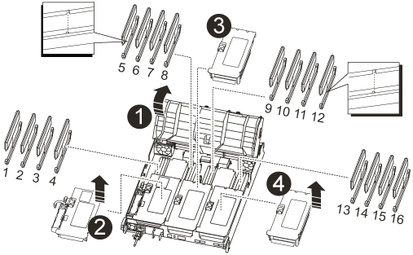

= Ersetzen Sie die Controller-Modul-Hardware - AFF A700s
:allow-uri-read: 
:icons: font
:imagesdir: ../media/

[role="lead"]
Um die Hardware des Controller-Moduls zu ersetzen, müssen Sie den beeinträchtigten Controller entfernen, die FRU-Komponenten in das Ersatzcontrollermodul verschieben, das Ersatzcontrollermodul im Gehäuse installieren und das System dann in den Wartungsmodus booten.

== Schritt 1: Entfernen Sie das Controller-Modul

Sie müssen das Controller-Modul aus dem Chassis entfernen, wenn Sie das Controller-Modul ersetzen oder eine Komponente im Controller-Modul ersetzen.

. Wenn Sie nicht bereits geerdet sind, sollten Sie sich richtig Erden.
. Lösen Sie den Haken- und Schlaufenriemen, mit dem die Kabel am Kabelführungsgerät befestigt sind, und ziehen Sie dann die Systemkabel und SFPs (falls erforderlich) vom Controller-Modul ab, um zu verfolgen, wo die Kabel angeschlossen waren.
+
Lassen Sie die Kabel im Kabelverwaltungs-Gerät so, dass bei der Neuinstallation des Kabelverwaltungsgeräts die Kabel organisiert sind.

. Trennen Sie das Netzteil des Controller-Moduls von der Quelle, und ziehen Sie dann das Kabel vom Netzteil ab.
. Entfernen Sie das Kabelführungs-Gerät aus dem Controller-Modul und legen Sie es beiseite.
. Drücken Sie beide Verriegelungsriegel nach unten, und drehen Sie dann beide Verriegelungen gleichzeitig nach unten.
+
Das Controller-Modul wird leicht aus dem Chassis entfernt.

+
image::../media/drw_a700s_pcm_remove.png[Lösen Sie das Controller-Modul]

+
[cols="1,4"]
|===

 a| 
image:../media/icon_round_1.png["Legende Nummer 1"]
 a| 
Verriegelungsverschluss

 a| 
image:../media/icon_round_2.png["Legende Nummer 2"]
 a| 
Sicherungsstift

|===
. Schieben Sie das Controller-Modul aus dem Gehäuse.
+
Stellen Sie sicher, dass Sie die Unterseite des Controller-Moduls unterstützen, während Sie es aus dem Gehäuse schieben.

. Das Steuermodul auf eine stabile, flache Oberfläche legen und den Luftkanal öffnen:
+
.. Drücken Sie die Verriegelungslaschen an den Seiten des Luftkanals in Richtung der Mitte des Controller-Moduls.
.. Schieben Sie den Luftkanal in Richtung der Lüftermodule, und drehen Sie ihn dann nach oben in die vollständig geöffnete Position.
+
image::../media/drw_a700s_open_air_duct.png[Öffnen Sie den Luftkanal]

+
[cols="1,4"]
|===

 a| 
image:../media/icon_round_1.png["Legende Nummer 1"]
 a| 
Verriegelungsklammern für Luftkanäle

 a| 
image:../media/icon_round_2.png["Legende Nummer 2"]
 a| 
Riser

 a| 
image:../media/icon_round_3.png["Legende Nummer 3"]
 a| 
Luftkanal

|===

== Schritt 2: Verschieben Sie die NVRAM-Karte

Im Rahmen des Controlleraustauschs müssen Sie die NVRAM-Karte vom Riser 1 im Modul für beeinträchtigte Controller entfernen und die Karte in Riser 1 des Ersatzcontrollermoduls installieren. Sie sollten Riser 1 erst wieder in das Ersatzcontrollermodul einsetzen, nachdem Sie die DIMMs vom beeinträchtigten Controller-Modul in das Ersatzcontrollermodul verschoben haben.

. Entfernen Sie den NVRAM-Riser 1 aus dem Controller-Modul:
+
.. Drehen Sie die Riserverriegelung auf der linken Seite des Riser nach oben und zu den Lüftern.
+
Der NVRAM-Riser hebt sich leicht vom Controller-Modul an.

.. Heben Sie den NVRAM-Riser an, und verschieben Sie ihn in Richtung der Lüfter, so dass die Metalllippe auf dem Riser den Rand des Controller-Moduls entfernt, heben Sie den Riser gerade aus dem Controller-Modul heraus. Legen Sie sie dann auf eine stabile, flache Oberfläche, sodass Sie auf die NVRAM-Karte zugreifen können.
+
image::../media/drw_a700s_nvme_replace.png[Ersetzen Sie die NVRAM-Karte]

+
[cols="1,4"]
|===

 a| 
image:../media/icon_round_1.png["Legende Nummer 1"]
 a| 
Luftkanal

 a| 
image:../media/icon_round_2.png["Legende Nummer 2"]
 a| 
Riserkarte 1 Verriegelungsriegel

 a| 
image:../media/icon_round_3.png["Legende Nummer 3"]
 a| 
Stecker des NVRAM-Akkukabels, der an die NVRAM-Karte angeschlossen ist

 a| 
image:../media/icon_round_4.png["Legende Nummer 4"]
 a| 
Kartenverriegelungshalterung

 a| 
image:../media/icon_round_5.png["Legende Nummer 5"]
 a| 
NVRAM-Karte

|===

. Entfernen Sie die NVRAM-Karte aus dem Riser-Modul:
+
.. Drehen Sie das Riser-Modul so, dass Sie auf die NVRAM-Karte zugreifen können.
.. Trennen Sie das an der NVRAM-Karte angeschlossene NVRAM-Akkukabel.
.. Drücken Sie die Sperrhalterung an der Seite des NVRAM-Riser, und drehen Sie sie dann in die offene Position.
.. Entfernen Sie die NVRAM-Karte aus dem Riser-Modul.

. Entfernen Sie den NVRAM-Riser aus dem Ersatzcontrollermodul.
. Installieren Sie die NVRAM-Karte in den NVRAM-Riser:
+
.. Richten Sie die Karte an der Kartenführung am Riser-Modul und dem Kartensockel im Riser aus.
.. Schieben Sie die Karte direkt in den Kartensockel.
+

NOTE: Stellen Sie sicher, dass die Karte vollständig und quadratische Position im Risersteckplatz hat.

.. Schließen Sie das Akkukabel an die Buchse auf der NVRAM-Karte an.
.. Drehen Sie die Verriegelung in die verriegelte Position, und stellen Sie sicher, dass sie einrastet.

== Schritt 3: PCIe-Karten verschieben

Im Rahmen des Controller-Austauschprozesses müssen Sie beide PCIe-Riser-Module, Riser 2 (mittlere Riserkarte) und Riser 3 (Riser ganz rechts), vom beeinträchtigten Controller-Modul entfernen und die PCIe-Karten von den Riser-Modulen entfernen. Und installieren Sie die Karten in den gleichen Riser-Modulen im Ersatz-Controller-Modul. Sobald die DIMMs in das Ersatzcontrollermodul verschoben wurden, installieren Sie die Riser-Module im Ersatzcontrollermodul.

IMPORTANT: Installieren Sie die Steigleitungen des außer Betrieb genommenen Controller-Moduls nicht im Ersatz-Controller-Modul.

. Entfernen Sie den PCIe-Riser aus dem Controller-Modul:
+
.. Entfernen Sie alle SFP-Module, die sich möglicherweise in den PCIe-Karten enthalten sind.
.. Drehen Sie die Modulverriegelung auf der linken Seite des Riser nach oben und in Richtung der Lüftermodule.
+
Der PCIe-Riser hebt sich leicht vom Controller-Modul an.

.. Heben Sie den PCIe-Riser an, und verschieben Sie ihn zu den Lüftern, sodass die Metalllippe auf dem Riser den Rand des Controller-Moduls entfernt, den Riser aus dem Controller-Modul herausheben und dann auf einer stabilen, flachen Oberfläche platzieren.
+
image::../media/drw_a700s_pcie_replace.png[Ersetzen Sie eine PCIe-Karte]

+
[cols="1,4"]
|===

 a| 
image:../media/icon_round_1.png["Legende Nummer 1"]
 a| 
Luftkanal

 a| 
image:../media/icon_round_2.png["Legende Nummer 2"]
 a| 
Riserverriegelung

 a| 
image:../media/icon_round_3.png["Legende Nummer 3"]
 a| 
Kartenverriegelungshalterung

 a| 
image:../media/icon_round_4.png["Legende Nummer 4"]
 a| 
Riser 2 (mittlerer Riser) und PCI-Karten in den Riser-Steckplätzen 2 und 3.

|===

. Entfernen Sie die PCIe-Karte aus dem Riser:
+
.. Drehen Sie den Riser so, dass Sie auf die PCIe-Karte zugreifen können.
.. Drücken Sie die Sicherungshalterung an der Seite des PCIe-Riser und drehen Sie sie dann in die offene Position.
.. Entfernen Sie die PCIe-Karte aus dem Riser.

. Entfernen Sie den entsprechenden Riser aus dem Ersatzcontrollermodul.
. Setzen Sie die PCIe-Karte vom Ersatzcontroller in den Riser ein, und setzen Sie den Riser wieder in den Ersatzcontroller ein:
+
.. Richten Sie die Karte mit der Kartenführung am Riser und dem Kartensockel im Riser aus, und schieben Sie sie anschließend in den Sockel im Riser.
+
Stellen Sie sicher, dass die Karte vollständig und quadratische Position im Risersteckplatz hat.

.. Setzen Sie den Riser wieder in das Ersatz-Controller-Modul ein.
.. Schwenken Sie die Verriegelungsverriegelung, bis sie in die verriegelte Position einrastet.

. Wiederholen Sie die vorherigen Schritte für Riser 3- und PCIe-Karten in den Steckplätzen 4 und 5 im Modul für beeinträchtigte Controller.

== Schritt 4: Verschieben Sie die Startmedien

Die AFF A700s enthält zwei Boot-Medien: Einen primären und einen sekundären oder Backup-Boot-Medium. Sie müssen sie vom beeinträchtigten Controller in den _Replacement_ Controller verschieben und in die entsprechenden Steckplätze im _Replacement_ Controller einbauen.

Die Boot-Medien befinden sich unter Riser 2, dem mittleren PCIe-Riser-Modul. Dieses PCIe-Modul muss entfernt werden, um Zugriff auf die Boot-Medien zu erhalten.

. Suchen Sie das Startmedium:
+
.. Öffnen Sie den Luftkanal, falls erforderlich.
.. Entfernen Sie bei Bedarf die Riserkarte 2, das mittlere PCIe-Modul, indem Sie die Sperrklinke entriegeln und dann den Riser aus dem Controller-Modul entfernen.
+
image::../media/drw_a700s_boot_media_replace.png[Ersetzen Sie das Startmedium]

+
[cols="1,4"]
|===

 a| 
image:../media/icon_round_1.png["Legende Nummer 1"]
 a| 
Luftkanal

 a| 
image:../media/icon_round_2.png["Legende Nummer 2"]
 a| 
Riser 2 (mittleres PCIe-Modul)

 a| 
image:../media/icon_round_3.png["Legende Nummer 3"]
 a| 
Schraube für Boot-Medien

 a| 
image:../media/icon_round_4.png["Legende Nummer 4"]
 a| 
Boot-Medien

|===
. Entfernen Sie die Boot-Medien aus dem Controller-Modul:
+
.. Entfernen Sie mit einem #1 Kreuzschlitzschraubendreher die Schraube, mit der das Bootmedium befestigt ist, und setzen Sie die Schraube an einem sicheren Ort beiseite.
.. Fassen Sie die Seiten des Startmediums an, drehen Sie die Startmedien vorsichtig nach oben, ziehen Sie dann die Startmedien gerade aus dem Sockel und legen Sie sie beiseite.

. Verschieben Sie das Boot-Medium auf das neue Controller-Modul und installieren Sie es:
+

NOTE: Installieren Sie die Boot-Medien in demselben Sockel im Ersatzcontrollermodul, wie sie im beeinträchtigten Controller-Modul installiert wurde; den primären Bootmediensockel (Steckplatz 1) in den primären Bootmedienanschluss und den sekundären Bootmedienanschluss (Steckplatz 2) in den sekundären Bootmediensockel.

+
.. Richten Sie die Kanten der Startmedien am Buchsengehäuse aus, und schieben Sie sie vorsichtig in die Buchse.
.. Drehen Sie das Startmedium nach unten zur Hauptplatine.
.. Befestigen Sie das Bootmedium mit der Boot-Medienschraube am Motherboard.
+
Ziehen Sie die Schraube nicht zu fest, oder beschädigen Sie die Bootsmedien möglicherweise nicht.

== Schritt 5: Bewegen Sie die Lüfter

Sie müssen die Lüfter vom beeinträchtigten Controller-Modul in das Ersatzmodul verschieben, wenn ein ausgefallenes Controller-Modul ersetzt wird.

. Entfernen Sie das Lüftermodul, indem Sie die Verriegelungslaschen an der Seite des Lüftermoduls einklemmen und dann das Lüftermodul gerade aus dem Controller-Modul herausheben.
+
image::../media/drw_a700s_replace_fan.png[Ersetzen Sie einen Lüfter]

+
[cols="1,4"]
|===

 a| 
image:../media/icon_round_1.png["Legende Nummer 1"]
 a| 
Verriegelungslaschen des Lüfters

 a| 
image:../media/icon_round_2.png["Legende Nummer 2"]
 a| 
Lüftermodul

|===
. Schieben Sie das Lüftermodul in das Ersatzcontrollermodul, und installieren Sie dann das Lüftermodul, indem Sie die Kanten an der Öffnung im Controller-Modul ausrichten und das Lüftermodul dann in das Controller-Modul schieben, bis die Verriegelungen einrasten.
. Wiederholen Sie diese Schritte für die übrigen Lüftermodule.

== Schritt 6: System-DIMMs verschieben

Um die DIMMs zu verschieben, suchen und verschieben Sie sie vom beeinträchtigten Controller in den Ersatz-Controller und befolgen Sie die spezifischen Schritte.

. Suchen Sie die DIMMs auf dem Controller-Modul.
+

+
[cols="1,4"]
|===

 a| 
image:../media/icon_round_1.png["Legende Nummer 1"]
 a| 
Luftkanal

 a| 
image:../media/icon_round_2.png["Legende Nummer 2"]
 a| 
Riser 1 und DIMM-Bank 1-4

 a| 
image:../media/icon_round_3.png["Legende Nummer 3"]
 a| 
Riser 2 und DIMM Bänke 5-8 und 9-12

 a| 
image:../media/icon_round_4.png["Legende Nummer 4"]
 a| 
Riser 3 und DIMM-Bank 13-16

|===
. Beachten Sie die Ausrichtung des DIMM-Moduls in den Sockel, damit Sie das DIMM-Modul in die richtige Ausrichtung einsetzen können.
. Werfen Sie das DIMM aus dem Steckplatz, indem Sie die beiden DIMM-Auswerferlaschen auf beiden Seiten des DIMM langsam auseinander drücken und dann das DIMM aus dem Steckplatz schieben.
+

NOTE: Halten Sie das DIMM vorsichtig an den Rändern, um Druck auf die Komponenten auf der DIMM-Leiterplatte zu vermeiden.

. Suchen Sie den Steckplatz, in dem Sie das DIMM installieren.
. Vergewissern Sie sich, dass sich die DIMM-Auswerferlaschen am Anschluss in der geöffneten Position befinden und setzen Sie das DIMM-Auswerfer anschließend in den Steckplatz ein.
+
Das DIMM passt eng in den Steckplatz, sollte aber leicht einpassen. Falls nicht, richten Sie das DIMM-Modul mit dem Steckplatz aus und setzen Sie es wieder ein.

+

NOTE: Prüfen Sie das DIMM visuell, um sicherzustellen, dass es gleichmäßig ausgerichtet und vollständig in den Steckplatz eingesetzt ist.

. Drücken Sie vorsichtig, aber fest auf die Oberseite des DIMM, bis die Auswurfklammern über den Kerben an den Enden des DIMM einrasten.
. Wiederholen Sie diese Schritte für die übrigen DIMMs.

== Schritt 7: Installieren Sie das NVRAM-Modul

Zur Installation des NVRAM-Moduls müssen Sie die entsprechende Sequenz von Schritten befolgen.

. Installieren Sie den Riser in das Controller-Modul:
+
.. Richten Sie die Lippe des Riser an der Unterseite der Bleche des Controller-Moduls aus.
.. Führen Sie den Riser entlang der Stifte im Controller-Modul und senken Sie den Riser anschließend in das Controller-Modul.
.. Drehen Sie die Verriegelung nach unten, und klicken Sie sie in die verriegelte Position.
+
Bei der Verriegelung ist die Verriegelung bündig mit der Oberseite des Riser und der Riser sitzt im Controller-Modul.

.. Setzen Sie alle SFP-Module wieder ein, die von den PCIe-Karten entfernt wurden.

== Schritt 8: Bewegen Sie den NVRAM-Akku

Beim Austausch des Controller-Moduls müssen Sie den NVRAM-Akku vom beeinträchtigten Controller-Modul auf das Ersatzcontrollermodul verschieben

. Suchen Sie den NVRAM-Akku auf der linken Seite des Riser-Moduls, Riser 1.
+
image::../media/drw_a700s_nvme_battery_replace.png[Ersetzen Sie die NVRAM-Batterie]

+
[cols="1,4"]
|===

 a| 
image:../media/icon_round_1.png["Legende Nummer 1"]
 a| 
NVRAM-Batteriestecker

 a| 
image:../media/icon_round_2.png["Legende Nummer 2"]
 a| 
Blaue Verriegelungslasche für NVRAM-Batterien

|===
. Suchen Sie den Batteriestecker, und drücken Sie den Clip auf der Vorderseite des Batteriesteckers, um den Stecker aus der Steckdose zu lösen, und ziehen Sie dann das Akkukabel aus der Steckdose.
. Fassen Sie den Akku an, und drücken Sie die blaue Verriegelungslasche, die mit DRUCKTASTE gekennzeichnet ist, und heben Sie den Akku aus dem Halter und dem Controller-Modul heraus.
. Schieben Sie den Akku in das Ersatzcontrollermodul und installieren Sie ihn dann in den NVRAM-Riser:
+
.. Schieben Sie den Akku entlang der Seitenwand aus Metall nach unten, bis die Halterungen an der Seitenwand in die Steckplätze am Akku einhaken und der Akkupack einrastet und einrastet.
.. Drücken Sie den Akku fest nach unten, um sicherzustellen, dass er fest eingerastet ist.
.. Schließen Sie den Batteriestecker an die Steckerbuchse an, und stellen Sie sicher, dass der Stecker einrastet.

== Schritt 9: Installieren Sie einen PCIe-Riser

Um einen PCIe-Riser zu installieren, müssen Sie eine bestimmte Sequenz von Schritten befolgen.

. Wenn Sie nicht bereits geerdet sind, sollten Sie sich richtig Erden.
. Installieren Sie den Riser in das Controller-Modul:
+
.. Richten Sie die Lippe des Riser an der Unterseite der Bleche des Controller-Moduls aus.
.. Führen Sie den Riser entlang der Stifte im Controller-Modul und senken Sie den Riser anschließend in das Controller-Modul.
.. Drehen Sie die Verriegelung nach unten, und klicken Sie sie in die verriegelte Position.
+
Bei der Verriegelung ist die Verriegelung bündig mit der Oberseite des Riser und der Riser sitzt im Controller-Modul.

.. Setzen Sie alle SFP-Module wieder ein, die von den PCIe-Karten entfernt wurden.

. Wiederholen Sie die vorherigen Schritte für Riser 3- und PCIe-Karten in den Steckplätzen 4 und 5 im Modul für beeinträchtigte Controller.

== Schritt 10: Das Netzteil bewegen

Sie müssen den Netzteilplatzhalter und den Netzteilplatzhalter vom beeinträchtigten Controller-Modul in das Ersatzcontrollermodul verschieben, wenn Sie ein Controller-Modul ersetzen.

. Wenn Sie nicht bereits geerdet sind, sollten Sie sich richtig Erden.
. Drehen Sie den Nockengriff so, dass er verwendet werden kann, um die Stromversorgung aus dem Controller-Modul zu ziehen, während Sie die Verriegelungslasche drücken.
+

CAUTION: Das Netzteil ist kurz. Verwenden Sie immer zwei Hände, um sie zu unterstützen, wenn Sie sie aus dem Controller-Modul entfernen, damit es nicht plötzlich aus dem Controller-Modul schwingen und Sie verletzen.

+
image::../media/drw_a700s_replace_psu.gif[Ersetzen Sie ein Netzteil]

+
[cols="1,4"]
|===

 a| 
image:../media/icon_round_1.png["Legende Nummer 1"]
 a| 
Blaue Verriegelungslasche für die Stromversorgung

 a| 
image:../media/icon_round_2.png["Legende Nummer 2"]
 a| 
Stromversorgung

|===
. Stellen Sie das Netzteil auf das neue Controller-Modul, und installieren Sie es.
. Halten und richten Sie die Kanten des Netzteils mit beiden Händen an der Öffnung im Controller-Modul aus, und drücken Sie dann vorsichtig das Netzteil in das Controller-Modul, bis die Verriegelungslasche einrastet.
+
Die Netzteile werden nur ordnungsgemäß mit dem internen Anschluss in Kontakt treten und auf eine Weise verriegeln.

+

NOTE: Um Schäden am internen Stecker zu vermeiden, sollten Sie beim Einschieben der Stromversorgung in das System keine übermäßige Kraft verwenden.

. Entfernen Sie die PSU-Abdeckplatte aus dem beeinträchtigten Controller-Modul, und setzen Sie sie dann in das Ersatzcontrollermodul ein.

== Schritt 11: Installieren Sie das Controller-Modul

Nachdem alle Komponenten vom beeinträchtigten Controller-Modul in das Ersatzcontrollermodul verschoben wurden, müssen Sie das Ersatzcontrollermodul in das Gehäuse installieren und in den Wartungsmodus starten.

. Wenn Sie nicht bereits geerdet sind, sollten Sie sich richtig Erden.
. Wenn Sie dies noch nicht getan haben, schließen Sie den Luftkanal:
+
.. Schwenken Sie den Luftkanal bis nach unten zum Controller-Modul.
.. Schieben Sie den Luftkanal in Richtung der Steigleitungen, bis die Verriegelungslaschen einrasten.
.. Überprüfen Sie den Luftkanal, um sicherzustellen, dass er richtig sitzt und fest sitzt.
+
image::../media/drw_a700s_close_air_duct.png[Schließen des Luftkanals]

+
[cols="1,4"]
|===

 a| 
image:../media/icon_round_1.png["Legende Nummer 1"]
 a| 
Verriegelungslaschen

 a| 
image:../media/icon_round_2.png["Legende Nummer 2"]
 a| 
Stößel schieben

|===
. Richten Sie das Ende des Controller-Moduls an der Öffnung im Gehäuse aus, und drücken Sie dann vorsichtig das Controller-Modul zur Hälfte in das System.
+

NOTE: Setzen Sie das Controller-Modul erst dann vollständig in das Chassis ein, wenn Sie dazu aufgefordert werden.

. Verkabeln Sie nur die Management- und Konsolen-Ports, sodass Sie auf das System zugreifen können, um die Aufgaben in den folgenden Abschnitten auszuführen.
+

NOTE: Sie schließen die übrigen Kabel später in diesem Verfahren an das Controller-Modul an.

. Führen Sie die Neuinstallation des Controller-Moduls durch:
+
.. Drücken Sie das Controller-Modul fest in das Gehäuse, bis es auf die Mittelebene trifft und vollständig sitzt.
+
Die Verriegelungen steigen, wenn das Controller-Modul voll eingesetzt ist.

+

NOTE: Beim Einschieben des Controller-Moduls in das Gehäuse keine übermäßige Kraft verwenden, um Schäden an den Anschlüssen zu vermeiden.

.. Drehen Sie die Verriegelungsriegel nach oben, und kippen Sie sie so, dass sie die Sicherungsstifte entfernen und dann in die verriegelte Position absenken.
.. Schließen Sie die Netzkabel an die Netzteile an, setzen Sie die Sicherungsmanschette des Netzkabels wieder ein, und schließen Sie dann die Netzteile an die Stromquelle an.
+
Das Controller-Modul startet, sobald die Stromversorgung wiederhergestellt ist. Bereiten Sie sich darauf vor, den Bootvorgang zu unterbrechen.

.. Unterbrechen Sie den Bootvorgang, indem Sie auf drücken `Ctrl-C`.

. Schließen Sie die Systemkabel und die Transceiver-Module an das Controller-Modul an, und installieren Sie das Kabelmanagement-Gerät neu.
. Schließen Sie die Stromkabel an die Netzteile an, und setzen Sie die Netzkabelhalter wieder ein.
. Wenn Ihr System für 10-GbE-Cluster-Interconnect und Datenverbindungen auf 40-GbE-NICs oder Onboard-Ports konfiguriert ist, konvertieren Sie diese Ports mithilfe des cadmin-Befehls aus dem Wartungsmodus in 10-GbE-Verbindungen.
+

NOTE: Achten Sie darauf, den Wartungsmodus nach Abschluss der Konvertierung zu beenden.

