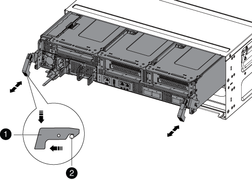
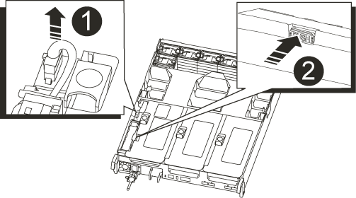
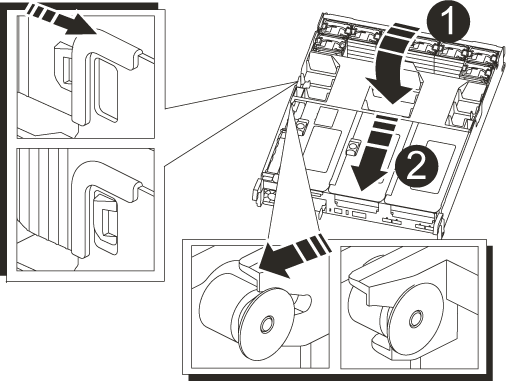

= Die NVRAM-Batterie in Ihrem AFF A700s System ersetzen
:allow-uri-read: 
:icons: font
:imagesdir: ../media/

[role="lead"]
Die NVRAM Batterie in Ihrem AFF A700s System wird ersetzt, indem das Controller Modul entfernt, die Batterie ausgetauscht und das Controller Modul wieder eingebaut wird.

Alle anderen Komponenten des Systems müssen ordnungsgemäß funktionieren. Falls nicht, müssen Sie sich an den technischen Support wenden.

[[step-1-shut-down-the-impaired-controller]]
== Schritt 1: Schalten Sie den beeinträchtigten Regler aus

Übernehmen Sie den fehlerhaften Controller und stoppen Sie ihn, damit der intakte Controller weiterhin Daten aus dem Speicher des fehlerhaften Controllers bereitstellt. Dazu unterdrücken Sie die automatische Fallerstellung in AutoSupport, deaktivieren die automatische Rückgabe und bringen den fehlerhaften Controller zur LOADER-Eingabeaufforderung. Die LOADER-Eingabeaufforderung ist der sichere, angehaltene Zustand, aus dem Sie die FRU ersetzen können.

Wenn Sie über ein Cluster mit mehr als zwei Nodes verfügen, muss es sich im Quorum befinden. Wenn sich das Cluster nicht im Quorum befindet oder ein gesunder Controller FALSE anzeigt, um die Berechtigung und den Zustand zu erhalten, müssen Sie das Problem korrigieren, bevor Sie den beeinträchtigten Controller herunterfahren; siehe link:https://docs.netapp.com/us-en/ontap/system-admin/synchronize-node-cluster-task.html?q=Quorum["Synchronisieren eines Node mit dem Cluster"^].

.Schritte
. Wenn AutoSupport aktiviert ist, unterdrücken Sie die automatische Erstellung eines Cases durch Aufrufen einer AutoSupport Meldung:
+
`system node autosupport invoke -node * -type all -message MAINT=<number of hours down>h`

+
Dies verhindert, dass während Ihres geplanten Wartungsfensters automatisch Supportfälle eröffnet werden. Die maximale Unterdrückungsdauer beträgt 72 Stunden. Falls Ihre Wartung vorzeitig abgeschlossen ist, können Sie die Fallerstellung wieder aktivieren, indem Sie eine AutoSupport-Nachricht mit  `MAINT=END` auslösen. Weitere Informationen finden Sie unter  https://kb.netapp.com/Support_Bulletins/Customer_Bulletins/SU92["Wie man die automatische Fallerstellung während geplanter Wartungsfenster unterdrückt"^].

+
Die folgende AutoSupport Meldung unterdrückt die automatische Erstellung von Cases für zwei Stunden:

+
`cluster1:*> system node autosupport invoke -node * -type all -message MAINT=2h`

. Wenn der beeinträchtigte Controller Teil eines HA-Paars ist, deaktivieren Sie das automatische Giveback von der Konsole des gesunden Controllers: `storage failover modify -node local -auto-giveback false`
. Nehmen Sie den beeinträchtigten Controller zur LOADER-Eingabeaufforderung:
+
[cols="1,2"]
|===
| Wenn der eingeschränkte Controller angezeigt wird... | Dann... 

 a| 
Die LOADER-Eingabeaufforderung
 a| 
Wechseln Sie zu Controller-Modul entfernen.

 a| 
Warten auf Giveback...
 a| 
Drücken Sie Strg-C, und antworten Sie dann `y`.

 a| 
Eingabeaufforderung des Systems oder Passwort (Systempasswort eingeben)
 a| 
Übernehmen oder stoppen Sie den beeinträchtigten Regler von der gesunden Steuerung: `storage failover takeover -ofnode _impaired_node_name_`

Wenn der Regler „beeinträchtigt“ auf Zurückgeben wartet... anzeigt, drücken Sie Strg-C, und antworten Sie dann `y`.

|===

[[step-2-remove-the-controller-module]]
== Schritt 2: Entfernen Sie das Controller-Modul

Sie müssen das Controller-Modul aus dem Chassis entfernen, wenn Sie das Controller-Modul ersetzen oder eine Komponente im Controller-Modul ersetzen.

. Wenn Sie nicht bereits geerdet sind, sollten Sie sich richtig Erden.
. Trennen Sie das Netzteil des Controller-Moduls von der Quelle, und ziehen Sie dann das Kabel vom Netzteil ab.
. Lösen Sie den Haken- und Schlaufenriemen, mit dem die Kabel am Kabelführungsgerät befestigt sind, und ziehen Sie dann die Systemkabel und SFPs (falls erforderlich) vom Controller-Modul ab, um zu verfolgen, wo die Kabel angeschlossen waren.
+
Lassen Sie die Kabel im Kabelverwaltungs-Gerät so, dass bei der Neuinstallation des Kabelverwaltungsgeräts die Kabel organisiert sind.

. Entfernen Sie das Kabelführungs-Gerät aus dem Controller-Modul und legen Sie es beiseite.
. Drücken Sie beide Verriegelungsriegel nach unten, und drehen Sie dann beide Verriegelungen gleichzeitig nach unten.
+
Das Controller-Modul wird leicht aus dem Chassis entfernt.

+

+
[cols="1,4"]
|===

 a| 
image:../media/icon_round_1.png["Legende Nummer 1"]
 a| 
Verriegelungsverschluss

 a| 
image:../media/icon_round_2.png["Legende Nummer 2"]
 a| 
Sicherungsstift

|===
. Schieben Sie das Controller-Modul aus dem Gehäuse.
+
Stellen Sie sicher, dass Sie die Unterseite des Controller-Moduls unterstützen, während Sie es aus dem Gehäuse schieben.

. Stellen Sie das Controller-Modul an einem sicheren Ort beiseite.

[[step-3-replace-the-nvram-battery]]
== Schritt 3: Tauschen Sie die NVRAM-Batterie aus

Um die NVRAM-Batterie auszutauschen, müssen Sie den fehlerhaften NVRAM-Akku aus dem Controller-Modul entfernen und die Ersatz-NVRAM-Batterie in das Controller-Modul installieren.

. Wenn Sie nicht bereits geerdet sind, sollten Sie sich richtig Erden.
. Suchen Sie den NVRAM-Akku auf der linken Seite des Riser-Moduls, Riser 1.
+

+
[cols="1,4"]
|===

 a| 
image:../media/icon_round_1.png["Legende Nummer 1"]
 a| 
NVRAM-Batteriestecker

 a| 
image:../media/icon_round_2.png["Legende Nummer 2"]
 a| 
Blaue Verriegelungslasche für NVRAM-Batterien

|===
. Suchen Sie den Batteriestecker, und drücken Sie den Clip auf der Vorderseite des Batteriesteckers, um den Stecker aus der Steckdose zu lösen, und ziehen Sie dann das Akkukabel aus der Steckdose.
. Drücken Sie die blaue Verriegelungslasche am Batteriehalter, damit die Verriegelung aus der Halterung löst.
. Schieben Sie den Akku nach unten, heben Sie den Akku aus dem Controller heraus und legen Sie ihn dann beiseite.
. Schieben Sie den Ersatzakku entlang der Seitenwand aus Metall nach unten, bis die Halterungen an der Seitenwand in die Steckplätze am Akkupack einhaken und der Akkupack einrastet und einrastet.
. Schließen Sie den Batteriestecker an die Steckerbuchse an, und stellen Sie sicher, dass der Stecker einrastet.

[[step-4-reinstall-the-controller-module]]
== Schritt 4: Installieren Sie das Controller-Modul neu

Nachdem Sie eine Komponente im Controller-Modul ausgetauscht haben, müssen Sie das Controller-Modul im Systemgehäuse neu installieren und starten.

. Wenn Sie nicht bereits geerdet sind, sollten Sie sich richtig Erden.
. Wenn Sie dies noch nicht getan haben, schließen Sie den Luftkanal:
+
.. Schwenken Sie den Luftkanal bis nach unten zum Controller-Modul.
.. Schieben Sie den Luftkanal in Richtung der Steigleitungen, bis die Verriegelungslaschen einrasten.
.. Überprüfen Sie den Luftkanal, um sicherzustellen, dass er richtig sitzt und fest sitzt.
+

+
[cols="1,4"]
|===

 a| 
image:../media/icon_round_1.png["Legende Nummer 1"]
 a| 
Verriegelungslaschen

 a| 
image:../media/icon_round_2.png["Legende Nummer 2"]
 a| 
Stößel schieben

|===

. Richten Sie das Ende des Controller-Moduls an der Öffnung im Gehäuse aus, und drücken Sie dann vorsichtig das Controller-Modul zur Hälfte in das System.
+

NOTE: Setzen Sie das Controller-Modul erst dann vollständig in das Chassis ein, wenn Sie dazu aufgefordert werden.

. Das System nach Bedarf neu einsetzen.
+
Wenn Sie die Medienkonverter (QSFPs oder SFPs) entfernt haben, sollten Sie diese erneut installieren, wenn Sie Glasfaserkabel verwenden.

. Führen Sie die Neuinstallation des Controller-Moduls durch:
+
.. Wenn Sie dies noch nicht getan haben, installieren Sie das Kabelverwaltungsgerät neu.
.. Drücken Sie das Controller-Modul fest in das Gehäuse, bis es auf die Mittelebene trifft und vollständig sitzt.
+
Die Verriegelungen steigen, wenn das Controller-Modul voll eingesetzt ist.

+

NOTE: Beim Einschieben des Controller-Moduls in das Gehäuse keine übermäßige Kraft verwenden, um Schäden an den Anschlüssen zu vermeiden.

.. Drehen Sie die Verriegelungsriegel nach oben, und kippen Sie sie so, dass sie die Sicherungsstifte entfernen und dann in die verriegelte Position absenken.
.. Schließen Sie die Netzkabel an die Netzteile an, setzen Sie die Sicherungsmanschette des Netzkabels wieder ein, und schließen Sie dann die Netzteile an die Stromquelle an.
+
Das Controller-Modul startet, sobald die Stromversorgung wiederhergestellt ist. Bereiten Sie sich darauf vor, den Bootvorgang zu unterbrechen.

. Wenn Ihr System für 10-GbE-Cluster-Interconnect und Datenverbindungen auf 40-GbE-NICs oder Onboard-Ports konfiguriert ist, konvertieren Sie diese Ports mithilfe des cadmin-Befehls aus dem Wartungsmodus in 10-GbE-Verbindungen.
+

NOTE: Achten Sie darauf, den Wartungsmodus nach Abschluss der Konvertierung zu beenden.

. Wiederherstellung des normalen Betriebs des Controllers durch Zurückgeben des Speichers: `storage failover giveback -ofnode _impaired_node_name_`
. Wenn die automatische Rückübertragung deaktiviert wurde, aktivieren Sie sie erneut: `storage failover modify -node local -auto-giveback true`

[[step-5-return-the-failed-part-to-netapp]]
== Schritt 5: Senden Sie das fehlgeschlagene Teil an NetApp zurück

Senden Sie das fehlerhafte Teil wie in den dem Kit beiliegenden RMA-Anweisungen beschrieben an NetApp zurück.  https://mysupport.netapp.com/site/info/rma["Rückgabe und Austausch von Teilen"]Weitere Informationen finden Sie auf der Seite.
