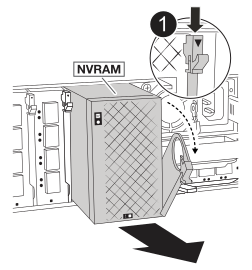

= Chassis austauschen – AFX 2K
:allow-uri-read: 
:icons: font
:imagesdir: ../media/

[role="lead"]
Das Gehäuse Ihres AFX 2K Storage-Systems wird ersetzt, wenn ein Hardwarefehler dies erfordert. Der Austauschprozess umfasst das Entfernen des Controllers, der I/O-Karten, des NVRAM12-Moduls, des Systemmanagement-Moduls und der Netzteile (PSUs), den Einbau des Ersatzgehäuses und die Wiedermontage der Gehäusekomponenten.

== Schritt 1: Entfernen Sie die Netzteile und Kabel

Sie müssen die beiden Netzteile (PSUs) entfernen, bevor Sie den Controller entfernen.

.Schritte
. Entfernen Sie die Netzteile:
+
.. Wenn Sie nicht bereits geerdet sind, sollten Sie sich richtig Erden.
.. Ziehen Sie die Netzkabel von den Netzteilen ab.
.. Entfernen Sie die beiden Netzteile von der Rückseite des Gehäuses, indem Sie den Netzteilgriff nach oben drehen, sodass Sie das Netzteil herausziehen können, drücken Sie auf die Netzteilverriegelungslasche und ziehen Sie das Netzteil dann aus dem Gehäuse.
+

CAUTION: Das Netzteil ist kurz. Verwenden Sie immer zwei Hände, um sie zu unterstützen, wenn Sie sie aus dem Controller-Modul entfernen, damit es nicht plötzlich aus dem Controller-Modul schwingen und Sie verletzen.

+
image::../media/drw_afx_2k_psu_remove_replace_ieops-2882.svg[Netzteil entfernen oder ersetzen]

+
[cols="1,4"]
|===

 a| 
image:../media/icon_round_1.png["Legende Nummer 1"]
 a| 
Verriegelungslasche für das Terrakotta-Netzteil

|===
.. Wiederholen Sie diese Schritte für das zweite Netzteil.

. Entfernen Sie die Kabel:
+
.. Ziehen Sie die Systemkabel und gegebenenfalls die SFP- und QSFP-Module vom Controller-Modul ab, lassen Sie sie jedoch im Kabelverwaltungssystem liegen, damit sie organisiert sind.
+

NOTE: Die Kabel sollten zu Beginn dieses Verfahrens beschriftet worden sein.

.. Entfernen Sie das Kabelmanagementgerät vom Gehäuse und legen Sie es beiseite.

== Schritt 2: Entfernen der E/A-Karten, NVRAM12, NVRAM12-EX und des Systemmanagement-Moduls

. Entfernen Sie das Ziel-I/O-Modul aus dem Gehäuse:
+
image:../media/drw_afx_2k_io_remove_replace_ieops-2878.svg["Entfernen Sie das E/A-Modul"]

+
[cols="1,4"]
|===

 a| 
image:../media/icon_round_1.png["Legende Nummer 1"]
 a| 
E/A-Nockenverriegelung

|===
+
.. Drücken Sie die Nockentaste am Zielmodul.
.. Drehen Sie die Nockenverriegelung so weit wie möglich vom Modul weg.
.. Entfernen Sie das Modul aus dem Gehäuse, indem Sie Ihren Finger in die Öffnung des Nockenhebels einhaken und das Modul aus dem Gehäuse ziehen.
+
Stellen Sie sicher, dass Sie den Steckplatz verfolgen, in dem sich das I/O-Modul befand.

.. Legen Sie das E/A-Modul beiseite und wiederholen Sie diese Schritte für alle anderen E/A-Module.

. Entfernen Sie das NVRAM12-Modul:
+
.. Drücken Sie die Verriegelungsnocken-Taste.
+
Die Nockentaste bewegt sich vom Gehäuse weg.

.. Drehen Sie die Nockenverriegelung so weit wie möglich nach unten.
.. Entfernen Sie das NVRAM-Modul aus dem Gehäuse, indem Sie den Finger in die Öffnung des Nockenhebels einhaken und das Modul aus dem Gehäuse ziehen.
+

+
[cols="1,4"]
|===

 a| 
image:../media/icon_round_1.png["Legende Nummer 1"]
| NVRAM12 Nockenriegel 
|===
.. Stellen Sie das NVRAM-Modul auf eine stabile Oberfläche.

. Das NVRAM12-EX-Modul entfernen:
+
.. Den Griff am Modul greifen und den Verriegelungsnockenknopf eindrücken.
.. Das NVRAM12-EX-Modul wird aus dem Gehäuse gezogen, während die Unterseite des Moduls mit der anderen Hand gestützt wird.
+
image::../media/drw_afx_emr_nv12l_remove_replace_ieops-2879.svg[Das NVRAM12-EX Modul entfernen]

+
[cols="1,4"]
|===

 a| 
image:../media/icon_round_1.png["Legende Nummer 1"]
| NVRAM12-EX Griff und Nockenknopf 
|===
.. Das NVRAM12-EX Modul auf eine stabile Oberfläche stellen.

. Entfernen Sie das Systemverwaltungsmodul:
+
.. Drücken Sie die Nockentaste am System Management-Modul.
.. Den Nockenhebel bis zum gewünschten Winkel nach unten drehen.
.. Den Finger in das Loch am Nockenhebel stecken und das Modul gerade aus dem System ziehen.
+
image::../media/drw_afx_2k_sys_mgmt_remove_replace_ieops-2880.svg[Systemverwaltung entfernen]

+
[cols="1,4"]
|===

 a| 
image::../media/icon_round_1.png[Legende Nummer 1]
 a| 
Nockenverriegelung des Systemmanagementmoduls

|===

== Schritt 3: Entfernen Sie das Controller-Modul

. Haken Sie an der Vorderseite des Geräts die Finger in die Löcher in den Verriegelungsnocken ein, drücken Sie die Laschen an den Nockenhebeln zusammen, und drehen Sie beide Verriegelungen gleichzeitig vorsichtig, aber fest zu sich hin.
+
Das Controller-Modul wird leicht aus dem Chassis entfernt.

+
image::../media/drw_a1k_pcm_remove_replace_ieops-1375.svg[Controller Grafik entfernen]

+
[cols="1,4"]
|===

 a| 
image:../media/icon_round_1.png["Legende Nummer 1"]
| Verriegelungsnocken 
|===
. Schieben Sie das Controller-Modul aus dem Gehäuse und platzieren Sie es auf einer Ebenen, stabilen Oberfläche.
+
Stellen Sie sicher, dass Sie die Unterseite des Controller-Moduls unterstützen, während Sie es aus dem Gehäuse schieben.

== Schritt 4: Ersetzen Sie das beschädigte Chassis

Entfernen Sie das Gehäuse für beeinträchtigte Störungen, und installieren Sie das Ersatzgehäuse.

.Schritte
. Entfernen Sie das Gehäuse für beeinträchtigte Störungen:
+
.. Entfernen Sie die Schrauben von den Montagepunkten des Gehäuses.
.. Schieben Sie das beschädigte Chassis von den Rackschienen in einem Systemschrank oder Geräterack und legen Sie es dann beiseite.

. Installieren Sie das Ersatzgehäuse:
+
.. Installieren Sie das Ersatzgehäuse im Geräterack oder Systemschrank, indem Sie das Gehäuse auf die Rackschienen in einem Systemschrank oder Geräterack führen.
.. Schieben Sie das Chassis vollständig in das Rack oder den Systemschrank der Ausrüstung.
.. Befestigen Sie die Vorderseite des Gehäuses mit den Schrauben, die Sie aus dem Gehäuse für beeinträchtigte Geräte entfernt haben, am Geräte-Rack oder Systemschrank.

== Schritt 5: Installieren der Gehäusekomponenten

Nachdem das Ersatzgehäuse installiert wurde, müssen Sie das Controllermodul installieren, die E/A-Module und das Systemverwaltungsmodul neu verkabeln und dann die Netzteile neu installieren und anschließen.

.Schritte
. Installieren Sie das Controller-Modul:
+
.. Richten Sie das Ende des Controllermoduls an der Öffnung an der Vorderseite des Gehäuses aus und drücken Sie den Controller dann vorsichtig ganz in das Gehäuse hinein.
.. Drehen Sie die Verriegelungsriegel in die verriegelte Position.

. Installieren Sie die E/A-Karten an der Rückseite des Gehäuses:
+
.. Richten Sie das Ende des E/A-Moduls am gleichen Steckplatz im Ersatzgehäuse aus wie im beschädigten Gehäuse und drücken Sie das Modul dann vorsichtig ganz in das Gehäuse hinein.
.. Drehen Sie den Nockenriegel nach oben in die verriegelte Position.
.. Wiederholen Sie diese Schritte für alle anderen E/A-Module.

. Installieren Sie das Systemverwaltungsmodul auf der Rückseite des Gehäuses:
+
.. Richten Sie das Ende des Systemverwaltungsmoduls an der Öffnung im Gehäuse aus und drücken Sie das Modul dann vorsichtig ganz in das Gehäuse hinein.
.. Drehen Sie den Nockenriegel nach oben in die verriegelte Position.
.. Falls Sie dies noch nicht getan haben, installieren Sie das Kabelmanagementgerät neu und schließen Sie die Kabel wieder an die E/A-Karten und das Systemverwaltungsmodul an.
+

NOTE: Wenn Sie die Medienkonverter (QSFPs oder SFPs) entfernt haben, müssen Sie sie erneut installieren.

+
Stellen Sie sicher, dass die Kabel entsprechend der Kabelbeschriftung angeschlossen sind.

. Installieren Sie das NVRAM12-Modul auf der Rückseite des Gehäuses:
+
.. Richten Sie das Ende des NVRAM12-Moduls an der Öffnung im Gehäuse aus und drücken Sie das Modul dann vorsichtig ganz in das Gehäuse hinein.
.. Drehen Sie den Nockenriegel nach oben in die verriegelte Position.

. Installieren Sie die Netzteile:
+
.. Stützen Sie die Kanten des Netzteils mit beiden Händen und richten Sie sie an der Öffnung im Gehäuse aus.
.. Drücken Sie das Netzteil vorsichtig in das Gehäuse, bis die Verriegelungslasche einrastet.
+
Die Netzteile werden nur ordnungsgemäß mit dem internen Anschluss in Kontakt treten und auf eine Weise verriegeln.

+

NOTE: Um eine Beschädigung des internen Anschlusses zu vermeiden, verwenden Sie beim Einschieben des Netzteils in das System keine übermäßige Kraft.

. Schließen Sie die Netzteilkabel wieder an beide Netzteile an und befestigen Sie jedes Netzkabel mit dem Netzkabelhalter am Netzteil.
+
Die Controller-Module beginnen zu starten, sobald die Netzteile installiert sind und die Stromversorgung wiederhergestellt ist.

.Was kommt als Nächstes?
Nach dem Austausch des defekten AFX 2K-Gehäuses und dem Wiedereinbau der Komponenten schließen Sie die link:chassis-replace-complete-system-restore-rma.html["Chassis-Ersatz"] ab.
