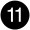

= Informationen zum Hinzufügen und Ersetzen von E/A-Modulen in einem AFX 2K System
:allow-uri-read: 
:icons: font
:imagesdir: ../media/

[role="lead"]
Das AFX 2K Speichersystem bietet Flexibilität beim Erweitern oder Austauschen von I/O-Modulen, um die Netzwerkkonnektivität und die Performance zu verbessern. Das Hinzufügen oder Austauschen eines I/O-Moduls ist erforderlich, wenn Netzwerkfunktionen erweitert werden oder ein ausgefallenes Modul ersetzt werden muss.

Sie können ein defektes E/A-Modul in Ihrem AFX 2K Storage-System durch ein E/A-Modul desselben Typs oder durch ein E/A-Modul eines anderen Typs ersetzen. Es besteht außerdem die Möglichkeit, ein E/A-Modul in ein System mit freien Steckplätzen hinzuzufügen.

* link:io-module-add.html["Fügen Sie ein I/O-Modul hinzu"]
+
Durch das Hinzufügen zusätzlicher Module kann die Redundanz verbessert werden, wodurch sichergestellt wird, dass das System auch bei einem Ausfall eines Moduls betriebsbereit bleibt.

* link:io-module-replace.html["Ersetzen Sie ein E/A-Modul"]
+
Durch das Ersetzen eines fehlerhaften E/A-Moduls kann das System in den optimalen Betriebszustand zurückversetzt werden.

.Nummerierung des E/A-Steckplatzes
Die I/O-Steckplätze des AFX 2K Controllers sind von 1 bis 11 nummeriert, wie in der folgenden Abbildung dargestellt.

image::../media/drw_afx_2k_rear_slots_ieops-2862.svg[Steckplatznummerierung auf einem AFX 2K Controller]

[cols="10%,23%,10%,24%,10%,23%"]
|===
| Slotnummer | I/O Steckplatz | Slotnummer | I/O Steckplatz | Slotnummer | I/O Steckplatz 

 a| 
image::../media/icon_round_1.svg[Legende Nummer 1]
| Hochverfügbarkeit  a| 
image::../media/icon_round_4.svg[Legende Nummer 4]

image::../media/icon_round_5.svg[Legende Nummer 5]
| NVRAM12  a| 
image::../media/icon_round_9.svg[Callout-Nummer 9]
| Netzwerk 

 a| 
image::../media/icon_round_2.svg[Legende Nummer 2]
| Cluster  a| 
image::../media/icon_round_6.svg[Callout-Nummer 6]

| NVRAM12-EX  a| 
image::../media/icon_round_10.svg[Callout-Nummer 10]
| Storage 

 a| 
image::../media/icon_round_3.svg[Legende Nummer 3]
| Netzwerk  a| 
image::../media/icon_round_8.svg[Callout-Nummer 8]
| Storage  a| 

| (*Optional*) Vier 25GbE SFP28 Ports für zusätzliche Management-Konnektivität 
|===