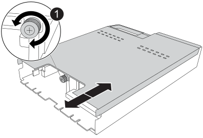

= Den NVRAM12-EX in einem AFX 2K System austauschen
:allow-uri-read: 
:icons: font
:imagesdir: ../media/

[role="lead"]
Das NVRAM12-EX in Ihrem AFX 2K-Speichersystem ist auszutauschen, wenn der nichtflüchtige Speicher defekt ist oder ein Upgrade erforderlich ist. Der Austauschvorgang umfasst das Herunterfahren des betroffenen Controllers, den Austausch des NVRAM12-EX-Moduls, des NVRAM DIMM oder der NVRAM Batterie sowie die Rücksendung des defekten Bauteils an NetApp.

Das NVRAM12-EX Modul besteht aus der NVRAM12 Hardware und vor Ort austauschbaren DIMMs. Ein defektes NVRAM12-EX Modul, die DIMMs oder die NVRAM Batterie im Inneren des NVRAM12-EX Moduls kann ersetzt werden.

.Bevor Sie beginnen
* Stellen Sie sicher, dass Sie das Ersatzteil zur Verfügung haben. Sie müssen die ausgefallene Komponente durch eine von NetApp erhaltene Ersatzkomponente ersetzen.
* Stellen Sie sicher, dass alle anderen Komponenten des Speichersystems ordnungsgemäß funktionieren. Wenn nicht, wenden Sie sich an https://support.netapp.com["NetApp Support"].
+

NOTE: Bevor das NVRAM12-EX Modul ausgetauscht wird, muss der betroffene Controller ausgeschaltet werden, bevor mit dem Austausch fortgefahren wird.

[[step-1-shut-down-the-impaired-controller]]
== Schritt 1: Schalten Sie den beeinträchtigten Regler aus

Schalten Sie den außer Betrieb genommenen Controller aus oder übernehmen Sie ihn.

Übernehmen Sie den fehlerhaften Controller und stoppen Sie ihn, damit der intakte Controller weiterhin Daten aus dem Speicher des fehlerhaften Controllers bereitstellt. Dazu unterdrücken Sie die automatische Fallerstellung in AutoSupport, deaktivieren die automatische Rückgabe und bringen den fehlerhaften Controller zur LOADER-Eingabeaufforderung. Die LOADER-Eingabeaufforderung ist der sichere, angehaltene Zustand, aus dem Sie die FRU ersetzen können.

.Über diese Aufgabe
* Wenn Sie einen Cluster mit mehr als vier Knoten haben, muss dieser im Quorum sein.  Um Clusterinformationen zu Ihren Knoten anzuzeigen, verwenden Sie die `cluster show` Befehl.  Weitere Informationen zum `cluster show` Befehl, siehelink:https://docs.netapp.com/us-en/ontap/system-admin/display-nodes-cluster-task.html["Anzeigen von Details auf Knotenebene in einem ONTAP Cluster"^] .
* Wenn der Cluster nicht im Quorum ist oder wenn der Zustand oder die Berechtigung eines Controllers (mit Ausnahme des beeinträchtigten Controllers) als falsch angezeigt wird, müssen Sie das Problem beheben, bevor Sie den beeinträchtigten Controller herunterfahren. Sehen link:https://docs.netapp.com/us-en/ontap/system-admin/synchronize-node-cluster-task.html?q=Quorum["Synchronisieren eines Node mit dem Cluster"^] .

.Schritte
. Wenn AutoSupport aktiviert ist, unterdrücken Sie die automatische Erstellung eines Cases durch Aufrufen einer AutoSupport Meldung:
+
`system node autosupport invoke -node * -type all -message MAINT=<# of hours>h`

+
Die folgende AutoSupport Meldung unterdrückt die automatische Erstellung von Cases für zwei Stunden:

+
`cluster1:> system node autosupport invoke -node * -type all -message MAINT=2h`

. Deaktivieren Sie die automatische Rückgabe von der Konsole des beeinträchtigten Controllers:
+
`storage failover modify -node impaired-node -auto-giveback-of false`

+

NOTE: Wenn Sie _Möchten Sie die automatische Rückgabe deaktivieren?_ sehen, geben Sie ein `y` .

. Nehmen Sie den beeinträchtigten Controller zur LOADER-Eingabeaufforderung:
+
[cols="1,2"]
|===
| Wenn der eingeschränkte Controller angezeigt wird... | Dann... 

 a| 
Die LOADER-Eingabeaufforderung
 a| 
Fahren Sie mit dem nächsten Schritt fort.

 a| 
Eingabeaufforderung für das System oder Passwort
 a| 
Übernehmen oder stoppen Sie den beeinträchtigten Controller vom fehlerfreien Controller:
`storage failover takeover -ofnode _impaired_node_name_ -halt _true_`

Der Parameter _-halt true_ bringt den beeinträchtigten Knoten zur LOADER-Eingabeaufforderung.

|===

[[step-2-replace-the-nvram12-ex-module-nvram-dimm-or-nvram-battery]]
== Schritt 2: Das NVRAM12-EX Modul, das NVRAM DIMM oder die NVRAM Batterie ersetzen

Das NVRAM12-EX Modul, die NVRAM DIMMs oder die NVRAM Batterie können mit den folgenden Optionen ersetzt werden.

Sie müssen das Controller-Modul aus dem Gehäuse entfernen, wenn Sie das Controller-Modul austauschen oder eine Komponente im Controller-Modul austauschen.

[role="tabbed-block"]
====
.Option 1: Austausch des NVRAM12-EX Moduls
--
Zum Austausch des NVRAM12-EX Moduls ist es im Gehäuse in Steckplatz 6/7 zu lokalisieren und die spezifische Abfolge von Schritten zu befolgen.

. Die NVRAM-Status-LED in Steckplatz 4/5 und die NVRAM12-EX-Status-LED in Steckplatz 6/7 des Systems befinden sich an den angegebenen Positionen. Eine NVRAM LED befindet sich außerdem auf der Frontplatte des Controller-Moduls. Das NV-Symbol ist zu beachten:
+
image::../media/drw_a1K-70-90_nvram-led_ieops-1463.svg[Grafik für die NVRAM-Warnungs- und Status-LED zur Lage]

+
[cols="1,4"]
|===

2+| *NVRAM* 

 a| 
image:../media/icon_round_1.png["Legende Nummer 1"]
 a| 
NVRAM-Status-LED

 a| 
image:../media/icon_round_2.png["Legende Nummer 2"]
 a| 
LED für NVRAM-Warnung

|===
+
image::../media/drw_afx_emr_nvram-led_ieops-2962.svg[Grafik zur Position der Aufmerksamkeits- und Status-LEDs des NVRAM12-EX]

+
[cols="1,4"]
|===

2+| *NVRAM12-EX* 

 a| 
image:../media/icon_round_1.png["Legende Nummer 1"]
 a| 
NVRAM12-EX Status-LED

 a| 
image:../media/icon_round_2.png["Legende Nummer 2"]
 a| 
NVRAM12-EX Attention-LED

|===
+
** Wenn die NV-LED aus ist, mit dem nächsten Schritt fortfahren.
** Wenn die NV-LED blinkt, warten Sie, bis das Blinken beendet ist. Wenn das Blinken länger als 5 Minuten andauert, wenden Sie sich an den technischen Support, um Unterstützung zu erhalten.

. Wenn Sie nicht bereits geerdet sind, sollten Sie sich richtig Erden.
. Ziehen Sie die Stromversorgungskabel der Netzteile vom Controller ab.
. Drehen Sie das Kabelführungs-Fach nach unten, indem Sie die Stifte an den Enden des Fachs vorsichtig herausziehen und das Fach nach unten drehen.
. Das defekte NVRAM12-EX-Modul wird aus dem Gehäuse entfernt:
+
.. Den Verriegelungsnockenknopf eindrücken.
.. Das defekte NVRAM12-EX-Modul wird entfernt, indem das Modul aus dem Gehäuse herausgezogen wird.
+
image::../media/drw_afx_emr_nv12l_remove_replace_ieops-2879.svg[Das NVRAM12-EX Modul entfernen]

+
[cols="1,4"]
|===

 a| 
image:../media/icon_round_1.png["Legende Nummer 1"]
| Nockenverriegelungstaste 
|===

. Das NVRAM12-EX Modul auf eine stabile Oberfläche stellen.
. Die Abdeckung des NVRAM12-EX Moduls wird geöffnet, indem mit den Fingern oder einem Schraubendreher die einzelne Rändelschraube an der Abdeckung gelöst und die Abdeckung vom Modul abgehoben wird.
+

+
[cols="1,4"]
|===

 a| 
image:../media/icon_round_1.png["Legende Nummer 1"]
| Rändelschraube für die NVRAM12-EX Abdeckung 
|===
. Die DIMMs sind einzeln aus dem defekten NVRAM12-EX Modul zu entnehmen und in das Ersatz NVRAM12-EX Modul einzusetzen.
+
image::../media/drw_afx_emr_nv12l_remove_dimms_ieops-2883.svg[Die NVRAM12-EX DIMMs entfernen]

+
[cols="1,4"]
|===

 a| 
image:../media/icon_round_1.png["Legende Nummer 1"]
| DIMM-Verriegelungslaschen 
|===
. Die Batterie vom NVRAM12-EX Modul trennen:
+
.. Den Clip an der Vorderseite des Batteriesteckers zusammendrücken, damit sich der Stecker aus der Buchse löst.
.. Trennen Sie das Akkukabel von der Steckdose.

. Die abgeklemmte Batterie wird entfernt, indem sie nach oben angehoben und aus dem Modul entnommen wird.
+
image::../media/drw_afx_emr_nv12l_remove_battery_ieops-2919.svg[Die NVRAM12-EX Batterie entfernen]

+
[cols="1,4"]
|===

 a| 
image:../media/icon_round_1.png["Legende Nummer 1"]
| NVRAM12-EX Batterieanschlussklemme 
|===
. Die Batterie wird in das Ersatzmodul NVRAM12-EX eingesetzt:
+
.. Den Batterieanschlussclip in die Buchse stecken und darauf achten, dass der Stecker einrastet.
.. Setzen Sie den Akku in den Steckplatz ein, und drücken Sie den Akku fest nach unten, um sicherzustellen, dass er fest eingerastet ist.

. Die Abdeckung des NVRAM12-EX Moduls wird installiert, indem die Abdeckung mit dem Schraubenloch ausgerichtet und mit der Rändelschraube befestigt wird.
. Das Ersatzmodul NVRAM12-EX in das Gehäuse einsetzen:
+
.. Das Modul wird an den Kanten der Gehäuseöffnung in Steckplatz 6/7 ausgerichtet.
.. Das Modul wird vorsichtig bis zum Anschlag in den Schlitz geschoben, sodass es einrastet.

. Drehen Sie das Kabelführungs-Fach bis in die geschlossene Position.

--
.Option 2: Ersetzen Sie das NVRAM-DIMM
--
Um NVRAM DIMMs im NVRAM12-EX Modul auszutauschen, muss das NVRAM12-EX Modul entfernt und anschließend das gewünschte DIMM ersetzt werden.

. Die NVRAM-Status-LED in Steckplatz 4/5 und die NVRAM12-EX-Status-LED in Steckplatz 6/7 des Systems befinden sich an den angegebenen Positionen. Eine NVRAM LED befindet sich außerdem auf der Frontplatte des Controller-Moduls. Das NV-Symbol ist zu beachten:
+
image::../media/drw_a1K-70-90_nvram-led_ieops-1463.svg[Grafik für die NVRAM-Warnungs- und Status-LED zur Lage]

+
[cols="1,4"]
|===

2+| *NVRAM* 

 a| 
image:../media/icon_round_1.png["Legende Nummer 1"]
 a| 
NVRAM-Status-LED

 a| 
image:../media/icon_round_2.png["Legende Nummer 2"]
 a| 
LED für NVRAM-Warnung

|===
+
image::../media/drw_afx_emr_nvram-led_ieops-2962.svg[Grafik zur Position der Aufmerksamkeits- und Status-LEDs des NVRAM12-EX]

+
[cols="1,4"]
|===

2+| *NVRAM12-EX* 

 a| 
image:../media/icon_round_1.png["Legende Nummer 1"]
 a| 
NVRAM12-EX Status-LED

 a| 
image:../media/icon_round_2.png["Legende Nummer 2"]
 a| 
NVRAM12-EX Attention-LED

|===
+
** Wenn die NV-LED aus ist, mit dem nächsten Schritt fortfahren.
** Wenn die NV-LED blinkt, warten Sie, bis das Blinken beendet ist. Wenn das Blinken länger als 5 Minuten andauert, wenden Sie sich an den technischen Support, um Unterstützung zu erhalten.

. Wenn Sie nicht bereits geerdet sind, sollten Sie sich richtig Erden.
. Ziehen Sie die Stromversorgungskabel von den Netzteilen ab.
. Drehen Sie das Kabelführungs-Fach nach unten, indem Sie die Stifte an den Enden des Fachs vorsichtig herausziehen und das Fach nach unten drehen.
. Das Zielmodul NVRAM12-EX aus dem Gehäuse entfernen:
+
.. Den Verriegelungsnockenknopf eindrücken.
.. Das defekte NVRAM12-EX-Modul wird entfernt, indem das Modul aus dem Gehäuse herausgezogen wird.
+
image::../media/drw_afx_emr_nv12l_remove_replace_ieops-2879.svg[Das NVRAM12-EX Modul entfernen]

+
[cols="1,4"]
|===

 a| 
image:../media/icon_round_1.png["Legende Nummer 1"]
| Nockenverriegelungstaste 
|===

. Das NVRAM12-EX Modul auf eine stabile Oberfläche stellen.
. Die Abdeckung des NVRAM12-EX Moduls wird geöffnet, indem mit den Fingern oder einem Schraubendreher die einzelne Rändelschraube an der Abdeckung gelöst und die Abdeckung vom Modul abgehoben wird.
+

+
[cols="1,4"]
|===

 a| 
image:../media/icon_round_1.png["Legende Nummer 1"]
| Rändelschraube für die NVRAM12-EX Abdeckung 
|===
. Das auszutauschende DIMM im NVRAM12-EX-Modul ermitteln.
+

NOTE: Die Positionen der DIMM-Steckplätze 1 und 2 lassen sich anhand des FRU-Kartenetiketts an der Seite des NVRAM12-EX Moduls bestimmen.

. Entfernen Sie das DIMM-Modul, indem Sie die DIMM-Sperrklinken nach unten drücken und das DIMM aus dem Sockel heben.
+
image::../media/drw_afx_emr_nv12l_remove_dimms_ieops-2883.svg[Die NVRAM12-EX DIMMs entfernen]

+
[cols="1,4"]
|===

 a| 
image:../media/icon_round_1.png["Legende Nummer 1"]
| DIMM-Verriegelungslaschen 
|===
. Installieren Sie das ErsatzDIMM, indem Sie das DIMM-Modul am Sockel ausrichten und das DIMM vorsichtig in den Sockel schieben, bis die Verriegelungslaschen einrasten.
. Die Abdeckung des NVRAM12-EX Moduls wird installiert, indem die Abdeckung mit dem Schraubenloch ausgerichtet und mit der Rändelschraube befestigt wird.
. Das NVRAM12-EX-Modul in das Gehäuse einsetzen:
+
.. Das Modul wird vorsichtig vollständig in den Schlitz geschoben, sodass es einrastet.

. Drehen Sie das Kabelführungs-Fach bis in die geschlossene Position.

--
.Option 3: Die NVRAM Batterie austauschen
--
Um NVRAM DIMMs im NVRAM12-EX Modul auszutauschen, muss das NVRAM12-EX Modul entfernt und anschließend die Batterie ersetzt werden.

. Die NVRAM-Status-LED in Steckplatz 4/5 und die NVRAM12-EX-Status-LED in Steckplatz 6/7 des Systems befinden sich an den angegebenen Positionen. Eine NVRAM LED befindet sich außerdem auf der Frontplatte des Controller-Moduls. Das NV-Symbol ist zu beachten:
+
image::../media/drw_a1K-70-90_nvram-led_ieops-1463.svg[Grafik für die NVRAM-Warnungs- und Status-LED zur Lage]

+
[cols="1,4"]
|===

2+| *NVRAM* 

 a| 
image:../media/icon_round_1.png["Legende Nummer 1"]
 a| 
NVRAM-Status-LED

 a| 
image:../media/icon_round_2.png["Legende Nummer 2"]
 a| 
LED für NVRAM-Warnung

|===
+
image::../media/drw_afx_emr_nvram-led_ieops-2962.svg[Grafik zur Position der Aufmerksamkeits- und Status-LEDs des NVRAM12-EX]

+
[cols="1,4"]
|===

2+| *NVRAM12-EX* 

 a| 
image:../media/icon_round_1.png["Legende Nummer 1"]
 a| 
NVRAM12-EX Status-LED

 a| 
image:../media/icon_round_2.png["Legende Nummer 2"]
 a| 
NVRAM12-EX Attention-LED

|===
+
** Wenn die NV-LED aus ist, mit dem nächsten Schritt fortfahren.
** Wenn die NV-LED blinkt, warten Sie, bis das Blinken beendet ist. Wenn das Blinken länger als 5 Minuten andauert, wenden Sie sich an den technischen Support, um Unterstützung zu erhalten.

. Wenn Sie nicht bereits geerdet sind, sollten Sie sich richtig Erden.
. Ziehen Sie die Stromversorgungskabel von den Netzteilen ab.
. Drehen Sie das Kabelführungs-Fach nach unten, indem Sie die Stifte an den Enden des Fachs vorsichtig herausziehen und das Fach nach unten drehen.
. Das Zielmodul NVRAM12-EX aus dem Gehäuse entfernen:
+
.. Den Verriegelungsnockenknopf eindrücken.
.. Das defekte NVRAM12-EX-Modul wird entfernt, indem das Modul aus dem Gehäuse herausgezogen wird.
+
image::../media/drw_afx_emr_nv12l_remove_replace_ieops-2879.svg[Das NVRAM12-EX Modul entfernen]

+
[cols="1,4"]
|===

 a| 
image:../media/icon_round_1.png["Legende Nummer 1"]
| Nockenverriegelungstaste 
|===

. Das NVRAM12-EX Modul auf eine stabile Oberfläche stellen.
. Die Abdeckung des NVRAM12-EX Moduls wird geöffnet, indem mit den Fingern oder einem Schraubendreher die einzelne Rändelschraube an der Abdeckung gelöst und die Abdeckung vom Modul abgehoben wird.
+

+
[cols="1,4"]
|===

 a| 
image:../media/icon_round_1.png["Legende Nummer 1"]
| Rändelschraube für die NVRAM12-EX Abdeckung 
|===
. Die Batterie vom NVRAM12-EX Modul trennen:
+
.. Den Clip an der Vorderseite des Batteriesteckers zusammendrücken, damit sich der Stecker aus der Buchse löst.
.. Trennen Sie das Akkukabel von der Steckdose.

. Die abgeklemmte Batterie wird entfernt, indem sie nach oben angehoben und aus dem Modul entnommen wird.
+
image::../media/drw_afx_emr_nv12l_remove_battery_ieops-2919.svg[Die NVRAM12-EX Batterie entfernen]

+
[cols="1,4"]
|===

 a| 
image:../media/icon_round_1.png["Legende Nummer 1"]
| NVRAM12-EX Batterieanschlussklemme 
|===
. Entfernen Sie den Ersatzakku aus der Verpackung.
. Den Ersatzakku in das NVRAM12-EX Modul einsetzen:
+
.. Den Batterieanschlussclip in die Buchse stecken und darauf achten, dass der Stecker einrastet.
.. Setzen Sie den Akku in den Steckplatz ein, und drücken Sie den Akku fest nach unten, um sicherzustellen, dass er fest eingerastet ist.

. Die Abdeckung des NVRAM12-EX Moduls wird installiert, indem die Abdeckung mit dem Schraubenloch ausgerichtet und mit der Rändelschraube befestigt wird.
. Das NVRAM12-EX-Modul in das Gehäuse einsetzen:
+
.. Das Modul wird vorsichtig vollständig in den Schlitz geschoben, sodass es einrastet.

. Drehen Sie das Kabelführungs-Fach bis in die geschlossene Position.

--
====

[[step-3-reboot-the-controller]]
== Schritt 3: Starten Sie den Controller neu

Nachdem Sie die FRU ersetzt haben, müssen Sie das Controller-Modul neu booten.

. Stecken Sie die Stromkabel wieder in das Netzteil.
+
Das System wird neu gebootet, normalerweise bis zur LOADER-Eingabeaufforderung.

. Eingeben `bye` an der LOADER-Eingabeaufforderung.

[[step-4-complete-nvram12-ex-replacement]]
== Schritt 4: NVRAM12-EX-Austausch abschließen

Führen Sie die folgenden Schritte durch, um den Austausch des NVRAM12-EX abzuschließen.

.Schritte
. Überprüfen Sie vom fehlerfreien Controller aus, ob die neue Partnersystem-ID automatisch zugewiesen wurde:
`_storage failover show_`
+
In der Befehlsausgabe sollte eine Meldung angezeigt werden, die den aktuellen Status des Speicheraustauschs anzeigt. Im folgenden Beispiel hat  `node2` einen Austausch durchlaufen und zeigt den aktuellen Status als  `In takeover` an.

+
[listing]
----
node1:> storage failover show
                                    Takeover
Node              Partner           Possible     State Description
------------      ------------      --------     -------------------------------------
node1             node2             false        In takeover
node2             node1             -            Waiting for giveback
----
. Geben Sie den Controller zurück:
+
.. Vom intakten Controller aus den Speicher des ausgetauschten Controllers zurückgeben: `_storage failover giveback -ofnode impaired_node_name_`
+
Der Controller nimmt seinen Storage wieder auf und schließt den Bootvorgang ab.

+

NOTE: Wenn das Rückübertragung ein Vetorecht ist, können Sie erwägen, das Vetos außer Kraft zu setzen.

+
Weitere Informationen finden Sie im https://docs.netapp.com/us-en/ontap/high-availability/ha_manual_giveback.html#if-giveback-is-interrupted["Manuelle Giveback-Befehle"^] Thema, um das Veto zu überschreiben.

.. Nach Abschluss der Rückgabe muss sichergestellt werden, dass das HA-Paar in einem ordnungsgemäßen Zustand ist und dass ein Takeover möglich ist: _Storage Failover show_
+
Die Ausgabe von der `storage failover show` Befehl sollte nicht die in der Partnernachricht geänderte System-ID enthalten.

. Überprüfen Sie, ob für jeden Controller die erwarteten Volumes vorhanden sind:
+
`vol show -node node-name`

. Drücken Sie <enter>, wenn die Konsolenmeldungen angehalten werden.
+
** Wenn die _Anmeldeaufforderung_ angezeigt wird, fahren Sie mit dem nächsten Schritt fort.
** Wenn keine Anmeldeaufforderung angezeigt wird, melden Sie sich beim Partnerknoten an.

. Warten Sie 5 Minuten, nachdem der Giveback-Bericht abgeschlossen ist, und prüfen Sie den Failover-Status und den Giveback-Status:
+
`storage failover show`Und `storage failover show-giveback`

+

NOTE: Der folgende Befehl ist nur auf der Berechtigungsebene „Diagnosemodus“ verfügbar.

. Wenn die automatische Rückübertragung deaktiviert wurde, aktivieren Sie sie erneut:
+
`storage failover modify -node local -auto-giveback-of true`

. Wenn AutoSupport aktiviert ist, können Sie die automatische Fallerstellung wiederherstellen/zurücknehmen:
+
`system node autosupport invoke -node * -type all -message MAINT=END`

[[step-5-return-the-failed-part-to-netapp]]
== Schritt 5: Senden Sie das fehlgeschlagene Teil an NetApp zurück

Senden Sie das fehlerhafte Teil wie in den dem Kit beiliegenden RMA-Anweisungen beschrieben an NetApp zurück.  https://mysupport.netapp.com/site/info/rma["Rückgabe und Austausch von Teilen"]Weitere Informationen finden Sie auf der Seite.
