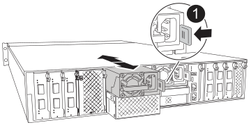

= Netzteil austauschen – AFX 2K
:allow-uri-read: 
:icons: font
:imagesdir: ../media/

[role="lead"]
Ein Austausch des AC-Netzteils (PSU) im AFX 2K-Speichersystem erfolgt bei Ausfall oder Defekt, sodass das System weiterhin mit der erforderlichen Energie für einen stabilen Betrieb versorgt wird. Der Austauschprozess umfasst das Trennen des betreffenden Netzteils, das Abziehen des Netzkabels, das Entfernen des defekten Netzteils und das Einsetzen des Ersatz-Netzteils, gefolgt vom erneuten Anschluss an die Stromquelle.

.Über diese Aufgabe
* Dieses Verfahren wird für den Austausch eines Netzteils auf einmal beschrieben.
+

IMPORTANT: Vermischen Sie PSUs nicht mit unterschiedlichen Effizienzwerten. Immer ersetzen wie für „Gefällt mir“.

* Die Netzteile sind redundant und Hot-Swap-fähig; Sie müssen den Controller nicht übernehmen, um diese Aufgabe auszuführen.

CAUTION: Tragen Sie bei Installations- und Wartungsarbeiten stets ein geerdetes Armband, das mit einem geprüften Erdungspunkt verbunden ist. Die Nichtbeachtung der richtigen ESD-Schutzmaßnahmen kann zu dauerhaften Schäden an Controller-Knoten, Storage Shelves und Network Switches führen.

.Schritte
. Identifizieren Sie das Netzteil, das Sie ersetzen möchten, basierend auf Konsolenfehlermeldungen oder durch die rote Fehler-LED am Netzteil.
. Trennen Sie das Netzteil:
+
.. Öffnen Sie die Stromkabelhalterung, und ziehen Sie dann das Netzkabel vom Netzteil ab.

. Entfernen Sie das Netzteil, indem Sie den Griff nach oben drehen, die Verriegelungslasche drücken und dann das Netzteil aus dem Controller-Modul herausziehen.
+

CAUTION: Das Netzteil ist kompakt.  Halten Sie es beim Entfernen mit beiden Händen fest, um zu verhindern, dass es vom Controllermodul herunterschwingt und Verletzungen verursacht.

+

+
[cols="1,4"]
|===

 a| 
image:../media/icon_round_1.png["Legende Nummer 1"]
 a| 
Verriegelungslasche für das Terrakotta-Netzteil

|===
. Installieren Sie das Ersatz-Netzteil im Controller-Modul:
+
.. Stützen und richten Sie die Kanten des Ersatznetzteils mit beiden Händen an der Öffnung im Controller-Modul aus.
.. Schieben Sie das Netzteil vorsichtig in das Controller-Modul, bis die Verriegelungsklammer einrastet.
+
Die Netzteile werden nur ordnungsgemäß mit dem internen Anschluss in Kontakt treten und auf eine Weise verriegeln.

+

NOTE: Um eine Beschädigung des internen Anschlusses zu vermeiden, verwenden Sie beim Einschieben des Netzteils in das System keine übermäßige Kraft.

. Schließen Sie die Netzteilverkabelung wieder an:
+
.. Schließen Sie das Netzkabel wieder an das Netzteil an.
.. Befestigen Sie das Netzkabel mit der Netzkabelhalterung am Netzteil.

+
Sobald das Netzteil wieder mit Strom versorgt wird, sollte die Status-LED grün leuchten.

. Senden Sie das fehlerhafte Teil wie in den dem Kit beiliegenden RMA-Anweisungen beschrieben an NetApp zurück.  https://mysupport.netapp.com/site/info/rma["Rückgabe und Austausch von Teilen"^]Weitere Informationen finden Sie auf der Seite.

