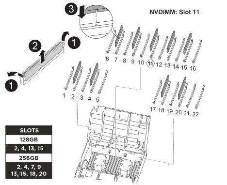

= Ersetzen Sie ein NVDIMM - ASA C400
:allow-uri-read: 
:icons: font
:imagesdir: ../media/

[role="lead"]
Sie müssen das NVDIMM im Controller-Modul ersetzen, wenn sich Ihr System registriert, dass die Flashlebensdauer fast am Ende liegt oder dass das identifizierte NVDIMM im Allgemeinen nicht ordnungsgemäß ist. Andernfalls kommt es zu einer Systempanik.

Alle anderen Komponenten des Systems müssen ordnungsgemäß funktionieren. Falls nicht, müssen Sie sich an den technischen Support wenden.

Sie müssen die fehlerhafte Komponente durch eine vom Anbieter empfangene Ersatz-FRU-Komponente ersetzen.

== Schritt 1: Schalten Sie den beeinträchtigten Regler aus

Fahren Sie den Controller mit eingeschränkter Konfiguration herunter oder übernehmen Sie ihn entsprechend.

[role="tabbed-block"]
====
.Option 1: Die meisten Konfigurationen
--
Um den beeinträchtigten Controller herunterzufahren, müssen Sie den Status des Controllers bestimmen und gegebenenfalls den Controller übernehmen, damit der gesunde Controller weiterhin Daten aus dem beeinträchtigten Reglerspeicher bereitstellen kann.

.Über diese Aufgabe
* Wenn Sie über ein SAN-System verfügen, müssen Sie Ereignismeldungen geprüft haben  `cluster kernel-service show`) Für beeinträchtigte Controller SCSI-Blade. Der `cluster kernel-service show` Der Befehl zeigt den Node-Namen, den Quorum-Status dieses Node, den Verfügbarkeitsstatus dieses Node und den Betriebsstatus dieses Node an.
+
Jeder Prozess des SCSI-Blades sollte sich im Quorum mit den anderen Nodes im Cluster befinden. Probleme müssen behoben werden, bevor Sie mit dem Austausch fortfahren.

* Wenn Sie über ein Cluster mit mehr als zwei Nodes verfügen, muss es sich im Quorum befinden. Wenn sich das Cluster nicht im Quorum befindet oder ein gesunder Controller FALSE anzeigt, um die Berechtigung und den Zustand zu erhalten, müssen Sie das Problem korrigieren, bevor Sie den beeinträchtigten Controller herunterfahren; siehe link:https://docs.netapp.com/us-en/ontap/system-admin/synchronize-node-cluster-task.html?q=Quorum["Synchronisieren eines Node mit dem Cluster"^].

.Schritte
. Wenn AutoSupport aktiviert ist, unterdrücken Sie die automatische Erstellung eines Cases durch Aufrufen einer AutoSupport Meldung: `system node autosupport invoke -node * -type all -message MAINT=number_of_hours_downh`
+
Die folgende AutoSupport Meldung unterdrückt die automatische Erstellung von Cases für zwei Stunden: `cluster1:> system node autosupport invoke -node * -type all -message MAINT=2h`

. Deaktivieren Sie das automatische Giveback von der Konsole des gesunden Controllers: `storage failover modify –node local -auto-giveback false`
+

NOTE: Wenn Sie sehen _Möchten Sie Auto-Giveback deaktivieren?_, geben Sie ein `y`.

. Nehmen Sie den beeinträchtigten Controller zur LOADER-Eingabeaufforderung:
+
[cols="1,2"]
|===
| Wenn der eingeschränkte Controller angezeigt wird... | Dann... 

 a| 
Die LOADER-Eingabeaufforderung
 a| 
Fahren Sie mit dem nächsten Schritt fort.

 a| 
Warten auf Giveback...
 a| 
Drücken Sie Strg-C, und antworten Sie dann `y` Wenn Sie dazu aufgefordert werden.

 a| 
Eingabeaufforderung für das System oder Passwort
 a| 
Übernehmen oder stoppen Sie den beeinträchtigten Regler von der gesunden Steuerung: `storage failover takeover -ofnode _impaired_node_name_`

Wenn der Regler „beeinträchtigt“ auf Zurückgeben wartet... anzeigt, drücken Sie Strg-C, und antworten Sie dann `y`.

|===

--
.Option 2: Controller befindet sich in einem MetroCluster mit zwei Nodes
--
Um den beeinträchtigten Controller herunterzufahren, müssen Sie den Status des Controllers bestimmen und gegebenenfalls den Controller umschalten, damit der gesunde Controller weiterhin Daten aus dem beeinträchtigten Reglerspeicher bereitstellen kann.

.Über diese Aufgabe
* Sie müssen die Netzteile am Ende dieses Verfahrens einschalten, um den gesunden Controller mit Strom zu versorgen.

.Schritte
. Überprüfen Sie den MetroCluster-Status, um festzustellen, ob der beeinträchtigte Controller automatisch auf den gesunden Controller umgeschaltet wurde: `metrocluster show`
. Je nachdem, ob eine automatische Umschaltung stattgefunden hat, fahren Sie mit der folgenden Tabelle fort:
+
[cols="1,2"]
|===
| Wenn die eingeschränkte Steuerung... | Dann... 

 a| 
Ist automatisch umgeschaltet
 a| 
Fahren Sie mit dem nächsten Schritt fort.

 a| 
Nicht automatisch umgeschaltet
 a| 
Einen geplanten Umschaltvorgang vom gesunden Controller durchführen: `metrocluster switchover`

 a| 
Hat nicht automatisch umgeschaltet, haben Sie versucht, mit dem zu wechseln `metrocluster switchover` Befehl und Switchover wurde vetoed
 a| 
Überprüfen Sie die Veto-Meldungen, und beheben Sie das Problem, wenn möglich, und versuchen Sie es erneut. Wenn das Problem nicht behoben werden kann, wenden Sie sich an den technischen Support.

|===
. Synchronisieren Sie die Datenaggregate neu, indem Sie das ausführen `metrocluster heal -phase aggregates` Befehl aus dem verbleibenden Cluster.
+
[listing]
----
controller_A_1::> metrocluster heal -phase aggregates
[Job 130] Job succeeded: Heal Aggregates is successful.
----
+
Wenn die Heilung ein Vetorecht ist, haben Sie die Möglichkeit, das zurückzugeben `metrocluster heal` Befehl mit dem `-override-vetoes` Parameter. Wenn Sie diesen optionalen Parameter verwenden, überschreibt das System alle weichen Vetos, die die Heilung verhindern.

. Überprüfen Sie, ob der Vorgang mit dem befehl „MetroCluster Operation show“ abgeschlossen wurde.
+
[listing]
----
controller_A_1::> metrocluster operation show
    Operation: heal-aggregates
      State: successful
Start Time: 7/25/2016 18:45:55
   End Time: 7/25/2016 18:45:56
     Errors: -
----
. Überprüfen Sie den Status der Aggregate mit `storage aggregate show` Befehl.
+
[listing]
----
controller_A_1::> storage aggregate show
Aggregate     Size Available Used% State   #Vols  Nodes            RAID Status
--------- -------- --------- ----- ------- ------ ---------------- ------------
...
aggr_b2    227.1GB   227.1GB    0% online       0 mcc1-a2          raid_dp, mirrored, normal...
----
. Heilen Sie die Root-Aggregate mit dem `metrocluster heal -phase root-aggregates` Befehl.
+
[listing]
----
mcc1A::> metrocluster heal -phase root-aggregates
[Job 137] Job succeeded: Heal Root Aggregates is successful
----
+
Wenn die Heilung ein Vetorecht ist, haben Sie die Möglichkeit, das zurückzugeben `metrocluster heal` Befehl mit dem Parameter -override-vetoes. Wenn Sie diesen optionalen Parameter verwenden, überschreibt das System alle weichen Vetos, die die Heilung verhindern.

. Stellen Sie sicher, dass der Heilungsvorgang abgeschlossen ist, indem Sie den verwenden `metrocluster operation show` Befehl auf dem Ziel-Cluster:
+
[listing]
----

mcc1A::> metrocluster operation show
  Operation: heal-root-aggregates
      State: successful
 Start Time: 7/29/2016 20:54:41
   End Time: 7/29/2016 20:54:42
     Errors: -
----
. Trennen Sie am Controller-Modul mit eingeschränkter Betriebsstörung die Netzteile.

--
====

== Schritt 2: Entfernen Sie das Controller-Modul

Um auf Komponenten im Controller-Modul zuzugreifen, müssen Sie das Controller-Modul aus dem Gehäuse entfernen.

. Wenn Sie nicht bereits geerdet sind, sollten Sie sich richtig Erden.
. Lösen Sie die Netzkabelhalter, und ziehen Sie anschließend die Kabel von den Netzteilen ab.
. Lösen Sie den Haken- und Schlaufenriemen, mit dem die Kabel am Kabelführungsgerät befestigt sind, und ziehen Sie dann die Systemkabel und SFPs (falls erforderlich) vom Controller-Modul ab, um zu verfolgen, wo die Kabel angeschlossen waren.
+
Lassen Sie die Kabel im Kabelverwaltungs-Gerät so, dass bei der Neuinstallation des Kabelverwaltungsgeräts die Kabel organisiert sind.

. Entfernen Sie das Kabelführungs-Gerät aus dem Controller-Modul und legen Sie es beiseite.
. Drücken Sie beide Verriegelungsriegel nach unten, und drehen Sie dann beide Verriegelungen gleichzeitig nach unten.
+
Das Controller-Modul wird leicht aus dem Chassis entfernt.

+
image::../media/drw_c400_remove_controller_IEOPS-1216.svg[drw c400 Controller IEOPS 1216 entfernen]

+
[cols="10,90"]
|===

 a| 
image:../media/legend_icon_01.png["Legende Nummer 1"]
 a| 
Verriegelungsriegel

 a| 
image:../media/legend_icon_02.png["Legende Nummer 2"]
 a| 
Der Controller bewegt sich leicht aus dem Chassis

|===
. Schieben Sie das Controller-Modul aus dem Gehäuse.
+
Stellen Sie sicher, dass Sie die Unterseite des Controller-Moduls unterstützen, während Sie es aus dem Gehäuse schieben.

. Stellen Sie das Controller-Modul auf eine stabile, flache Oberfläche.

== Schritt 3: Ersetzen Sie das NVDIMM

Um das NVDIMM auszutauschen, müssen Sie es im Controller-Modul mithilfe der FRU-Karte oben am Luftkanal oder der FRU-Karte oben auf dem Steckplatz 1-Riser suchen.

* Die NVDIMM-LED blinkt während des Destaging der Inhalte, wenn Sie das System anhalten. Nach Abschluss der Abscheidungen schaltet sich die LED aus.
* Obwohl der Inhalt des NVDIMM verschlüsselt ist, empfiehlt es sich, den Inhalt des NVDIMM vor dem Ersetzen zu löschen. Weitere Informationen finden Sie im https://mysupport.netapp.com/info/web/ECMP1132988.html["Angaben zu flüchtigem Speicher"] Auf der NetApp Support Site
+

NOTE: Sie müssen sich auf der NetApp Support Site anmelden, um das _Statement of Volatility_ für Ihr System anzuzeigen.

Sie können das NVDIMM mit den folgenden Animationen, Abbildungen oder geschriebenen Schritten ersetzen.

NOTE: In der Animation werden leere Steckplätze für Sockel ohne DIMMs angezeigt. Diese leeren Buchsen sind mit Leereinschüben bestückt.

.Animation - Ersetzen Sie das NVDIMM
video::7dfe09d8-eff8-41e3-9eb4-b03100032579[panopto]

[cols="10,90"]
|===

 a| 
image:../media/legend_icon_01.png["Legende Nummer 1"]
 a| 
DIMM-Verriegelungslaschen

 a| 
image:../media/legend_icon_02.png["Legende Nummer 2"]
 a| 
DIMM

 a| 
image:../media/legend_icon_03.png["Legende Nummer 3"]
 a| 
DIMM-Sockel

|===
. Öffnen Sie den Luftkanal, und suchen Sie anschließend das NVDIMM in Steckplatz 11 des Controller-Moduls.
+

NOTE: NVDIMM sieht deutlich anders aus als System-DIMMs.

. Werfen Sie das NVDIMM aus dem Steckplatz, indem Sie die beiden NVDIMM-Auswerfer-Laschen auf beiden Seiten des NVDIMM langsam auseinander schieben, und schieben Sie dann das NVDIMM aus dem Sockel, und legen Sie es beiseite.
+

NOTE: Halten Sie das NVDIMM vorsichtig an den Kanten, um Druck auf die Komponenten auf der NVDIMM-Leiterplatte zu vermeiden.

. Entfernen Sie das NVDIMM-Ersatzfach aus dem antistatischen Versandbeutel, halten Sie das NVDIMM an den Ecken und richten Sie es dann am Steckplatz aus.
+
Die Kerbe zwischen den Stiften am NVDIMM sollte mit der Lasche im Sockel aufliegen.

. Suchen Sie den Steckplatz, in dem Sie das NVDIMM installieren.
. Setzen Sie den NVDIMM in den Steckplatz ein.
+
Das NVDIMM passt eng in den Steckplatz, sollte aber leicht in gehen. Falls nicht, bauen Sie das NVDIMM mit dem Steckplatz aus und setzen Sie es wieder ein.

+

NOTE: Sichtprüfung des NVDIMM, um sicherzustellen, dass es gleichmäßig ausgerichtet und vollständig in den Steckplatz eingesetzt ist.

. Drücken Sie vorsichtig, aber fest auf der Oberseite des NVDIMM, bis die Auswurfklammern über den Kerben an den Enden des NVDIMM einrasten.
. Schließen Sie den Luftkanal.

== Schritt 4: Installieren Sie das Controller-Modul

Nachdem Sie die Komponente im Controller-Modul ersetzt haben, müssen Sie das Controller-Modul wieder in das Gehäuse einsetzen und dann im Wartungsmodus booten.

. Wenn Sie dies noch nicht getan haben, schließen Sie den Luftkanal.
. Richten Sie das Ende des Controller-Moduls an der Öffnung im Gehäuse aus, und drücken Sie dann vorsichtig das Controller-Modul zur Hälfte in das System.
+

NOTE: Setzen Sie das Controller-Modul erst dann vollständig in das Chassis ein, wenn Sie dazu aufgefordert werden.

. Verkabeln Sie nur die Management- und Konsolen-Ports, sodass Sie auf das System zugreifen können, um die Aufgaben in den folgenden Abschnitten auszuführen.
+

NOTE: Sie schließen die übrigen Kabel später in diesem Verfahren an das Controller-Modul an.

. Schließen Sie die Installation des Controller-Moduls ab:
+
.. Schließen Sie das Netzkabel an das Netzteil an, setzen Sie die Sicherungshülse des Netzkabels wieder ein, und schließen Sie dann das Netzteil an die Stromquelle an.
.. Schieben Sie das Controller-Modul mithilfe der Verriegelungen fest in das Gehäuse, bis sich die Verriegelungsriegel erheben.
+

NOTE: Beim Einschieben des Controller-Moduls in das Gehäuse keine übermäßige Kraft verwenden, um Schäden an den Anschlüssen zu vermeiden.

.. Setzen Sie das Controller-Modul vollständig in das Gehäuse ein, indem Sie die Verriegelungsriegel nach oben drehen, kippen Sie sie so, dass sie die Sicherungsstifte entfernen, den Controller vorsichtig ganz nach innen schieben und dann die Verriegelungsriegel in die verriegelte Position senken.
+
Das Controller-Modul beginnt zu booten, sobald es vollständig im Gehäuse sitzt. Bereiten Sie sich darauf vor, den Bootvorgang zu unterbrechen.

.. Wenn Sie dies noch nicht getan haben, installieren Sie das Kabelverwaltungsgerät neu.
.. Unterbrechen Sie den normalen Boot-Prozess und booten Sie zu LOADER, indem Sie drücken `Ctrl-C`.
+

NOTE: Wenn das System im Startmenü stoppt, wählen Sie die Option zum Booten in LOADER.

.. Geben Sie an der LOADER-Eingabeaufforderung ein `bye` Um die PCIe-Karten und andere Komponenten neu zu initialisieren.
.. Unterbrechen Sie den Boot-Prozess und booten Sie an der LOADER-Eingabeaufforderung, indem Sie drücken `Ctrl-C`.
+
Wenn das System im Startmenü stoppt, wählen Sie die Option zum Booten in LOADER.

== Schritt 5: Stellen Sie das Controller-Modul wieder in Betrieb

Sie müssen das System neu verstellen, das Controller-Modul zurückgeben und dann das automatische Giveback erneut aktivieren.

. Das System nach Bedarf neu einsetzen.
+
Wenn Sie die Medienkonverter (QSFPs oder SFPs) entfernt haben, sollten Sie diese erneut installieren, wenn Sie Glasfaserkabel verwenden.

. Wiederherstellung des normalen Betriebs des Controllers durch Zurückgeben des Speichers: `storage failover giveback -ofnode _impaired_node_name_`
. Wenn die automatische Rückübertragung deaktiviert wurde, aktivieren Sie sie erneut: `storage failover modify -node local -auto-giveback true`

== Schritt 6: Aggregate in einer MetroCluster Konfiguration mit zwei Nodes zurückwechseln

Nachdem Sie in einer MetroCluster Konfiguration mit zwei Nodes den FRU-Austausch abgeschlossen haben, können Sie den MetroCluster SwitchBack-Vorgang durchführen. Damit wird die Konfiguration in ihren normalen Betriebszustand zurückversetzt, wobei die Synchronisations-Storage Virtual Machines (SVMs) auf dem ehemals beeinträchtigten Standort jetzt aktiv sind und Daten aus den lokalen Festplattenpools bereitstellen.

Dieser Task gilt nur für MetroCluster-Konfigurationen mit zwei Nodes.

.Schritte
. Vergewissern Sie sich, dass sich alle Nodes im befinden `enabled` Bundesland: `metrocluster node show`
+
[listing]
----
cluster_B::>  metrocluster node show

DR                           Configuration  DR
Group Cluster Node           State          Mirroring Mode
----- ------- -------------- -------------- --------- --------------------
1     cluster_A
              controller_A_1 configured     enabled   heal roots completed
      cluster_B
              controller_B_1 configured     enabled   waiting for switchback recovery
2 entries were displayed.
----
. Überprüfen Sie, ob die Neusynchronisierung auf allen SVMs abgeschlossen ist: `metrocluster vserver show`
. Überprüfen Sie, ob die automatischen LIF-Migrationen durch die heilenden Vorgänge erfolgreich abgeschlossen wurden: `metrocluster check lif show`
. Führen Sie den Wechsel zurück mit dem aus `metrocluster switchback` Befehl von einem beliebigen Node im verbleibenden Cluster
. Stellen Sie sicher, dass der Umkehrvorgang abgeschlossen ist: `metrocluster show`
+
Der Vorgang zum zurückwechseln wird weiterhin ausgeführt, wenn sich ein Cluster im befindet `waiting-for-switchback` Bundesland:

+
[listing]
----
cluster_B::> metrocluster show
Cluster              Configuration State    Mode
--------------------	------------------- 	---------
 Local: cluster_B configured       	switchover
Remote: cluster_A configured       	waiting-for-switchback
----
+
Der Vorgang zum zurückwechseln ist abgeschlossen, wenn sich die Cluster im befinden `normal` Bundesland:

+
[listing]
----
cluster_B::> metrocluster show
Cluster              Configuration State    Mode
--------------------	------------------- 	---------
 Local: cluster_B configured      		normal
Remote: cluster_A configured      		normal
----
+
Wenn ein Wechsel eine lange Zeit in Anspruch nimmt, können Sie den Status der in-progress-Basispläne über die überprüfen `metrocluster config-replication resync-status show` Befehl.

. Wiederherstellung beliebiger SnapMirror oder SnapVault Konfigurationen

== Schritt 7: Senden Sie das fehlgeschlagene Teil an NetApp zurück

Senden Sie das fehlerhafte Teil wie in den dem Kit beiliegenden RMA-Anweisungen beschrieben an NetApp zurück. Siehe https://mysupport.netapp.com/site/info/rma["Teilerückgabe  Austausch"] Seite für weitere Informationen.
