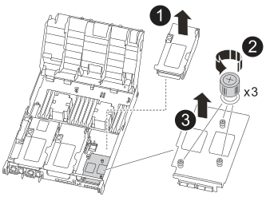

= Ersetzen Sie eine PCIe- oder Zusatzkarte - ASA C400
:allow-uri-read: 
:icons: font
:imagesdir: ../media/

[role="lead"]
Um eine PCIe- oder Mezzanine-Karte zu ersetzen, müssen Sie die Kabel und alle SFP- und QSFP-Module von den Karten trennen, die fehlerhafte PCIe- oder Mezzanine-Karte ersetzen und die Karten anschließend neu einstecken.

* Sie können dieses Verfahren bei allen Versionen von ONTAP verwenden, die von Ihrem System unterstützt werden
* Alle anderen Komponenten des Systems müssen ordnungsgemäß funktionieren. Falls nicht, müssen Sie sich an den technischen Support wenden.

== Schritt 1: Schalten Sie den beeinträchtigten Regler aus

[role="lead"]
Sie können den beeinträchtigten Controller je nach Hardwarekonfiguration des Speichersystems mithilfe verschiedener Verfahren herunterfahren oder übernehmen.

[role="tabbed-block"]
====
.Option 1: Die meisten Konfigurationen
--
[role="lead"]
Um den beeinträchtigten Controller herunterzufahren, müssen Sie den Status des Controllers bestimmen und gegebenenfalls den Controller übernehmen, damit der gesunde Controller weiterhin Daten aus dem beeinträchtigten Reglerspeicher bereitstellen kann.

.Über diese Aufgabe
* Wenn Sie über ein SAN-System verfügen, müssen Sie Event-Meldungen ) für den beeinträchtigten Controller SCSI Blade überprüft haben  `cluster kernel-service show`. Mit dem `cluster kernel-service show` Befehl (im erweiterten Modus von priv) werden der Knotenname,  der Node, der Verfügbarkeitsstatus dieses Node und der Betriebsstatus dieses Node angezeigtlink:https://docs.netapp.com/us-en/ontap/system-admin/display-nodes-cluster-task.html["Quorum-Status"].
+
Jeder Prozess des SCSI-Blades sollte sich im Quorum mit den anderen Nodes im Cluster befinden. Probleme müssen behoben werden, bevor Sie mit dem Austausch fortfahren.

* Wenn Sie über ein Cluster mit mehr als zwei Nodes verfügen, muss es sich im Quorum befinden. Wenn sich das Cluster nicht im Quorum befindet oder ein gesunder Controller FALSE anzeigt, um die Berechtigung und den Zustand zu erhalten, müssen Sie das Problem korrigieren, bevor Sie den beeinträchtigten Controller herunterfahren; siehe link:https://docs.netapp.com/us-en/ontap/system-admin/synchronize-node-cluster-task.html?q=Quorum["Synchronisieren eines Node mit dem Cluster"^].

.Schritte
. Wenn AutoSupport aktiviert ist, können Sie die automatische Case-Erstellung durch Aufrufen einer AutoSupport Meldung unterdrücken: `system node autosupport invoke -node * -type all -message MAINT=<# of hours>h`
+
Die folgende AutoSupport Meldung unterdrückt die automatische Erstellung von Cases für zwei Stunden: `cluster1:> system node autosupport invoke -node * -type all -message MAINT=2h`

. Deaktivieren Sie das automatische Giveback von der Konsole des Controller mit dem ordnungsgemäßen Zustand: `storage failover modify -node local -auto-giveback false`
+

NOTE: Wenn Sie sehen _Möchten Sie Auto-Giveback deaktivieren?_, geben Sie ein `y`.

. Nehmen Sie den beeinträchtigten Controller zur LOADER-Eingabeaufforderung:
+
[cols="1,2"]
|===
| Wenn der eingeschränkte Controller angezeigt wird... | Dann... 

 a| 
Die LOADER-Eingabeaufforderung
 a| 
Fahren Sie mit dem nächsten Schritt fort.

 a| 
Warten auf Giveback...
 a| 
Drücken Sie Strg-C, und antworten Sie dann `y` Wenn Sie dazu aufgefordert werden.

 a| 
Eingabeaufforderung für das System oder Passwort
 a| 
Übernehmen oder stoppen Sie den beeinträchtigten Regler von der gesunden Steuerung: `storage failover takeover -ofnode _impaired_node_name_`

Wenn der Regler „beeinträchtigt“ auf Zurückgeben wartet... anzeigt, drücken Sie Strg-C, und antworten Sie dann `y`.

|===

--
.Option 2: Controller befindet sich in einem MetroCluster mit zwei Nodes
--
[role="lead"]
Um den beeinträchtigten Controller herunterzufahren, müssen Sie den Status des Controllers bestimmen und gegebenenfalls den Controller umschalten, damit der gesunde Controller weiterhin Daten aus dem beeinträchtigten Reglerspeicher bereitstellen kann.

.Über diese Aufgabe
* Sie müssen die Netzteile am Ende dieses Verfahrens einschalten, um den gesunden Controller mit Strom zu versorgen.

.Schritte
. Überprüfen Sie den MetroCluster-Status, um festzustellen, ob der beeinträchtigte Controller automatisch auf den gesunden Controller umgeschaltet wurde: `metrocluster show`
. Je nachdem, ob eine automatische Umschaltung stattgefunden hat, fahren Sie mit der folgenden Tabelle fort:
+
[cols="1,2"]
|===
| Wenn die eingeschränkte Steuerung... | Dann... 

 a| 
Ist automatisch umgeschaltet
 a| 
Fahren Sie mit dem nächsten Schritt fort.

 a| 
Nicht automatisch umgeschaltet
 a| 
Einen geplanten Umschaltvorgang vom gesunden Controller durchführen: `metrocluster switchover`

 a| 
Hat nicht automatisch umgeschaltet, haben Sie versucht, mit dem zu wechseln `metrocluster switchover` Befehl und Switchover wurde vetoed
 a| 
Überprüfen Sie die Veto-Meldungen, und beheben Sie das Problem, wenn möglich, und versuchen Sie es erneut. Wenn das Problem nicht behoben werden kann, wenden Sie sich an den technischen Support.

|===
. Synchronisieren Sie die Datenaggregate neu, indem Sie das ausführen `metrocluster heal -phase aggregates` Befehl aus dem verbleibenden Cluster.
+
[listing]
----
controller_A_1::> metrocluster heal -phase aggregates
[Job 130] Job succeeded: Heal Aggregates is successful.
----
+
Wenn die Heilung ein Vetorecht ist, haben Sie die Möglichkeit, das zurückzugeben `metrocluster heal` Befehl mit dem `-override-vetoes` Parameter. Wenn Sie diesen optionalen Parameter verwenden, überschreibt das System alle weichen Vetos, die die Heilung verhindern.

. Überprüfen Sie, ob der Vorgang mit dem befehl „MetroCluster Operation show“ abgeschlossen wurde.
+
[listing]
----
controller_A_1::> metrocluster operation show
    Operation: heal-aggregates
      State: successful
Start Time: 7/25/2016 18:45:55
   End Time: 7/25/2016 18:45:56
     Errors: -
----
. Überprüfen Sie den Status der Aggregate mit `storage aggregate show` Befehl.
+
[listing]
----
controller_A_1::> storage aggregate show
Aggregate     Size Available Used% State   #Vols  Nodes            RAID Status
--------- -------- --------- ----- ------- ------ ---------------- ------------
...
aggr_b2    227.1GB   227.1GB    0% online       0 mcc1-a2          raid_dp, mirrored, normal...
----
. Heilen Sie die Root-Aggregate mit dem `metrocluster heal -phase root-aggregates` Befehl.
+
[listing]
----
mcc1A::> metrocluster heal -phase root-aggregates
[Job 137] Job succeeded: Heal Root Aggregates is successful
----
+
Wenn die Heilung ein Vetorecht ist, haben Sie die Möglichkeit, das zurückzugeben `metrocluster heal` Befehl mit dem Parameter -override-vetoes. Wenn Sie diesen optionalen Parameter verwenden, überschreibt das System alle weichen Vetos, die die Heilung verhindern.

. Stellen Sie sicher, dass der Heilungsvorgang abgeschlossen ist, indem Sie den verwenden `metrocluster operation show` Befehl auf dem Ziel-Cluster:
+
[listing]
----

mcc1A::> metrocluster operation show
  Operation: heal-root-aggregates
      State: successful
 Start Time: 7/29/2016 20:54:41
   End Time: 7/29/2016 20:54:42
     Errors: -
----
. Trennen Sie am Controller-Modul mit eingeschränkter Betriebsstörung die Netzteile.

--
====

== Schritt 2: Entfernen Sie das Controller-Modul

[role="lead"]
Um auf Komponenten im Controller-Modul zuzugreifen, müssen Sie das Controller-Modul aus dem Gehäuse entfernen.

. Wenn Sie nicht bereits geerdet sind, sollten Sie sich richtig Erden.
. Lösen Sie die Netzkabelhalter, und ziehen Sie anschließend die Kabel von den Netzteilen ab.
. Lösen Sie den Haken- und Schlaufenriemen, mit dem die Kabel am Kabelführungsgerät befestigt sind, und ziehen Sie dann die Systemkabel und SFPs (falls erforderlich) vom Controller-Modul ab, um zu verfolgen, wo die Kabel angeschlossen waren.
+
Lassen Sie die Kabel im Kabelverwaltungs-Gerät so, dass bei der Neuinstallation des Kabelverwaltungsgeräts die Kabel organisiert sind.

. Entfernen Sie das Kabelführungs-Gerät aus dem Controller-Modul und legen Sie es beiseite.
. Drücken Sie beide Verriegelungsriegel nach unten, und drehen Sie dann beide Verriegelungen gleichzeitig nach unten.
+
Das Controller-Modul wird leicht aus dem Chassis entfernt.

+
image::../media/drw_c400_remove_controller_IEOPS-1216.svg[Controller entfernen]

+
[cols="10a,90a"]
|===

 a| 
image:../media/icon_round_1.png["Legende Nummer 1"]
 a| 
Verriegelungsriegel

 a| 
image:../media/icon_round_2.png["Legende Nummer 2"]
 a| 
Der Controller bewegt sich leicht aus dem Chassis

|===
. Schieben Sie das Controller-Modul aus dem Gehäuse.
+
Stellen Sie sicher, dass Sie die Unterseite des Controller-Moduls unterstützen, während Sie es aus dem Gehäuse schieben.

. Stellen Sie das Controller-Modul auf eine stabile, flache Oberfläche.

== Schritt 3: Ersetzen Sie eine PCIe-Karte

[role="lead"]
Um eine PCIe-Karte zu ersetzen, müssen Sie die ausgefallene PCIe-Karte ausfindig machen, den Riser, der die Karte enthält, aus dem Controller-Modul entfernen, die Karte austauschen und dann den PCIe-Riser im Controller-Modul wieder einsetzen.

Sie können die folgende Animation, Illustration oder die geschriebenen Schritte zum Ersetzen einer PCIe-Karte verwenden.

.Animation: Ersetzen Sie eine PCIe-Karte
video::ed42334e-8eb2-48dd-b447-b0300189230f[panopto]
image:../media/drw_c400_replace_PCIe_cards_IEOPS-1235.svg["Breite=500 px"]

[cols="10,90"]
|===

 a| 
image:../media/icon_round_1.png["Legende Nummer 1"]
 a| 
Riserverriegelung

 a| 
image:../media/icon_round_2.png["Legende Nummer 2"]
 a| 
Verriegelung der PCI-Karte

 a| 
image:../media/icon_round_3.png["Legende Nummer 3"]
 a| 
PCI-Sperrplatte

 a| 
image:../media/icon_round_4.png["Legende Nummer 4"]
 a| 
PCI-Karte

|===
. Entfernen Sie den Riser mit der auszutauschenden Karte:
+
.. Öffnen Sie den Luftkanal, indem Sie die Verriegelungslaschen an den Seiten des Luftkanals drücken, ihn zur Rückseite des Controller-Moduls schieben und dann in seine vollständig geöffnete Position drehen.
.. Entfernen Sie alle SFP- oder QSFP-Module, die sich möglicherweise in den PCIe-Karten enthalten haben.
.. Drehen Sie die Riserverriegelung auf der linken Seite des Steigrohrs nach oben und in Richtung Luftkanal.
+
Der Riser hebt sich leicht vom Controller-Modul auf.

.. Heben Sie den Riser gerade nach oben und legen Sie ihn auf einer stabilen, flachen Oberfläche beiseite.

. Entfernen Sie die PCIe-Karte aus dem Riser:
+
.. Drehen Sie den Riser so, dass Sie auf die PCIe-Karte zugreifen können.
.. Drücken Sie die Sicherungshalterung an der Seite des PCIe-Riser und drehen Sie sie dann in die offene Position.
.. Nur für Aufsteher 2 und 3 die Seitenverkleidung nach oben schwenken.
.. Entfernen Sie die PCIe-Karte aus dem Riser, indem Sie die Halterung vorsichtig nach oben drücken und die Karte gerade aus dem Sockel heben.

. Installieren Sie die Ersatz-PCIe-Karte in den Riser, indem Sie die Karte am Sockel ausrichten, drücken Sie die Karte in den Sockel und schließen Sie dann die Seitenwand am Riser, sofern vorhanden.
+
Achten Sie darauf, dass Sie die Karte richtig im Steckplatz ausrichten und sogar Druck auf die Karte ausüben, wenn Sie sie in der Steckdose einsetzen. Die PCIe-Karte muss vollständig und gleichmäßig im Steckplatz eingesetzt sein.

+

NOTE: Wenn Sie eine Karte in den unteren Steckplatz einsetzen und den Kartensteckplatz nicht gut sehen können, entfernen Sie die obere Karte, damit Sie den Kartensteckplatz sehen, die Karte installieren und dann die Karte, die Sie aus dem oberen Steckplatz entfernt haben, wieder einsetzen können.

. Installieren Sie den Riser wieder:
+
.. Richten Sie den Riser an den Stiften an der Seite des Riser-Sockels aus und senken Sie den Riser an den Stiften nach unten.
.. Schieben Sie den Riser in den Sockel auf dem Motherboard.
.. Drehen Sie die Verriegelung bündig mit dem Blech auf dem Riser ab.

== Schritt 4: Tauschen Sie die Mezzanine-Karte aus

[role="lead"]
Die Mezzanine-Karte befindet sich unter der Risernummer 3 (Steckplatz 4 und 5). Sie müssen diesen Riser entfernen, um auf die Mezzanine-Karte zuzugreifen, die Mezzanine-Karte austauschen und dann die Riser-Nummer 3 neu installieren. Weitere Informationen finden Sie in der FRU-Zuordnung des Controller-Moduls.

Sie können die Mezzanine-Karte mit der folgenden Animation, Illustration oder den schriftlichen Schritten ersetzen.

.Animation - Ersetzen Sie die Mezzanine-Karte
video::e3fd32b6-bdbb-4c53-b666-b030018a5744[panopto]

[cols="10a,90a"]
|===

 a| 
image:../media/icon_round_1.png["Legende Nummer 1"]
 a| 
PCI-Riser

 a| 
image:../media/icon_round_2.png["Legende Nummer 2"]
 a| 
Rändelschraube für Riser

 a| 
image:../media/icon_round_3.png["Legende Nummer 3"]
 a| 
Riserkarte

|===
. Entfernen Sie die Risernummer 3 (Steckplätze 4 und 5):
+
.. Öffnen Sie den Luftkanal, indem Sie die Verriegelungslaschen an den Seiten des Luftkanals drücken, ihn zur Rückseite des Controller-Moduls schieben und dann in seine vollständig geöffnete Position drehen.
.. Entfernen Sie alle SFP- oder QSFP-Module, die sich möglicherweise in den PCIe-Karten enthalten haben.
.. Drehen Sie die Riserverriegelung auf der linken Seite des Steigrohrs nach oben und in Richtung Luftkanal.
+
Der Riser hebt sich leicht vom Controller-Modul auf.

.. Heben Sie den Riser an und legen Sie ihn auf eine stabile, flache Oberfläche.

. Setzen Sie die Mezzanine-Karte wieder ein:
+
.. Entfernen Sie alle QSFP- oder SFP-Module von der Karte.
.. Lösen Sie die Rändelschrauben auf der Mezzanine-Karte, und heben Sie die Karte vorsichtig direkt aus der Steckdose, und legen Sie sie beiseite.
.. Richten Sie die Ersatzkarte über die Buchse und die Führungsstifte aus, und schieben Sie die Karte vorsichtig in die Buchse.
.. Ziehen Sie die Rändelschrauben auf der Mezzanine-Karte fest.

. Installieren Sie den Riser wieder:
+
.. Richten Sie den Riser an den Stiften an der Seite des Riser-Sockels aus und senken Sie den Riser an den Stiften nach unten.
.. Schieben Sie den Riser in den Sockel auf dem Motherboard.
.. Drehen Sie die Verriegelung bündig mit dem Blech auf dem Riser ab.

== Schritt 5: Installieren Sie das Controller-Modul

Nachdem Sie die Komponente im Controller-Modul ersetzt haben, müssen Sie das Controller-Modul wieder in das Gehäuse einsetzen und dann im Wartungsmodus booten.

. Wenn Sie dies noch nicht getan haben, schließen Sie den Luftkanal.
. Richten Sie das Ende des Controller-Moduls an der Öffnung im Gehäuse aus, und drücken Sie dann vorsichtig das Controller-Modul zur Hälfte in das System.
+

NOTE: Setzen Sie das Controller-Modul erst dann vollständig in das Chassis ein, wenn Sie dazu aufgefordert werden.

. Das System nach Bedarf neu einsetzen.
+
Wenn Sie die Medienkonverter (QSFPs oder SFPs) entfernt haben, sollten Sie diese erneut installieren, wenn Sie Glasfaserkabel verwenden.

. Schließen Sie die Installation des Controller-Moduls ab:
+
.. Schließen Sie das Netzkabel an das Netzteil an, setzen Sie die Sicherungshülse des Netzkabels wieder ein, und schließen Sie dann das Netzteil an die Stromquelle an.
.. Drücken Sie das Controller-Modul mithilfe der Verriegelungsverriegelungen fest in das Gehäuse, bis es auf die Mittelebene trifft und vollständig sitzt.
+
Die Verriegelungen steigen, wenn das Controller-Modul voll eingesetzt ist.

+

NOTE: Beim Einschieben des Controller-Moduls in das Gehäuse keine übermäßige Kraft verwenden, um Schäden an den Anschlüssen zu vermeiden.

+
Das Controller-Modul beginnt zu booten, sobald es vollständig im Gehäuse sitzt. Bereiten Sie sich darauf vor, den Bootvorgang zu unterbrechen.

.. Setzen Sie das Controller-Modul vollständig in das Gehäuse ein, indem Sie die Verriegelungsriegel nach oben drehen, kippen Sie sie so, dass sie die Sicherungsstifte entfernen, den Controller vorsichtig ganz nach innen schieben und dann die Verriegelungsriegel in die verriegelte Position senken.
.. Wenn Sie dies noch nicht getan haben, installieren Sie das Kabelverwaltungsgerät neu.
.. Unterbrechen Sie den normalen Boot-Prozess und booten Sie zu LOADER, indem Sie drücken `Ctrl-C`.
+

NOTE: Wenn das System im Startmenü stoppt, wählen Sie die Option zum Booten in LOADER.

.. Geben Sie an der LOADER-Eingabeaufforderung ein `bye` Um die PCIe-Karten und andere Komponenten neu zu initialisieren und den Controller neu zu starten.

. Wiederherstellung des normalen Betriebs des Controllers durch Zurückgeben des Speichers: `storage failover giveback -ofnode _impaired_node_name_`
. Wenn die automatische Rückübertragung deaktiviert wurde, aktivieren Sie sie erneut: `storage failover modify -node local -auto-giveback true`

== Schritt 6: Stellen Sie das Controller-Modul wieder in Betrieb

Um den Controller wiederherzustellen, müssen Sie das System erneut einspielen, das Controller-Modul zurückgeben und dann das automatische Giveback wieder aktivieren.

. Das System nach Bedarf neu einsetzen.
+
Wenn Sie die Medienkonverter (QSFPs oder SFPs) entfernt haben, sollten Sie diese erneut installieren, wenn Sie Glasfaserkabel verwenden.

. Wiederherstellung des normalen Betriebs des Controllers durch Zurückgeben des Speichers: `storage failover giveback -ofnode _impaired_node_name_`
. Wenn die automatische Rückübertragung deaktiviert wurde, aktivieren Sie sie erneut: `storage failover modify -node local -auto-giveback true`

== Schritt 7: Aggregate in einer MetroCluster Konfiguration mit zwei Nodes zurückwechseln

Nachdem Sie in einer MetroCluster Konfiguration mit zwei Nodes den FRU-Austausch abgeschlossen haben, können Sie den MetroCluster SwitchBack-Vorgang durchführen. Damit wird die Konfiguration in ihren normalen Betriebszustand zurückversetzt, wobei die Synchronisations-Storage Virtual Machines (SVMs) auf dem ehemals beeinträchtigten Standort jetzt aktiv sind und Daten aus den lokalen Festplattenpools bereitstellen.

Dieser Task gilt nur für MetroCluster-Konfigurationen mit zwei Nodes.

.Schritte
. Vergewissern Sie sich, dass sich alle Nodes im befinden `enabled` Bundesland: `metrocluster node show`
+
[listing]
----
cluster_B::>  metrocluster node show

DR                           Configuration  DR
Group Cluster Node           State          Mirroring Mode
----- ------- -------------- -------------- --------- --------------------
1     cluster_A
              controller_A_1 configured     enabled   heal roots completed
      cluster_B
              controller_B_1 configured     enabled   waiting for switchback recovery
2 entries were displayed.
----
. Überprüfen Sie, ob die Neusynchronisierung auf allen SVMs abgeschlossen ist: `metrocluster vserver show`
. Überprüfen Sie, ob die automatischen LIF-Migrationen durch die heilenden Vorgänge erfolgreich abgeschlossen wurden: `metrocluster check lif show`
. Führen Sie den Wechsel zurück mit dem aus `metrocluster switchback` Befehl von einem beliebigen Node im verbleibenden Cluster
. Stellen Sie sicher, dass der Umkehrvorgang abgeschlossen ist: `metrocluster show`
+
Der Vorgang zum zurückwechseln wird weiterhin ausgeführt, wenn sich ein Cluster im befindet `waiting-for-switchback` Bundesland:

+
[listing]
----
cluster_B::> metrocluster show
Cluster              Configuration State    Mode
--------------------	------------------- 	---------
 Local: cluster_B configured       	switchover
Remote: cluster_A configured       	waiting-for-switchback
----
+
Der Vorgang zum zurückwechseln ist abgeschlossen, wenn sich die Cluster im befinden `normal` Bundesland:

+
[listing]
----
cluster_B::> metrocluster show
Cluster              Configuration State    Mode
--------------------	------------------- 	---------
 Local: cluster_B configured      		normal
Remote: cluster_A configured      		normal
----
+
Wenn ein Wechsel eine lange Zeit in Anspruch nimmt, können Sie den Status der in-progress-Basispläne über die überprüfen `metrocluster config-replication resync-status show` Befehl.

. Wiederherstellung beliebiger SnapMirror oder SnapVault Konfigurationen

== Schritt 8: Senden Sie das fehlgeschlagene Teil an NetApp zurück

Senden Sie das fehlerhafte Teil wie in den dem Kit beiliegenden RMA-Anweisungen beschrieben an NetApp zurück.  https://mysupport.netapp.com/site/info/rma["Rückgabe und Austausch von Teilen"]Weitere Informationen finden Sie auf der Seite.
