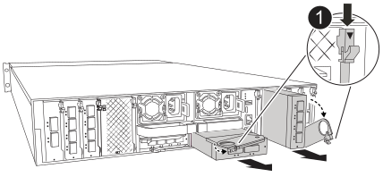

= Austausch eines E/A-Moduls in einem ASA A1K System
:allow-uri-read: 
:icons: font
:imagesdir: ../media/

[role="lead"]
Ersetzen Sie ein I/O-Modul in Ihrem ASA A1K-System, wenn das Modul ausfällt oder ein Upgrade erfordert, um höhere Leistung oder zusätzliche Funktionen zu unterstützen. Beim Austausch werden der Controller heruntergefahren, das fehlerhafte I/O-Modul ersetzt, der Controller neu gebootet und das fehlerhafte Teil an NetApp zurückgegeben.

Sie können dieses Verfahren mit allen Versionen von ONTAP verwenden, die von Ihrem Speichersystem unterstützt werden.

.Bevor Sie beginnen
* Sie müssen das Ersatzteil zur Verfügung haben.
* Stellen Sie sicher, dass alle anderen Komponenten des Speichersystems ordnungsgemäß funktionieren. Wenden Sie sich andernfalls an den technischen Support.

[[step-1-shut-down-the-impaired-node]]
== Schritt 1: Fahren Sie den Knoten mit beeinträchtigten Knoten herunter

Schalten Sie den außer Betrieb genommenen Controller aus oder übernehmen Sie ihn.

Übernehmen Sie den fehlerhaften Controller und stoppen Sie ihn, damit der intakte Controller weiterhin Daten aus dem Speicher des fehlerhaften Controllers bereitstellt. Dazu unterdrücken Sie die automatische Fallerstellung in AutoSupport, deaktivieren die automatische Rückgabe und bringen den fehlerhaften Controller zur LOADER-Eingabeaufforderung. Die LOADER-Eingabeaufforderung ist der sichere, angehaltene Zustand, aus dem Sie die FRU ersetzen können.

.Über diese Aufgabe
* Wenn Sie über ein SAN-System verfügen, müssen Sie Event-Meldungen ) für den beeinträchtigten Controller SCSI Blade überprüft haben  `cluster kernel-service show`. Mit dem `cluster kernel-service show` Befehl (im erweiterten Modus von priv) werden der Knotenname,  der Node, der Verfügbarkeitsstatus dieses Node und der Betriebsstatus dieses Node angezeigtlink:https://docs.netapp.com/us-en/ontap/system-admin/display-nodes-cluster-task.html["Quorum-Status"].
+
Jeder Prozess des SCSI-Blades sollte sich im Quorum mit den anderen Nodes im Cluster befinden. Probleme müssen behoben werden, bevor Sie mit dem Austausch fortfahren.

* Wenn Sie über ein Cluster mit mehr als zwei Nodes verfügen, muss es sich im Quorum befinden. Wenn sich das Cluster nicht im Quorum befindet oder ein gesunder Controller FALSE anzeigt, um die Berechtigung und den Zustand zu erhalten, müssen Sie das Problem korrigieren, bevor Sie den beeinträchtigten Controller herunterfahren; siehe link:https://docs.netapp.com/us-en/ontap/system-admin/synchronize-node-cluster-task.html?q=Quorum["Synchronisieren eines Node mit dem Cluster"^].

.Schritte
. Wenn AutoSupport aktiviert ist, unterdrücken Sie die automatische Erstellung eines Cases durch Aufrufen einer AutoSupport Meldung:
+
`system node autosupport invoke -node * -type all -message MAINT=<number of hours down>h`

+
Dies verhindert, dass während Ihres geplanten Wartungsfensters automatisch Supportfälle eröffnet werden. Die maximale Unterdrückungsdauer beträgt 72 Stunden. Falls Ihre Wartung vorzeitig abgeschlossen ist, können Sie die Fallerstellung wieder aktivieren, indem Sie eine AutoSupport-Nachricht mit  `MAINT=END` auslösen. Weitere Informationen finden Sie unter  https://kb.netapp.com/Support_Bulletins/Customer_Bulletins/SU92["Wie man die automatische Fallerstellung während geplanter Wartungsfenster unterdrückt"^].

+
Die folgende AutoSupport Meldung unterdrückt die automatische Erstellung von Cases für zwei Stunden:

+
`cluster1:> system node autosupport invoke -node * -type all -message MAINT=2h`

. Automatische Rückgabe deaktivieren:
+
.. Geben Sie den folgenden Befehl von der Konsole des fehlerfreien Controllers ein:
+
`storage failover modify -node _impaired_node_name_ -auto-giveback false`

.. Eingeben `y` wenn die Eingabeaufforderung _Möchten Sie die automatische Rückgabe deaktivieren?_ angezeigt wird

. Nehmen Sie den beeinträchtigten Controller zur LOADER-Eingabeaufforderung:
+
[cols="1,2"]
|===
| Wenn der eingeschränkte Controller angezeigt wird... | Dann... 

 a| 
Die LOADER-Eingabeaufforderung
 a| 
Fahren Sie mit dem nächsten Schritt fort.

 a| 
Warten auf Giveback...
 a| 
Drücken Sie Strg-C, und antworten Sie dann `y` Wenn Sie dazu aufgefordert werden.

 a| 
Eingabeaufforderung für das System oder Passwort
 a| 
Übernehmen oder stoppen Sie den beeinträchtigten Regler von der gesunden Steuerung:

`storage failover takeover -ofnode _impaired_node_name_ -halt _true_`

Der Parameter _-stop true_ führt Sie zur Loader-Eingabeaufforderung.

|===

[[step-2-replace-a-failed-io-module]]
== Schritt 2: Ersetzen Sie ein fehlerhaftes I/O-Modul

Um ein E/A-Modul zu ersetzen, suchen Sie es im Gehäuse und befolgen Sie die entsprechenden Schritte.

.Schritte
. Wenn Sie nicht bereits geerdet sind, sollten Sie sich richtig Erden.
. Trennen Sie alle Kabel vom Ziel-E/A-Modul.
. Drehen Sie das Kabelführungs-Fach nach unten, indem Sie die Tasten an beiden Seiten an der Innenseite des Kabelführungs-Fachs ziehen und das Fach dann nach unten drehen.
+

NOTE: Diese Abbildung zeigt das Entfernen eines horizontalen und vertikalen E/A-Moduls. In der Regel entfernen Sie nur ein I/O-Modul.

+

+
[cols="1,4"]
|===

 a| 
image:../media/icon_round_1.png["Legende Nummer 1"]
 a| 
E/A-Nockenverriegelung

|===
+
Achten Sie darauf, dass Sie die Kabel so kennzeichnen, dass Sie wissen, woher sie stammen.

. Entfernen Sie das Ziel-E/A-Modul aus dem Gehäuse:
+
.. Drücken Sie die Nockentaste am Zielmodul.
.. Drehen Sie die Nockenverriegelung so weit wie möglich vom Modul weg.
.. Entfernen Sie das Modul aus dem Gehäuse, indem Sie den Finger in die Öffnung des Nockenhebels stecken und das Modul aus dem Gehäuse ziehen.
+
Stellen Sie sicher, dass Sie den Steckplatz verfolgen, in dem sich das I/O-Modul befand.

. Legen Sie das E/A-Modul beiseite.
. Installieren Sie das Ersatz-E/A-Modul im Gehäuse:
+
.. Richten Sie das Modul an den Kanten der Öffnung des Gehäusesteckplatzes aus.
.. Schieben Sie das Modul vorsichtig in den Steckplatz bis zum Gehäuse, und drehen Sie dann die Nockenverriegelung ganz nach oben, um das Modul zu verriegeln.

. Verkabeln Sie das E/A-Modul.
. Drehen Sie das Kabelführungs-Fach bis in die geschlossene Position.

[[step-3-reboot-the-controller]]
== Schritt 3: Starten Sie den Controller neu

Nachdem Sie ein I/O-Modul ersetzt haben, müssen Sie den Controller neu starten.

.Schritte
. Booten Sie den Controller über die LOADER-Eingabeaufforderung neu:
+
`bye`

+

NOTE: Durch einen Neustart des außer Betrieb genommenen Controllers werden auch die E/A-Module und andere Komponenten neu initialisiert.

. Stellen Sie den funktionsbeeinträchtigten Controller wieder in den Normalbetrieb ein, indem Sie den Speicher zurückgeben:
+
`storage failover giveback -ofnode _impaired_node_name_`

. Automatisches Giveback von der Konsole des funktionstüchtigen Controllers wiederherstellen:
+
`storage failover modify -node local -auto-giveback true`

. Wenn AutoSupport aktiviert ist, stellen Sie die automatische Fallerstellung wieder her:
+
`system node autosupport invoke -node * -type all -message MAINT=END`

[[step-4-return-the-failed-part-to-netapp]]
== Schritt 4: Senden Sie das fehlgeschlagene Teil an NetApp zurück

Senden Sie das fehlerhafte Teil wie in den dem Kit beiliegenden RMA-Anweisungen beschrieben an NetApp zurück.  https://mysupport.netapp.com/site/info/rma["Rückgabe und Austausch von Teilen"]Weitere Informationen finden Sie auf der Seite.
