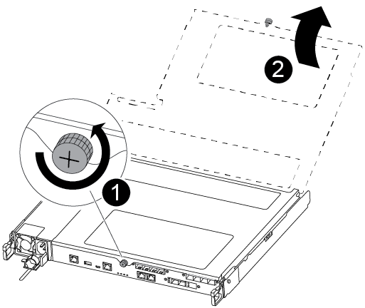
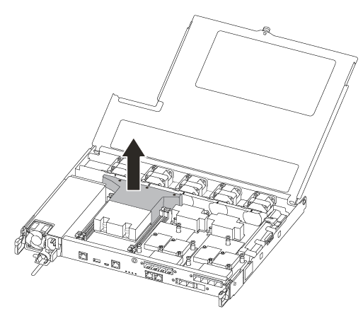
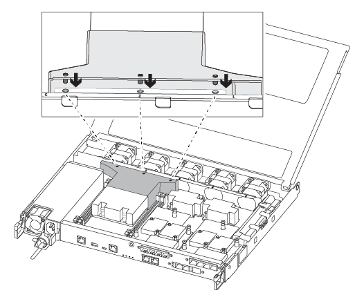

= Das Bootmedium in einem ASA A250 System mithilfe des automatisierten Boot-Wiederherstellungsprozesses ersetzen
:allow-uri-read: 
:icons: font
:imagesdir: ../media/

[role="lead"]
Das Bootmedium in Ihrem ASA A250-System speichert wichtige Firmware- und Konfigurationsdaten. Der Austauschvorgang umfasst das Entfernen und Öffnen des Controller-Moduls, das Entfernen des beschädigten Bootmediums, das Einsetzen des Ersatz-Bootmediums in das Controller-Modul und anschließend das Wiedereinsetzen des Controller-Moduls.

Die automatische Wiederherstellung des Startmediums wird nur in ONTAP 9.18.1 und höher unterstützt. Wenn auf Ihrem Speichersystem eine frühere Version von ONTAP ausgeführt wird, verwenden Sie die link:bootmedia-replace-workflow.html["manuelle Boot-Wiederherstellung"].

Das Startmedium befindet sich im Controllermodul unter dem Luftkanal und ist zugänglich, indem das Controllermodul aus dem System entfernt wird.

[[step-1-remove-the-controller-module]]
== Schritt 1: Entfernen Sie das Controller-Modul

. Wenn Sie nicht bereits geerdet sind, sollten Sie sich richtig Erden.
. Trennen Sie die Netzteile des Controller-Moduls von der Quelle.
. Lösen Sie die Netzkabelhalter, und ziehen Sie anschließend die Kabel von den Netzteilen ab.
. Ziehen Sie die E/A-Kabel vom Controller-Modul ab.
. Setzen Sie den Zeigefinger in den Verriegelungsmechanismus auf beiden Seiten des Controller-Moduls ein, drücken Sie den Hebel mit dem Daumen, und ziehen Sie den Controller vorsichtig einige Zentimeter aus dem Gehäuse.
+

NOTE: Wenn Sie Schwierigkeiten beim Entfernen des Controller-Moduls haben, setzen Sie Ihre Zeigefinger durch die Fingerlöcher von innen (durch Überqueren der Arme).

+
image::../media/drw_a250_pcm_remove_install.png[Öffnen des Verriegelungsmechanismus]

+
[cols="1,4"]
|===

 a| 
image:../media/icon_round_1.png["Legende Nummer 1"]
 a| 
Hebel

 a| 
image:../media/icon_round_2.png["Legende Nummer 2"]
 a| 
Verriegelungsmechanismus

|===
. Fassen Sie die Seiten des Controller-Moduls mit beiden Händen an, ziehen Sie es vorsichtig aus dem Gehäuse heraus und legen Sie es auf eine flache, stabile Oberfläche.
. Drehen Sie die Daumenschraube auf der Vorderseite des Controller-Moduls gegen den Uhrzeigersinn, und öffnen Sie die Abdeckung des Controller-Moduls.
+

+
[cols="1,4"]
|===

 a| 
image:../media/icon_round_1.png["Legende Nummer 1"]
 a| 
Flügelschraube

 a| 
image:../media/icon_round_2.png["Legende Nummer 2"]
 a| 
Controller-Modulabdeckung.

|===
. Heben Sie die Luftkanalabdeckung heraus.
+

[[step-2-replace-the-boot-media]]
== Schritt 2: Ersetzen Sie die Startmedien

Sie können das Bootmedium mit dem folgenden Video oder den tabellarischen Schritten ersetzen:

.Animation - Ersetzen Sie das Startmedium
video::7c2cad51-dd95-4b07-a903-ac5b015c1a6d[panopto]
. Suchen und ersetzen Sie das beschädigte Bootmedium im Controllermodul:
+

NOTE: Um die Schraube zu entfernen, mit der die Bootsmedien befestigt sind, benötigen Sie einen #1 Magnetschraubendreher. Aufgrund der Platzbeschränkungen im Controller-Modul sollten Sie auch einen Magneten haben, um die Schraube darauf zu übertragen, damit Sie sie nicht verlieren.

+
image::../media/drw_a250_replace_boot_media.png[Wiedereinsetzen des Startmediums]

+
[cols="1,3"]
|===

 a| 
image:../media/icon_round_1.png["Legende Nummer 1"]
 a| 
Entfernen Sie die Schraube, mit der das Boot-Medium am Motherboard im Controller-Modul befestigt ist.

 a| 
image:../media/icon_round_2.png["Legende Nummer 2"]
 a| 
Heben Sie die Boot-Medien aus dem Controller-Modul.

|===
+
.. Entfernen Sie die Schraube mit dem #1-Magnetschraubendreher aus dem gestörten Boot-Medium und legen Sie sie sicher auf den Magneten.
.. Heben Sie die gestörten Startmedien vorsichtig direkt aus dem Sockel und legen Sie sie beiseite.
.. Entfernen Sie die Ersatzstartmedien aus dem antistatischen Versandbeutel, und richten Sie sie am Controller-Modul aus.
.. Setzen Sie die Schraube mit dem #1-Magnetschraubendreher ein und ziehen Sie sie fest.
+
Ziehen Sie die Schraube nicht zu fest, oder beschädigen Sie die Bootsmedien möglicherweise nicht.

.. Installieren Sie den Luftkanal.
+

.. Schließen Sie die Abdeckung des Controller-Moduls, und ziehen Sie die Daumenschraube fest.
+
image::../media/drw_a250_close_controller_module_cover.png[Schließen der Abdeckung des Controller-Moduls]

+
[cols="1,3"]
|===

 a| 
image:../media/icon_round_1.png["Legende Nummer 1"]
 a| 
Controller-Modulabdeckung

 a| 
image:../media/icon_round_2.png["Legende Nummer 2"]
 a| 
Flügelschraube

|===

. Installieren Sie das Controller-Modul:
+
.. Richten Sie das Ende des Controller-Moduls an der Öffnung im Gehäuse aus, und drücken Sie dann vorsichtig das Controller-Modul zur Hälfte in das System.
.. Drücken Sie das Controller-Modul ganz in das Chassis:
.. Platzieren Sie Ihre Zeigefinger durch die Fingerlöcher von der Innenseite des Verriegelungsmechanismus.
.. Drücken Sie die Daumen auf den orangefarbenen Laschen oben am Verriegelungsmechanismus nach unten, und schieben Sie das Controller-Modul vorsichtig über den Anschlag.
.. Lösen Sie Ihre Daumen von oben auf den Verriegelungs-Mechanismen und drücken Sie weiter, bis die Verriegelungen einrasten.
+
Das Controller-Modul sollte vollständig eingesetzt und mit den Kanten des Gehäuses bündig sein.

. Schließen Sie die E/A-Kabel des Controller-Moduls wieder an.
. Schließen Sie die Netzkabel an die Netzteile an, setzen Sie die Sicherungsmanschette des Netzkabels wieder ein, und schließen Sie dann die Netzteile an die Stromquelle an.
+
Das Controllermodul beginnt mit dem Booten und stoppt bei der LOADER-Eingabeaufforderung.

.Wie es weiter geht
Nach dem physischen Austausch der gestörten Startmedien, link:bootmedia-recovery-image-boot-bmr.html["Stellen Sie das ONTAP-Image vom Partner-Node wieder her"].
