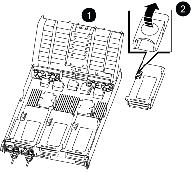

= Ersetzen Sie den Controller - ASA A800
:allow-uri-read: 
:icons: font
:imagesdir: ../media/

[role="lead"]
Um den Controller auszutauschen, müssen Sie den beeinträchtigten Controller entfernen, die FRU-Komponenten auf das Ersatz-Controller-Modul verschieben, das Ersatz-Controller-Modul im Chassis einbauen und das System dann im Wartungsmodus booten.

== Schritt 1: Entfernen Sie das Controller-Modul

Sie müssen das Controller-Modul aus dem Chassis entfernen, wenn Sie das Controller-Modul ersetzen oder eine Komponente im Controller-Modul ersetzen.

. Stellen Sie sicher, dass alle Laufwerke im Gehäuse fest auf der Mittelplatine sitzen, indem Sie mit den Daumen auf die einzelnen Laufwerke drücken, bis Sie einen positiven Anschlag spüren.
+
image::../media/drw_a800_drive_seated_IEOPS-960.svg[Festplattenlaufwerke einsetzen]

. Gehen Sie zur Rückseite des Gehäuses. Wenn Sie nicht bereits geerdet sind, sollten Sie sich richtig Erden.
. Trennen Sie die Netzteile des Controller-Moduls von der Quelle.
. Lösen Sie die Netzkabelhalter, und ziehen Sie anschließend die Kabel von den Netzteilen ab.
. Lösen Sie den Haken- und Schlaufenriemen, mit dem die Kabel an das Kabelmanagement-Gerät gebunden sind, und ziehen Sie dann die Systemkabel und SFP- und QSFP-Module (falls erforderlich) vom Controller-Modul ab, um zu verfolgen, wo die Kabel angeschlossen waren.
+
Lassen Sie die Kabel im Kabelverwaltungs-Gerät so, dass bei der Neuinstallation des Kabelverwaltungsgeräts die Kabel organisiert sind.

. Entfernen Sie das Kabelführungs-Gerät aus dem Controller-Modul und legen Sie es beiseite.
. Drücken Sie beide Verriegelungsriegel nach unten, und drehen Sie dann beide Verriegelungen gleichzeitig nach unten.
+
Das Controller-Modul wird leicht aus dem Chassis entfernt.

+
image::../media/drw_a800_pcm_remove.png[Lösen Sie das Controller-Modul]

+
[cols="1,4"]
|===

 a| 
image:../media/icon_round_1.png["Legende Nummer 1"]
 a| 
Verriegelungsverschluss

 a| 
image:../media/icon_round_2.png["Legende Nummer 2"]
 a| 
Sicherungsstift

|===
. Schieben Sie das Controller-Modul aus dem Gehäuse und legen Sie es auf eine stabile, flache Oberfläche.
+
Stellen Sie sicher, dass Sie die Unterseite des Controller-Moduls unterstützen, während Sie es aus dem Gehäuse schieben. .

. Stellen Sie das Controller-Modul auf eine stabile, flache Oberfläche.
. Öffnen Sie den Luftkanal des Steuermoduls:
+
.. Drücken Sie die Verriegelungslaschen an den Seiten des Luftkanals in Richtung der Mitte des Controller-Moduls.
.. Schieben Sie den Luftkanal in Richtung der Lüftermodule, und drehen Sie ihn dann nach oben in die vollständig geöffnete Position.
+
image::../media/drw_a800_open_air_duct.png[Öffnen Sie den Luftkanal]

+
[cols="1,4"]
|===

 a| 
image:../media/icon_round_1.png["Legende Nummer 1"]
 a| 
Verriegelungsklammern für Luftkanäle

 a| 
image:../media/icon_round_2.png["Legende Nummer 2"]
 a| 
Schieben Sie den Luftkanal in Richtung Lüftermodule

 a| 
image:../media/icon_round_3.png["Legende Nummer 3"]
 a| 
Luftkanal in Richtung Lüftermodule drehen

|===

== Schritt 2: Bewegen Sie die Netzteile

Wenn Sie ein Controller-Modul ersetzen, müssen Sie die Netzteile vom Controller-Modul mit eingeschränkter Betriebsfähigkeit in das Ersatzcontrollermodul verschieben.

. Drehen Sie den Nockengriff so, dass er verwendet werden kann, um die Stromversorgung aus dem Controller-Modul zu ziehen, während Sie die Verriegelungslasche drücken.
+

CAUTION: Das Netzteil ist kurz. Verwenden Sie immer zwei Hände, um sie zu unterstützen, wenn Sie sie aus dem Controller-Modul entfernen, damit es nicht plötzlich aus dem Controller-Modul schwingen und Sie verletzen.

+
image::../media/drw_a800_replace_psu.svg[Entfernen oder ersetzen Sie ein Netzteil]

+
[cols="1,4"]
|===

 a| 
image:../media/icon_round_1.png["Legende Nummer 1"]
 a| 
Blaue Verriegelungslasche für die Stromversorgung

 a| 
image:../media/icon_round_2.png["Legende Nummer 2"]
 a| 
Stromversorgung

|===
. Stellen Sie das Netzteil auf das neue Controller-Modul, und installieren Sie es.
. Halten und richten Sie die Kanten des Netzteils mit beiden Händen an der Öffnung im Controller-Modul aus, und drücken Sie dann vorsichtig das Netzteil in das Controller-Modul, bis die Verriegelungslasche einrastet.
+
Die Netzteile werden nur ordnungsgemäß mit dem internen Anschluss in Kontakt treten und auf eine Weise verriegeln.

+

NOTE: Um Schäden am internen Stecker zu vermeiden, sollten Sie beim Einschieben der Stromversorgung in das System keine übermäßige Kraft verwenden.

== Schritt 3: Bewegen Sie die Lüfter

Sie müssen die Lüfter vom beeinträchtigten Controller-Modul in das Ersatzmodul verschieben, wenn ein ausgefallenes Controller-Modul ersetzt wird.

. Entfernen Sie das Lüftermodul, indem Sie die Verriegelungslaschen an der Seite des Lüftermoduls einklemmen und dann das Lüftermodul gerade aus dem Controller-Modul herausheben.
+
image::../media/drw_a800_replace_fan.png[Entfernen Sie den Lüfter]

+
[cols="1,4"]
|===

 a| 
image:../media/icon_round_1.png["Legende Nummer 1"]
 a| 
Verriegelungslaschen des Lüfters

 a| 
image:../media/icon_round_2.png["Legende Nummer 2"]
 a| 
Lüftermodul

|===
. Schieben Sie das Lüftermodul in das Ersatzcontrollermodul, und installieren Sie dann das Lüftermodul, indem Sie die Kanten an der Öffnung im Controller-Modul ausrichten und das Lüftermodul dann in das Controller-Modul schieben, bis die Verriegelungen einrasten.
. Wiederholen Sie diese Schritte für die übrigen Lüftermodule.

== Schritt 4: Bewegen Sie den NVDIMM-Akku

Beim Austausch des Controller-Moduls müssen Sie den NVRAM-Akku vom beeinträchtigten Controller-Modul auf das Ersatzcontrollermodul verschieben

. Öffnen Sie die Luftkanalabdeckung, und suchen Sie den NVDIMM-Akku im Riser.
+
image::../media/drw_a800_nvdimm_battery_replace.png[Tauschen Sie die NVDIMM-Batterie aus]

+
[cols="1,4"]
|===

 a| 
image:../media/icon_round_1.png["Legende Nummer 1"]
 a| 
Luftkanalaufführung

 a| 
image:../media/icon_round_2.png["Legende Nummer 2"]
 a| 
NVDIMM-Batteriestecker

 a| 
image:../media/icon_round_3.png["Legende Nummer 3"]
 a| 
NVDIMM-Akkupack

|===
+
*Achtung:* die LED der NVDIMM-Batterie-Steuerplatine blinkt während der Auslagerung des Inhalts in den Flash-Speicher, wenn Sie das System anhalten. Nach Abschluss der Abscheidungen schaltet sich die LED aus.

. Suchen Sie den Batteriestecker, und drücken Sie den Clip auf der Vorderseite des Batteriesteckers, um den Stecker aus der Steckdose zu lösen, und ziehen Sie dann das Akkukabel aus der Steckdose.
. Fassen Sie die Batterie an, und heben Sie die Batterie aus dem Luftkanal und dem Controller-Modul.
. Setzen Sie den Akku in das Ersatzcontrollermodul, und installieren Sie ihn dann in den NVDIMM-Luftkanal:
+
.. Setzen Sie den Akku in den Steckplatz ein, und drücken Sie den Akku fest nach unten, um sicherzustellen, dass er fest eingerastet ist.
.. Schließen Sie den Batteriestecker an die Steckerbuchse an, und stellen Sie sicher, dass der Stecker einrastet.

== Schritt 5: Entfernen Sie die PCIe Riser

Im Rahmen des Controller-Austauschprozesses müssen Sie die PCIe-Module aus dem beeinträchtigten Controller-Modul entfernen. Sobald NVDIMMs und DIMMs in das Ersatzcontroller-Modul verschoben wurden, müssen Sie sie am selben Ort im Ersatzcontroller-Modul installieren.

. Entfernen Sie den PCIe-Riser aus dem Controller-Modul:
+
.. Entfernen Sie alle SFP- oder QSFP-Module, die sich möglicherweise in den PCIe-Karten enthalten haben.
.. Drehen Sie die Riserverriegelung auf der linken Seite des Riser nach oben und in Richtung der Lüftermodule.
+
Der Riser hebt sich leicht vom Controller-Modul auf.

.. Heben Sie den Riser an, und legen Sie ihn in Richtung der Lüfter, so dass die Metalllippe auf dem Riser den Rand des Controller-Moduls entfernt, heben Sie den Riser aus dem Controller-Modul und legen Sie ihn dann auf eine stabile, flache Oberfläche.
+

+
[cols="1,4"]
|===

 a| 
image:../media/icon_round_1.png["Legende Nummer 1"]
 a| 
Luftkanal

 a| 
image:../media/icon_round_2.png["Legende Nummer 2"]
 a| 
Riserkarte 1 (linker Riser), Riserkarte 2 (mittlere Riser) und 3 (rechter Riser) Verriegelungsriegel

|===

. Wiederholen Sie den vorherigen Schritt für die verbleibenden Riser im Modul für beeinträchtigte Controller.
. Wiederholen Sie die oben genannten Schritte mit den leeren Riser in der Ersatzsteuerung und bringen Sie sie weg.

== Schritt 6: System-DIMMs verschieben

Um die DIMMs zu verschieben, suchen und verschieben Sie sie vom beeinträchtigten Controller in den Ersatz-Controller und befolgen Sie die spezifischen Schritte.

. Beachten Sie die Ausrichtung des DIMM-Moduls in den Sockel, damit Sie das DIMM-Modul in die richtige Ausrichtung einsetzen können.
. Werfen Sie das DIMM aus dem Steckplatz, indem Sie die beiden DIMM-Auswerferlaschen auf beiden Seiten des DIMM langsam auseinander drücken und dann das DIMM aus dem Steckplatz schieben.
+

NOTE: Halten Sie das DIMM vorsichtig an den Rändern, um Druck auf die Komponenten auf der DIMM-Leiterplatte zu vermeiden.

. Suchen Sie den Steckplatz, in dem Sie das DIMM installieren.
. Setzen Sie das DIMM-Modul in den Steckplatz ein.
+
Das DIMM passt eng in den Steckplatz, sollte aber leicht einpassen. Falls nicht, richten Sie das DIMM-Modul mit dem Steckplatz aus und setzen Sie es wieder ein.

+

NOTE: Prüfen Sie das DIMM visuell, um sicherzustellen, dass es gleichmäßig ausgerichtet und vollständig in den Steckplatz eingesetzt ist.

. Drücken Sie vorsichtig, aber fest auf die Oberseite des DIMM, bis die Auswurfklammern über den Kerben an den Enden des DIMM einrasten.
. Wiederholen Sie diese Schritte für die übrigen DIMMs.

== Schritt 7: Verschieben Sie die NVDIMMs

Um die NVDIMMs zu verschieben, suchen und verschieben Sie sie vom beeinträchtigten Controller in den Ersatzcontroller und befolgen Sie die entsprechenden Schritte.

. Suchen Sie die NVDIMMs auf dem Controller-Modul.
+
image::../media/drw_a800_no_risers_nvdimm_move.svg[NVDIMMs verschieben]

+
[cols="1,4"]
|===

 a| 
image:../media/icon_round_1.png["Legende Nummer 1"]
 a| 
Luftkanal

 a| 
image:../media/icon_round_2.png["Legende Nummer 2"]
 a| 
NVDIMMs

|===
. Beachten Sie die Ausrichtung des NVDIMM in den Sockel, damit Sie das NVDIMM in das Ersatzcontrollermodul in die richtige Ausrichtung einsetzen können.
. Werfen Sie das NVDIMM aus dem Steckplatz, indem Sie die beiden NVDIMM-Auswerfer-Laschen auf beiden Seiten des NVDIMM langsam auseinander schieben, und schieben Sie dann das NVDIMM aus dem Sockel, und legen Sie es beiseite.
+

NOTE: Halten Sie das NVDIMM vorsichtig an den Kanten, um Druck auf die Komponenten auf der NVDIMM-Leiterplatte zu vermeiden.

. Suchen Sie den Steckplatz, in dem Sie das NVDIMM installieren.
. Setzen Sie den NVDIMM in den Steckplatz ein.
+
Das NVDIMM passt eng in den Steckplatz, sollte aber leicht in gehen. Falls nicht, bauen Sie das NVDIMM mit dem Steckplatz aus und setzen Sie es wieder ein.

+

NOTE: Sichtprüfung des NVDIMM, um sicherzustellen, dass es gleichmäßig ausgerichtet und vollständig in den Steckplatz eingesetzt ist.

. Drücken Sie vorsichtig, aber fest auf der Oberseite des NVDIMM, bis die Auswurfklammern über den Kerben an den Enden des NVDIMM einrasten.
. Wiederholen Sie die vorherigen Schritte, um das andere NVDIMM zu verschieben.

== Schritt 8: Verschieben Sie die Startmedien

Sie müssen das Startmediengerät vom gestörten Controller entfernen und in den Ersatz-Controller einsetzen.

Das Boot-Medium befindet sich unter Riser 3.

. Suchen Sie das Startmedium:
+
image::../media/drw_a800_pcm_replace_only_boot_media.png[Entfernen Sie das Startmedium]

+
[cols="1,4"]
|===

 a| 
image:../media/icon_round_1.png["Legende Nummer 1"]
 a| 
Luftkanal

 a| 
image:../media/icon_round_2.png["Legende Nummer 2"]
 a| 
Riser 3

 a| 
image:../media/icon_round_3.png["Legende Nummer 3"]
 a| 
Kreuzschlitzschraubendreher #1

 a| 
image:../media/icon_round_4.png["Legende Nummer 4"]
 a| 
Schraube für Boot-Medien

 a| 
image:../media/icon_round_5.png["Legende Nummer 5"]
 a| 
Boot-Medien

|===
. Entfernen Sie die Boot-Medien aus dem Controller-Modul:
+
.. Entfernen Sie mit einem #1 Kreuzschlitzschraubendreher die Schraube, mit der das Bootmedium befestigt ist, und setzen Sie die Schraube an einem sicheren Ort beiseite.
.. Fassen Sie die Seiten des Startmediums an, drehen Sie die Startmedien vorsichtig nach oben, ziehen Sie dann die Startmedien gerade aus dem Sockel und legen Sie sie beiseite.

. Verschieben Sie das Boot-Medium auf das neue Controller-Modul und installieren Sie es:
+
.. Richten Sie die Kanten der Startmedien am Buchsengehäuse aus, und schieben Sie sie vorsichtig in die Buchse.
.. Drehen Sie das Startmedium nach unten zur Hauptplatine.
.. Befestigen Sie das Bootmedium mit der Boot-Medienschraube am Motherboard.
+
Ziehen Sie die Schraube nicht zu fest, oder beschädigen Sie die Bootsmedien möglicherweise nicht.

== Schritt 9: Installieren Sie die PCIe Riser

Nach dem Verschieben der DIMMs, NVDIMMs und Boot-Medien installieren Sie die PCIe-Risers im Ersatzcontroller-Modul.

. Installieren Sie den Riser in das Ersatzcontrollermodul:
+
.. Richten Sie die Lippe des Riser an der Unterseite der Bleche des Controller-Moduls aus.
.. Führen Sie den Riser entlang der Stifte im Controller-Modul und senken Sie den Riser anschließend in das Controller-Modul.
.. Drehen Sie die Verriegelung nach unten, und klicken Sie sie in die verriegelte Position.
+
Bei der Verriegelung ist die Verriegelung bündig mit der Oberseite des Riser und der Riser sitzt im Controller-Modul.

.. Setzen Sie alle SFP- oder QSFP-Module, die von den PCIe-Karten entfernt wurden, erneut ein.

. Wiederholen Sie den vorherigen Schritt für die verbleibenden PCIe-Riser.

== Schritt 10: Installieren Sie das Controller-Modul

Nachdem alle Komponenten vom beeinträchtigten Controller-Modul in das Ersatzcontrollermodul verschoben wurden, müssen Sie das Ersatzcontrollermodul in das Gehäuse installieren und in den Wartungsmodus starten.

. Wenn Sie dies noch nicht getan haben, schließen Sie den Luftkanal:
+
.. Schwenken Sie den Luftkanal bis nach unten zum Controller-Modul.
.. Schieben Sie den Luftkanal in Richtung der Steigleitungen, bis die Verriegelungslaschen einrasten.
.. Überprüfen Sie den Luftkanal, um sicherzustellen, dass er richtig sitzt und fest sitzt.
+
image::../media/drw_a800_close_air_duct.png[Schließen Sie den Luftkanal]

+
[cols="1,4"]
|===

 a| 
image:../media/icon_round_1.png["Legende Nummer 1"]
 a| 
Verriegelungslaschen

 a| 
image:../media/icon_round_2.png["Legende Nummer 2"]
 a| 
Stößel schieben

|===

. Richten Sie das Ende des Controller-Moduls an der Öffnung im Gehäuse aus, und drücken Sie dann vorsichtig das Controller-Modul zur Hälfte in das System.
+

NOTE: Setzen Sie das Controller-Modul erst dann vollständig in das Chassis ein, wenn Sie dazu aufgefordert werden.

. Verkabeln Sie nur die Management- und Konsolen-Ports, sodass Sie auf das System zugreifen können, um die Aufgaben in den folgenden Abschnitten auszuführen.
+

NOTE: Sie schließen die übrigen Kabel später in diesem Verfahren an das Controller-Modul an.

. Führen Sie die Neuinstallation des Controller-Moduls durch:
+
.. Drücken Sie das Controller-Modul fest in das Gehäuse, bis es auf die Mittelebene trifft und vollständig sitzt.
+
Die Verriegelungen steigen, wenn das Controller-Modul voll eingesetzt ist.

+

NOTE: Beim Einschieben des Controller-Moduls in das Gehäuse keine übermäßige Kraft verwenden, um Schäden an den Anschlüssen zu vermeiden.

.. Drehen Sie die Verriegelungsriegel nach oben, und kippen Sie sie so, dass sie die Sicherungsstifte entfernen und dann in die verriegelte Position absenken.

. Schließen Sie die Systemkabel und die Transceiver-Module an das Controller-Modul an, und installieren Sie das Kabelmanagement-Gerät neu.
. Schließen Sie die Stromkabel an die Netzteile an, und setzen Sie die Netzkabelhalter wieder ein.
+
Das Controller-Modul startet, sobald es an die Stromversorgung angeschlossen ist. Bereiten Sie sich darauf vor, den Bootvorgang zu unterbrechen.

+

NOTE: Wenn Ihr System über Gleichstromnetzteile verfügt, stellen Sie sicher, dass die Rändelschrauben des Netzteilkabels fest angezogen sind.

