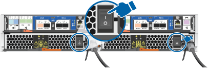

= Detaillierte Schritte – AFF C190
:allow-uri-read: 
:icons: font
:imagesdir: ../media/

[role="lead"]
Dieser Abschnitt enthält detaillierte Schritt-für-Schritt-Anleitungen zur Installation eines AFF C190 Systems.

== Schritt 1: Installation vorbereiten

Um Ihr AFF C190 System zu installieren, erstellen Sie ein Konto und registrieren Sie das System. Außerdem müssen Sie die entsprechende Anzahl und den entsprechenden Kabeltyp für Ihr System inventarisieren und bestimmte Netzwerkinformationen erfassen.

.Bevor Sie beginnen
* Stellen Sie sicher, dass Sie Zugriff auf haben link:https://hwu.netapp.com["NetApp Hardware Universe"^] (HWU) enthält Informationen zu den Standortanforderungen sowie zusätzliche Informationen zu Ihrem konfigurierten System.
* Stellen Sie sicher, dass Sie Zugriff auf haben link:http://mysupport.netapp.com/documentation/productlibrary/index.html?productID=62286["Versionshinweise"^] Für Ihre Version von ONTAP finden Sie weitere Informationen zu diesem System.
* Stellen Sie sicher, dass Sie die folgenden Elemente an Ihrem Standort haben:
+
** Rack-Platz für das Storage-System
** Kreuzschlitzschraubendreher #2
** Zusätzliche Netzwerkkabel zum Anschließen des Systems an den Netzwerk-Switch und Laptop oder die Konsole über einen Webbrowser
** Ein Laptop oder eine Konsole mit einer RJ-45-Verbindung und Zugriff auf einen Webbrowser

.Schritte
. Packen Sie den Inhalt aller Boxen aus.
. Notieren Sie die Seriennummer des Systems von den Controllern.
+
image::../media/drw_ssn_label.png[Beispiel für die Seriennummer des Systems, die den Standort der Nummer anzeigt]

. Richten Sie Ihr Konto ein:
+
.. Melden Sie sich bei Ihrem bestehenden Konto an oder erstellen Sie ein Konto.
.. Registrieren (link:https://mysupport.netapp.com/eservice/registerSNoAction.do?moduleName=RegisterMyProduct["NetApp Produktregistrierung"^]) Ihr System.

. Herunterladen und installieren link:https://mysupport.netapp.com/site/tools/tool-eula/activeiq-configadvisor["NetApp Downloads: Config Advisor"^] Auf Ihrem Laptop.
. Notieren Sie sich die Anzahl und die Kabeltypen, die Sie erhalten haben.
+
In der folgenden Tabelle sind die Kabeltypen aufgeführt, die Sie möglicherweise erhalten können. Wenn Sie ein Kabel erhalten, das nicht in der Tabelle aufgeführt ist, lesen Sie die link:https://hwu.netapp.com["NetApp Hardware Universe"^] Um das Kabel zu lokalisieren und dessen Verwendung zu identifizieren.

+
[cols="1,2,1,2"]
|===
| Kabeltyp... | Teilenummer und Länge | Steckverbindertyp | Für... 

 a| 
10-GbE-Kabel (je nach Bestellung)
 a| 
X6566B-05-R6 (112-00297), 0,5 m

X6566B-2-R6 (112-00299), 2 m
 a| 
image:../media/oie_cable_sfp_gbe_copper.png[""]
 a| 
Cluster Interconnect-Netzwerk

 a| 
X6566B-2-R6 (112-00299), 2 m

X6566B-3-R6 (112-00300), 3 m

X6566B-5-R6 (112-00301), 5 m
 a| 
Daten

 a| 
Optische Netzwerkkabel (je nach Bestellung)
 a| 
X6553-R6 (112-00188), 2 m

X6536-R6 (112-00090), 5 m

X6554-R6 (112-00189), 15 m
 a| 
image:../media/oie_sfp_optical.png[""]

image::../media/oie_cable_fiber_lc_connector.png[oie-Kabel-Glasfaser-lc-Anschluss]
 a| 
SFP + FC-Host-Netzwerk

 a| 
CAT 6, RJ-45 (je nach Bestellung)
 a| 
X6585-R6 (112-00291), 3 m

X6562-R6 (112-00196), 5 m
 a| 
image:../media/oie_cable_rj45.png[""]
 a| 
Ethernet-Host und Management-Netzwerk

 a| 
Micro-USB-Konsolenkabel
 a| 
Keine Angabe
 a| 
image:../media/oie_cable_micro_usb.png["Abbildung zeigt einen Micro-USB-Anschluss"]
 a| 
Verbindung über die Konsole während der Software-Einrichtung auf Laptops/Konsolen, die nicht von Windows stammen

 a| 
Stromkabel
 a| 
Keine Angabe
 a| 
image:../media/oie_cable_power.png[""]
 a| 
System einschalten

|===
. Laden Sie die herunter, und füllen Sie die aus link:https://library.netapp.com/ecm/ecm_download_file/ECMLP2839002["Cluster-Konfigurationsdokument"^].

== Schritt 2: Installieren Sie die Hardware

Installieren Sie Ihr System gegebenenfalls in einem 4-Säulen-Rack oder NetApp Systemschrank.

.Schritte
. Installieren Sie die Schienensatz nach Bedarf.
. Installieren und sichern Sie das System anhand der im Schienensatz enthaltenen Anweisungen.
+

NOTE: Sie müssen sich der Sicherheitsbedenken im Zusammenhang mit dem Gewicht des Systems bewusst sein.

+
image::../media/drw_oie_fas2700_weight_caution.png[drw oie fas2700 Gewicht Achtung]

. Schließen Sie Kabelmanagement-Geräte (wie abgebildet) an.
+
image::../media/drw_cable_management_arm_install.png[drw-Kabelmanagement-ARM-Installation]

. Bringen Sie die Blende auf die Vorderseite des Systems an.

== Schritt 3: Controller mit Ihrem Netzwerk verbinden

Verkabeln Sie die Controller mit dem Netzwerk unter Verwendung der Cluster-Methode ohne Switch mit zwei Nodes oder der Cluster Interconnect-Netzwerkmethode.

In der folgenden Tabelle wird der Kabeltyp mit der Aufrufnummer und der Kabelfarbe in den Abbildungen für Cluster-Netzwerkverkabelungen ohne zwei Knoten und geswitchte Cluster-Netzwerkverkabelungen aufgeführt.

[cols="20%,80%"]
|===
| Verkabelung | Verbindungstyp 

 a| 
image::../media/oie_legend_icon_1_lg.svg[oie-Legende-Symbol 1 lg]
 a| 
Cluster Interconnect

 a| 
image::../media/oie_legend_icon_2_o.svg[oie-Legendensymbol 2 o]
 a| 
Controller zum Hosten von Datennetzwerk-Switches

 a| 
image::../media/oie_legend_icon_3_lp.svg[oie Legend Icon 3 lp]
 a| 
Controller für den Management-Netzwerk-Switch

|===
[role="tabbed-block"]
====
.Option 1: Cluster mit zwei Nodes ohne Switches
--
Erfahren Sie, wie Sie ein 2-Node-Cluster ohne Switches verkabeln.

.Bevor Sie beginnen
Wenden Sie sich an den Netzwerkadministrator, um Informationen zum Anschließen des Systems an die Switches zu erhalten.

Prüfen Sie unbedingt den Abbildungspfeil, um die richtige Ausrichtung des Kabelanschlusses zu prüfen.

image::../media/oie_cable_pull_tab_down.png[ziehen Sie die Lasche des oie-Kabels nach unten]

NOTE: Wenn Sie den Anschluss einsetzen, sollten Sie das Gefühl haben, dass er einrasten kann. Wenn Sie nicht das Gefühl haben, dass er klickt, entfernen Sie ihn, drehen Sie ihn um und versuchen Sie es erneut.

NOTE: Stecken Sie beim Anschließen an einen optischen Switch den SFP-Port in den Controller-Port, bevor Sie die Verkabelung zum Port durchführen.

.Über diese Aufgabe
Beachten Sie bei der Verkabelung zwischen den Controllern und den Switches die folgenden Verkabelungsabbildungen.

UTA2-Datennetzwerkkonfigurationen::
+
--
image::../media/drw_c190_tnsc_unified_network_cabling_animated_gif.png[drw c190 tnsc Unified Network Cabling animiert gif]

--
Ethernet-Netzwerkkonfigurationen::
+
--
image::../media/drw_c190_tnsc_ethernet_network_cabling_animated_gif.png[drw c190 tnsc ethernet-Netzwerkverkabelung animiert gif]

--

Führen Sie die folgenden Schritte für jedes Controller-Modul durch.

.Schritte
. Verkabeln Sie die Cluster Interconnect Ports e0a mit e0a und e0b mit e0b mit dem Cluster Interconnect-Kabel. +image:../media/drw_c190_u_tnsc_clust_cbling.png[""]
. Verkabeln Sie die Controller entweder mit einem UTA2-Datennetzwerk oder einem Ethernet-Netzwerk.
+
UTA2-Datennetzwerkkonfigurationen:: Verwenden Sie einen der folgenden Kabeltypen, um die Datenports e0c/0c und e0d/0d oder e0e/0e und e0f/0f mit dem Host-Netzwerk zu verkabeln.
+
--
image:../media/drw_c190_u_fc_10gbe_cbling.png["Abbildung, die die Anschlüsse des Datenanschlusses wie im umgebenden Text beschrieben zeigt"]

--
Ethernet-Netzwerkkonfigurationen:: Verwenden Sie das Cat 6 RJ45-Kabel, um die e0c- über e0f-Ports mit Ihrem Hostnetzwerk zu verkabeln. In der folgenden Abbildung.
+
--
image:../media/drw_c190_e_rj45_cbling.png[""]

--

. Verkabeln Sie die E0M-Ports mit den Management-Netzwerk-Switches mit den RJ45-Kabeln.
+
image:../media/drw_c190_u_mgmt_cbling.png[""]

IMPORTANT: Schließen Sie die Stromkabel AN dieser Stelle NICHT an.

--
.Option 2: Cluster mit Switch
--
Lesen Sie, wie Sie ein Cluster mit Switches verkabeln.

.Bevor Sie beginnen
Wenden Sie sich an den Netzwerkadministrator, um Informationen zum Anschließen des Systems an die Switches zu erhalten.

Prüfen Sie unbedingt den Abbildungspfeil, um die richtige Ausrichtung des Kabelanschlusses zu prüfen.

image::../media/oie_cable_pull_tab_down.png[ziehen Sie die Lasche des oie-Kabels nach unten]

NOTE: Wenn Sie den Anschluss einsetzen, sollten Sie das Gefühl haben, dass er einrasten kann. Wenn Sie nicht das Gefühl haben, dass er klickt, entfernen Sie ihn, drehen Sie ihn um und versuchen Sie es erneut.

NOTE: Stecken Sie beim Anschließen an einen optischen Switch den SFP-Port in den Controller-Port, bevor Sie die Verkabelung zum Port durchführen.

.Über diese Aufgabe
Beachten Sie bei der Verkabelung zwischen den Controllern und den Switches die folgenden Verkabelungsabbildungen.

Unified Netzwerkkonfigurationen::
+
--
image::../media/drw_c190_switched_unified_network_cabling_animated_gif.png[drw c190 Switch Unified Network Cabling animiert (gif)]

--
Ethernet-Netzwerkkonfigurationen::
+
--
image::../media/drw_c190_switched_ethernet_network_cabling_animated.png[drw c190 geschaltete ethernet-Netzwerkverkabelung animiert]

--

Führen Sie die folgenden Schritte für jedes Controller-Modul durch.

.Schritte
. Verkabeln sie e0a und e0b mit dem Cluster Interconnect-Kabel mit den Cluster Interconnect-Switches.
+
image:../media/drw_c190_u_switched_clust_cbling.png[""]

. Verkabeln Sie die Controller entweder mit einem UTA2-Datennetzwerk oder einem Ethernet-Netzwerk.
+
UTA2-Datennetzwerkkonfigurationen:: Verwenden Sie einen der folgenden Kabeltypen, um die Datenports e0c/0c und e0d/0d oder e0e/0e und e0f/0f mit dem Host-Netzwerk zu verkabeln.
+
--
image:../media/drw_c190_u_fc_10gbe_cbling.png["Abbildung, die die Anschlüsse des Datenanschlusses wie im umgebenden Text beschrieben zeigt"]

--
Ethernet-Netzwerkkonfigurationen:: Verwenden Sie das Cat 6 RJ45-Kabel, um die e0c- über e0f-Ports mit Ihrem Hostnetzwerk zu verkabeln.
+
--
image:../media/drw_c190_e_rj45_cbling.png[""]

--

. Verkabeln Sie die E0M-Ports mit den Management-Netzwerk-Switches mit den RJ45-Kabeln.
+
image:../media/drw_c190_u_mgmt_cbling.png[""]

IMPORTANT: Schließen Sie die Stromkabel AN dieser Stelle NICHT an.

--
====

== Schritt 4: System-Setup abschließen

Führen Sie die Systemeinrichtung und -Konfiguration mithilfe der Cluster-Erkennung mit nur einer Verbindung zum Switch und Laptop durch, oder indem Sie direkt einen Controller im System verbinden und dann eine Verbindung zum Management-Switch herstellen.

[role="tabbed-block"]
====
.Option 1: Wenn die Netzwerkerkennung aktiviert ist
--
Erfahren Sie, wie Sie die Systemeinrichtung abschließen Wenn die Netzwerkerkennung auf Ihrem Laptop aktiviert ist.

.Schritte
. Schließen Sie die Stromkabel an die Controller-Netzteile an, und schließen Sie sie dann an Stromquellen auf verschiedenen Stromkreisen an.
. Schalten Sie die Netzschalter an beide Knoten ein.
+

+

NOTE: Das erste Booten kann bis zu acht Minuten dauern.

. Stellen Sie sicher, dass die Netzwerkerkennung auf Ihrem Laptop aktiviert ist.
+
Weitere Informationen finden Sie in der Online-Hilfe Ihres Notebooks.

. Verbinden Sie Ihren Laptop mit dem Management-Switch:

image::../media/dwr_laptop_to_switch_only.svg[dwr-Laptop nur zum Umschalten]

. Wählen Sie ein ONTAP-Symbol aus, um es zu ermitteln:
+
image::../media/drw_autodiscovery_controler_select.png[wählen sie den drw-Kontroller für die automatische Ermittlung aus]

+
.. Öffnen Sie Den Datei-Explorer.
.. Klicken Sie im linken Fensterbereich auf *Netzwerk*.
.. Klicken Sie mit der rechten Maustaste, und wählen Sie *Aktualisieren*.
.. Doppelklicken Sie auf das ONTAP-Symbol, und akzeptieren Sie alle auf dem Bildschirm angezeigten Zertifikate.
+

NOTE: XXXXX ist die Seriennummer des Systems für den Ziel-Node.

+
System Manager wird geöffnet.

. Konfigurieren Sie das System mithilfe von System Manager geführten Setups anhand der Daten, die Sie im erfasst haben link:https://library.netapp.com/ecm/ecm_download_file/ECMLP2862613["ONTAP Konfigurationsleitfaden"^].
. Überprüfen Sie den Systemzustand Ihres Systems, indem Sie Config Advisor ausführen.
. Wechseln Sie nach Abschluss der Erstkonfiguration mit dem link:https://docs.netapp.com/us-en/ontap-family/["ONTAP-Dokumentation"] Site für Informationen zur Konfiguration zusätzlicher Funktionen in ONTAP.
+

NOTE: Die Standard-Port-Konfiguration für Unified-Konfigurationssysteme ist der CNA-Modus. Wenn Sie eine Verbindung zu einem FC-Host-Netzwerk herstellen, müssen Sie die Ports für den FC-Modus ändern.

--
.Option 2: Wenn die Netzwerkerkennung nicht aktiviert ist
--
Erfahren Sie, wie Sie die Systemeinrichtung abschließen, wenn die Netzwerkerkennung auf Ihrem Laptop nicht aktiviert ist.

.Schritte
. Laptop oder Konsole verkabeln und konfigurieren:
+
.. Stellen Sie den Konsolenport des Laptops oder der Konsole auf 115,200 Baud mit N-8-1 ein.
+

NOTE: Informationen zur Konfiguration des Konsolenport finden Sie in der Online-Hilfe Ihres Laptops oder der Konsole.

.. Schließen Sie das Konsolenkabel an den Laptop oder die Konsole an, und schließen Sie den Konsolenport am Controller mithilfe des im Lieferumfang des Systems verwendeten Konsolenkabels an.
+
image::../media/drw_console_connect_fas2700_affa200.png[die drw-Konsole verbindet fas2700 afa200]

.. Verbinden Sie den Laptop oder die Konsole mit dem Switch im Management-Subnetz.
+
image::../media/drw_client_to_mgmt_subnet_fas2700_affa220.png[drw-Client zum Management-Subnetz fas2700 afa220]

.. Weisen Sie dem Laptop oder der Konsole eine TCP/IP-Adresse zu. Verwenden Sie dabei eine Adresse, die sich im Management-Subnetz befindet.

. Schließen Sie die Stromkabel an die Controller-Netzteile an, und schließen Sie sie dann an Stromquellen auf verschiedenen Stromkreisen an.
. Schalten Sie die Netzschalter an beide Knoten ein.
+

+

NOTE: Das erste Booten kann bis zu acht Minuten dauern.

. Weisen Sie einem der Nodes eine erste Node-Management-IP-Adresse zu.
+
[cols="1,2"]
|===
| Wenn das Managementnetzwerk DHCP enthält... | Dann... 

 a| 
Konfiguriert
 a| 
Notieren Sie die IP-Adresse, die den neuen Controllern zugewiesen ist.

 a| 
Nicht konfiguriert
 a| 
.. Öffnen Sie eine Konsolensitzung mit PuTTY, einem Terminalserver oder dem entsprechenden Betrag für Ihre Umgebung.
+

NOTE: Überprüfen Sie die Online-Hilfe Ihres Laptops oder Ihrer Konsole, wenn Sie nicht wissen, wie PuTTY konfiguriert werden soll.

.. Geben Sie die Management-IP-Adresse ein, wenn Sie dazu aufgefordert werden.

|===
. Konfigurieren Sie das Cluster unter System Manager auf Ihrem Laptop oder Ihrer Konsole:
+
.. Rufen Sie die Node-Management-IP-Adresse im Browser auf.
+

NOTE: Das Format für die Adresse ist +https://x.x.x.x+.

.. Konfigurieren Sie das System anhand der Daten, die Sie im erfasst haben link:https://library.netapp.com/ecm/ecm_download_file/ECMLP2862613["ONTAP Konfigurationsleitfaden"^].

. Überprüfen Sie den Systemzustand Ihres Systems, indem Sie Config Advisor ausführen.
. Wechseln Sie nach Abschluss der Erstkonfiguration mit dem link:https://docs.netapp.com/us-en/ontap-family/["ONTAP "] Site für Informationen zur Konfiguration zusätzlicher Funktionen in ONTAP.
+

NOTE: Die Standard-Port-Konfiguration für Unified-Konfigurationssysteme ist der CNA-Modus. Wenn Sie eine Verbindung zu einem FC-Host-Netzwerk herstellen, müssen Sie die Ports für den FC-Modus ändern.

--
====