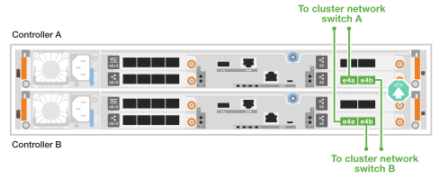

= Verkabeln Sie die Hardware – AFF C30 und AFF C60
:allow-uri-read: 
:icons: font
:imagesdir: ../media/

[role="lead"]
Nachdem Sie die AFF C30- oder AFF C60-Storage-System-Hardware installiert haben, verkabeln Sie die Controller mit dem Netzwerk und den Shelfs.

.Bevor Sie beginnen
Wenden Sie sich an Ihren Netzwerkadministrator, um Informationen über das Anschließen des Speichersystems an die Netzwerk-Switches zu erhalten.

.Über diese Aufgabe
* Die Verfahren zur Verkabelung von Cluster/HA und Host-Netzwerk zeigen gemeinsame Konfigurationen. Beachten Sie, dass die jeweilige Verkabelung von den für Ihr Speichersystem bestellten Komponenten abhängt. Ausführliche Informationen zur Konfiguration und zur Steckplatzpriorität finden Sie unter link:https://hwu.netapp.com["NetApp Hardware Universe"^].
* Die Verkabelungsgrafiken haben Pfeilsymbole, die die richtige Ausrichtung (nach oben oder unten) des Kabelsteckers zeigen, wenn ein Anschluss in einen Anschluss eingesetzt wird.
+
Wenn Sie den Anschluss einsetzen, sollten Sie das Gefühl haben, dass er einrasten kann. Wenn Sie nicht das Gefühl haben, dass er klickt, entfernen Sie ihn, drehen Sie ihn um und versuchen Sie es erneut.

+
image:../media/drw_cable_pull_tab_direction_ieops-1699.svg["Richtung der Zuglasche des Kabels"]

* Wenn Sie eine Verkabelung zu einem optischen Switch vornehmen, stecken Sie den optischen Transceiver in den Controller-Port, bevor Sie ihn mit dem Switch-Port verbinden.

== Schritt 1: Cluster/HA-Verbindungen verkabeln

Verkabeln Sie die Controller mit dem ONTAP-Cluster. Dieses Verfahren hängt von Ihrem Speichersystemmodell und Ihrer I/O-Modulkonfiguration ab.

[role="tabbed-block"]
====
.Cluster-Verkabelung ohne Switch
--
Verkabeln Sie die Controller miteinander, um die ONTAP-Cluster-Verbindungen zu erstellen.

.AFF A30 oder A50 mit zwei 2-Port 100-GbE-I/O-Modulen
[%collapsible]
=====
Die I/O-Modulports in Steckplatz 2 und 4 sind 40-GbE-Ports.???? Gilt dies nur für 30-50, wenn ja, lassen Sie die 2 Notizen, wo die sind, aber wenn gilt für alle 3, dann verschieben Sie es yo neuen Absatz unter Abschnitt Lead Text.?????

.Schritte
. Verkabeln der Cluster/HA Interconnect-Verbindungen:
+

NOTE: Der Cluster-Interconnect-Verkehr und der HA Traffic nutzen dieselben physischen Ports.

+
.. Kabel-Controller A-Port e2a zu Controller B-Port e2a.
.. Kabel-Controller A-Anschluss e4a zu Controller B-Anschluss e4a.
+

NOTE: Die Ports e2b und e4b an den I/O-Modulen in den Steckplätzen 2 und 4 sind ungenutzt und bei Bedarf für Front-End-Konnektivität (Host-Netzwerk) verfügbar.

+
*Cluster/HA Verbindungskabel*

+
image::../media/oie_cable_25Gb_Ethernet_SFP28_IEOPS-1069.svg[Cluster HA-Kabel]

+
image::../media/drw_isi_a30-50_switchless_2p_100gbe_2card_cabling_ieops-2011.svg[Schaltplan mit zwei-Node-Cluster-Verkabelung ohne Switch und zwei 100-gbe-io-Modulen]

=====
.AFF A30 oder A50 mit einem 2-Port 100-GbE-I/O-Modul
[%collapsible]
=====
Die I/O-Modulports in Steckplatz 2 und 4 sind 40-GbE-Ports.????

.Schritte
. Verkabeln der Cluster/HA Interconnect-Verbindungen:
+

NOTE: Der Cluster-Interconnect-Verkehr und der HA Traffic nutzen dieselben physischen Ports.

+
.. Kabel-Controller A-Anschluss e4a zu Controller B-Anschluss e4a.
.. Kabel Controller A-Port e4b zu Controller B-Port e4b.
+
*Cluster/HA Verbindungskabel*

+
image::../media/oie_cable_25Gb_Ethernet_SFP28_IEOPS-1069.svg[Cluster HA-Kabel]

+
image::../media/drw_isi_a30-50_switchless_2p_100gbe_1card_cabling_ieops-1925.svg[Schaltplan für die Verkabelung von Clustern mit zwei Nodes mithilfe eines 100-gbe-io-Moduls]

=====
.AFF A20 mit einem 10/25-GbE-I/O-Modul mit 2 Ports
[%collapsible]
=====
Beispiel hinzufügen

+ image:../media/oie_cable_sfp_gbe_copper.png["GbE SFP Kupfer Connector"]

+

=====
--
.Switch-Cluster-Verkabelung
--
Verkabeln Sie die Controller mit den Cluster-Netzwerk-Switches, um die ONTAP-Cluster-Verbindungen zu erstellen.

.AFF A30 oder A50 mit zwei 2-Port 100-GbE-I/O-Modulen
[%collapsible]
=====
Beispiel hinzufügen

Hinweis: Die e2b und e4b mit 40/100-GbE-Ports der I/O-Module in den Steckplätzen 2 und 4 werden nicht verwendet und sind bei Bedarf für Front-End-Konnektivität verfügbar.

=====
.AFF A30 oder A50 mit einem 2-Port 100-GbE-I/O-Modul
[%collapsible]
=====
.Schritte
. Verkabeln Sie die Controller mit den Cluster-Netzwerk-Switches:
+

NOTE: Der Cluster-Interconnect-Verkehr und der HA Traffic nutzen dieselben physischen Ports.

+
.. Kabel Controller A-Port e4a und Controller B-Port e4a zu Cluster-Netzwerk-Switch A.
.. Verbinden Sie Controller A-Port e4b und Controller B-Port e4b mit Cluster-Netzwerk-Switch B.
+
*Cluster/HA Verbindungskabel*

+
image::../media/oie_cable100_gbe_qsfp28.png[100-GB-Kabel]

+

=====
.AFF A20 mit einem 10/25-GbE-I/O-Modul mit 2 Ports
[%collapsible]
=====
Beispiel hinzufügen

=====
--
====

== Schritt 2: Verkabeln Sie die Host-Netzwerkverbindungen

Verkabeln Sie die Controller mit dem Host-Netzwerk. Dieses Verfahren hängt von Ihrem Speichersystemmodell und Ihrer I/O-Modulkonfiguration ab. Host-Konnektivität ist 40/100 GbE.???

.AFF A30 oder A50 mit zwei 2-Port 100-GbE-I/O-Modulen
[%collapsible]
====
Text

====
.AFF A30 oder A50 mit einem 2-Port 100-GbE-I/O-Modul
[%collapsible]
====
. Verkabeln Sie die Host-Netzwerkverbindungen.
+
Die folgenden Teilschritte sind Beispiele für optionale Verkabelung des Host-Netzwerks. Falls erforderlich, finden  Sie unter link:https://hwu.netapp.com["NetApp Hardware Universe"^] Informationen zu Ihrer spezifischen Konfiguration des Storage-Systems.

+
.. Optional: Kabel zu 40/100-GbE-Host-Netzwerk-Switches
+
Kabel-Ports e2a, e2b, e2c und e2d an jedem Controller mit den Ethernet-Host-Netzwerk-Switches.

+
*40/100-GbE-Kabel*

+
image::../media/oie_cable_sfp_gbe_copper.png[40/100-GB-Kabel]

+
image::../media/drw_isi_a30-50_host_2p_40-100gbe_1card_cabling_ieops-1923.svg[Verkabelung zu 40/100-gbe-ethernet-Host-Netzwerk-Switches]

.. Optional: Kabel zu FC Host-Netzwerk-Switches
+
Verkabeln Sie die Ports 1a, 1b, 1c und 1d an jedem Controller mit den FC Host-Netzwerk-Switches.

+
*64 Gbit/s FC-Kabel*

+
image::../media/oie_cable_sfp_gbe_copper.png[64-GB-fc-Kabel]

+
image::../media/drw_isi_a30-50_4p_64gb_fc_1card_cabling_ieops-1924.svg[Verkabelung zu 64 gb fc Host Netzwerk-Switches]

====
.AFF A20 mit einem 2-Port 100-GbE-Modul
[%collapsible]
====
Text hinzufügen

====

== Schritt 3: Verkabelung der Management-Netzwerkverbindungen

Verkabeln Sie die Controller mit dem Managementnetzwerk.

. Verkabeln Sie die Managementports (Schraubenschlüssel) an jedem Controller mit den Managementnetzwerk-Switches.
+
* 1000BASE-T RJ-45 KABEL*

+
image::../media/oie_cable_rj45.png[RJ-45-Kabel]

+
image::../media/drw_isi_g_wrench_cabling_ieops-1928.svg[Stellen Sie eine Verbindung mit dem Managementnetzwerk her]

IMPORTANT: Stecken Sie die Netzkabel noch nicht ein.

== Schritt 4: Verkabeln Sie die Shelf-Verbindungen

Im folgenden Verfahren wird gezeigt, wie Sie die Controller mit einem NS224-Shelf verkabeln.

.Über diese Aufgabe
* Die maximale Anzahl der unterstützten Einschübe für Ihr Speichersystem und alle Verkabelungsoptionen, wie link:https://hwu.netapp.com["NetApp Hardware Universe"^]z. B. optische und Switch-Attached, finden Sie unter .
* Sie verkabeln jeden Controller mit jedem NSM100B-Modul im NS224-Shelf mithilfe der Storage-Kabel, die im Lieferumfang des Storage-Systems enthalten sind. Folgende Kabeltypen können verwendet werden:
+
*100 GbE QSFP28 Kupferkabel*

+
image::../media/oie_cable100_gbe_qsfp28.png[100-GbE-QSFP28-Kupferkabel]

* Die Grafik zeigt die Verkabelung von Controller A blau und Controller B gelb.

.Schritte
. Controller A am Shelf verkabeln:
+
.. Kabel-Controller A-Anschluss e3a zu NSM A-Anschluss e1a.
.. Kabel-Controller A-Port e3b zu NSM B-Port e1b.
+
image:../media/drw_isi_g_1_ns224_controller_a_cabling_ieops-1945.svg["Controller A-Ports e3a und e3b sind mit einem NS224-Shelf verbunden"]

. Controller B am Shelf verkabeln:
+
.. Kabel-Controller B Port e3a zu NSM B Port e1a.
.. Kabel Controller B Port e3b zu NSM A Port e1b.
+
image:../media/drw_isi_g_1_ns224_controller_b_cabling_ieops-1946.svg["Controller B-Ports e3a und e3b, verkabelt mit einem NS224-Shelf"]

.Was kommt als Nächstes?
Nachdem Sie die Hardware für Ihr Speichersystem verkabelt haben, können Sie link:install-power-hardware.html["Schalten Sie das Speichersystem ein"].
