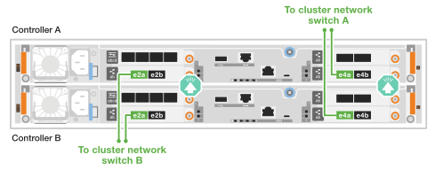

= Verkabeln Sie die Hardware – AFF C30 und AFF C60
:allow-uri-read: 
:icons: font
:imagesdir: ../media/

[role="lead"]
Nachdem Sie die AFF C30- oder AFF C60-Storage-System-Hardware installiert haben, verkabeln Sie die Controller mit dem Netzwerk und den Shelfs.

.Bevor Sie beginnen
Wenden Sie sich an Ihren Netzwerkadministrator, um Informationen über das Anschließen des Speichersystems an die Netzwerk-Switches zu erhalten.

.Über diese Aufgabe
* Die Verkabelungsgrafiken haben Pfeilsymbole, die die richtige Ausrichtung (nach oben oder unten) des Kabelsteckers zeigen, wenn ein Anschluss in einen Anschluss eingesetzt wird.
+
Wenn Sie den Anschluss einsetzen, sollten Sie das Gefühl haben, dass er einrasten kann. Wenn Sie nicht das Gefühl haben, dass er klickt, entfernen Sie ihn, drehen Sie ihn um und versuchen Sie es erneut.

+
image:../media/drw_cable_pull_tab_direction_ieops-1699.svg["Richtung der Zuglasche des Kabels"]

* Wenn Sie eine Verkabelung zu einem optischen Switch vornehmen, stecken Sie den optischen Transceiver in den Controller-Port, bevor Sie ihn mit dem Switch-Port verbinden.

== Schritt 1: Cluster/HA-Verbindungen verkabeln

Erstellen Sie die ONTAP-Cluster-Verbindungen. Bei Clustern ohne Switch verbinden Sie die Controller miteinander. Verbinden Sie bei geswitchten Clustern die Controller mit den Cluster-Netzwerk-Switches.

[NOTE]
====
Die Cluster-/HA-Verkabelungsbeispiele zeigen gängige Konfigurationen.

Wenn Sie Ihre Konfiguration hier nicht sehen, finden Sie unter link:https://hwu.netapp.com["NetApp Hardware Universe"^]umfassende Informationen zur Konfiguration und Steckplatzpriorität, um das Storage-System zu verkabeln.

====
[role="tabbed-block"]
====
.Cluster-Verkabelung ohne Switch
--
.AFF C30 oder AFF C60 mit zwei 40/100-GbE-I/O-Modulen mit 2 Ports
[%collapsible]
=====
.Schritte
. Verkabeln der Cluster/HA Interconnect-Verbindungen:
+

NOTE: Der Cluster-Interconnect-Verkehr und der HA Traffic nutzen dieselben physischen Ports (auf den I/O-Modulen in den Steckplätzen 2 und 4). Die Ports sind 40/100 GbE.

+
.. Kabel-Controller A-Port e2a zu Controller B-Port e2a.
.. Kabel-Controller A-Anschluss e4a zu Controller B-Anschluss e4a.
+

NOTE: Die I/O-Modulports e2b und e4b sind nicht verwendet und stehen für die Host-Netzwerk-Konnektivität zur Verfügung.

+
*100 GbE Cluster/HA Interconnect-Kabel*

+
image::../media/oie_cable100_gbe_qsfp28.png[Cluster HA 100-GbE-Kabel]

+
image::../media/drw_isi_a30-50_switchless_2p_100gbe_2card_cabling_ieops-2011.svg[Diagramm der Switch-losen Cluster-Verkabelung bei a30 und a60 mit zwei 100-gbe-io-Modulen]

=====
.AFF C30 oder AFF C60 mit einem 40/100-GbE-I/O-Modul mit 2 Anschlüssen
[%collapsible]
=====
.Schritte
. Verkabeln der Cluster/HA Interconnect-Verbindungen:
+

NOTE: Der Cluster-Interconnect-Verkehr und der HA-Verkehr teilen sich dieselben physischen Ports (auf dem I/O-Modul in Steckplatz 4). Die Ports sind 40/100 GbE.

+
.. Kabel-Controller A-Anschluss e4a zu Controller B-Anschluss e4a.
.. Kabel Controller A-Port e4b zu Controller B-Port e4b.
+
*100 GbE Cluster/HA Interconnect-Kabel*

+
image::../media/oie_cable100_gbe_qsfp28.png[Cluster HA 100-GbE-Kabel]

+
image::../media/drw_isi_a30-50_switchless_2p_100gbe_1card_cabling_ieops-1925.svg[Diagramm der Switch-losen Cluster-Verkabelung bei a30 und a60 mit einem 100-gbe-io-Modul]

=====
--
.Switch-Cluster-Verkabelung
--
.AFF C30 oder AFF C60 mit zwei 40/100-GbE-I/O-Modulen mit 2 Ports
[%collapsible]
=====
.Schritte
. Verkabeln der Cluster/HA Interconnect-Verbindungen:
+

NOTE: Der Cluster-Interconnect-Verkehr und der HA Traffic nutzen dieselben physischen Ports (auf den I/O-Modulen in den Steckplätzen 2 und 4). Die Ports sind 40/100 GbE.

+
.. Verbinden Sie Controller A-Port e4a mit Cluster-Netzwerk-Switch A.
.. Verbinden Sie Controller A-Port e2a mit Cluster-Netzwerk-Switch B.
.. Verbinden Sie Controller B-Port e4a mit Cluster-Netzwerk-Switch A.
.. Verbinden Sie Controller B-Port e2a mit Cluster-Netzwerk-Switch B.
+

NOTE: Die I/O-Modulports e2b und e4b sind nicht verwendet und stehen für die Host-Netzwerk-Konnektivität zur Verfügung.

+
*40/100 GbE Cluster/HA Interconnect-Kabel*

+
image::../media/oie_cable100_gbe_qsfp28.png[Cluster HA 40/100-GbE-Kabel]

+

=====
.AFF C30 oder AFF C60 mit einem 40/100-GbE-I/O-Modul mit 2 Anschlüssen
[%collapsible]
=====
.Schritte
. Verkabeln Sie die Controller mit den Cluster-Netzwerk-Switches:
+

NOTE: Der Cluster-Interconnect-Verkehr und der HA-Verkehr teilen sich dieselben physischen Ports (auf dem I/O-Modul in Steckplatz 4). Die Ports sind 40/100 GbE.

+
.. Verbinden Sie Controller A-Port e4a mit Cluster-Netzwerk-Switch A.
.. Verbinden Sie den Controller A-Port e4b mit dem Cluster-Netzwerk-Switch B.
.. Verbinden Sie Controller B-Port e4a mit Cluster-Netzwerk-Switch A.
.. Verbinden Sie Controller B-Port e4b mit Cluster-Netzwerk-Switch B.
+
*40/100 GbE Cluster/HA Interconnect-Kabel*

+
image::../media/oie_cable100_gbe_qsfp28.png[Cluster HA 40/100-GbE-Kabel]

+
image::../media/drw_isi_a30-50_2p_100gbe_1card_switched_cabling_ieops-1926.svg[Verkabeln Sie Cluster-Verbindungen mit dem Cluster-Netzwerk]

=====
--
====

== Schritt 2: Verkabeln Sie die Host-Netzwerkverbindungen

Verkabeln Sie die Controller mit dem Ethernet- oder FC-Hostnetzwerk.

[NOTE]
====
Die Beispiele für die Hostnetzwerkverkabelung zeigen gängige Konfigurationen.

Wenn Sie Ihre Konfiguration hier nicht sehen, finden Sie unter link:https://hwu.netapp.com["NetApp Hardware Universe"^]umfassende Informationen zur Konfiguration und Steckplatzpriorität, um das Storage-System zu verkabeln.

====
[role="tabbed-block"]
====
.Ethernet-Hostverkabelung
--
.AFF C30 oder AFF C60 mit zwei 40/100-GbE-I/O-Modulen mit 2 Ports
[%collapsible]
=====
.Schritte
. Verbinden Sie an jedem Controller die Ports e2b und e4b mit den Ethernet-Host-Netzwerk-Switches.
+

NOTE: Die Ports an E/A-Modulen in Steckplatz 2 und 4 sind 40/100 GbE (Host-Konnektivität ist 40/100 GbE).

+
*40/100-GbE-Kabel*

+
image::../media/oie_cable_sfp_gbe_copper.png[40/100-GB-Kabel]

+
image::../media/drw_isi_a30-50_host_2p_40-100gbe_2card_cabling_ieops-2014.svg[Verkabelung zu 40/100-gbe-ethernet-Host-Netzwerk-Switches]

=====
.AFF C30 oder AFF C60 mit einem 10/25-GbE-I/O-Modul mit 4 Anschlüssen
[%collapsible]
=====
.Schritte
. Verkabeln Sie bei jedem Controller die Ports e2a, e2b, e2c und e2d mit den Ethernet-Host-Netzwerk-Switches.
+
*10/25-GbE-Kabel*

+
image:../media/oie_cable_sfp_gbe_copper.png["GbE SFP Kupfer Connector"]

+
image::../media/drw_isi_a30-50_host_2p_40-100gbe_1card_cabling_ieops-1923.svg[Verkabelung zu 40/100-gbe-ethernet-Host-Netzwerk-Switches]

=====
--
.FC-Host-Verkabelung
--
.AFF C30 oder AFF C60 mit einem 64-Gbit/s-FC-I/O-Modul mit 4 Anschlüssen
[%collapsible]
=====
.Schritte
. Verkabeln Sie an jedem Controller die Ports 1a, 1b, 1c und 1d mit den FC-Host-Netzwerk-Switches.
+
*64 Gbit/s FC-Kabel*

+
image:../media/oie_cable_sfp_gbe_copper.png["64-GB-fc-Kabel, Breite=100 px"]

+
image::../media/drw_isi_a30-50_4p_64gb_fc_1card_cabling_ieops-1924.svg[Verkabelung zu 64 gb fc Host Netzwerk-Switches]

=====
--
====

== Schritt 3: Verkabelung der Management-Netzwerkverbindungen

Verkabeln Sie die Controller mit dem Managementnetzwerk.

. Verkabeln Sie die Managementports (Schraubenschlüssel) an jedem Controller mit den Managementnetzwerk-Switches.
+
* 1000BASE-T RJ-45 KABEL*

+
image::../media/oie_cable_rj45.png[RJ-45-Kabel]

+
image::../media/drw_isi_g_wrench_cabling_ieops-1928.svg[Stellen Sie eine Verbindung mit dem Managementnetzwerk her]

IMPORTANT: Stecken Sie die Netzkabel noch nicht ein.

== Schritt 4: Verkabeln Sie die Shelf-Verbindungen

Dieses Verfahren zeigt, wie Sie die Controller mit einem NS224-Shelf verkabeln.

.Über diese Aufgabe
* Die maximale Anzahl der unterstützten Einschübe für Ihr Speichersystem und alle Verkabelungsoptionen, wie link:https://hwu.netapp.com["NetApp Hardware Universe"^]z. B. optische und Switch-Attached, finden Sie unter .
* Die Verkabelung des NS224-Regals zeigt NSM100B-Module anstelle von NSM100-Modulen. Die Verkabelung ist unabhängig vom Typ der verwendeten NSM-Module gleich, lediglich die Portnamen unterscheiden sich:
+
** NSM100B-Module verwenden die Ports e1a und e1b auf einem E/A-Modul in Steckplatz 1.
** NSM100-Module verwenden integrierte (Onboard-)Ports e0a und e0b.

* Sie verkabeln jeden Controller mit jedem NSM-Modul im NS224-Regal mithilfe der Speicherkabel, die mit Ihrem Speichersystem geliefert wurden. Dabei kann es sich um den folgenden Kabeltyp handeln:
+
*100 GbE QSFP28 Kupferkabel*

+
image::../media/oie_cable100_gbe_qsfp28.png[100-GbE-QSFP28-Kupferkabel]

* Die Grafik zeigt die Verkabelung von Controller A blau und Controller B gelb.

.Schritte
. Controller A am Shelf verkabeln:
+
.. Kabel-Controller A-Anschluss e3a zu NSM A-Anschluss e1a.
.. Kabel-Controller A-Port e3b zu NSM B-Port e1b.
+
image:../media/drw_isi_g_1_ns224_controller_a_cabling_ieops-1945.svg["Controller A-Ports e3a und e3b sind mit einem NS224-Shelf verbunden"]

. Controller B am Shelf verkabeln:
+
.. Kabel-Controller B Port e3a zu NSM B Port e1a.
.. Kabel Controller B Port e3b zu NSM A Port e1b.
+
image:../media/drw_isi_g_1_ns224_controller_b_cabling_ieops-1946.svg["Controller B-Ports e3a und e3b, verkabelt mit einem NS224-Shelf"]

.Was kommt als Nächstes?
Nachdem Sie die Hardware für Ihr Speichersystem verkabelt haben, können Sie link:install-power-hardware.html["Schalten Sie das Speichersystem ein"].
