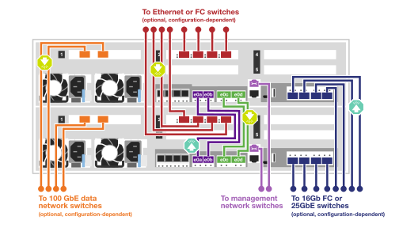
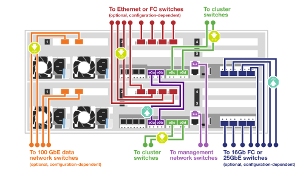
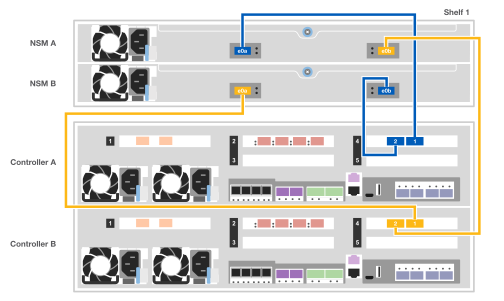
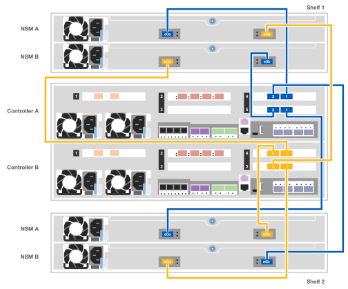

= Ausführliche Anleitung - AFF C400
:allow-uri-read: 
:icons: font
:imagesdir: ../media/

[role="lead"]
Dieser Leitfaden enthält detaillierte Schritt-für-Schritt-Anleitungen zur Installation eines typischen NetApp Systems. In diesem Handbuch finden Sie weitere detaillierte Installationsanweisungen.

Wenn Sie über eine MetroCluster-Konfiguration verfügen, verwenden Sie den MetroCluster-Installationsinhalt.

https://docs.netapp.com/us-en/ontap-metrocluster/index.html["MetroCluster-Dokumentation"^]

== Schritt 1: Installation vorbereiten

[role="lead"]
Um Ihr System zu installieren, müssen Sie ein Konto erstellen, das System registrieren und Lizenzschlüssel abrufen. Außerdem müssen Sie die entsprechende Anzahl und den entsprechenden Kabeltyp für Ihr System inventarisieren und bestimmte Netzwerkinformationen erfassen.

.Bevor Sie beginnen
Sie müssen Zugriff auf das Hardware Universe haben, um Informationen zu den Standortanforderungen sowie zusätzliche Informationen über Ihr konfiguriertes System zu erhalten. Möglicherweise möchten Sie auch Zugriff auf die Versionshinweise für Ihre Version von ONTAP haben, um weitere Informationen zu diesem System zu erhalten.

https://hwu.netapp.com["NetApp Hardware Universe"]

http://mysupport.netapp.com/documentation/productlibrary/index.html?productID=62286["Finden Sie die Versionshinweise für Ihre Version von ONTAP 9"]

Folgendes müssen Sie an Ihrer Website angeben:

* Rack-Platz für das Storage-System
* Kreuzschlitzschraubendreher #2
* Zusätzliche Netzwerkkabel zum Anschließen des Systems an den Netzwerk-Switch und Laptop oder die Konsole über einen Webbrowser

.Schritte
. Packen Sie den Inhalt aller Boxen aus.
. Notieren Sie die Seriennummer des Systems von den Controllern.
+
image::../media/drw_ssn_label.png[drw ssn-Etikett]

. Notieren Sie sich die Anzahl und die Kabeltypen, die Sie erhalten haben.
+
In der folgenden Tabelle sind die Kabeltypen aufgeführt, die Sie möglicherweise erhalten können. Wenn Sie ein Kabel empfangen, das nicht in der Tabelle aufgeführt ist, finden Sie im Hardware Universe das Kabel und dessen Verwendung.

+
https://hwu.netapp.com["NetApp Hardware Universe"]

+
[cols="1,2,1,2"]
|===
| Kabeltyp... | Teilenummer und Länge | Steckverbindertyp | Für... 

 a| 
100-GbE-Kabel (QSFP28)
 a| 
X6211A-05 (112-00595), 0,5 m

X6211A-1 (112-00573), 1 m

X6211A-2 (112-00574), 2 m

X6211A-5 (112-00574), 5 m
 a| 
image:../media/oie_cable100_gbe_qsfp28.png[""]
 a| 
Storage-, Cluster Interconnect/HA- und Ethernet-Daten (abhängig von der Reihenfolge

 a| 
25-GbE-Kabel (SFP28)
 a| 
X66240-2 (112-00598), 2 m

X66240-5 (112-00639), 5 m
 a| 
image:../media/oie_cable_sfp_gbe_copper.png[""]
 a| 
GbE-Netzwerkverbindung (auftragsabhängig)

 a| 
32 Gbit FC (SFP+ Op)
 a| 
X66250-2 (112-00342), 2 m

X66250-5 (112-00344), 5 m

X66250-15 (112-00346), 15 m
 a| 
image:../media/oie_cable_sfp_gbe_copper.png[""]
 a| 
FC-Netzwerkverbindung

 a| 
Optische Kabel
 a| 
X66250-2-N-C (112-00342)
 a| 
image:../media/oie_cable_fiber_lc_connector.png[""]
 a| 
16 GB FC oder 25 GbE Kabel für Mezzanine-Karten (abhängig von der Bestellung)

 a| 
RJ-45 (je nach Bestellung)
 a| 
X6585-R6 (112-00291), 3 m

X6562-R6 (112-00196), 5 m
 a| 
image:../media/oie_cable_rj45.png[""]
 a| 
Managementnetzwerk

 a| 
Micro-USB-Konsolenkabel
 a| 
Keine Angabe
 a| 
image:../media/oie_cable_micro_usb.png[""]
 a| 
Verbindung über die Konsole, die während der Software-Einrichtung verwendet wird, wenn Laptop oder Konsole die Netzwerkerkennung nicht unterstützt.

 a| 
Stromkabel
 a| 
Keine Angabe
 a| 
image:../media/oie_cable_power.png[""]
 a| 
System einschalten

|===
. Lesen Sie den _NetApp ONTAP Configuration Guide_ und sammeln Sie die in diesem Leitfaden aufgeführten Informationen.
+
https://library.netapp.com/ecm/ecm_download_file/ECMLP2862613["ONTAP Konfigurationsleitfaden"]

== Schritt 2: Installieren Sie die Hardware

[role="lead"]
Sie müssen das System je nach Bedarf in einem 4-Säulen-Rack oder NetApp Systemschrank installieren.

. Installieren Sie die Schienensatz nach Bedarf.
. Installieren und sichern Sie das System anhand der im Schienensatz enthaltenen Anweisungen.
+

NOTE: Sie müssen sich der Sicherheitsbedenken im Zusammenhang mit dem Gewicht des Systems bewusst sein.

+
image::../media/drw_katana_lifting_restriction_icon.png[drw Katana-Symbol für die Beschränkung des Hubens]

. Schließen Sie Kabelmanagement-Geräte (wie abgebildet) an.
+
image::../media/drw_a320_cable_management_arms.png[drw a320 Kabelführungsarme]

. Bringen Sie die Blende auf die Vorderseite des Systems an.

== Schritt 3: Controller mit Ihrem Netzwerk verbinden

[role="lead"]
Sie können die Controller mithilfe der Switch-freien Cluster-Methode mit zwei Nodes oder des Cluster Interconnect-Netzwerks mit dem Netzwerk verkabeln.

NOTE: Wenn die Portetiketten auf der Karte nicht sichtbar sind, können Sie die Ports identifizieren, indem Sie die Ausrichtung der Karteninstallation überprüfen (bei C400 befindet sich der PCIe-Anschlusssockel auf der linken Seite des Kartensteckplatzes), und dann in NetApp Hardware Universe nach der Teilenummer nach der Karte suchen. Zeigt eine Grafik der Blende mit den Port-Etiketten. Sie können die Teilenummer der Karte über den Befehl sysconfig -a oder auf der Packliste des Systems finden.

NOTE: Wenn Sie eine MetroCluster IP-Konfiguration verkabeln, sind die Ports e0a/e0b zum Hosten von Daten-LIFs verfügbar (normalerweise im standardmäßigen IPSpace).

=== Option 1: Verkabeln eines 2-Node-Clusters ohne Switches

[role="lead"]
Die optionalen Daten-Ports, optionalen NIC-Karten und Management-Ports der Controller-Module werden mit Switches verbunden. Die Cluster Interconnect- und HA-Ports sind an beiden Controller-Modulen verkabelt.

Sie müssen sich an den Netzwerkadministrator wenden, um Informationen über das Anschließen des Systems an die Switches zu erhalten.

Achten Sie beim Einsetzen der Kabel in die Anschlüsse darauf, die Richtung der Kabelabziehlaschen zu überprüfen. Die Kabelabziehlaschen sind für alle Onboard-Ports und nach unten für Erweiterungskarten (NIC) vorgesehen.

image::../media/oie_cable_pull_tab_up.png[ziehen Sie die Lasche des oie-Kabels nach oben]

image::../media/oie_cable_pull_tab_down.png[ziehen Sie die Lasche des oie-Kabels nach unten]

NOTE: Wenn Sie den Anschluss einsetzen, sollten Sie das Gefühl haben, dass er einrasten kann. Wenn Sie nicht das Gefühl haben, dass er klickt, entfernen Sie ihn, drehen Sie ihn um und versuchen Sie es erneut.

.Schritte
. Schließen Sie die Verkabelung zwischen den Controllern und den Switches anhand der Abbildung ab:
+

. Gehen Sie zu <<Schritt 4: Controller mit Laufwerk-Shelfs verkabeln>> Anleitung zur Verkabelung des Festplatten-Shelf

=== Option 2: Kabel ein geschalteter Cluster

[role="lead"]
Die optionalen Daten-Ports, optionale NIC-Karten, Mezzanine-Karten und Management-Ports der Controller-Module sind mit den Switches verbunden. Die Cluster Interconnect- und HA-Ports sind mit dem Cluster/HA-Switch verbunden.

Sie müssen sich an den Netzwerkadministrator wenden, um Informationen über das Anschließen des Systems an die Switches zu erhalten.

Achten Sie beim Einsetzen der Kabel in die Anschlüsse darauf, die Richtung der Kabelabziehlaschen zu überprüfen. Die Kabelabziehlaschen sind für alle Onboard-Ports und nach unten für Erweiterungskarten (NIC) vorgesehen.

image::../media/oie_cable_pull_tab_up.png[ziehen Sie die Lasche des oie-Kabels nach oben]

image::../media/oie_cable_pull_tab_down.png[ziehen Sie die Lasche des oie-Kabels nach unten]

NOTE: Wenn Sie den Anschluss einsetzen, sollten Sie das Gefühl haben, dass er einrasten kann. Wenn Sie nicht das Gefühl haben, dass er klickt, entfernen Sie ihn, drehen Sie ihn um und versuchen Sie es erneut.

.Schritte
. Schließen Sie die Verkabelung zwischen den Controllern und den Switches anhand der Abbildung ab:
+

. Gehen Sie zu <<Schritt 4: Controller mit Laufwerk-Shelfs verkabeln>> Anleitung zur Verkabelung des Festplatten-Shelf

== Schritt 4: Controller mit Laufwerk-Shelfs verkabeln

[role="lead"]
Die folgenden Optionen zeigen, wie Sie ein oder zwei NS224-Laufwerk-Shelfs mit Ihrem System verkabeln.

=== Option 1: Controller mit einem einzelnen Festplatten-Shelf verkabeln

[role="lead"]
Sie müssen jeden Controller mit den NSM-Modulen am NS224-Laufwerk-Shelf verkabeln.

Prüfen Sie unbedingt den Abbildungspfeil, um die richtige Ausrichtung des Kabelanschlusses zu prüfen. Die Kabelabziehlasche für die NS224 sind nach oben.

image::../media/oie_cable_pull_tab_up.png[ziehen Sie die Lasche des oie-Kabels nach oben]

NOTE: Wenn Sie den Anschluss einsetzen, sollten Sie das Gefühl haben, dass er einrasten kann. Wenn Sie nicht das Gefühl haben, dass er klickt, entfernen Sie ihn, drehen Sie ihn um und versuchen Sie es erneut.

.Schritte
. Verwenden Sie die folgende Abbildung, um Ihre Controller mit einem einzelnen Festplatten-Shelf zu verkabeln.
+

. Gehen Sie zu <<Schritt 5: System-Setup und -Konfiguration abschließen>> Zum Abschließen der Einrichtung und Konfiguration des Systems.

=== Option 2: Controller mit zwei Festplatten-Shelfs verkabeln

[role="lead"]
Sie müssen jeden Controller an beiden NS224 Laufwerk-Shelfs mit den NSM-Modulen verkabeln.

Prüfen Sie unbedingt den Abbildungspfeil, um die richtige Ausrichtung des Kabelanschlusses zu prüfen. Die Kabelabziehlasche für die NS224 sind nach oben.

image::../media/oie_cable_pull_tab_up.png[ziehen Sie die Lasche des oie-Kabels nach oben]

NOTE: Wenn Sie den Anschluss einsetzen, sollten Sie das Gefühl haben, dass er einrasten kann. Wenn Sie nicht das Gefühl haben, dass er klickt, entfernen Sie ihn, drehen Sie ihn um und versuchen Sie es erneut.

.Schritte
. Verwenden Sie die folgende Abbildung, um Ihre Controller mit zwei Laufwerk-Shelfs zu verkabeln.
+

. Gehen Sie zu <<Schritt 5: System-Setup und -Konfiguration abschließen>> Zum Abschließen der Einrichtung und Konfiguration des Systems.

== Schritt 5: System-Setup und -Konfiguration abschließen

[role="lead"]
Die Einrichtung und Konfiguration des Systems kann mithilfe der Cluster-Erkennung nur mit einer Verbindung zum Switch und Laptop abgeschlossen werden. Sie können auch direkt eine Verbindung zu einem Controller im System herstellen und dann eine Verbindung zum Management Switch herstellen.

=== Option 1: Abschluss der Systemeinrichtung und -Konfiguration bei aktivierter Netzwerkerkennung

[role="lead"]
Wenn die Netzwerkerkennung auf Ihrem Laptop aktiviert ist, können Sie das System mit der automatischen Cluster-Erkennung einrichten und konfigurieren.

. Verwenden Sie die folgende Animation, um Shelf-IDs für ein oder mehrere Festplatten-Shelfs einzuschalten und festzulegen:
+
Für NS224 Laufwerk-Shelfs sind die Shelf-IDs auf 00 und 01 voreingestellt. Wenn Sie die Shelf-IDs ändern möchten, verwenden Sie das gerade gebogene Ende einer Büroklammer oder den Kugelschreiber mit schmaler Spitze, um auf die Shelf-ID-Taste hinter der Frontplatte zuzugreifen.

+
.Animation: Legen Sie die Festplatten-Shelf-IDs fest
video::c500e747-30f8-4763-9065-afbf00008e7f[panopto]
. Schließen Sie die Stromkabel an die Controller-Netzteile an, und schließen Sie sie dann an Stromquellen auf verschiedenen Stromkreisen an.
. Stellen Sie sicher, dass die Netzwerkerkennung auf Ihrem Laptop aktiviert ist.
+
Weitere Informationen finden Sie in der Online-Hilfe Ihres Notebooks.

. Schließen Sie Ihren Laptop mithilfe der folgenden Animation an den Management-Switch an.
+
.Animation - Verbinden Sie Ihren Laptop mit dem Management-Switch
video::d61f983e-f911-4b76-8b3a-ab1b0066909b[panopto]
. Wählen Sie ein ONTAP-Symbol aus, um es zu ermitteln:
+
image::../media/drw_autodiscovery_controler_select.png[wählen sie den drw-Kontroller für die automatische Ermittlung aus]

+
.. Öffnen Sie Den Datei-Explorer.
.. Klicken Sie im linken Bereich auf Netzwerk.
.. Mit der rechten Maustaste klicken und Aktualisieren auswählen.
.. Doppelklicken Sie auf das ONTAP-Symbol, und akzeptieren Sie alle auf dem Bildschirm angezeigten Zertifikate.
+

NOTE: XXXXX ist die Seriennummer des Systems für den Ziel-Node.

+
System Manager wird geöffnet.

. Mit der systemgesteuerten Einrichtung konfigurieren Sie das System anhand der im _NetApp ONTAP Configuration Guide_ erfassten Daten.
+
https://library.netapp.com/ecm/ecm_download_file/ECMLP2862613["ONTAP Konfigurationsleitfaden"]

. Richten Sie Ihr Konto ein und laden Sie Active IQ Config Advisor herunter:
+
.. Melden Sie sich bei Ihrem bestehenden Konto an oder erstellen Sie ein Konto.
+
https://mysupport.netapp.com/site/user/registration["NetApp Support-Registrierung"]

.. Registrieren Sie das System.
+
https://mysupport.netapp.com/site/systems/register["NetApp Produktregistrierung"]

.. Laden Sie Active IQ Config Advisor herunter.
+
https://mysupport.netapp.com/site/tools["NetApp Downloads: Config Advisor"]

. Überprüfen Sie den Systemzustand Ihres Systems, indem Sie Config Advisor ausführen.
. Wechseln Sie nach Abschluss der Erstkonfiguration mit dem https://www.netapp.com/data-management/oncommand-system-documentation/["ONTAP  ONTAP System Manager; Dokumentationsressourcen"] Seite für Informationen über das Konfigurieren zusätzlicher Funktionen in ONTAP.

=== Option 2: Abschluss der Systemeinrichtung und -Konfiguration, falls die Netzwerkerkennung nicht aktiviert ist

[role="lead"]
Wenn die Netzwerkerkennung auf Ihrem Laptop nicht aktiviert ist, müssen Sie die Konfiguration und das Setup mit dieser Aufgabe abschließen.

. Laptop oder Konsole verkabeln und konfigurieren:
+
.. Stellen Sie den Konsolenport des Laptops oder der Konsole auf 115,200 Baud mit N-8-1 ein.
+

NOTE: Informationen zur Konfiguration des Konsolenport finden Sie in der Online-Hilfe Ihres Laptops oder der Konsole.

.. Verbinden Sie das Konsolenkabel mit dem Laptop oder der Konsole über das im Lieferumfang des Systems mitgelieferte Konsolenkabel, und verbinden Sie dann den Laptop mit dem Management Switch im Management-Subnetz.
.. Weisen Sie dem Laptop oder der Konsole eine TCP/IP-Adresse zu. Verwenden Sie dabei eine Adresse, die sich im Management-Subnetz befindet.

. Verwenden Sie die folgende Animation, um Shelf-IDs für ein oder mehrere Festplatten-Shelfs einzuschalten und festzulegen:
+
Für NS224 Laufwerk-Shelfs sind die Shelf-IDs auf 00 und 01 voreingestellt. Wenn Sie die Shelf-IDs ändern möchten, verwenden Sie das gerade gebogene Ende einer Büroklammer oder den Kugelschreiber mit schmaler Spitze, um auf die Shelf-ID-Taste hinter der Frontplatte zuzugreifen.

+
.Animation: Legen Sie die Festplatten-Shelf-IDs fest
video::c500e747-30f8-4763-9065-afbf00008e7f[panopto]
. Schließen Sie die Stromkabel an die Controller-Netzteile an, und schließen Sie sie dann an Stromquellen auf verschiedenen Stromkreisen an.
+

NOTE: Das erste Booten kann bis zu acht Minuten dauern.

. Weisen Sie einem der Nodes eine erste Node-Management-IP-Adresse zu.
+
[cols="1,2"]
|===
| Wenn das Managementnetzwerk DHCP enthält... | Dann... 

 a| 
Konfiguriert
 a| 
Notieren Sie die IP-Adresse, die den neuen Controllern zugewiesen ist.

 a| 
Nicht konfiguriert
 a| 
.. Öffnen Sie eine Konsolensitzung mit PuTTY, einem Terminalserver oder dem entsprechenden Betrag für Ihre Umgebung.
+

NOTE: Überprüfen Sie die Online-Hilfe Ihres Laptops oder Ihrer Konsole, wenn Sie nicht wissen, wie PuTTY konfiguriert werden soll.

.. Geben Sie die Management-IP-Adresse ein, wenn Sie dazu aufgefordert werden.

|===
. Konfigurieren Sie das Cluster unter System Manager auf Ihrem Laptop oder Ihrer Konsole:
+
.. Rufen Sie die Node-Management-IP-Adresse im Browser auf.
+

NOTE: Das Format für die Adresse ist +https://x.x.x.x.+

.. Konfigurieren Sie das System mit den im _NetApp ONTAP Configuration Guide_ erfassten Daten.
+
https://library.netapp.com/ecm/ecm_download_file/ECMLP2862613["ONTAP Konfigurationsleitfaden"]

. Richten Sie Ihr Konto ein und laden Sie Active IQ Config Advisor herunter:
+
.. Melden Sie sich bei Ihrem bestehenden Konto an oder erstellen Sie ein Konto.
+
https://mysupport.netapp.com/site/user/registration["NetApp Support-Registrierung"]

.. Registrieren Sie das System.
+
https://mysupport.netapp.com/site/systems/register["NetApp Produktregistrierung"]

.. Laden Sie Active IQ Config Advisor herunter.
+
https://mysupport.netapp.com/site/tools["NetApp Downloads: Config Advisor"]

. Überprüfen Sie den Systemzustand Ihres Systems, indem Sie Config Advisor ausführen.
. Wechseln Sie nach Abschluss der Erstkonfiguration mit dem https://www.netapp.com/data-management/oncommand-system-documentation/["ONTAP  ONTAP System Manager; Dokumentationsressourcen"] Seite für Informationen über das Konfigurieren zusätzlicher Funktionen in ONTAP.

