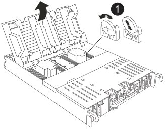

= Ersetzen Sie den Echtzeitakku AFF C80
:allow-uri-read: 
:icons: font
:imagesdir: ../media/

[role="lead"]
Ersetzen Sie in Ihrem AFF C80-System die Echtzeituhr (RTC)-Batterie, die allgemein als Knopfzellenbatterie bezeichnet wird, um sicherzustellen, dass Dienste und Anwendungen, die auf eine genaue Zeitsynchronisierung angewiesen sind, weiterhin funktionsfähig bleiben.

Entfernen Sie die fehlerhafte RTC-Batterie, und setzen Sie die Ersatz-RTC-Batterie ein.

.Schritte
. Öffnen Sie den Luftkanal der Steuerung auf der Oberseite der Steuerung.
+
.. Stecken Sie Ihre Finger in die Aussparungen an den entfernten Enden des Luftkanals.
.. Heben Sie den Luftkanal an, und drehen Sie ihn bis zum gewünschten Winkel nach oben.

. Suchen Sie die RTC-Batterie unter dem Luftkanal.
+

+
[cols="1,4"]
|===

 a| 
image:../media/icon_round_1.png["Legende Nummer 1"]
 a| 
RTC-Akku und Gehäuse

|===
. Schieben Sie den Akku vorsichtig von der Halterung weg, drehen Sie ihn vom Halter weg, und heben Sie ihn dann aus der Halterung.
+

NOTE: Beachten Sie die Polarität der Batterie, während Sie sie aus dem Halter entfernen. Der Akku ist mit einem Pluszeichen gekennzeichnet und muss korrekt in der Halterung positioniert werden. Ein Pluszeichen in der Nähe des Halters zeigt an, wie der Akku positioniert werden soll.

. Entfernen Sie den Ersatzakku aus dem antistatischen Versandbeutel.
. Notieren Sie die Polarität der RTC-Batterie, und setzen Sie sie anschließend in den Halter ein, indem Sie die Batterie schräg kippen und nach unten drücken.
. Überprüfen Sie die Batterie visuell, um sicherzustellen, dass sie vollständig in den Halter eingebaut ist und die Polarität korrekt ist.

