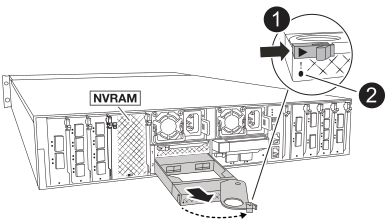

= Ersetzen Sie den Flash Cache Modulträger oder ein Caching-Modul – FAS70 und FAS90
:allow-uri-read: 
:icons: font
:imagesdir: ../media/

[role="lead"]
Der NVMe SSD Flash Cache Modulträger in Ihrem FAS70 oder FAS90 System enthält ein oder zwei Flash Cache Module (Caching-Module) mit einem einzelnen SSD Flash Cache Laufwerk, das in jedes Caching-Modul integriert ist.

FAS70 unterstützt 2-TB-Caching-Module, FAS90 unterstützt 4-TB-Caching-Module. Sie können im Flash Cache Modulträger keine unterschiedlichen Caching-Module mit unterschiedlicher Kapazität kombinieren.

Je nachdem, welche Komponente Sie ersetzen müssen, können Sie einen der folgenden Vorgänge ausführen: Den gesamten Flash Cache Modulträger oder ein Caching-Modul.

* <<Ersetzen Sie den Flash Cache-Modulträger>>
* <<Ersetzen Sie das Caching-Modul>>

== Ersetzen Sie den Flash Cache-Modulträger

Der Flash Cache Modulträger befindet sich in Steckplatz 6 und beherbergt bis zu zwei Flash Cache Module. Sie können den Flash Cache Modulträger nicht im laufenden Betrieb austauschen

.Bevor Sie beginnen
* Stellen Sie sicher, dass Ihr Storage-System über das geeignete Betriebssystem für den Flash Cache Ersatzmodulträger verfügt.
* Vergewissern Sie sich, dass alle anderen Komponenten ordnungsgemäß funktionieren. Falls nicht, wenden Sie sich an den technischen Support.

=== Schritt 1: Fahren Sie den Knoten mit beeinträchtigten Knoten herunter

Fahren Sie den Regler herunter oder übernehmen Sie ihn mit einer der folgenden Optionen.

[role="tabbed-block"]
====
.Option 1: Die meisten Systeme
--
Um den beeinträchtigten Controller herunterzufahren, müssen Sie den Status des Controllers bestimmen und gegebenenfalls den Controller übernehmen, damit der gesunde Controller weiterhin Daten aus dem beeinträchtigten Reglerspeicher bereitstellen kann.

.Über diese Aufgabe
* Wenn Sie über ein SAN-System verfügen, müssen Sie Event-Meldungen ) für den beeinträchtigten Controller SCSI Blade überprüft haben  `cluster kernel-service show`. Mit dem `cluster kernel-service show` Befehl (im erweiterten Modus von priv) werden der Knotenname,  der Node, der Verfügbarkeitsstatus dieses Node und der Betriebsstatus dieses Node angezeigtlink:https://docs.netapp.com/us-en/ontap/system-admin/display-nodes-cluster-task.html["Quorum-Status"].
+
Jeder Prozess des SCSI-Blades sollte sich im Quorum mit den anderen Nodes im Cluster befinden. Probleme müssen behoben werden, bevor Sie mit dem Austausch fortfahren.

* Wenn Sie über ein Cluster mit mehr als zwei Nodes verfügen, muss es sich im Quorum befinden. Wenn sich das Cluster nicht im Quorum befindet oder ein gesunder Controller FALSE anzeigt, um die Berechtigung und den Zustand zu erhalten, müssen Sie das Problem korrigieren, bevor Sie den beeinträchtigten Controller herunterfahren; siehe link:https://docs.netapp.com/us-en/ontap/system-admin/synchronize-node-cluster-task.html?q=Quorum["Synchronisieren eines Node mit dem Cluster"^].

.Schritte
. Wenn AutoSupport aktiviert ist, unterdrücken Sie die automatische Erstellung eines Cases durch Aufrufen einer AutoSupport Meldung:
+
`system node autosupport invoke -node * -type all -message MAINT=<# of hours>h`

+
Die folgende AutoSupport Meldung unterdrückt die automatische Erstellung von Cases für zwei Stunden:

+
`cluster1:> system node autosupport invoke -node * -type all -message MAINT=2h`

. Automatische Rückgabe deaktivieren:
+
.. Geben Sie den folgenden Befehl von der Konsole des fehlerfreien Controllers ein:
+
`storage failover modify -node _impaired_node_name_ -auto-giveback false`

.. Eingeben `y` wenn die Eingabeaufforderung _Möchten Sie die automatische Rückgabe deaktivieren?_ angezeigt wird

. Nehmen Sie den beeinträchtigten Controller zur LOADER-Eingabeaufforderung:
+
[cols="1,2"]
|===
| Wenn der eingeschränkte Controller angezeigt wird... | Dann... 

 a| 
Die LOADER-Eingabeaufforderung
 a| 
Fahren Sie mit dem nächsten Schritt fort.

 a| 
Warten auf Giveback...
 a| 
Drücken Sie Strg-C, und antworten Sie dann `y` Wenn Sie dazu aufgefordert werden.

 a| 
Eingabeaufforderung für das System oder Passwort
 a| 
Übernehmen oder stoppen Sie den beeinträchtigten Regler von der gesunden Steuerung:

`storage failover takeover -ofnode _impaired_node_name_ -halt _true_`

Der Parameter _-stop true_ führt Sie zur Loader-Eingabeaufforderung.

|===

--
.Option 2: Controller befindet sich in einem MetroCluster
--
Um den beeinträchtigten Controller herunterzufahren, müssen Sie den Status des Controllers bestimmen und gegebenenfalls den Controller übernehmen, damit der gesunde Controller weiterhin Daten aus dem beeinträchtigten Reglerspeicher bereitstellen kann.

* Wenn Sie über ein Cluster mit mehr als zwei Nodes verfügen, muss es sich im Quorum befinden. Wenn sich das Cluster nicht im Quorum befindet oder ein gesunder Controller FALSE anzeigt, um die Berechtigung und den Zustand zu erhalten, müssen Sie das Problem korrigieren, bevor Sie den beeinträchtigten Controller herunterfahren; siehe link:https://docs.netapp.com/us-en/ontap/system-admin/synchronize-node-cluster-task.html?q=Quorum["Synchronisieren eines Node mit dem Cluster"^].
* Sie müssen bestätigt haben, dass der MetroCluster-Konfigurationsstatus konfiguriert ist und sich die Knoten in einem aktivierten und normalen Zustand befinden:
+
`metrocluster node show`

.Schritte
. Wenn AutoSupport aktiviert ist, unterdrücken Sie die automatische Erstellung eines Cases durch Aufrufen einer AutoSupport Meldung:
+
`system node autosupport invoke -node * -type all -message MAINT=number_of_hours_downh`

+
Die folgende AutoSupport Meldung unterdrückt die automatische Erstellung von Cases für zwei Stunden:

+
`cluster1:*> system node autosupport invoke -node * -type all -message MAINT=2h`

. Automatische Rückgabe deaktivieren:
+
.. Geben Sie den folgenden Befehl von der Konsole des fehlerfreien Controllers ein:
+
`storage failover modify -node local -auto-giveback false`

.. Eingeben `y` wenn die Eingabeaufforderung _Möchten Sie die automatische Rückgabe deaktivieren?_ angezeigt wird

. Nehmen Sie den beeinträchtigten Controller zur LOADER-Eingabeaufforderung:
+
[cols="1,2"]
|===
| Wenn der eingeschränkte Controller angezeigt wird... | Dann... 

 a| 
Die LOADER-Eingabeaufforderung
 a| 
Gehen Sie zum nächsten Abschnitt.

 a| 
Warten auf Giveback...
 a| 
Drücken Sie Strg-C, und antworten Sie dann `y` Wenn Sie dazu aufgefordert werden.

 a| 
Eingabeaufforderung des Systems oder Passwort (Systempasswort eingeben)
 a| 
Übernehmen oder stoppen Sie den beeinträchtigten Regler von der gesunden Steuerung:

`storage failover takeover -ofnode _impaired_node_name_ -halt _true_`

Der Parameter _-stop true_ führt Sie zur Loader-Eingabeaufforderung.

|===

--
====

=== Schritt 2: Ersetzen Sie den Flash Cache Modulträger

Führen Sie die folgenden Schritte durch, um den Flash Cache Modulträger zu ersetzen.

.Schritte
. Wenn Sie nicht bereits geerdet sind, sollten Sie sich richtig Erden.
. Suchen Sie den fehlerhaften Flash Cache-Modulträger in Steckplatz 6 durch die gelbe Warn-LED auf der Vorderseite des Flash Cache-Modulträgers.
+
image::../media/drw_fas70-90_remove_caching_module_carrier_ieops-1772.svg[Entfernen Sie den Flash Cache Modulträger]

+
[cols="1,4"]
|===

 a| 
image:../media/icon_round_1.png["Legende Nummer 1"]
 a| 
Flash Cache Modulträger

 a| 
image:../media/icon_round_2.png["Legende Nummer 2"]
 a| 
Steckplatznummern für Caching-Module

 a| 
image:../media/icon_round_3.png["Legende Nummer 3"]
 a| 
Flash Cache-Modulträger-Nockengriff

 a| 
image:../media/icon_round_4.png["Legende Nummer 4"]
 a| 
Fehler-LED für Flash Cache-Modulträger

|===
. Entfernen Sie den fehlerhaften Flash Cache-Modulträger:
+
.. Drehen Sie das Kabelführungs-Fach nach unten, indem Sie die Tasten an beiden Seiten an der Innenseite des Kabelführungs-Fachs ziehen und das Fach dann nach unten drehen.
.. Drücken Sie die blaue Lasche unten im Flash Cache Modulträger zusammen.
.. Drehen Sie die Lasche vom Modul weg.

. Ziehen Sie den Flash Cache-Modulträger aus dem Controller-Modul und legen Sie ihn auf eine antistatische Matte.
. Verschieben Sie die Caching-Module auf den Flash Cache Ersatz-Modulträger:
+
.. Drücken Sie die Terra Cotta Lasche oben am Cache-Modul zusammen, und drehen Sie den Nockengriff vom Cache-Modul weg.
.. Entfernen Sie das Modul aus dem Gehäuse, indem Sie den Finger in die Öffnung des Nockenhebels stecken und das Modul aus dem Flash Cache-Modulträger ziehen.
.. Setzen Sie das Caching-Modul in denselben Steckplatz im Ersatz-Flash Cache-Modulträger ein, und drehen Sie den Nockengriff in die geschlossene Position am Caching-Modul, um es zu verriegeln.

. Wiederholen Sie diese Schritte, wenn ein zweites Cache-Modul vorhanden ist.
. Installieren Sie den Flash Cache Ersatzmodulträger in das System:
+
.. Richten Sie das Modul an den Kanten der Öffnung des Gehäusesteckplatzes aus.
.. Schieben Sie das Modul vorsichtig in den Steckplatz bis zum Gehäuse, und drehen Sie dann die Nockenverriegelung ganz nach oben, um das Modul zu verriegeln.
.. Drehen Sie das Kabelführungs-Fach bis in die geschlossene Position.

=== Schritt 3: Starten Sie den Controller neu

Nachdem Sie den Flash Cache-Modulträger ersetzt haben, müssen Sie das Controller-Modul neu starten.

.Schritte
. Starten Sie an der LOADER-Eingabeaufforderung den Node: _Bye_ neu
+

NOTE: Dadurch werden die I/O-Karten und andere Komponenten neu initialisiert und der Node neu gestartet.

. Kehren Sie den Knoten wieder in den normalen Betrieb zurück: _Storage Failover Giveback -ofnode Impaired_Node_Name_
. Wenn das automatische Giveback deaktiviert wurde, aktivieren Sie es erneut: _Storage Failover modify -Node local -Auto-Giveback true_

=== Schritt 4: Senden Sie das fehlgeschlagene Teil an NetApp zurück

Senden Sie das fehlerhafte Teil wie in den dem Kit beiliegenden RMA-Anweisungen beschrieben an NetApp zurück.  https://mysupport.netapp.com/site/info/rma["Rückgabe und Austausch von Teilen"]Weitere Informationen finden Sie auf der Seite.

== Ersetzen Sie das Caching-Modul

Die Flash Cache Module (Caching-Module) befinden sich in Steckplatz 6-1 oder in Steckplatz 6-2 oder sowohl in Steckplatz 6-1 als auch in Steckplatz 6-2.

Sie können die einzelnen Caching-Module im laufenden Betrieb durch Caching-Module ersetzen, die dieselbe Kapazität vom selben Anbieter oder von einem anderen unterstützten Anbieter haben.

.Bevor Sie beginnen
* Stellen Sie sicher, dass das Ersatz-Caching-Modul dieselbe Kapazität wie das ausgefallene Cache hat, vom selben Anbieter oder von einem anderen unterstützten Anbieter.
* Vergewissern Sie sich, dass alle anderen Komponenten ordnungsgemäß funktionieren. Falls nicht, wenden Sie sich an den technischen Support.
* Die Laufwerke in den Caching-Modulen sind keine Field Replaceable Units (FRU). Sie müssen das gesamte Cache-Modul ersetzen.

.Schritte
. Wenn Sie nicht bereits geerdet sind, sollten Sie sich richtig Erden.
. Suchen Sie das fehlgeschlagene Cache-Modul in Steckplatz 6 mithilfe der gelb beleuchteten Warn-LED an der Vorderseite des Cache-Moduls.
. Bereiten Sie den Cache-Modulschacht wie folgt vor:
+
.. Notieren Sie die Kapazität des Caching-Moduls, die Teilenummer und die Seriennummer auf dem Zielknoten: _System Node Run local sysconfig -AV 6_
.. Bereiten Sie auf der Administratorberechtigungsebene den Steckplatz für das Ziel-Caching-Modul für `y` die Entfernung vor und antworten Sie, wenn Sie gefragt werden, ob Sie fortfahren möchten: _System Controller Slot Module remove -Node_Name -slot slot_number_ der folgende Befehl bereitet Steckplatz 6-1 auf node1 auf die Entfernung vor und zeigt eine Meldung an, dass es sicher entfernt werden kann:
+
[listing]
----
::> system controller slot module remove -node node1 -slot 6-1

Warning: SSD module in slot 6-1 of the node node1 will be powered off for removal.
Do you want to continue? (y|n): _y_
The module has been successfully removed from service and powered off. It can now be safely removed.
----
.. Zeigen Sie mit dem den Status des Steckplatzes an `system controller slot module show` Befehl.
+
Der Status `powered-off` des Caching-Modulsteckplatzes wird in der Bildschirmausgabe für das zu ersetzende Caching-Modul angezeigt.

+

NOTE: Siehe https://docs.netapp.com/us-en/ontap-cli-9121/["Befehlsman-Pages"^] Für Ihre Version von ONTAP.

. Entfernen Sie das Caching-Modul:
+

+
[cols="1,4"]
|===

 a| 
image:../media/icon_round_1.png["Legende Nummer 1"]
 a| 
Nockengriff des Caching-Moduls

 a| 
image:../media/icon_round_2.png["Legende Nummer 2"]
 a| 
Fehler-LED des Caching-Moduls

|===
+
.. Drehen Sie das Kabelführungs-Fach nach unten, indem Sie die Tasten an beiden Seiten an der Innenseite des Kabelführungs-Fachs ziehen und das Fach dann nach unten drehen.
.. Drücken Sie die Entriegelungstaste Terra Cotta auf der Vorderseite des Cache-Moduls.
.. Drehen Sie den Nockengriff so weit wie möglich.
.. Entfernen Sie das Caching-Modul aus dem Gehäuse, indem Sie den Finger in die Öffnung des Nockenhebels stecken und das Modul aus dem Flash Cache-Modulträger ziehen.
+
Achten Sie darauf, das Caching-Modul zu unterstützen, wenn Sie es aus dem Flash Cache Modulträger entfernen.

. Installieren Sie das Ersatz-Cache-Modul:
+
.. Richten Sie die Kanten des Caching-Moduls an der Öffnung im Controller-Modul aus.
.. Schieben Sie das Cache-Modul vorsichtig in den Schacht, bis der Nockengriff einrastet.
.. Den Nockengriff drehen, bis er einrastet.
.. Drehen Sie das Kabelführungs-Fach bis in die geschlossene Position.

. Bringen Sie das Ersatz-Cache-Modul online, indem Sie das verwenden `system controller slot module insert` Befehl wie folgt:
+
Der folgende Befehl bereitet Steckplatz 6-1 auf node1 für das Einschalten vor und zeigt eine Meldung an, dass er eingeschaltet ist:

+
[listing]
----
::> system controller slot module insert -node node1 -slot 6-1

Warning: NVMe module in slot 6-1 of the node localhost will be powered on and initialized.
Do you want to continue? (y|n): `y`

The module has been successfully powered on, initialized and placed into service.
----
. Überprüfen Sie den Steckplatzstatus mithilfe der `system controller slot module show` Befehl.
+
Stellen Sie sicher, dass die Befehlsausgabe den Status für das meldet `powered-on` Und einsatzbereit.

. Vergewissern Sie sich, dass das Ersatz-Cache-Modul online ist und erkannt wird, und bestätigen Sie anschließend visuell, dass die gelbe Warnungs-LED nicht leuchtet: `sysconfig -av slot_number`
+

NOTE: Wenn Sie das Caching-Modul durch ein Caching-Modul eines anderen Anbieters ersetzen, wird der neue Anbietername in der Befehlsausgabe angezeigt.

. Senden Sie das fehlerhafte Teil wie in den dem Kit beiliegenden RMA-Anweisungen beschrieben an NetApp zurück.  https://mysupport.netapp.com/site/info/rma["Rückgabe und Austausch von Teilen"^]Weitere Informationen finden Sie auf der Seite.

