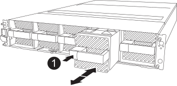

= Ersetzen Sie das Controller-Modul FAS70 und FAS90
:allow-uri-read: 
:icons: font
:imagesdir: ../media/

[role="lead"]
Um den Controller auszutauschen, müssen Sie den beeinträchtigten Controller entfernen, die FRU-Komponenten auf das Ersatz-Controller-Modul verschieben, das Ersatz-Controller-Modul im Gehäuse installieren und das System dann im Wartungsmodus booten.

== Schritt 1: Entfernen Sie das Controller-Modul

Sie müssen das Controller-Modul aus dem Gehäuse entfernen, wenn Sie das Controller-Modul austauschen oder eine Komponente im Controller-Modul austauschen.

. Überprüfen Sie die NVRAM-Status-LED in Steckplatz 4/5 des Systems. An der Vorderseite des Controller-Moduls befindet sich außerdem eine NVRAM-LED. Suchen Sie nach dem NV-Symbol:
+
image::../media/drw_a1K-70-90_nvram-led_ieops-1463.svg[Grafik für die NVRAM-Warnungs- und Status-LED zur Lage]

+
[cols="1,4"]
|===

 a| 
image:../media/icon_round_1.png["Legende Nummer 1"]
 a| 
NVRAM-Status-LED

 a| 
image:../media/icon_round_2.png["Legende Nummer 2"]
 a| 
LED für NVRAM-Warnung

|===
+

NOTE: Wenn die NVRAM-Status-LED blinkt, bedeutet dies möglicherweise, dass das Controller-Modul nicht ordnungsgemäß übernommen oder angehalten wurde (nicht belegte Daten). Wenn das beeinträchtigte Controller-Modul nicht erfolgreich vom Partner-Controller-Modul übernommen wurde, wenden Sie sich an https://mysupport.netapp.com/site/global/dashboard["NetApp Support"] , bevor Sie mit diesem Verfahren fortfahren.

+
Das allgemeine Verhalten der NVRAM-Status-LED am Controller-Modul für beeinträchtigte besteht wie folgt:

+
** Die NVRAM-Status-LED blinkt, wenn die Stromversorgung vom Controller-Modul getrennt wird und sich das Controller-Modul im Status „Warten auf Rückgabe“ befindet oder das Controller-Modul nicht ordnungsgemäß übernommen oder angehalten wird (nicht belegte Daten).
** Wenn das Controller-Modul aus dem Gehäuse entfernt wird, blinkt die NVRAM-Status-LED, sodass das Controller-Modul nicht übernommen oder ordnungsgemäß angehalten wird (nicht belegte Daten). Vergewissern Sie sich, dass das Controller-Modul sauber Übernahme durch das Partner Controller-Modul erfolgt ist oder dass das beeinträchtigte Controller-Modul angezeigt wird `waiting for giveback`. Anschließend kann die blinkende LED ignoriert werden (und der Controller kann aus dem Gehäuse entfernt werden).

. Wenn Sie nicht bereits geerdet sind, sollten Sie sich richtig Erden.
. Haken Sie an der Vorderseite des Geräts die Finger in die Löcher in den Verriegelungsnocken ein, drücken Sie die Laschen an den Nockenhebeln zusammen, und drehen Sie beide Verriegelungen gleichzeitig vorsichtig, aber fest zu sich hin.
+
Das Controller-Modul bewegt sich leicht aus dem Gehäuse.

+
image::../media/drw_a1k_pcm_remove_replace_ieops-1375.svg[Controller Grafik entfernen]

+
[cols="1,4"]
|===

 a| 
image:../media/icon_round_1.png["Legende Nummer 1"]
| Verriegelungsnocken 
|===
. Schieben Sie das Controller-Modul aus dem Gehäuse und legen Sie es auf eine Ebene, stabile Oberfläche.
+
Stellen Sie sicher, dass Sie die Unterseite des Controller-Moduls stützen, wenn Sie es aus dem Gehäuse herausziehen.

== Schritt 2: Bewegen Sie die Lüfter

Sie müssen die fünf Lüftermodule aus dem außer Betrieb genommenen Controller-Modul am Ersatz-Controller-Modul entfernen.

. Wenn Sie nicht bereits geerdet sind, sollten Sie sich richtig Erden.
. Entfernen Sie die Blende (falls erforderlich) mit zwei Händen, indem Sie die Öffnungen auf beiden Seiten der Blende fassen und dann zu Ihnen ziehen, bis sich die Blende von den Kugelknöpfen am Rahmen des Chassis löst.
. Drücken Sie die graue Verriegelungstaste am Lüftermodul, und ziehen Sie das Lüftermodul gerade aus dem Gehäuse, und stellen Sie sicher, dass Sie es mit der freien Hand stützen.
+

NOTE: Die Lüftermodule sind kurz. Unterstützen Sie das Lüftermodul immer mit Ihrer freien Hand, damit es nicht plötzlich vom Gehäuse abfällt und Sie verletzt.

+

+
[cols="1,4"]
|===

 a| 
image::../media/icon_round_1.png[Legende Nummer 1]
 a| 
Schwarze Verriegelungstaste

|===
. Installieren Sie den Lüfter im Ersatz-Controller-Modul:
+
.. Richten Sie die Kanten des Lüftergehäuses an der Öffnung an der Vorderseite des Ersatz-Controller-Moduls aus.
.. Schieben Sie das Lüftermodul vorsichtig bis zum Einrasten in das Ersatz-Controller-Modul.

. Wiederholen Sie die vorherigen Schritte für die übrigen Lüftermodule.

== Schritt 3: Verschieben Sie den NV-Akku

Bringen Sie die NV-Batterie in die Ersatzsteuerung.

. Öffnen Sie die Abdeckung des NV-Batterie-Luftkanals, und suchen Sie nach der NV-Batterie.
+
image::../media/drw_a1k_remove_replace_nvmembat_ieops-1379.svg[NV-Batterie AFF A1K entfernen]

+
[cols="1,4"]
|===

 a| 
image::../media/icon_round_1.png[Legende Nummer 1]
| Abdeckung des NV-Batterie-Luftkanals 

 a| 
image::../media/icon_round_2.png[Legende Nummer 2]
 a| 
NV-Batteriestecker

 a| 
image::../media/icon_round_3.png[Legende Nummer 3]
 a| 
NV-Akkupack

|===
. Heben Sie die Batterie an, um auf den Batteriestecker zuzugreifen.
. Drücken Sie die Klammer auf der Vorderseite des Batteriesteckers, um den Stecker aus der Steckdose zu lösen, und ziehen Sie dann das Batteriekabel aus der Steckdose.
. Heben Sie die Batterie aus dem Luftkanal und dem Controller-Modul heraus.
. Setzen Sie den Akku in das neue Controller-Modul ein, und setzen Sie ihn dann in den Luftkanal der NV-Batterie ein:
+
.. Öffnen Sie den Luftkanal der NV-Batterie im neuen Controller-Modul.
.. Stecken Sie den Batteriestecker in die Steckdose, und stellen Sie sicher, dass der Stecker einrastet.
.. Setzen Sie den Akku in den Steckplatz ein, und drücken Sie den Akku fest nach unten, um sicherzustellen, dass er fest eingerastet ist.
.. Schließen Sie die Abdeckung des Luftkanals.

== Schritt 4: System-DIMMs verschieben

Bringen Sie die DIMMs an das Ersatz-Controller-Modul an.

. Öffnen Sie den Luftkanal der Hauptplatine, und suchen Sie die DIMMs.
+
image::../media/drw_a1k_dimms_ieops-1512.svg[DIMM Entfernen AFF A1K]

+
[cols="1,4"]
|===

 a| 
image::../media/icon_round_1.png[Legende Nummer 1]
 a| 
System-DIMM

|===
. Beachten Sie die Ausrichtung des DIMM-Moduls in den Sockel, damit Sie das DIMM-Modul in die richtige Ausrichtung einsetzen können.
. Werfen Sie das DIMM aus dem Steckplatz, indem Sie die beiden DIMM-Auswerferlaschen auf beiden Seiten des DIMM langsam auseinander drücken und dann das DIMM aus dem Steckplatz schieben.
+

NOTE: Halten Sie das DIMM vorsichtig an den Rändern, um Druck auf die Komponenten auf der DIMM-Leiterplatte zu vermeiden.

. Suchen Sie den Steckplatz, in dem Sie das DIMM im Ersatz-Controller-Modul installieren.
. Setzen Sie das DIMM-Modul in den Steckplatz ein.
+
Das DIMM passt eng in den Steckplatz, sollte aber leicht einpassen. Falls nicht, richten Sie das DIMM-Modul mit dem Steckplatz aus und setzen Sie es wieder ein.

+

NOTE: Prüfen Sie das DIMM visuell, um sicherzustellen, dass es gleichmäßig ausgerichtet und vollständig in den Steckplatz eingesetzt ist.

. Drücken Sie vorsichtig, aber fest auf die Oberseite des DIMM, bis die Auswurfklammern über den Kerben an den Enden des DIMM einrasten.
. Wiederholen Sie diese Schritte für die übrigen DIMMs. Schließen Sie den Luftkanal der Hauptplatine.

== Schritt 5: Installieren Sie das Controller-Modul

Installieren Sie das Controller-Modul neu, und starten Sie es.

. Wenn Sie dies noch nicht getan haben, schließen Sie den Luftkanal.
. Richten Sie das Ende des Controller-Moduls an der Öffnung im Gehäuse aus, und schieben Sie das Controller-Modul in das Gehäuse, wobei die Hebel von der Vorderseite des Systems weg gedreht sind.
. Sobald das Controller-Modul Sie daran hindert, es weiter zu schieben, drehen Sie die Nockengriffe nach innen, bis sie wieder unter den Lüftern einrasten
+

NOTE: Setzen Sie das Controller-Modul nicht zu stark in das Gehäuse ein, um Beschädigungen der Anschlüsse zu vermeiden.

+
Das Controller-Modul startet, sobald es vollständig im Gehäuse sitzt.

. Stellen Sie den außer Betrieb genommenen Controller wieder ein, indem Sie seine Speicherung zurückgeben: `storage failover giveback -ofnode _impaired_node_name_`.
. Wenn die automatische Rückgabe deaktiviert wurde, aktivieren Sie sie erneut: `storage failover modify -node local -auto-giveback true`.
. Wenn AutoSupport aktiviert ist, kann die automatische Fallerstellung wiederhergestellt/aufgehoben werden: `system node autosupport invoke -node * -type all -message MAINT=END`.

