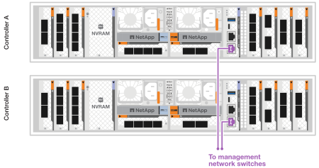
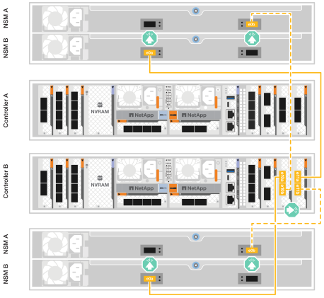

= Verkabelung der Hardware FAS70 und FAS90
:allow-uri-read: 
:icons: font
:imagesdir: ../media/

[role="lead"]
Nachdem Sie die Rack-Hardware für Ihr FAS70 oder FAS90 Storage-System installiert haben, installieren Sie die Netzwerkkabel für die Controller und verbinden Sie die Kabel zwischen den Controllern und Storage Shelfs.

.Bevor Sie beginnen
Prüfen Sie den Pfeil in der Abbildung in den Verkabelungsdiagrammen auf die richtige Ausrichtung der Zuglasche am Kabelanschluss.

image::../media/drw_cable_pull_tab_direction_ieops-1699.svg[Beispiel für die Ausrichtung der Kabelzuglasche]

* Wenn Sie den Anschluss einsetzen, sollten Sie spüren, dass er einrastet. Wenn Sie ihn nicht einrasten, entfernen Sie ihn, drehen Sie den Kabelkopf um und versuchen Sie es erneut.
* Wenn Sie ein optisches Gerät mit einem Switch verbinden, stecken Sie das SFP-Modul in den Controller-Port, bevor Sie es mit dem Port verbinden.

== Schritt 1: Verbinden Sie die Storage Controller mit Ihrem Netzwerk

Verbinden Sie die Storage Controller mit Ihrem Host-Netzwerk.

.Bevor Sie beginnen
Informationen zum Anschließen des Speichersystems an die Switches erhalten Sie von Ihrem Netzwerkadministrator.

.Über diese Aufgabe
Diese Verfahren zeigen gängige Konfigurationen. Beachten Sie, dass die jeweilige Verkabelung von den für Ihr Speichersystem bestellten Komponenten abhängt. Ausführliche Informationen zur Konfiguration und zur Steckplatzpriorität finden Sie unter link:https://hwu.netapp.com["NetApp Hardware Universe"^].

[role="tabbed-block"]
====
.Option 1: Verbinden Sie die Controller mit einem ONTAP Cluster ohne Switch
--
Verbinden Sie die Storage Controller miteinander, um die ONTAP-Cluster-Verbindungen zu erstellen, und verbinden Sie dann die Ethernet-Ports auf jedem Controller mit dem Host-Netzwerk.

.Schritte
. Verwenden Sie das Cluster/HA-Verbindungskabel, um die Ports e1a mit e1a und die Ports e7a mit e7a zu verbinden.
+

NOTE: Der Cluster-Interconnect-Verkehr und der HA Traffic nutzen dieselben physischen Ports.

+
.. Schließen Sie den Port e1a an Controller A an den Port e1a an Controller B. an
.. Verbinden Sie Port e7a auf Controller A mit Port e7a auf Controller B.
+
*Cluster/HA Verbindungskabel*

+
image::../media/oie_cable_25Gb_Ethernet_SFP28_IEOPS-1069.svg[Cluster HA-Kabel]

+
image::../media/drw_a1k_tnsc_cluster_cabling_ieops-1648.svg[Verkabelungsdiagramm für Cluster mit zwei Nodes ohne Switches]

. Verbinden Sie die Ethernet-Modulports mit Ihrem Hostnetzwerk.
+
Im Folgenden finden Sie einige typische Beispiele für eine Verkabelung im Host-Netzwerk. Informationen zu Ihrer spezifischen Systemkonfiguration finden Sie unter link:https://hwu.netapp.com["NetApp Hardware Universe"^] .

+
.. Verbinden Sie die Ports e9a und e9b wie in der Abbildung dargestellt mit dem Ethernet-Datennetzwerk-Switch.
+

NOTE: Verwenden Sie für maximale Systemperformance für Cluster- und HA-Datenverkehr die Ports e1b und e7b nicht für Host-Netzwerkverbindungen. Verwenden Sie eine separate Hostkarte, um die Leistung zu maximieren.

+
*100-GbE-Kabel*

+
image::../media/oie_cable_sfp_gbe_copper.svg[100-GB-Ethernet-Kabel]

+
image::../media/drw_a1k_network_cabling1_ieops-1649.svg[Kabel zum 100-GB-Ethernet-Netzwerk]

.. Verbinden Sie Ihre 10/25 GbE Host-Netzwerk-Switches.
+
*10/25 GbE Host*

+
image::../media/oie_cable_sfp_gbe_copper.svg[10 GB Ethernet-Kabel]

+
image::../media/drw_a1k_network_cabling2_ieops-1650.svg[Kabel zu 10/25-GB-Ethernet-Netzwerk]

. Verwenden Sie die 1000BASE-T RJ-45-Kabel, um die Controller-Management-Ports (Schraubenschlüssel) mit den Management-Netzwerk-Switches zu verbinden.
+
image::../media/oie_cable_rj45.svg[RJ-45-Kabel]

+
* 1000BASE-T RJ-45 KABEL*

+

IMPORTANT: Stecken Sie die Netzkabel noch nicht ein.

--
.Option 2: Verbinden Sie die Controller mit einem Switch-basierten ONTAP-Cluster
--
Verbinden Sie die Storage Controller mit den Cluster-Netzwerk-Switches, um die ONTAP-Cluster-Verbindungen zu erstellen, und verbinden Sie dann die Ethernet-Ports auf jedem Controller mit dem Host-Netzwerk.

.Schritte
. Stellen Sie die folgenden Kabelverbindungen her:
+

NOTE: Der Cluster-Interconnect-Verkehr und der HA Traffic nutzen dieselben physischen Ports.

+
.. Verbinden Sie Port e1a an Controller A und Port e1a an Controller B mit Cluster-Netzwerk-Switch A.
.. Verbinden Sie Port e7a an Controller A und Port e7a an Controller B mit Cluster-Netzwerk-Switch B.
+
*100-GbE-Kabel*

+
image::../media/oie_cable100_gbe_qsfp28.svg[100-GB-Kabel]

+
image::../media/drw_a1k_switched_cluster_cabling_ieops-1652.svg[Verkabeln Sie Cluster-Verbindungen mit dem Cluster-Netzwerk]

. Verbinden Sie die Ethernet-Modulports mit Ihrem Hostnetzwerk.
+
Im Folgenden finden Sie einige typische Beispiele für eine Verkabelung im Host-Netzwerk. Informationen zu Ihrer spezifischen Systemkonfiguration finden Sie unter link:https://hwu.netapp.com["NetApp Hardware Universe"^] .

+
.. Verbinden Sie die Ports e9a und e9b wie in der Abbildung dargestellt mit dem Ethernet-Datennetzwerk-Switch.
+

NOTE: Verwenden Sie für maximale Systemperformance für Cluster- und HA-Datenverkehr die Ports e1b und e7b nicht für Host-Netzwerkverbindungen. Verwenden Sie eine separate Hostkarte, um die Leistung zu maximieren.

+
*100-GbE-Kabel*

+
image::../media/oie_cable_sfp_gbe_copper.svg[100-GB-Ethernet-Kabel]

+
image::../media/drw_a1k_network_cabling1_ieops-1649.svg[Kabel zum 100-GB-Ethernet-Netzwerk]

.. Verbinden Sie Ihre 10/25 GbE Host-Netzwerk-Switches.
+
*4 Ports, 10/25 GbE Host*

+
image::../media/oie_cable_sfp_gbe_copper.svg[10 GB Ethernet-Kabel]

+
image::../media/drw_a1k_network_cabling2_ieops-1650.svg[Kabel zu 10/25-GB-Ethernet-Netzwerk]

. Verbinden Sie die Controller-Management-Ports (Schraubenschlüssel) mit den Management-Netzwerk-Switches über 1000BASE-T RJ-45-Kabel.
+
image::../media/oie_cable_rj45.svg[RJ-45-Kabel]

+
* 1000BASE-T RJ-45 KABEL*

+

IMPORTANT: Stecken Sie die Netzkabel noch nicht ein.

--
====

== Schritt 2: Controller zu den Shelfs verkabeln

Verkabeln Sie Ihre Controller mit dem Shelf oder den Shelfs.

Diese Verfahren zeigen, wie Sie Ihre Controller zu einem Shelf oder zwei NS224-Shelfs oder zwei oder vier DS460C Shelfs verkabeln. Sie können bis zu vier NS224 Shelfs direkt mit Ihren Controllern verbinden.

[role="tabbed-block"]
====
.Option 1: Verbindung zu einem NS224 Storage-Shelf
--
Verkabeln Sie jeden Controller mit den NSM-Modulen im NS224-Shelf. Die Grafik zeigt die Verkabelung von jedem der Controller: Controller A-Verkabelung in blau und Controller B-Verkabelung in gelb.

*100 GbE QSFP28 Kupferkabel*

image::../media/oie_cable100_gbe_qsfp28.svg[100-GbE-QSFP28-Kupferkabel]

.Schritte
. Verbinden Sie auf Controller A die folgenden Ports:
+
.. Verbinden Sie Port e11a mit NSM A Port e0a.
.. Verbinden Sie Port e11b mit Port NSM B Port e0b.
+
image:../media/drw_a1k_1shelf_cabling_a_ieops-1703.svg["Controller A e11a und e11b zu einem einzelnen NS224 Shelf"]

. Verbinden Sie an Controller B die folgenden Ports:
+
.. Verbinden Sie Port e11a mit NSM B Port e0a.
.. Verbinden Sie Port e11b mit NSM A Port e0b.

+
image:../media/drw_a1k_1shelf_cabling_b_ieops-1704.svg["Verkabeln Sie die Controller B-Ports e11a und e11b mit einem NS224-Shelf"]

--
.Option 2: Verbindung mit zwei NS224 Storage-Shelfs
--
Verkabeln Sie jeden Controller mit den NSM-Modulen beider NS224-Shelfs. Die Grafik zeigt die Verkabelung von jedem der Controller: Controller A-Verkabelung in blau und Controller B-Verkabelung in gelb.

*100 GbE QSFP28 Kupferkabel*

image::../media/oie_cable100_gbe_qsfp28.svg[100-GbE-QSFP28-Kupferkabel]

.Schritte
. Verbinden Sie auf Controller A die folgenden Ports:
+
.. Verbinden Sie Port e11a mit Shelf 1 NSM A Port e0a.
.. Verbinden Sie den Port e11b mit dem Shelf 2 NSM B-Port e0b.
.. Verbinden Sie Port e10a mit Shelf 2 NSM A Port E0a.
.. Verbinden Sie Port e10b mit Shelf 1 NSM A Port e0b.

+
image:../media/drw_a1k_2shelf_cabling_a_ieops-1705.svg["Kabel-Controller A-Ports e11a e11b e10a und e10b zu zwei NS224-Einschüben"]

. Verbinden Sie an Controller B die folgenden Ports:
+
.. Verbinden Sie Port e11a mit Shelf 1 NSM B Port e0a.
.. Verbinden Sie Port e11b mit Shelf 2 NSM A Port e0b.
.. Verbinden Sie Port e10a mit Shelf 2 NSM B Port e0a.
.. Verbinden Sie Port e10b mit Shelf 1 NSM A Port e0b.

+

--
.Option 3: Kabel zu zwei DS460C Shelfs
--
Verkabeln Sie jeden Controller mit den IOM-Modulen beider DS460C Shelfs. Die Grafik zeigt die Verkabelung von jedem der Controller: Controller A-Verkabelung in blau und Controller B-Verkabelung in gelb.

*Mini-SAS-HD-Kabel*

.Schritte
. An Controller A die folgenden Verbindungen verkabeln:
+
.. Schließen Sie Port e10a an Shelf 1 IOM A-Port 1 an.
.. Schließen Sie den Port e10c an Shelf 2 IOM A-Port 1 an
.. Schließen Sie den Port e11b an Shelf 1 IOM B-Port 3 an.
.. Schließen Sie den Port e11d an Shelf 2 IOM B-Port 3 an.

+
image:../media/drw_fas70-90_twoshelf_ds460c_cabling_controller1_ieops-1918.svg["Kabel der Controller A-Ports e10a e10c und e11b und e11d zu zwei DS460C-Shelfs"]

. An Controller B die folgenden Verbindungen verkabeln:
+
.. Schließen Sie Port e10a an Shelf 1 IOM B-Port 1 an.
.. Schließen Sie den Port e10c an Shelf 2 IOM B-Port 1 an.
.. Schließen Sie den Port e11b an Shelf 1 IOM A-Port 3 an.
.. Schließen Sie den Port e11d an Shelf 2 IOM A-Port 3 an.

+
image:../media/drw_fas70-90_twoshelf_ds460c_cabling_controller2_ieops-1919.svg["Kabel der Controller B-Ports e10a e10c und e11b und e11d zu zwei DS460C-Einschüben"]

--
====
.Was kommt als Nächstes?
Nachdem Sie die Hardware für Ihr FAS70 oder FAS90 System verkabelt haben, Sie link:install-power-hardware.html["Schalten Sie das FAS70 oder FAS90 Storage-System ein"].
