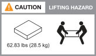

= Installationsvoraussetzungen - FAS70 und FAS90
:allow-uri-read: 
:icons: font
:imagesdir: ../media/

[role="lead"]
Überprüfen Sie die erforderlichen Geräte und die Vorsichtsmaßnahmen zum Anheben des FAS70- oder FAS90-Speichersystems und der Lagerregale.

== Für die Installation erforderliche Ausrüstung

Zur Installation Ihres FAS70- oder FAS90-Speichersystems benötigen Sie die folgenden Geräte und Werkzeuge.

* Zugriff auf einen Webbrowser zur Konfiguration des Speichersystems
* Band für elektrostatische Entladung (ESD)
* Taschenlampe
* Laptop oder Konsole mit USB-/serieller Verbindung
* Büroklammer oder Kugelschreiber mit schmaler Spitze zum Einstellen der NS224-Einschubnummern
* Kreuzschlitzschraubendreher #2

== Vorsichtsmaßnahmen beim Anheben

FAS70 und FAS90 Storage-Systeme, NS224 Storage-Shelfs und DS460C Storage Shelfs sind schwer. Gehen Sie beim Anheben und Bewegen dieser Gegenstände vorsichtig vor.

=== FAS70 und FAS90 Storage-Systeme

Ein FAS70 oder FAS90 Storage-System kann bis zu 28.5 kg (62.83 lbs) wiegen. Zum Anheben des Systems zwei Personen oder einen Hydraulikhub verwenden.

=== NS224-Shelf

Ein NS224-Einlegeboden kann bis zu 30.29 kg (66.78 lbs) wiegen. Zum Anheben des Lagerregals zwei Personen oder einen Hydraulikhub verwenden. Halten Sie alle Komponenten im Lagerregal (vorne und hinten), um ein Ausbalancieren des Regalgewichts zu vermeiden.

image::../media/drw_ns224_lifting_weight_ieops-1716.svg[NS224 Vorsicht beim Anheben]

=== DS460C Shelf

Ein DS460C Shelf kann bis zu 181.1 kg (360.4 lbs) wiegen. Zum Anheben des Lagerregals benötigen Sie unter Umständen bis zu fünf Personen oder einen Hydraulikhub. Halten Sie alle Komponenten im Lagerregal (vorne und hinten), um ein Ausbalancieren des Regalgewichts zu vermeiden.

image::../media/drw_ds460c_weight_warning_ieops-1932.svg[DS460C Vorsicht beim Anheben]

.Verwandte Informationen
* https://library.netapp.com/ecm/ecm_download_file/ECMP12475945["Sicherheitsinformationen und gesetzliche Hinweise"^]
* https://hwu.netapp.com["NetApp Hardware Universe"^]

.Was kommt als Nächstes?
Nachdem Sie die Hardwareanforderungen überprüft haben, können Sie link:install-prepare.html["Bereiten Sie sich auf die Installation Ihres FAS70 oder FAS90 Storage-Systems vor"].
