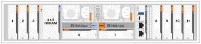

= Informationen zum Hinzufügen und Austauschen von E/A-Modulen in einem FAS70 oder FAS90 System
:allow-uri-read: 
:icons: font
:imagesdir: ../media/

[role="lead"]
Das FAS70- oder FAS90-System bietet Flexibilität beim erweitern oder Ersetzen von I/O-Modulen, um die Netzwerkkonnektivität und -Performance zu verbessern. Das Hinzufügen oder Austauschen eines E/A-Moduls ist wichtig, wenn die Netzwerkfunktionen aktualisiert oder ein fehlerhaftes Modul behandelt werden soll.

Sie können ein ausgefallenes I/O-Modul in Ihrem FAS70- oder FAS90-Storage-System durch dasselbe I/O-Modul oder ein anderes I/O-Modul ersetzen. Sie können auch ein I/O-Modul zu einem System mit leeren Steckplätzen hinzufügen.

* link:io-module-add.html["Fügen Sie ein I/O-Modul hinzu"]
+
Durch das Hinzufügen zusätzlicher Module kann die Redundanz verbessert werden, wodurch sichergestellt wird, dass das System auch bei einem Ausfall eines Moduls betriebsbereit bleibt.

* link:io-module-hotswap.html["Hot-Swap eines I/O-Moduls"]
+
Sie können bestimmte E/A-Module im Hot-Swap-Verfahren gegen ein gleichwertiges E/A-Modul austauschen, um das Speichersystem wieder in seinen optimalen Betriebszustand zu versetzen. Hot-Swap erfolgt, ohne dass eine manuelle Übernahme durchgeführt werden muss.

Um dieses Verfahren anwenden zu können, muss auf Ihrem Speichersystem ONTAP 9.18.1 oder später installiert sein.

* link:io-module-replace.html["Ersetzen Sie ein E/A-Modul"]
+
Durch das Ersetzen eines fehlerhaften E/A-Moduls kann das System in den optimalen Betriebszustand zurückversetzt werden.

.Nummerierung des E/A-Steckplatzes
Die I/O-Steckplätze der FAS70 und FAS90 Controller sind wie in der folgenden Abbildung dargestellt mit 1 bis 11 nummeriert.

