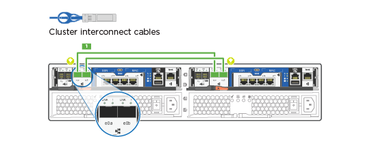

= Detaillierter Leitfaden - FAS2700
:allow-uri-read: 
:icons: font
:imagesdir: ../media/

[role="lead"]
Auf dieser Seite finden Sie detaillierte Schritt-für-Schritt-Anleitungen zur Installation eines typischen NetApp-Systems. In diesem Handbuch finden Sie weitere detaillierte Installationsanweisungen.

== Schritt 1: Installation vorbereiten

Um Ihr FAS2700 System zu installieren, müssen Sie ein Konto auf der NetApp Support-Website erstellen, Ihr System registrieren und Lizenzschlüssel erhalten. Außerdem müssen Sie die entsprechende Anzahl und den entsprechenden Kabeltyp für Ihr System inventarisieren und bestimmte Netzwerkinformationen erfassen.

Sie müssen Zugriff auf das Hardware Universe haben, um Informationen zu den Standortanforderungen sowie zusätzliche Informationen über Ihr konfiguriertes System zu erhalten. Möglicherweise möchten Sie auch Zugriff auf die Versionshinweise für Ihre Version von ONTAP haben, um weitere Informationen zu diesem System zu erhalten.

https://hwu.netapp.com["NetApp Hardware Universe"]

http://mysupport.netapp.com/documentation/productlibrary/index.html?productID=62286["Finden Sie die Versionshinweise für Ihre Version von ONTAP 9"]

Folgendes müssen Sie an Ihrer Website angeben:

* Rack-Platz für das Storage-System
* Kreuzschlitzschraubendreher #2
* Zusätzliche Netzwerkkabel zum Anschließen des Systems an den Netzwerk-Switch und Laptop oder die Konsole über einen Webbrowser
* Ein Laptop oder eine Konsole mit einer RJ-45-Verbindung und Zugriff auf einen Webbrowser

.Schritte
. Packen Sie den Inhalt aller Boxen aus.
. Notieren Sie die Seriennummer des Systems von den Controllern.
+
image::../media/drw_ssn_label.png[Beispiel für die Seriennummer des Systems]

. Richten Sie Ihr Konto ein:
+
.. Melden Sie sich bei Ihrem bestehenden Konto an oder erstellen Sie ein Konto.
.. Registrieren Sie das System.
+
https://mysupport.netapp.com/eservice/registerSNoAction.do?moduleName=RegisterMyProduct["NetApp Produktregistrierung"]

. Laden Sie Config Advisor auf Ihrem Laptop herunter und installieren Sie es.
+
https://mysupport.netapp.com/site/tools/tool-eula/activeiq-configadvisor["NetApp Downloads: Config Advisor"]

. Notieren Sie sich die Anzahl und die Kabeltypen, die Sie erhalten haben.
+
In der folgenden Tabelle sind die Kabeltypen aufgeführt, die Sie möglicherweise erhalten können. Wenn Sie ein Kabel empfangen, das nicht in der Tabelle aufgeführt ist, finden Sie im Hardware Universe das Kabel und dessen Verwendung.

+
https://hwu.netapp.com["NetApp Hardware Universe"]

+
[cols="1,2,1,2"]
|===
| Kabeltyp... | Teilenummer und Länge | Steckverbindertyp | Für... 

 a| 
10-GbE-Kabel (je nach Bestellung)
 a| 
X6566B-05-R6 (112-00297), 0,5 m

X6566B-2-R6 (112-00299), 2 m
 a| 
image:../media/oie_cable_sfp_gbe_copper.png["GbE SFP Kupfer Connector"]
 a| 
Cluster Interconnect-Netzwerk

 a| 
10-GbE-Kabel (je nach Bestellung)
 a| 
Teilenummer X6566B-2-R6 (112-00299), 2 m

Oder X6566B-3-R6 (112-00300), 3 m

X6566B-5-R6 (112-00301), 5 m
 a| 
image:../media/oie_cable_sfp_gbe_copper.png["GbE SFP Kupfer Connector"]
 a| 
Daten

 a| 
Optische Netzwerkkabel (je nach Bestellung)
 a| 
X6553-R6 (112-00188), 2 m

X6536-R6 (112-00090), 5 m

X6554-R6 (112-00189), 15 m
 a| 
image:../media/oie_cable_fiber_lc_connector.png["LC-Glasfaseranschluss"]
 a| 
FC-Host-Netzwerk

 a| 
CAT 6, RJ-45 (je nach Bestellung)
 a| 
Teilenummern X6585-R6 (112-00291), 3m

X6562-R6 (112-00196), 5 m
 a| 
image:../media/oie_cable_rj45.png["RJ-45-Kabelanschluss"]
 a| 
Managementnetzwerk und Ethernet-Daten

 a| 
Lagerung (je nach Reihenfolge)
 a| 
Teilenummer X66030A (112-00435), 0,5 m

X66031A (112-00436), 1 m

X66032A (112-00437), 2 m

X66033A (112-00438), 3 m
 a| 
image:../media/oie_cable_mini_sas_hd_to_mini_sas_hd.png["Mini-SAS-zu-Mini-SAS-Anschluss"]
 a| 
Storage

 a| 
Micro-USB-Konsolenkabel
 a| 
Keine Angabe
 a| 
image:../media/oie_cable_micro_usb.png["Micro-USB-Anschluss"]
 a| 
Verbindung über die Konsole während der Software-Einrichtung auf Laptops/Konsolen, die nicht von Windows stammen

 a| 
Stromkabel
 a| 
Keine Angabe
 a| 
image:../media/oie_cable_power.png["Stromkabel"]
 a| 
System einschalten

|===
. Laden Sie das _Cluster-Konfigurationsarbeitsblatt_ herunter, und füllen Sie es aus.
+
https://library.netapp.com/ecm/ecm_download_file/ECMLP2839002["Cluster-Konfigurationsdokument"]

== Schritt 2: Installieren Sie die Hardware

Sie müssen das System je nach Bedarf in einem 4-Säulen-Rack oder NetApp Systemschrank installieren.

.Schritte
. Installieren Sie die Schienensatz nach Bedarf.
. Installieren und sichern Sie das System anhand der im Schienensatz enthaltenen Anweisungen.
+

NOTE: Sie müssen sich der Sicherheitsbedenken im Zusammenhang mit dem Gewicht des Systems bewusst sein.

+
image::../media/drw_oie_fas2700_weight_caution.png[Vorsicht bei der zweiköpfigen Hebebühne]

. Schließen Sie Kabelmanagement-Geräte (wie abgebildet) an.
+
image::../media/drw_cable_management_arm_install.png[Anschließen von Kabelverwaltungsgeräten]

. Bringen Sie die Blende auf die Vorderseite des Systems an.

== Schritt 3: Controller mit Ihrem Netzwerk verbinden

Sie können die Controller mithilfe der Switch-freien Cluster-Methode mit zwei Nodes oder des Cluster Interconnect-Netzwerks mit dem Netzwerk verkabeln.

=== Option 1: Verkabeln eines 2-Node-Clusters ohne Switches, Unified Network-Konfiguration

Managementnetzwerk, UTA2-Datennetzwerk und Management-Ports auf den Controllern werden mit Switches verbunden. Die Cluster Interconnect-Ports sind an beiden Controllern verkabelt.

Sie müssen sich an den Netzwerkadministrator wenden, um Informationen über das Anschließen des Systems an die Switches zu erhalten.

Prüfen Sie unbedingt den Abbildungspfeil, um die richtige Ausrichtung des Kabelanschlusses zu prüfen.

image::../media/oie_cable_pull_tab_down.png[Kabelanschluss mit Zuglasche unten]

NOTE: Wenn Sie den Anschluss einsetzen, sollten Sie das Gefühl haben, dass er einrasten kann. Wenn Sie nicht das Gefühl haben, dass er klickt, entfernen Sie ihn, drehen Sie ihn um und versuchen Sie es erneut.

.Schritte
. Sie können die Verkabelung zwischen den Controllern und den Switches mit der Grafik oder Schritt-für-Schritt-Anleitung ausführen:
+
image::../media/drw_2700_tnsc_unified_network_cabling_animated_gif.png[2-Node-Cluster-Verkabelung ohne Switches in einer Unified Netzwerkkonfiguration]

+
[cols="1,3"]
|===
| Schritt | Führen Sie an jedem Controller aus 

 a| 
image:../media/icon_square_1_green.png["Schritt 1"]
 a| 
Verbinden Sie die Cluster-Interconnect-Ports mit dem Cluster Interconnect-Kabel miteinander:

** e0a an e0a
** e0b bis e0b
image:../media/drw_c190_u_tnsc_clust_cbling.png["Cluster-Interconnect-Verkabelung"]

 a| 
image:../media/icon_square_2_yellow.png["Schritt 2"]
 a| 
Verwenden Sie einen der folgenden Kabeltypen, um die UTA2-Daten-Ports mit Ihrem Hostnetzwerk zu verkabeln:

Ein FC-Host

** 0c und 0d
** * Oder* 0e und 0f Eine 10GbE
** e0c und e0d
** * Oder* e0e und e0f

NOTE: Sie können ein Port-Paar als CNA und ein Port-Paar als FC verbinden, oder Sie können beide Port-Paare als CNA oder beide Port-Paare als FC verbinden.

image:../media/drw_c190_u_fc_10gbe_cabling.png["Anschlüsse des Datenports"]

 a| 
image:../media/icon_square_3_orange.png["Schritt 3"]
 a| 
Verkabeln Sie die E0M-Ports mit den Management-Netzwerk-Switches mit den RJ45-Kabeln:

image:../media/drw_c190_u_mgmt_cabling.png["Verkabelung des Management-Ports"]

 a| 
image:../media/oie_legend_icon_attn_symbol.png["Achtung-Symbol"]
 a| 
Schließen Sie die Stromkabel AN dieser Stelle NICHT an.

|===
. Informationen zum Kabelanschluss des Speichers finden Sie unter <<Schritt 4: Controller mit Laufwerk-Shelfs verkabeln>>

=== Option 2: Verkabelung eines Switch-Clusters, Unified-Netzwerk-Konfiguration

Managementnetzwerk, UTA2-Datennetzwerk und Management-Ports auf den Controllern werden mit Switches verbunden. Die Cluster-Interconnect-Ports sind mit den Cluster-Interconnect-Switches verbunden.

Sie müssen sich an den Netzwerkadministrator wenden, um Informationen über das Anschließen des Systems an die Switches zu erhalten.

Prüfen Sie unbedingt den Abbildungspfeil, um die richtige Ausrichtung des Kabelanschlusses zu prüfen.

image::../media/oie_cable_pull_tab_down.png[Kabelanschluss mit Zuglasche unten]

NOTE: Wenn Sie den Anschluss einsetzen, sollten Sie das Gefühl haben, dass er einrasten kann. Wenn Sie nicht das Gefühl haben, dass er klickt, entfernen Sie ihn, drehen Sie ihn um und versuchen Sie es erneut.

.Schritte
. Sie können die Verkabelung zwischen den Controllern und den Switches mit der Grafik oder Schritt-für-Schritt-Anleitung ausführen:
+
image::../media/drw_2700_switched_unified_network_cabling_animated_gif.png[Unified Network Cabling mit Switch Lustre]

+
[cols="1,3"]
|===
| Schritt | Führen Sie die Ausführung an jedem Controller-Modul aus 

 a| 
image:../media/icon_square_1_green.png["Schritt 1"]
 a| 
Verkabelung e0a und e0b mit den Cluster Interconnect Switches mit dem Cluster Interconnect-Kabel:

image:../media/drw_c190_u_switched_clust_cbling.png["ClusterInterconnect-Verkabelung"]

 a| 
image:../media/icon_square_2_yellow.png["Schritt 2"]
 a| 
Verwenden Sie einen der folgenden Kabeltypen, um die UTA2-Daten-Ports mit Ihrem Hostnetzwerk zu verkabeln:

Ein FC-Host

** 0c und 0d
** **Oder** 0e und 0f

Eine 10GbE

** e0c und e0d
** **Oder** e0e und e0f

NOTE: Sie können ein Port-Paar als CNA und ein Port-Paar als FC verbinden, oder Sie können beide Port-Paare als CNA oder beide Port-Paare als FC verbinden.

image:../media/drw_c190_u_fc_10gbe_cabling.png["Anschlüsse des Datenports"]

 a| 
image:../media/icon_square_3_orange.png["Schritt 3"]
 a| 
Verkabeln Sie die E0M-Ports mit den Management-Netzwerk-Switches mit den RJ45-Kabeln:

image:../media/drw_c190_u_mgmt_cabling.png["Verkabelung des Management-Ports"]

 a| 
image:../media/oie_legend_icon_attn_symbol.png["Achtung-Symbol"]
 a| 
Schließen Sie die Stromkabel AN dieser Stelle NICHT an.

|===
. Informationen zum Kabelanschluss des Speichers finden Sie unter <<Schritt 4: Controller mit Laufwerk-Shelfs verkabeln>>

=== Option 3: Verkabelung eines 2-Node-Clusters ohne Switches, Ethernet-Netzwerkkonfiguration

Managementnetzwerk, Ethernet-Datennetzwerk und Management-Ports auf den Controllern sind mit Switches verbunden. Die Cluster Interconnect-Ports sind an beiden Controllern verkabelt.

Sie müssen sich an den Netzwerkadministrator wenden, um Informationen über das Anschließen des Systems an die Switches zu erhalten.

Prüfen Sie unbedingt den Abbildungspfeil, um die richtige Ausrichtung des Kabelanschlusses zu prüfen.

image::../media/oie_cable_pull_tab_down.png[Kabelanschluss mit Zuglasche unten]

NOTE: Wenn Sie den Anschluss einsetzen, sollten Sie das Gefühl haben, dass er einrasten kann. Wenn Sie nicht das Gefühl haben, dass er klickt, entfernen Sie ihn, drehen Sie ihn um und versuchen Sie es erneut.

.Schritte
. Sie können die Verkabelung zwischen den Controllern und den Switches mit der Grafik oder Schritt-für-Schritt-Anleitung ausführen:
+
image::../media/drw_2700_tnsc_ethernet_network_cabling_animated_gif.png[2-Node-Netzwerkverkabelung ohne Switches]

+
[cols="1,3"]
|===
| Schritt | Führen Sie an jedem Controller aus 

 a| 
image:../media/icon_square_1_green.png["Schritt 1"]
 a| 
Verbinden Sie die Cluster-Interconnect-Ports mit dem Cluster Interconnect-Kabel miteinander:

** e0a an e0a
** e0b bis e0b 

 a| 
image:../media/icon_square_2_yellow.png["Schritt 2"]
 a| 
Verwenden Sie das Cat 6 RJ45-Kabel, um e0c über e0f-Ports mit Ihrem Hostnetzwerk zu verkabeln:

image:../media/drw_c190_e_rj45_cbling.png["Host-Netzwerkverkabelung"]

 a| 
image:../media/icon_square_3_orange.png["Schritt 3"]
 a| 
Verkabeln Sie die E0M-Ports mit den Management-Netzwerk-Switches mit den RJ45-Kabeln:

image:../media/drw_c190_e_mgmt_cbling.png["Verkabelung des Management-Ports"]

 a| 
image:../media/oie_legend_icon_attn_symbol.png["Achtung-Symbol"]
 a| 
Schließen Sie die Stromkabel AN dieser Stelle NICHT an.

|===
. Informationen zum Kabelanschluss des Speichers finden Sie unter <<Schritt 4: Controller mit Laufwerk-Shelfs verkabeln>>

=== Option 4: Kabel ein Switch-Cluster, Ethernet-Netzwerk-Konfiguration

Managementnetzwerk, Ethernet-Datennetzwerk und Management-Ports auf den Controllern sind mit Switches verbunden. Die Cluster-Interconnect-Ports sind mit den Cluster-Interconnect-Switches verbunden.

Sie müssen sich an den Netzwerkadministrator wenden, um Informationen über das Anschließen des Systems an die Switches zu erhalten.

Prüfen Sie unbedingt den Abbildungspfeil, um die richtige Ausrichtung des Kabelanschlusses zu prüfen.

image::../media/oie_cable_pull_tab_down.png[Kabelanschluss mit Zuglasche unten]

NOTE: Wenn Sie den Anschluss einsetzen, sollten Sie das Gefühl haben, dass er einrasten kann. Wenn Sie nicht das Gefühl haben, dass er klickt, entfernen Sie ihn, drehen Sie ihn um und versuchen Sie es erneut.

.Schritte
. Sie können die Verkabelung zwischen den Controllern und den Switches mit der Grafik oder Schritt-für-Schritt-Anleitung ausführen:
+
image::../media/drw_2700_switched_ethernet_network_cabling_animated_gif.png[Geswitchte Ethernet-Verkabelung]

+
[cols="1,2"]
|===
| Schritt | Führen Sie die Ausführung an jedem Controller-Modul aus 

 a| 
image:../media/icon_square_1_green.png["Schritt 1"]
 a| 
Verkabelung e0a und e0b mit den Cluster Interconnect Switches mit dem Cluster Interconnect-Kabel:

image:../media/drw_c190_e_switched_clust_cbling.png["Cluster-Interconnect-Verkabelung"]

 a| 
image:../media/icon_square_2_yellow.png["Schritt 2"]
 a| 
Verwenden Sie das Cat 6 RJ45-Kabel, um e0c über e0f-Ports mit Ihrem Hostnetzwerk zu verkabeln:

image:../media/drw_c190_e_rj45_cbling.png["Host-Netzwerkverkabelung"]

 a| 
image:../media/icon_square_3_orange.png["Schritt 3"]
 a| 
Verkabeln Sie die E0M-Ports mit den Management-Netzwerk-Switches mit den RJ45-Kabeln:

image:../media/drw_c190_e_mgmt_cbling.png["Verkabelung des Management-Ports"]

 a| 
image:../media/oie_legend_icon_attn_symbol.png["Achtung-Symbol"]
 a| 
Schließen Sie die Stromkabel AN dieser Stelle NICHT an.

|===
. Informationen zum Kabelanschluss des Speichers finden Sie unter <<Schritt 4: Controller mit Laufwerk-Shelfs verkabeln>>

== Schritt 4: Controller mit Laufwerk-Shelfs verkabeln

Sie müssen die Controller mithilfe der integrierten Storage-Ports mit den Shelfs verkabeln. NetApp empfiehlt MP-HA-Verkabelung für Systeme mit externem Storage. Wenn Sie ein SAS-Bandlaufwerk haben, können Sie Single-Path-Verkabelung verwenden. Wenn Sie keine externen Shelfs haben, ist die MP-HA-Verkabelung zu internen Laufwerken optional (nicht abgebildet), wenn die SAS-Kabel zusammen mit dem System bestellt werden.

=== Option 1: Kabelspeicherung auf einem HA-Paar mit externen Festplatten-Shelfs

Sie müssen die Shelf-Verbindungen verkabeln und dann beide Controller mit den Laufwerk-Shelfs verkabeln.

Prüfen Sie unbedingt den Abbildungspfeil, um die richtige Ausrichtung des Kabelanschlusses zu prüfen.

image::../media/oie_cable_pull_tab_down.png[Kabelanschluss mit Zuglasche unten]

.Schritte
. Verkabeln Sie das HA-Paar mit externen Festplatten-Shelfs:
+

NOTE: Das Beispiel verwendet DS224C. Die Verkabelung ist ähnlich wie bei anderen unterstützten Festplatten-Shelfs.

+
image::../media/drw_2700_ha_storage_cabling_animated_gif.png[Shelf-Verkabelung in einem HA-Paar]

+
[cols="1,3"]
|===
| Schritt | Führen Sie an jedem Controller aus 

 a| 
image:../media/icon_square_1_blue.png["Legende Nummer 1"]
 a| 
Verkabeln Sie die Shelf-zu-Shelf-Ports.

** Port 3 auf IOM A zu Port 1 auf dem IOM A auf dem Shelf direkt unten.
** Port 3 auf IOM B zu Port 1 auf dem IOM B auf dem Shelf direkt unten.
+
image:../media/oie_cable_mini_sas_hd_to_mini_sas_hd.png["Mini-SAS-zu-Mini-SAS-Anschluss"]     Kabel Mini-SAS HD auf Mini-SAS HD

 a| 
image:../media/icon_square_2_yellow.png["Schritt 2"]
 a| 
Verbinden Sie jeden Node mit IOM A im Stack.

** Controller 1 Port 0b zu IOM A-Port 3 am letzten Laufwerk-Shelf im Stack.
** Controller 2 Port 0a zu IOM A-Port 1 am ersten Festplatten-Shelf im Stack.
+
image:../media/oie_cable_mini_sas_hd_to_mini_sas_hd.png["Mini-SAS-zu-Mini-SAS-Anschluss"]     Kabel Mini-SAS HD auf Mini-SAS HD

 a| 
image:../media/icon_square_3_orange.png["Schritt 3"]
 a| 
Verbinden Sie jeden Node mit IOM B im Stack

** Controller 1 Port 0a zu IOM B-Port 1 am ersten Festplatten-Shelf im Stack.
** Controller 2 Port 0b zu IOM B-Port 3 auf dem letzten Laufwerk-Shelf im Stack.
image:../media/oie_cable_mini_sas_hd_to_mini_sas_hd.png["Mini-SAS-zu-Mini-SAS-Anschluss"]     Kabel Mini-SAS HD auf Mini-SAS HD

|===
+
Wenn Sie über mehr als einen Festplatten-Shelf-Stack verfügen, lesen Sie die „_Installation and Cabling Guide_“ für den Laufwerk-Shelf-Typ.

. Informationen zum Abschließen der Einrichtung des Systems finden Sie unter <<Schritt 5: System-Setup und -Konfiguration abschließen>>

== Schritt 5: System-Setup und -Konfiguration abschließen

Die Einrichtung und Konfiguration des Systems kann mithilfe der Cluster-Erkennung nur mit einer Verbindung zum Switch und Laptop abgeschlossen werden. Sie können auch direkt eine Verbindung zu einem Controller im System herstellen und dann eine Verbindung zum Management Switch herstellen.

=== Option 1: Schließen Sie das System-Setup ab, wenn die Netzwerkerkennung aktiviert ist

Wenn die Netzwerkerkennung auf Ihrem Laptop aktiviert ist, können Sie das System mit der automatischen Cluster-Erkennung einrichten und konfigurieren.

.Schritte
. Mithilfe der folgenden Animation können Sie eine oder mehrere Laufwerk-Shelf-IDs festlegen
+
.Animation: Legen Sie die Festplatten-Shelf-IDs fest
video::c600f366-4d30-481a-89d9-ab1b0066589b[panopto]
. Schließen Sie die Stromkabel an die Controller-Netzteile an, und schließen Sie sie dann an Stromquellen auf verschiedenen Stromkreisen an.
. Schalten Sie die Netzschalter an beide Knoten ein.
+
image::../media/drw_turn_on_power_switches_to_psus.png[Einschalten der Stromversorgung]

+

NOTE: Das erste Booten kann bis zu acht Minuten dauern.

. Stellen Sie sicher, dass die Netzwerkerkennung auf Ihrem Laptop aktiviert ist.
+
Weitere Informationen finden Sie in der Online-Hilfe Ihres Notebooks.

. Schließen Sie Ihren Laptop mithilfe der folgenden Animation an den Management-Switch an.
+
.Animation - Verbinden Sie Ihren Laptop mit dem Management-Switch
video::d61f983e-f911-4b76-8b3a-ab1b0066909b[panopto]
. Wählen Sie ein ONTAP-Symbol aus, um es zu ermitteln:
+
image::../media/drw_autodiscovery_controler_select.png[Wählen Sie ein ONTAP-Symbol aus]

+
.. Öffnen Sie Den Datei-Explorer.
.. Klicken Sie im linken Bereich auf Netzwerk.
.. Mit der rechten Maustaste klicken und Aktualisieren auswählen.
.. Doppelklicken Sie auf das ONTAP-Symbol, und akzeptieren Sie alle auf dem Bildschirm angezeigten Zertifikate.
+

NOTE: XXXXX ist die Seriennummer des Systems für den Ziel-Node.

+
System Manager wird geöffnet.

. Mit der systemgesteuerten Einrichtung konfigurieren Sie das System anhand der im _NetApp ONTAP Configuration Guide_ erfassten Daten.
+
https://library.netapp.com/ecm/ecm_download_file/ECMLP2862613["ONTAP Konfigurationsleitfaden"]

. Überprüfen Sie den Systemzustand Ihres Systems, indem Sie Config Advisor ausführen.
. Wechseln Sie nach Abschluss der Erstkonfiguration mit dem https://www.netapp.com/data-management/oncommand-system-documentation/["ONTAP  ONTAP System Manager; Dokumentationsressourcen"] Seite für Informationen über das Konfigurieren zusätzlicher Funktionen in ONTAP.

=== Option 2: Abschluss der Systemeinrichtung und -Konfiguration, falls die Netzwerkerkennung nicht aktiviert ist

Wenn die Netzwerkerkennung auf Ihrem Laptop nicht aktiviert ist, müssen Sie die Konfiguration und das Setup mit dieser Aufgabe abschließen.

.Schritte
. Laptop oder Konsole verkabeln und konfigurieren:
+
.. Stellen Sie den Konsolenport des Laptops oder der Konsole auf 115,200 Baud mit N-8-1 ein.
+

NOTE: Informationen zur Konfiguration des Konsolenport finden Sie in der Online-Hilfe Ihres Laptops oder der Konsole.

.. Schließen Sie das Konsolenkabel an den Laptop oder die Konsole an, und schließen Sie den Konsolenport am Controller mithilfe des im Lieferumfang des Systems verwendeten Konsolenkabels an.
+
image::../media/drw_console_connect_fas2700_affa200.png[Es wird eine Verbindung zum Konsolenport hergestellt]

.. Verbinden Sie den Laptop oder die Konsole mit dem Switch im Management-Subnetz.
+
image::../media/drw_client_to_mgmt_subnet_fas2700_affa220.png[Verbindung mit dem Management-Subnetz wird hergestellt]

.. Weisen Sie dem Laptop oder der Konsole eine TCP/IP-Adresse zu. Verwenden Sie dabei eine Adresse, die sich im Management-Subnetz befindet.

. Mithilfe der folgenden Animation können Sie eine oder mehrere Laufwerk-Shelf-IDs festlegen:
+
.Animation: Legen Sie die Festplatten-Shelf-IDs fest
video::c600f366-4d30-481a-89d9-ab1b0066589b[panopto]
. Schließen Sie die Stromkabel an die Controller-Netzteile an, und schließen Sie sie dann an Stromquellen auf verschiedenen Stromkreisen an.
. Schalten Sie die Netzschalter an beide Knoten ein.
+
image::../media/drw_turn_on_power_switches_to_psus.png[Einschalten der Stromversorgung]

+

NOTE: Das erste Booten kann bis zu acht Minuten dauern.

. Weisen Sie einem der Nodes eine erste Node-Management-IP-Adresse zu.
+
[cols="1-3"]
|===
| Wenn das Managementnetzwerk DHCP enthält... | Dann... 

 a| 
Konfiguriert
 a| 
Notieren Sie die IP-Adresse, die den neuen Controllern zugewiesen ist.

 a| 
Nicht konfiguriert
 a| 
.. Öffnen Sie eine Konsolensitzung mit PuTTY, einem Terminalserver oder dem entsprechenden Betrag für Ihre Umgebung.
+

NOTE: Überprüfen Sie die Online-Hilfe Ihres Laptops oder Ihrer Konsole, wenn Sie nicht wissen, wie PuTTY konfiguriert werden soll.

.. Geben Sie die Management-IP-Adresse ein, wenn Sie dazu aufgefordert werden.

|===
. Konfigurieren Sie das Cluster unter System Manager auf Ihrem Laptop oder Ihrer Konsole:
+
.. Rufen Sie die Node-Management-IP-Adresse im Browser auf.
+

NOTE: Das Format für die Adresse ist +https://x.x.x.x.+

.. Konfigurieren Sie das System mit den im _NetApp ONTAP Configuration Guide_ erfassten Daten.
+
https://library.netapp.com/ecm/ecm_download_file/ECMLP2862613["ONTAP Konfigurationsleitfaden"]

. Überprüfen Sie den Systemzustand Ihres Systems, indem Sie Config Advisor ausführen.
. Wechseln Sie nach Abschluss der Erstkonfiguration mit dem https://www.netapp.com/data-management/oncommand-system-documentation/["ONTAP  ONTAP System Manager; Dokumentationsressourcen"] Seite für Informationen über das Konfigurieren zusätzlicher Funktionen in ONTAP.

