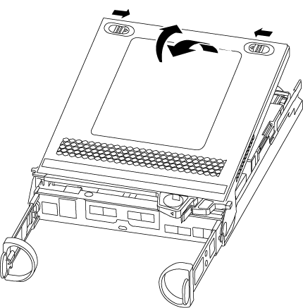

= Ersetzen Sie die Echtzeituhr-Batterie - FAS2700
:allow-uri-read: 
:icons: font
:imagesdir: ../media/

[role="lead"]
Sie ersetzen den Echtzeituhr-Akku (RTC) im Controller-Modul, sodass die Dienste und Anwendungen Ihres Systems, die von der genauen Zeitsynchronisierung abhängen, weiterhin funktionieren.

* Sie können dieses Verfahren bei allen Versionen von ONTAP verwenden, die von Ihrem System unterstützt werden
* Alle anderen Komponenten des Systems müssen ordnungsgemäß funktionieren. Falls nicht, müssen Sie sich an den technischen Support wenden.

== Schritt 1: Schalten Sie den beeinträchtigten Regler aus

Um den beeinträchtigten Controller herunterzufahren, müssen Sie den Status des Controllers bestimmen und gegebenenfalls den Controller übernehmen, damit der gesunde Controller weiterhin Daten aus dem beeinträchtigten Reglerspeicher bereitstellen kann.

.Über diese Aufgabe
* Wenn Sie über ein SAN-System verfügen, müssen Sie Event-Meldungen ) für den beeinträchtigten Controller SCSI Blade überprüft haben  `cluster kernel-service show`. Mit dem `cluster kernel-service show` Befehl (im erweiterten Modus von priv) werden der Knotenname, der Quorum-Status dieses Node, der Verfügbarkeitsstatus dieses Node und der Betriebsstatus dieses Node angezeigt.
+
Jeder Prozess des SCSI-Blades sollte sich im Quorum mit den anderen Nodes im Cluster befinden. Probleme müssen behoben werden, bevor Sie mit dem Austausch fortfahren.

* Wenn Sie über ein Cluster mit mehr als zwei Nodes verfügen, muss es sich im Quorum befinden. Wenn sich das Cluster nicht im Quorum befindet oder ein gesunder Controller FALSE anzeigt, um die Berechtigung und den Zustand zu erhalten, müssen Sie das Problem korrigieren, bevor Sie den beeinträchtigten Controller herunterfahren; siehe link:https://docs.netapp.com/us-en/ontap/system-admin/synchronize-node-cluster-task.html?q=Quorum["Synchronisieren eines Node mit dem Cluster"^].

.Schritte
. Wenn AutoSupport aktiviert ist, können Sie die automatische Case-Erstellung durch Aufrufen einer AutoSupport Meldung unterdrücken: `system node autosupport invoke -node * -type all -message MAINT=<# of hours>h`
+
Die folgende AutoSupport Meldung unterdrückt die automatische Erstellung von Cases für zwei Stunden: `cluster1:> system node autosupport invoke -node * -type all -message MAINT=2h`

. Deaktivieren Sie das automatische Giveback von der Konsole des gesunden Controllers: `storage failover modify –node local -auto-giveback false`
+

NOTE: Wenn Sie sehen _Möchten Sie Auto-Giveback deaktivieren?_, geben Sie ein `y`.

. Nehmen Sie den beeinträchtigten Controller zur LOADER-Eingabeaufforderung:
+
[cols="1,2"]
|===
| Wenn der eingeschränkte Controller angezeigt wird... | Dann... 

 a| 
Die LOADER-Eingabeaufforderung
 a| 
Fahren Sie mit dem nächsten Schritt fort.

 a| 
Warten auf Giveback...
 a| 
Drücken Sie Strg-C, und antworten Sie dann `y` Wenn Sie dazu aufgefordert werden.

 a| 
Eingabeaufforderung für das System oder Passwort
 a| 
Übernehmen oder stoppen Sie den beeinträchtigten Regler von der gesunden Steuerung: `storage failover takeover -ofnode _impaired_node_name_`

Wenn der Regler „beeinträchtigt“ auf Zurückgeben wartet... anzeigt, drücken Sie Strg-C, und antworten Sie dann `y`.

|===

== Schritt 2: Controller-Modul entfernen

Um auf Komponenten innerhalb des Controllers zuzugreifen, müssen Sie zuerst das Controller-Modul aus dem System entfernen und dann die Abdeckung am Controller-Modul entfernen.

. Wenn Sie nicht bereits geerdet sind, sollten Sie sich richtig Erden.
. Lösen Sie den Haken- und Schlaufenriemen, mit dem die Kabel am Kabelführungsgerät befestigt sind, und ziehen Sie dann die Systemkabel und SFPs (falls erforderlich) vom Controller-Modul ab, um zu verfolgen, wo die Kabel angeschlossen waren.
+
Lassen Sie die Kabel im Kabelverwaltungs-Gerät so, dass bei der Neuinstallation des Kabelverwaltungsgeräts die Kabel organisiert sind.

. Entfernen Sie die Kabelführungsgeräte von der linken und rechten Seite des Controller-Moduls und stellen Sie sie zur Seite.
+
image::../media/drw_25xx_cable_management_arm.png[Einsetzen oder Entfernen der Kabelverwaltungs-ARM]

. Drücken Sie die Verriegelung am Nockengriff, bis sie loslässt, öffnen Sie den Nockengriff vollständig, um das Controller-Modul aus der Mittelplatine zu lösen, und ziehen Sie das Controller-Modul anschließend mit zwei Händen aus dem Gehäuse heraus.
+
image::../media/drw_2240_x_opening_cam_latch.png[Öffnen der Nockenhebelverriegelung]

. Drehen Sie das Controller-Modul um und legen Sie es auf eine flache, stabile Oberfläche.
. Öffnen Sie die Abdeckung, indem Sie die blauen Laschen einschieben, um die Abdeckung zu lösen, und schwenken Sie dann die Abdeckung nach oben und öffnen Sie sie.
+

== Schritt 3: Ersetzen Sie die RTC-Batterie

Um die RTC-Batterie zu ersetzen, suchen Sie sie im Controller, und befolgen Sie die einzelnen Schritte.

. Wenn Sie nicht bereits geerdet sind, sollten Sie sich richtig Erden.
. Suchen Sie den RTC-Akku.
+
image::../media/drw_2600_rtc_battery.png[Entfernen der RTC-Batterie]

. Schieben Sie den Akku vorsichtig von der Halterung weg, drehen Sie ihn vom Halter weg, und heben Sie ihn dann aus der Halterung.
+

NOTE: Beachten Sie die Polarität der Batterie, während Sie sie aus dem Halter entfernen. Der Akku ist mit einem Pluszeichen gekennzeichnet und muss korrekt in der Halterung positioniert werden. Ein Pluszeichen in der Nähe des Halters zeigt an, wie der Akku positioniert werden soll.

. Entfernen Sie den Ersatzakku aus dem antistatischen Versandbeutel.
. Suchen Sie den leeren Batteriehalter im Controller-Modul.
. Notieren Sie die Polarität der RTC-Batterie, und setzen Sie sie anschließend in den Halter ein, indem Sie die Batterie schräg kippen und nach unten drücken.
. Überprüfen Sie die Batterie visuell, um sicherzustellen, dass sie vollständig in den Halter eingebaut ist und die Polarität korrekt ist.

== Schritt 4: Das Controllermodul wieder einbauen und Zeit/Datum nach dem RTC-Batterieaustausch einstellen

Nachdem Sie eine Komponente innerhalb des Controller-Moduls ersetzt haben, müssen Sie das Controller-Modul im Systemgehäuse neu installieren, die Uhrzeit und das Datum auf dem Controller zurücksetzen und es dann booten.

. Wenn Sie dies noch nicht getan haben, schließen Sie den Luftkanal oder die Abdeckung des Controller-Moduls.
. Richten Sie das Ende des Controller-Moduls an der Öffnung im Gehäuse aus, und drücken Sie dann vorsichtig das Controller-Modul zur Hälfte in das System.
+
Setzen Sie das Controller-Modul erst dann vollständig in das Chassis ein, wenn Sie dazu aufgefordert werden.

. Das System nach Bedarf neu einsetzen.
+
Wenn Sie die Medienkonverter (QSFPs oder SFPs) entfernt haben, sollten Sie diese erneut installieren, wenn Sie Glasfaserkabel verwenden.

. Wenn die Netzteile nicht angeschlossen waren, schließen Sie sie wieder an, und setzen Sie die Netzkabelhalter wieder ein.
. Führen Sie die Neuinstallation des Controller-Moduls durch:
+
.. Schieben Sie das Steuermodul fest in die offene Position, bis es auf die Mittelebene trifft und vollständig sitzt, und schließen Sie dann den Nockengriff in die verriegelte Position.
+

NOTE: Beim Einschieben des Controller-Moduls in das Gehäuse keine übermäßige Kraft verwenden, um Schäden an den Anschlüssen zu vermeiden.

.. Wenn Sie dies noch nicht getan haben, installieren Sie das Kabelverwaltungsgerät neu.
.. Verbinden Sie die Kabel mit dem Haken- und Schlaufenband mit dem Kabelmanagement-Gerät.
.. Schließen Sie die Stromkabel wieder an die Netzteile und an die Stromquellen an, und schalten Sie dann den Netzstrom ein, um den Bootvorgang zu starten.
.. Halten Sie den Controller an der LOADER-Eingabeaufforderung an.

. Uhrzeit und Datum auf dem Controller zurücksetzen:
+
.. Prüfen Sie Datum und Uhrzeit auf dem gesunden Controller mit dem `show date` Befehl.
.. Überprüfen Sie an der LOADER-Eingabeaufforderung auf dem Ziel-Controller die Zeit und das Datum.
.. Ändern Sie bei Bedarf das Datum mit dem `set date mm/dd/yyyy` Befehl.
.. Stellen Sie bei Bedarf die Uhrzeit in GMT mithilfe des ein `set time hh:mm:ss` Befehl.
.. Bestätigen Sie Datum und Uhrzeit auf dem Ziel-Controller.

. Geben Sie an der LOADER-Eingabeaufforderung ein `bye` Um die PCIe-Karten und andere Komponenten neu zu initialisieren und den Controller neu zu starten.
. Wiederherstellung des normalen Betriebs des Controllers durch Zurückgeben des Speichers: `storage failover giveback -ofnode _impaired_node_name_`
. Wenn die automatische Rückübertragung deaktiviert wurde, aktivieren Sie sie erneut: `storage failover modify -node local -auto-giveback true`

== Schritt 5: Aggregate in einer MetroCluster Konfiguration mit zwei Nodes zurückwechseln

Nachdem Sie in einer MetroCluster Konfiguration mit zwei Nodes den FRU-Austausch abgeschlossen haben, können Sie den MetroCluster SwitchBack-Vorgang durchführen. Damit wird die Konfiguration in ihren normalen Betriebszustand zurückversetzt, wobei die Synchronisations-Storage Virtual Machines (SVMs) auf dem ehemals beeinträchtigten Standort jetzt aktiv sind und Daten aus den lokalen Festplattenpools bereitstellen.

Dieser Task gilt nur für MetroCluster-Konfigurationen mit zwei Nodes.

.Schritte
. Vergewissern Sie sich, dass sich alle Nodes im befinden `enabled` Bundesland: `metrocluster node show`
+
[listing]
----
cluster_B::>  metrocluster node show

DR                           Configuration  DR
Group Cluster Node           State          Mirroring Mode
----- ------- -------------- -------------- --------- --------------------
1     cluster_A
              controller_A_1 configured     enabled   heal roots completed
      cluster_B
              controller_B_1 configured     enabled   waiting for switchback recovery
2 entries were displayed.
----
. Überprüfen Sie, ob die Neusynchronisierung auf allen SVMs abgeschlossen ist: `metrocluster vserver show`
. Überprüfen Sie, ob die automatischen LIF-Migrationen durch die heilenden Vorgänge erfolgreich abgeschlossen wurden: `metrocluster check lif show`
. Führen Sie den Wechsel zurück mit dem aus `metrocluster switchback` Befehl von einem beliebigen Node im verbleibenden Cluster
. Stellen Sie sicher, dass der Umkehrvorgang abgeschlossen ist: `metrocluster show`
+
Der Vorgang zum zurückwechseln wird weiterhin ausgeführt, wenn sich ein Cluster im befindet `waiting-for-switchback` Bundesland:

+
[listing]
----
cluster_B::> metrocluster show
Cluster              Configuration State    Mode
--------------------	------------------- 	---------
 Local: cluster_B configured       	switchover
Remote: cluster_A configured       	waiting-for-switchback
----
+
Der Vorgang zum zurückwechseln ist abgeschlossen, wenn sich die Cluster im befinden `normal` Bundesland:

+
[listing]
----
cluster_B::> metrocluster show
Cluster              Configuration State    Mode
--------------------	------------------- 	---------
 Local: cluster_B configured      		normal
Remote: cluster_A configured      		normal
----
+
Wenn ein Wechsel eine lange Zeit in Anspruch nimmt, können Sie den Status der in-progress-Basispläne über die überprüfen `metrocluster config-replication resync-status show` Befehl.

. Wiederherstellung beliebiger SnapMirror oder SnapVault Konfigurationen

== Schritt 6: Senden Sie das fehlgeschlagene Teil an NetApp zurück

Senden Sie das fehlerhafte Teil wie in den dem Kit beiliegenden RMA-Anweisungen beschrieben an NetApp zurück. Siehe https://mysupport.netapp.com/site/info/rma["Teilerückgabe  Austausch"] Seite für weitere Informationen.
